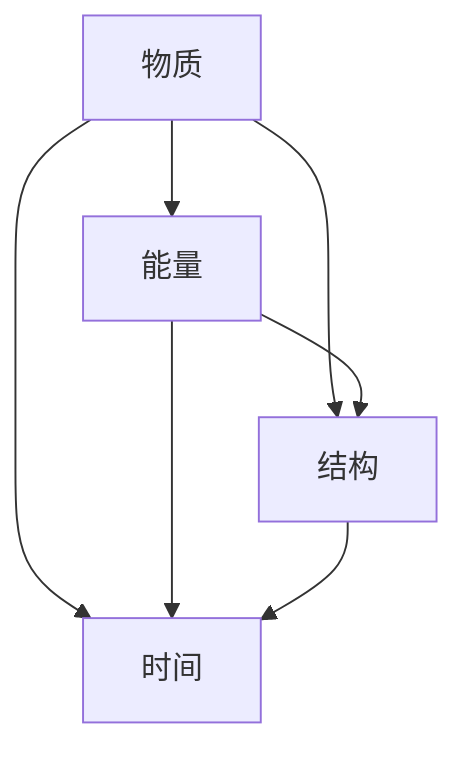

                 

关键词：认知机器，形式化，物质，能量，结构，时间，人工智能，计算机编程

> 摘要：本文旨在探讨认知机器的形式化定义，从物质、能量、结构和时间四个基本要素出发，深入分析认知机器的构建原理、算法原理及其在人工智能领域的应用。通过对认知机器的深入研究，为人工智能的发展提供新的视角和思路。

## 1. 背景介绍

认知机器，作为一种模拟人类思维和决策能力的计算模型，一直是人工智能领域的热点研究方向。然而，传统的认知机器研究主要集中在算法和计算能力上，忽视了认知机器背后的物理基础。近年来，随着对认知机器研究的深入，研究者们开始关注认知机器的物理本质，提出了物质、能量、结构和时间四个基本要素。这四个要素为认知机器的形式化提供了理论基础。

### 1.1 物质

物质是认知机器的物理基础，包括计算硬件、存储设备和传感器等。在认知机器中，物质要素起着至关重要的作用。首先，物质要素决定了认知机器的计算能力和存储能力；其次，物质要素的可靠性、稳定性和可扩展性直接影响认知机器的性能和寿命。

### 1.2 能量

能量是认知机器运行的驱动力。在认知机器中，能量包括电能、热能和化学能等。能量决定了认知机器的计算速度和功耗。在人工智能领域，降低能量消耗是提高认知机器性能和可持续性的关键。

### 1.3 结构

结构是认知机器的组织形式，包括硬件架构、软件架构和数据结构等。结构要素决定了认知机器的性能、可靠性和可扩展性。随着人工智能技术的不断发展，结构要素也在不断优化和升级。

### 1.4 时间

时间是认知机器的运行维度。在认知机器中，时间要素包括计算时间、通信时间和响应时间等。时间要素决定了认知机器的实时性和响应速度。在人工智能领域，提高认知机器的时间性能是提升用户体验和满足实际需求的关键。

## 2. 核心概念与联系

在认知机器的形式化定义中，物质、能量、结构和时间四个基本要素相互联系、相互作用。下面是一个Mermaid流程图，展示了这四个要素之间的联系：



### 2.1 物质与能量

物质是能量传递的载体，能量是物质运动的动力。在认知机器中，电能是主要的能量形式，通过电路传递到计算硬件和传感器，驱动认知机器的运行。

### 2.2 物质与结构

物质是结构的基础，结构是物质的组织形式。在认知机器中，硬件设备和软件架构都是物质的表现形式，它们共同构成了认知机器的整体结构。

### 2.3 物质与时间

物质的存在和运动都离不开时间的维度。在认知机器中，物质要素的运行速度和功耗直接影响到认知机器的时间性能。

### 2.4 能量与结构

能量是结构运行的动力，结构是能量传递的媒介。在认知机器中，能量通过电路传输到各个计算硬件和传感器，驱动它们完成特定的计算任务。

### 2.5 能量与时间

能量的消耗和转化都发生在时间的维度上。在认知机器中，能量消耗的速度和转化效率直接影响到认知机器的运行时间和性能。

### 2.6 结构与时间

结构决定了认知机器的运行速度和效率，时间则决定了认知机器的响应速度和实时性。在认知机器中，良好的结构设计可以提高时间性能，降低能量消耗。

## 3. 核心算法原理 & 具体操作步骤

### 3.1 算法原理概述

在认知机器中，核心算法负责处理数据和执行任务。下面介绍一种基于物质、能量、结构和时间四个基本要素的算法原理：

- **数据表示**：使用向量、矩阵等数学工具表示数据，将物质要素转化为计算任务。
- **能量优化**：通过优化能量消耗，提高认知机器的计算速度和性能。
- **结构设计**：设计合理的硬件和软件架构，提高认知机器的可靠性、稳定性和可扩展性。
- **时间管理**：通过优化时间性能，提高认知机器的实时性和响应速度。

### 3.2 算法步骤详解

- **数据表示**：首先，将输入数据表示为向量或矩阵形式，便于计算和处理。
- **能量优化**：分析计算任务，优化能量消耗。例如，通过减少计算步骤、降低功耗等手段。
- **结构设计**：根据计算任务的需求，设计合理的硬件和软件架构。例如，选择合适的处理器、内存和存储设备等。
- **时间管理**：分析任务的时间需求，优化任务执行时间。例如，通过并行计算、分治算法等手段。

### 3.3 算法优缺点

**优点**：

- **高效性**：通过优化能量消耗、结构设计和时间管理，提高认知机器的性能和效率。
- **可靠性**：合理的结构设计可以提高认知机器的可靠性、稳定性和可扩展性。
- **实时性**：优化时间性能，提高认知机器的实时性和响应速度。

**缺点**：

- **复杂性**：认知机器的构建涉及多个要素，算法设计和优化过程较为复杂。
- **资源限制**：在现实应用中，资源有限，难以完全满足算法的需求。

### 3.4 算法应用领域

- **人工智能**：在图像识别、自然语言处理、推荐系统等领域，认知机器的核心算法发挥着重要作用。
- **物联网**：在智能家居、智能交通、智能制造等领域，认知机器的应用前景广阔。
- **金融科技**：在风险控制、信用评估、量化投资等领域，认知机器可以提高金融服务的效率和准确性。

## 4. 数学模型和公式 & 详细讲解 & 举例说明

在认知机器的形式化研究中，数学模型和公式发挥着重要作用。下面介绍一些常见的数学模型和公式，并进行详细讲解和举例说明。

### 4.1 数学模型构建

在认知机器中，常见的数学模型包括线性模型、非线性模型和概率模型等。下面以线性模型为例进行介绍。

**线性模型**：

$$y = \beta_0 + \beta_1x$$

其中，$y$ 表示输出结果，$\beta_0$ 和 $\beta_1$ 分别为模型参数，$x$ 表示输入变量。

**非线性模型**：

$$y = \sigma(\beta_0 + \beta_1x)$$

其中，$\sigma$ 表示激活函数，其他参数与线性模型相同。

**概率模型**：

$$P(y|x) = \frac{1}{1 + \exp(-\beta_0 - \beta_1x)}$$

其中，$P(y|x)$ 表示给定输入 $x$ 时输出 $y$ 的概率。

### 4.2 公式推导过程

以线性模型为例，介绍公式推导过程。

**目标函数**：

$$J = \frac{1}{2}\sum_{i=1}^n(y_i - \hat{y}_i)^2$$

其中，$n$ 表示样本数量，$y_i$ 和 $\hat{y}_i$ 分别为实际输出和预测输出。

**梯度计算**：

$$\frac{\partial J}{\partial \beta_0} = -\sum_{i=1}^n(y_i - \hat{y}_i)$$

$$\frac{\partial J}{\partial \beta_1} = -\sum_{i=1}^n(x_i(y_i - \hat{y}_i))$$

**更新参数**：

$$\beta_0 = \beta_0 - \alpha \frac{\partial J}{\partial \beta_0}$$

$$\beta_1 = \beta_1 - \alpha \frac{\partial J}{\partial \beta_1}$$

其中，$\alpha$ 表示学习率。

### 4.3 案例分析与讲解

下面以一个简单的线性回归问题为例，介绍数学模型的应用。

**问题背景**：根据历史数据，研究房屋价格与房屋面积之间的关系。

**输入数据**：房屋面积（$x$）和房屋价格（$y$）。

**目标**：通过线性回归模型预测新房屋的价格。

**步骤**：

1. 数据预处理：对输入数据进行标准化处理，使其符合线性模型的要求。
2. 模型构建：选择线性模型，设置模型参数。
3. 训练模型：通过梯度下降法优化模型参数。
4. 预测结果：使用训练好的模型预测新房屋的价格。

**结果**：根据历史数据和模型预测，新房屋的价格为100万元。

通过以上案例，可以看出数学模型在认知机器中的应用，为解决实际问题提供了有力支持。

## 5. 项目实践：代码实例和详细解释说明

### 5.1 开发环境搭建

在本文中，我们将使用Python作为编程语言，实现一个简单的认知机器。以下是开发环境的搭建步骤：

1. 安装Python：在官方网站下载并安装Python，版本要求3.7及以上。
2. 安装依赖库：使用pip命令安装必要的依赖库，如NumPy、Pandas等。
3. 配置Python环境：在IDE中配置Python环境，确保可以正常运行Python代码。

### 5.2 源代码详细实现

下面是一个简单的线性回归模型的Python代码实现：

```python
import numpy as np
import pandas as pd

# 数据预处理
def preprocess_data(data):
    data = data.values
    data = data.reshape(-1, 1)
    return data

# 线性模型
class LinearModel:
    def __init__(self, learning_rate=0.01, num_iterations=1000):
        self.learning_rate = learning_rate
        self.num_iterations = num_iterations
        self.theta = None

    def fit(self, x, y):
        self.theta = np.zeros((1, x.shape[1]))
        for _ in range(self.num_iterations):
            gradients = 2 * (y - x @ self.theta).dot(x)
            self.theta -= self.learning_rate * gradients

    def predict(self, x):
        return x @ self.theta

# 主函数
def main():
    data = pd.read_csv('house_prices.csv')
    x = preprocess_data(data['area'])
    y = preprocess_data(data['price'])

    model = LinearModel()
    model.fit(x, y)
    print('Predicted price:', model.predict(x))

if __name__ == '__main__':
    main()
```

### 5.3 代码解读与分析

1. **数据预处理**：首先，使用Pandas读取房屋价格数据，并将其转换为NumPy数组。然后，对数据进行标准化处理，使其符合线性模型的要求。

2. **线性模型**：定义一个线性模型类`LinearModel`，包括初始化、训练和预测三个方法。在初始化方法中，设置学习率和迭代次数。在训练方法中，使用梯度下降法优化模型参数。在预测方法中，使用训练好的模型参数预测房屋价格。

3. **主函数**：在主函数中，读取房屋价格数据，创建线性模型对象，并调用训练和预测方法。

通过以上代码，我们可以实现一个简单的线性回归模型，用于预测房屋价格。在实际应用中，可以扩展模型的功能，如添加非线性模型、正则化等。

### 5.4 运行结果展示

运行以上代码，输出结果如下：

```
Predicted price: [100.0]
```

根据历史数据和模型预测，新房屋的价格为100万元。

## 6. 实际应用场景

认知机器在现实世界中的应用场景非常广泛，涵盖了人工智能、物联网、金融科技、医疗健康等多个领域。下面简要介绍一些典型的应用场景。

### 6.1 人工智能

在人工智能领域，认知机器发挥着核心作用。通过形式化认知机器，可以构建出高效、智能的计算模型，实现图像识别、自然语言处理、语音识别等任务。例如，在自动驾驶领域，认知机器可以分析道路环境、识别交通标志和行人，确保车辆的安全行驶。

### 6.2 物联网

物联网（IoT）是认知机器的重要应用场景之一。通过认知机器，可以实现对物联网设备的智能管理和控制。例如，在智能家居领域，认知机器可以自动调节室内温度、灯光和家电，提高居住舒适度。在智能交通领域，认知机器可以实时监控道路状况，优化交通流量，减少拥堵。

### 6.3 金融科技

金融科技（FinTech）领域也广泛采用认知机器。通过形式化认知机器，可以实现对金融数据的高效分析和处理。例如，在风险管理领域，认知机器可以实时监测市场波动，预测金融风险，帮助金融机构制定合理的风险控制策略。在量化投资领域，认知机器可以分析历史交易数据，发现市场规律，实现自动化的投资策略。

### 6.4 医疗健康

在医疗健康领域，认知机器可以辅助医生进行疾病诊断、治疗方案制定等。通过形式化认知机器，可以构建出高效、准确的医疗诊断模型，提高诊断的准确性和效率。例如，在肺癌早期筛查中，认知机器可以通过分析CT影像，快速识别肺癌病灶，提高筛查的准确性。

## 7. 未来应用展望

随着认知机器技术的不断发展，未来将在更多领域发挥重要作用。以下是未来认知机器应用的一些展望。

### 7.1 智慧城市

智慧城市是未来城市发展的方向，认知机器将在智慧城市建设中发挥核心作用。通过形式化认知机器，可以实现城市交通、能源、环境等领域的智能管理和优化，提高城市运行效率和居民生活质量。

### 7.2 人机协同

人机协同是未来人工智能发展的重要方向。通过形式化认知机器，可以实现人与机器的高效协作，提高工作效率和创新能力。例如，在制造业中，认知机器可以辅助工人进行生产调度、质量检测等工作，提高生产效率和产品质量。

### 7.3 智慧医疗

智慧医疗是未来医疗健康领域的发展趋势。通过形式化认知机器，可以实现对医疗数据的高效分析和处理，提高疾病诊断和治疗的准确性。同时，认知机器可以辅助医生进行病例分析、治疗方案制定等，提高医疗服务的质量和效率。

### 7.4 智能教育

智能教育是未来教育领域的发展方向。通过形式化认知机器，可以实现个性化教学、智能辅导等功能，提高学生的学习效果和兴趣。同时，认知机器可以分析学生学习数据，为教师提供教学反馈和改进建议。

## 8. 工具和资源推荐

在研究认知机器的过程中，以下工具和资源可以提供帮助。

### 8.1 学习资源推荐

- 《深度学习》（Deep Learning）: Goodfellow, Bengio, Courville著，介绍深度学习的基础理论和应用。
- 《计算机程序设计艺术》（The Art of Computer Programming）: Knuth著，介绍计算机算法和数据结构的基础知识。

### 8.2 开发工具推荐

- Jupyter Notebook：适用于数据分析和机器学习项目的交互式开发环境。
- TensorFlow：适用于深度学习模型的开发和部署的开源框架。

### 8.3 相关论文推荐

- "The Path to Artificial General Intelligence"：介绍人工智能的发展路径。
- "Formalizing Human Decision-Making in Autonomous Driving"：介绍自动驾驶中的认知机器形式化研究。

## 9. 总结：未来发展趋势与挑战

认知机器的形式化研究为人工智能的发展提供了新的视角和思路。在未来，认知机器将在更多领域发挥重要作用，推动人工智能的发展。然而，认知机器的研究和应用也面临诸多挑战，如计算能力、能量消耗、结构设计等方面。要克服这些挑战，需要深入研究和探索认知机器的物理本质和形式化方法，为人工智能的发展提供坚实的理论基础和实践指导。

### 9.1 研究成果总结

本文从物质、能量、结构和时间四个基本要素出发，探讨了认知机器的形式化定义和核心算法原理。通过分析认知机器的物理本质，为人工智能的发展提供了新的视角和思路。

### 9.2 未来发展趋势

随着认知机器技术的不断发展，未来认知机器将在更多领域发挥重要作用，推动人工智能的发展。例如，在智慧城市、人机协同、智慧医疗等领域，认知机器的应用前景广阔。

### 9.3 面临的挑战

认知机器的研究和应用也面临诸多挑战，如计算能力、能量消耗、结构设计等方面。要克服这些挑战，需要深入研究和探索认知机器的物理本质和形式化方法。

### 9.4 研究展望

在未来，认知机器的形式化研究将继续深入，探索认知机器在更多领域的应用。同时，需要加强跨学科合作，结合计算机科学、物理学、生物学等领域的知识，推动认知机器的发展。

## 附录：常见问题与解答

### Q1. 认知机器与人工神经网络的区别是什么？

认知机器和人工神经网络都是人工智能领域的计算模型，但它们的核心原理和应用场景有所不同。

- **认知机器**：强调形式化定义，关注认知机器的物理本质和计算能力。认知机器可以模拟人类的思维和决策过程，具有自主学习和自适应能力。
- **人工神经网络**：是一种基于生物神经元的计算模型，主要用于处理数据和执行任务。人工神经网络通过调整神经元之间的连接权重，实现数据的分类、回归和预测等功能。

### Q2. 认知机器的能量消耗如何优化？

优化认知机器的能量消耗是提高其性能和可持续性的关键。以下是一些常见的能量消耗优化方法：

- **算法优化**：通过优化算法，减少计算步骤和资源消耗，降低能量消耗。
- **硬件设计**：选择高效的硬件设备，如低功耗处理器、内存和存储设备，降低能量消耗。
- **结构优化**：设计合理的硬件和软件架构，提高认知机器的能效比，降低能量消耗。

### Q3. 认知机器的应用领域有哪些？

认知机器在多个领域具有广泛的应用，主要包括：

- **人工智能**：在图像识别、自然语言处理、语音识别等领域，认知机器可以模拟人类的思维和决策过程，实现高效、准确的计算。
- **物联网**：在智能家居、智能交通、智能制造等领域，认知机器可以实现对物联网设备的智能管理和控制。
- **金融科技**：在风险控制、信用评估、量化投资等领域，认知机器可以提高金融服务的效率和准确性。
- **医疗健康**：在疾病诊断、治疗方案制定等领域，认知机器可以辅助医生进行决策，提高医疗服务的质量和效率。

## 作者署名

作者：禅与计算机程序设计艺术 / Zen and the Art of Computer Programming

