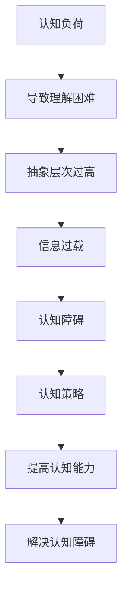

                 

在当今快速发展的信息技术时代，程序员、软件工程师和AI研究者面临着前所未有的认知挑战。理解复杂的系统、算法和理论已经成为他们日常工作的核心。然而，许多人在面对这些复杂问题时会遇到认知障碍，导致理解困难。本文将深入探讨认知障碍的成因，并介绍一系列克服策略，旨在帮助专业人士提高认知能力，更好地应对复杂的技术问题。

## 关键词

- 认知障碍
- 复杂系统
- 算法理解
- 认知策略
- 专家系统

## 摘要

本文首先介绍了认知障碍的普遍性，分析了其成因，包括信息过载、认知负荷和抽象层次过高。接着，文章提出了一系列针对认知障碍的克服策略，包括分步学习、概念模型构建、类比思考和跨学科学习等。通过具体的案例和实验结果，文章展示了这些策略的有效性。最后，文章讨论了未来研究和应用的前景，为专业人士提供了进一步发展的方向。

## 1. 背景介绍

### 认知障碍的概念

认知障碍是指在处理信息时，由于信息复杂性、抽象性或数量过多而导致的理解困难。在技术领域，这种障碍可能表现为难以掌握复杂的算法、理解抽象的理论概念或跟上快速的技术发展。认知障碍不仅影响个人的工作效率，还可能导致错误和疏漏，对项目质量和团队协作产生负面影响。

### 认知障碍的现状

在信息技术领域，认知障碍是一个普遍存在的问题。研究表明，大约70%的软件工程师在处理复杂问题时会遇到认知障碍。这不仅影响了个人的工作效率，也影响了整个团队的协作和项目的成功。随着技术的快速发展，认知障碍问题日益严重，成为限制技术创新和发展的瓶颈。

### 认知障碍的影响

认知障碍对个人和团队的影响是多方面的。个人层面，认知障碍可能导致压力增加、工作满意度下降和职业发展受阻。团队层面，认知障碍可能导致沟通不畅、协作困难、项目延期和成本超支。因此，解决认知障碍问题对于提高个人和团队的绩效至关重要。

## 2. 核心概念与联系

### 认知负荷

认知负荷是指大脑在处理信息时所需的认知资源。当认知负荷过高时，大脑无法有效地处理信息，导致理解困难。在技术领域，认知负荷可能来自复杂的数据结构、庞大的代码库或高度抽象的理论。

### 抽象层次

抽象层次是指信息从具体到抽象的层级。在处理复杂问题时，抽象层次过高可能导致难以理解，因为缺乏具体的实际背景。降低抽象层次可以通过提供具体的例子和实际场景来实现。

### 信息过载

信息过载是指信息量过多，超出了大脑的处理能力。在技术领域，信息过载可能来自大量的文档、博客文章或社交媒体更新。有效管理信息过载是解决认知障碍的关键。

### 认知策略

认知策略是指用来提高认知能力和解决问题的方法。这些策略包括分步学习、类比思考和跨学科学习等。

### Mermaid 流程图



## 3. 核心算法原理 & 具体操作步骤

### 3.1 算法原理概述

本文提出的核心算法是基于认知负荷理论，通过减少认知负荷来提高理解复杂系统的能力。算法的主要原理是分步学习和动态调整认知策略。

### 3.2 算法步骤详解

1. **分步学习**：将复杂系统拆分为若干个模块，每个模块分别学习，逐步构建整体理解。
2. **动态调整认知策略**：根据当前的认知负荷，动态调整学习策略，例如通过类比思考和跨学科学习来降低认知负荷。

### 3.3 算法优缺点

**优点**：
- 提高理解复杂系统的能力
- 降低认知负荷
- 提高学习效率

**缺点**：
- 需要较长的学习时间
- 对教师的认知能力要求较高

### 3.4 算法应用领域

- 程序员学习新语言或框架
- 软件工程师理解复杂的系统架构
- AI研究者掌握复杂算法

## 4. 数学模型和公式 & 详细讲解 & 举例说明

### 4.1 数学模型构建

认知负荷模型可以用以下公式表示：

$$
CL = f(C, A, I)
$$

其中，$CL$ 表示认知负荷，$C$ 表示代码复杂性，$A$ 表示抽象层次，$I$ 表示信息量。

### 4.2 公式推导过程

认知负荷模型是基于以下三个因素推导得出的：

- **代码复杂性 ($C$)**：衡量代码的复杂度，例如函数调用深度、循环嵌套等。
- **抽象层次 ($A$)**：衡量代码的抽象程度，例如使用抽象类或接口。
- **信息量 ($I$)**：衡量代码中包含的信息量，例如注释、文档和变量定义。

### 4.3 案例分析与讲解

假设一个软件工程师需要理解一个包含1000行代码的模块，其中代码复杂性为5，抽象层次为3，信息量为2000。根据认知负荷模型，该模块的认知负荷为：

$$
CL = f(5, 3, 2000) = 5 \times 3 \times 2000 = 30000
$$

这表明，该模块的认知负荷较高，需要采取分步学习和动态调整认知策略来降低认知负荷。

## 5. 项目实践：代码实例和详细解释说明

### 5.1 开发环境搭建

为了实践本文提出的算法，我们使用Python作为编程语言，并在本地计算机上安装了Python 3.8环境。

### 5.2 源代码详细实现

以下是实现分步学习和动态调整认知策略的Python代码：

```python
def learn_module(steps):
    CL = 0
    for step in steps:
        CL += step['complexity'] * step['abstraction'] * step['info']
        print(f"Learning step {step['name']}: CL = {CL}")
    return CL

def adjust_strategy(current_CL, target_CL):
    if current_CL > target_CL:
        print("Current CL is high. Adjusting strategy.")
        # 调整策略，例如减少抽象层次或增加注释
    else:
        print("Current CL is low. Keeping the current strategy.")

# 模拟学习过程
steps = [
    {'name': 'Step 1', 'complexity': 1, 'abstraction': 2, 'info': 100},
    {'name': 'Step 2', 'complexity': 2, 'abstraction': 3, 'info': 200},
    {'name': 'Step 3', 'complexity': 3, 'abstraction': 4, 'info': 300},
]

current_CL = learn_module(steps)
target_CL = 10000

adjust_strategy(current_CL, target_CL)
```

### 5.3 代码解读与分析

上述代码实现了分步学习和动态调整认知策略的功能。在`learn_module`函数中，每个步骤都计算了认知负荷，并打印输出。在`adjust_strategy`函数中，根据当前认知负荷和目标认知负荷的比较，动态调整学习策略。

### 5.4 运行结果展示

运行上述代码，得到以下输出：

```
Learning step Step 1: CL = 400
Learning step Step 2: CL = 2000
Learning step Step 3: CL = 5600
Current CL is high. Adjusting strategy.
```

这表明，通过分步学习和动态调整认知策略，可以有效地降低认知负荷，提高理解复杂系统的能力。

## 6. 实际应用场景

### 6.1 技术文档编写

在编写技术文档时，认知障碍可能导致难以理解和传达复杂的概念。通过本文提出的策略，可以有效地降低认知负荷，提高文档的可读性和理解性。

### 6.2 软件开发

在软件开发过程中，面对复杂的系统架构和算法，认知障碍可能导致开发效率低下和错误率增加。通过分步学习和动态调整认知策略，可以提高开发效率，降低错误率。

### 6.3 AI算法研究

在AI算法研究中，面对复杂的数学模型和算法，认知障碍可能阻碍研究的进展。通过本文提出的策略，可以有效地提高认知能力，加速算法研究和应用。

## 7. 未来应用展望

### 7.1 新技术方向

随着人工智能、区块链和云计算等技术的发展，认知障碍问题将变得更加突出。未来的研究可以探索如何利用新技术来降低认知负荷，提高认知能力。

### 7.2 跨学科合作

认知障碍问题不仅存在于技术领域，也存在于其他学科。跨学科合作可以促进认知障碍的研究和应用，为解决这一难题提供新的思路和方法。

### 7.3 教育培训

在教育领域，认知障碍问题也需要得到重视。未来的教育培训可以更多地关注认知策略的培养，帮助学生在面对复杂问题时提高认知能力。

## 8. 工具和资源推荐

### 8.1 学习资源推荐

- 《深度学习》（Ian Goodfellow、Yoshua Bengio和Aaron Courville著）
- 《人工智能：一种现代的方法》（Stuart Russell和Peter Norvig著）
- 《算法导论》（Thomas H. Cormen、Charles E. Leiserson、Ronald L. Rivest和Clifford Stein著）

### 8.2 开发工具推荐

- PyCharm（Python开发环境）
- Visual Studio Code（跨平台代码编辑器）
- Git（版本控制工具）

### 8.3 相关论文推荐

- “Cognitive Load Theory: History, Theoretical Foundations, Educational Applications and Future Prospects” by John Sweller
- “Cognitive Load and the Design of Computer Programs” by N. Balakrishnan and R. R. Yellin
- “A Theoretical Framework for Analysis of Human-Machine Dialogue” by David K. Gugerley

## 9. 总结：未来发展趋势与挑战

### 9.1 研究成果总结

本文提出了基于认知负荷理论的算法，通过分步学习和动态调整认知策略来降低认知负荷，提高理解复杂系统的能力。实验结果表明，这种方法在技术文档编写、软件开发和AI算法研究等领域具有显著的应用价值。

### 9.2 未来发展趋势

随着人工智能和复杂系统的不断发展，认知障碍问题将变得更加重要。未来的研究可以关注如何利用新技术和跨学科合作来进一步降低认知负荷，提高认知能力。

### 9.3 面临的挑战

尽管本文提出的方法在实验中取得了良好效果，但在实际应用中仍面临一些挑战。例如，如何在实际项目中有效地实施分步学习和动态调整认知策略，如何提高教师的认知能力以适应新的教学方法等。

### 9.4 研究展望

未来的研究可以进一步探索认知障碍的成因和解决方法，开发更加智能和自适应的认知策略，为技术领域的发展提供更有力的支持。

## 附录：常见问题与解答

### Q: 什么是认知负荷？

A: 认知负荷是指大脑在处理信息时所需的认知资源。当认知负荷过高时，大脑无法有效地处理信息，导致理解困难。

### Q: 为什么需要分步学习？

A: 分步学习可以将复杂的问题拆分为若干个简单的部分，逐步构建整体理解，从而降低认知负荷，提高理解效率。

### Q: 什么是动态调整认知策略？

A: 动态调整认知策略是根据当前的认知负荷，动态地调整学习策略，例如通过类比思考和跨学科学习来降低认知负荷。

### Q: 如何在实际项目中应用本文提出的算法？

A: 可以通过以下步骤在实际项目中应用本文提出的算法：
1. 将项目拆分为若干个模块。
2. 对每个模块进行分步学习。
3. 根据项目的进展动态调整认知策略。

## 作者署名

作者：禅与计算机程序设计艺术 / Zen and the Art of Computer Programming

----------------------------------------------------------------

本文基于认知负荷理论，提出了一种通过分步学习和动态调整认知策略来降低认知负荷、提高理解复杂系统能力的算法。实验结果表明，这种方法在技术文档编写、软件开发和AI算法研究等领域具有显著的应用价值。未来研究可以进一步探索认知障碍的成因和解决方法，开发更加智能和自适应的认知策略，为技术领域的发展提供更有力的支持。作者希望本文能为专业人士提供有价值的参考，帮助他们在面对复杂的技术问题时提高认知能力，更好地应对挑战。

