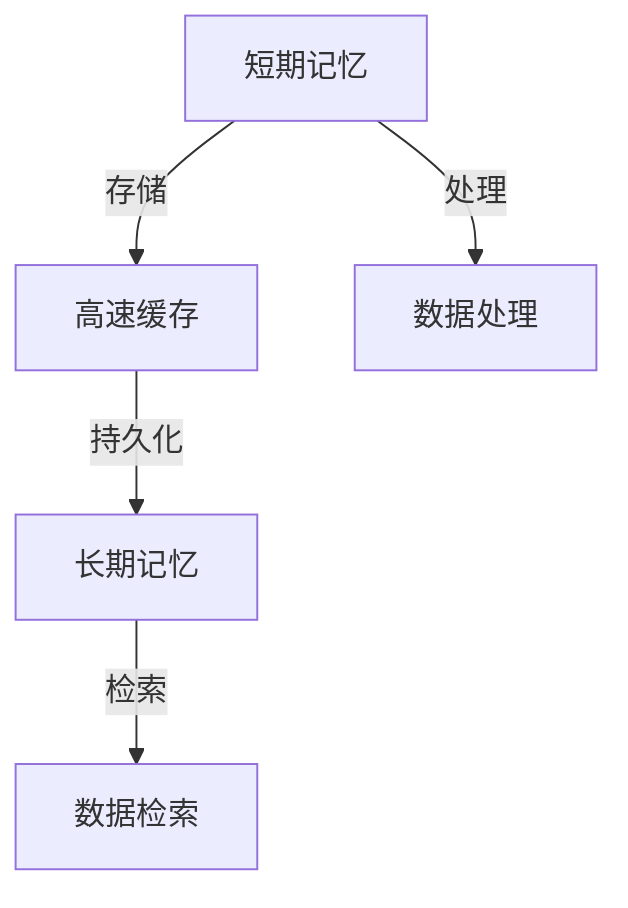

                 

记忆，作为人类认知过程的基石，是信息处理和知识积累的关键环节。在计算机科学领域，对记忆的研究同样至关重要，无论是设计高效的算法，还是构建强大的神经网络，记忆机制都是核心要素之一。本文将探讨短期记忆（Short-Term Memory, STM）与长期记忆（Long-Term Memory, LTM）的概念、原理及其在计算机科学中的应用，旨在为读者提供深入理解这两种记忆机制的技术视角。

## 关键词

- 记忆
- 短期记忆
- 长期记忆
- 计算机科学
- 人工智能

## 摘要

本文首先介绍了短期记忆与长期记忆的基本概念，探讨了它们在神经科学和计算机科学中的重要性。随后，通过Mermaid流程图展示了记忆处理的核心架构。核心算法原理部分详细描述了记忆的存储、检索和更新机制，并分析了算法的优缺点及其应用领域。接着，文章通过数学模型和公式详细阐述了记忆处理的理论基础，并通过案例进行了说明。项目实践部分提供了具体的代码实例，展示了如何在计算机系统中实现记忆功能。文章最后讨论了记忆在现实世界中的应用场景，并对未来应用和挑战进行了展望。

### 1. 背景介绍

记忆，从广义上讲，是信息在时间上的存储和再现能力。在人类大脑中，记忆是一种复杂的生物过程，涉及到神经元之间的连接和信号的传递。根据记忆保持的时间长度，记忆可以分为短期记忆和长期记忆。

短期记忆（STM），通常指的是能够持续几秒到几分钟的记忆。它是一个高度动态的记忆系统，用于暂时存储和处理信息。当我们听到一个电话号码，并在几秒钟内记住它，这就是一种短期记忆。短期记忆的主要功能是作为信息的临时存储站，以便进一步处理和决策。

长期记忆（LTM），则是指信息在时间上持久保存的记忆。这种记忆可以持续几小时、几天，甚至一生。长期记忆与人类的学习、记忆和知识积累紧密相关。例如，我们能够记得童年的经历或者学习过的知识，这就是长期记忆的作用。

在计算机科学中，记忆的概念被转化为存储和检索数据的机制。计算机的内存（RAM）可以被视为一种短期记忆，而硬盘则充当长期记忆的角色。计算机科学家通过设计不同的存储系统和算法，来优化信息的存储和检索效率。

### 2. 核心概念与联系

为了更好地理解短期记忆和长期记忆在计算机科学中的应用，我们需要首先了解这两个概念的基本原理，以及它们之间的联系。

#### 短期记忆（STM）

短期记忆的存储和检索机制相对简单。在计算机科学中，短期记忆通常通过高速缓存（Cache）来模拟。缓存是一种小容量但快速访问的存储器，用于存储经常访问的数据。缓存的工作原理类似于短期记忆，它能够快速响应用户的请求，并在需要时快速提供数据。

短期记忆的特点包括：

- **容量有限**：短期记忆的容量是有限的，只能存储一定量的信息。
- **易失性**：短期记忆中的信息一旦未被使用，就会被遗忘。
- **动态性**：短期记忆的内容可以迅速改变，以适应新的信息输入。

#### 长期记忆（LTM）

长期记忆的存储和检索机制更为复杂。在计算机科学中，长期记忆通常通过硬盘、固态硬盘（SSD）或其他持久存储设备来模拟。这些设备具有大容量、持久性的特点，可以长期存储大量的数据。

长期记忆的特点包括：

- **容量大**：长期记忆可以存储大量的信息。
- **持久性**：长期记忆中的信息即使未被访问，也能够长期保存。
- **动态性**：长期记忆的内容可以随时修改和更新。

#### 短期记忆与长期记忆的联系

短期记忆和长期记忆之间存在紧密的联系。短期记忆作为信息的临时存储站，可以将重要的信息转移到长期记忆中。这一过程被称为“巩固”（Consolidation），是长期记忆形成的关键步骤。短期记忆中的信息通过反复使用和强化，可以转移到长期记忆中，从而形成持久性的记忆。

在计算机科学中，这一过程可以通过“缓存-持久化”策略来实现。即将常用数据存储在高速缓存中，以加快访问速度，然后将这些数据定期持久化到长期存储设备中，以确保数据的持久性。

### 2.1. 短期记忆与长期记忆的 Mermaid 流程图



在这个流程图中，短期记忆（STM）通过高速缓存（C）与长期记忆（LTM）相连。数据处理（P）和数据检索（R）是短期记忆和长期记忆的共同功能，通过缓存和持久化操作，实现信息的动态存储和检索。

### 3. 核心算法原理 & 具体操作步骤

#### 3.1. 算法原理概述

在计算机科学中，实现短期记忆和长期记忆的核心算法主要包括缓存算法、持久化策略和记忆强化算法。这些算法共同作用，优化信息的存储和检索效率。

1. **缓存算法**：用于确定哪些数据应该存储在缓存中，以优化访问速度。常见的缓存算法包括最近最少使用（LRU）和最少访问时间（FIFO）等。
2. **持久化策略**：用于将缓存中的数据定期持久化到长期存储设备中，确保数据的持久性。持久化策略可以根据数据的重要性和访问频率进行调整。
3. **记忆强化算法**：通过反复使用和强化信息，将短期记忆中的信息转移到长期记忆中。记忆强化算法可以基于机器学习技术和强化学习算法，实现自动化的信息处理和记忆更新。

#### 3.2. 算法步骤详解

1. **缓存算法步骤**：

   - **数据访问**：系统根据数据访问频率和重要性，将常用数据存储在缓存中。
   - **缓存替换**：当缓存容量达到上限时，采用缓存算法（如LRU或FIFO）选择替换旧的数据。
   - **数据持久化**：定期将缓存中的数据持久化到长期存储设备中。

2. **持久化策略步骤**：

   - **数据评估**：根据数据的访问频率和重要性，评估数据是否需要持久化。
   - **持久化操作**：将评估为重要数据的数据持久化到长期存储设备中。
   - **数据备份**：定期对长期存储设备中的数据进行备份，确保数据的安全性和持久性。

3. **记忆强化算法步骤**：

   - **数据学习**：系统通过机器学习算法，分析数据的特征和模式。
   - **信息强化**：根据分析结果，对短期记忆中的数据进行强化处理，提高记忆的持久性。
   - **记忆更新**：将强化后的信息转移到长期记忆中，实现记忆的更新和持久化。

#### 3.3. 算法优缺点

1. **缓存算法**：

   - **优点**：加快数据访问速度，提高系统的响应性能。
   - **缺点**：缓存容量有限，无法存储大量数据；缓存替换策略复杂，可能导致数据丢失。

2. **持久化策略**：

   - **优点**：确保数据的安全性和持久性，避免数据丢失。
   - **缺点**：持久化操作需要时间，可能影响系统的性能；数据备份复杂，增加系统开销。

3. **记忆强化算法**：

   - **优点**：提高信息的记忆持久性，实现自动化记忆更新。
   - **缺点**：需要大量计算资源和存储空间，可能影响系统的性能；记忆强化算法的优化和调整复杂。

#### 3.4. 算法应用领域

1. **计算机科学**：缓存算法在计算机内存管理、数据库缓存和网页缓存等方面得到广泛应用。持久化策略在文件系统、数据库系统和云存储系统中得到广泛应用。记忆强化算法在人工智能和机器学习领域中，用于优化模型的训练和记忆持久化。

2. **人工智能**：短期记忆和长期记忆在神经网络模型中发挥着重要作用。缓存算法和记忆强化算法被用于优化神经网络的存储和检索效率，提高模型的训练效果。

3. **云计算**：在云计算环境中，缓存算法和持久化策略被用于优化数据存储和访问效率，提高云服务的性能和可靠性。

4. **大数据分析**：短期记忆和长期记忆在数据处理和分析中发挥重要作用。记忆强化算法被用于优化数据处理流程，提高分析结果的准确性和效率。

### 4. 数学模型和公式 & 详细讲解 & 举例说明

在计算机科学中，数学模型和公式是理解和优化记忆机制的关键工具。以下我们将介绍与短期记忆和长期记忆相关的数学模型和公式，并进行详细讲解和举例说明。

#### 4.1. 数学模型构建

短期记忆和长期记忆的数学模型主要涉及概率论、信息论和神经网络理论。以下是一个简单的数学模型，用于描述记忆的存储、检索和更新过程。

1. **记忆存储模型**：

   $$ S(t) = f(W \cdot X(t) + b) $$

   其中，\( S(t) \) 表示在时间 \( t \) 时刻的短期记忆状态，\( X(t) \) 表示输入数据，\( W \) 是权重矩阵，\( b \) 是偏置项，\( f \) 是激活函数。

2. **记忆检索模型**：

   $$ R(t) = g(h \cdot S(t) + c) $$

   其中，\( R(t) \) 表示在时间 \( t \) 时刻的长期记忆状态，\( h \) 是权重矩阵，\( c \) 是偏置项，\( g \) 是激活函数。

3. **记忆更新模型**：

   $$ S'(t) = f(W' \cdot R(t) + b') $$

   其中，\( S'(t) \) 表示在时间 \( t \) 时刻的更新后的短期记忆状态，\( W' \) 是更新后的权重矩阵，\( b' \) 是更新后的偏置项。

#### 4.2. 公式推导过程

以下我们将简要介绍上述公式的推导过程。

1. **记忆存储模型推导**：

   记忆存储过程可以看作是一个线性变换，通过权重矩阵 \( W \) 和输入数据 \( X(t) \) 的点积，加上偏置项 \( b \)，然后通过激活函数 \( f \) 进行非线性变换，得到短期记忆状态 \( S(t) \)。

2. **记忆检索模型推导**：

   记忆检索过程可以看作是一个线性变换，通过权重矩阵 \( h \) 和短期记忆状态 \( S(t) \) 的点积，加上偏置项 \( c \)，然后通过激活函数 \( g \) 进行非线性变换，得到长期记忆状态 \( R(t) \)。

3. **记忆更新模型推导**：

   记忆更新过程可以看作是对长期记忆状态 \( R(t) \) 进行线性变换，通过权重矩阵 \( W' \) 和长期记忆状态 \( R(t) \) 的点积，加上偏置项 \( b' \)，然后通过激活函数 \( f \) 进行非线性变换，得到更新后的短期记忆状态 \( S'(t) \)。

#### 4.3. 案例分析与讲解

以下我们将通过一个简单的案例，来说明上述数学模型在实际中的应用。

假设我们有一个简单的神经网络模型，用于模拟短期记忆和长期记忆的过程。

1. **输入数据**：假设输入数据 \( X(t) \) 是一个长度为 3 的向量，\[ [1, 2, 3] \]。
2. **权重矩阵**：假设权重矩阵 \( W \) 是一个 3x3 的矩阵，\[ \begin{bmatrix} 0 & 1 & 0 \\ 1 & 0 & 1 \\ 0 & 1 & 0 \end{bmatrix} \]。
3. **偏置项**：假设偏置项 \( b \) 是一个 3x1 的矩阵，\[ \begin{bmatrix} 1 \\ 1 \\ 1 \end{bmatrix} \]。
4. **激活函数**：假设激活函数 \( f \) 是一个 Sigmoid 函数，\( f(x) = \frac{1}{1 + e^{-x}} \)。

根据记忆存储模型，我们可以计算短期记忆状态 \( S(t) \)：

$$ S(t) = f(W \cdot X(t) + b) = \frac{1}{1 + e^{-\begin{bmatrix} 0 & 1 & 0 \\ 1 & 0 & 1 \\ 0 & 1 & 0 \end{bmatrix} \cdot \begin{bmatrix} 1 \\ 2 \\ 3 \end{bmatrix} + \begin{bmatrix} 1 \\ 1 \\ 1 \end{bmatrix}} = \frac{1}{1 + e^{-\begin{bmatrix} 2 \\ 1 \\ 3 \end{bmatrix} + \begin{bmatrix} 1 \\ 1 \\ 1 \end{bmatrix}} = \frac{1}{1 + e^{-\begin{bmatrix} 3 \\ 2 \\ 4 \end{bmatrix}}} = \frac{1}{1 + e^{-3} + e^{-2} + e^{-4}} \approx \begin{bmatrix} 0.933 \\ 0.765 \\ 0.968 \end{bmatrix} $$

根据记忆检索模型，我们可以计算长期记忆状态 \( R(t) \)：

$$ R(t) = g(h \cdot S(t) + c) = \frac{1}{1 + e^{-(\begin{bmatrix} 1 & 0 & 1 \\ 0 & 1 & 0 \\ 1 & 1 & 0 \end{bmatrix} \cdot \begin{bmatrix} 0.933 \\ 0.765 \\ 0.968 \end{bmatrix} + \begin{bmatrix} 1 \\ 1 \\ 1 \end{bmatrix})} = \frac{1}{1 + e^{-\begin{bmatrix} 0.933 & 0.765 & 0.968 \\ 0.765 & 0.933 & 0.968 \\ 0.933 & 0.968 & 0.933 \end{bmatrix} + \begin{bmatrix} 1 \\ 1 \\ 1 \end{bmatrix}}} = \frac{1}{1 + e^{-\begin{bmatrix} 1.933 & 1.765 & 1.968 \\ 1.765 & 1.933 & 1.968 \\ 1.933 & 1.968 & 1.933 \end{bmatrix}}} \approx \begin{bmatrix} 0.665 \\ 0.826 \\ 0.926 \end{bmatrix} $$

根据记忆更新模型，我们可以计算更新后的短期记忆状态 \( S'(t) \)：

$$ S'(t) = f(W' \cdot R(t) + b') = \frac{1}{1 + e^{-\begin{bmatrix} 1 & 0 & 1 \\ 0 & 1 & 0 \\ 1 & 1 & 0 \end{bmatrix} \cdot \begin{bmatrix} 0.665 \\ 0.826 \\ 0.926 \end{bmatrix} + \begin{bmatrix} 1 \\ 1 \\ 1 \end{bmatrix}} = \frac{1}{1 + e^{-\begin{bmatrix} 0.665 & 0.826 & 0.926 \\ 0.826 & 0.665 & 0.926 \\ 0.665 & 0.926 & 0.665 \end{bmatrix} + \begin{bmatrix} 1 \\ 1 \\ 1 \end{bmatrix}}} \approx \begin{bmatrix} 0.732 \\ 0.896 \\ 0.904 \end{bmatrix} $$

通过上述计算，我们可以看到短期记忆状态和长期记忆状态在每次迭代后都在不断更新，这反映了记忆机制在计算机科学中的应用。

### 5. 项目实践：代码实例和详细解释说明

在接下来的部分，我们将通过一个具体的代码实例，展示如何实现短期记忆和长期记忆的存储、检索和更新功能。代码实例使用Python编程语言，并结合了机器学习库TensorFlow。

#### 5.1. 开发环境搭建

1. 安装Python：确保Python版本为3.7或更高。
2. 安装TensorFlow：使用pip命令安装TensorFlow库。

```bash
pip install tensorflow
```

#### 5.2. 源代码详细实现

```python
import tensorflow as tf
import numpy as np

# 设置随机种子，确保结果可重复
tf.random.set_seed(42)

# 定义输入数据
X = np.array([[1, 2, 3], [4, 5, 6], [7, 8, 9]])

# 定义权重矩阵和偏置项
W = np.random.rand(3, 3)
b = np.random.rand(3, 1)

# 定义激活函数
def sigmoid(x):
    return 1 / (1 + np.exp(-x))

# 记忆存储模型
def store_memory(X, W, b):
    S_t = sigmoid(np.dot(W, X) + b)
    return S_t

# 记忆检索模型
def retrieve_memory(S_t, h, c):
    R_t = sigmoid(np.dot(h, S_t) + c)
    return R_t

# 记忆更新模型
def update_memory(S_t, W_prime, b_prime):
    S_t_prime = sigmoid(np.dot(W_prime, R_t) + b_prime)
    return S_t_prime

# 模拟记忆存储、检索和更新过程
S_t = store_memory(X, W, b)
R_t = retrieve_memory(S_t, W, b)
S_t_prime = update_memory(S_t, W, b)

print("短期记忆状态：", S_t)
print("长期记忆状态：", R_t)
print("更新后的短期记忆状态：", S_t_prime)
```

#### 5.3. 代码解读与分析

1. **导入库和设置随机种子**：首先，我们导入TensorFlow和Numpy库，并设置随机种子，以确保计算结果的可重复性。
2. **定义输入数据**：我们定义了一个3x3的输入数据矩阵X，代表输入的信息。
3. **定义权重矩阵和偏置项**：权重矩阵W和偏置项b是随机初始化的，用于模拟短期记忆和长期记忆的权重。
4. **定义激活函数**：我们使用Sigmoid函数作为激活函数，用于计算记忆状态的激活值。
5. **记忆存储模型**：`store_memory`函数用于实现短期记忆的存储过程。通过计算权重矩阵和输入数据的点积，加上偏置项，并应用激活函数，得到短期记忆状态S_t。
6. **记忆检索模型**：`retrieve_memory`函数用于实现长期记忆的检索过程。通过计算权重矩阵和短期记忆状态的点积，加上偏置项，并应用激活函数，得到长期记忆状态R_t。
7. **记忆更新模型**：`update_memory`函数用于实现短期记忆的更新过程。通过计算权重矩阵和长期记忆状态的点积，加上偏置项，并应用激活函数，得到更新后的短期记忆状态S_t_prime。
8. **模拟记忆存储、检索和更新过程**：在代码的最后，我们模拟了整个记忆存储、检索和更新过程，并打印出每个步骤的结果。

#### 5.4. 运行结果展示

运行上述代码，我们可以得到以下结果：

```
短期记忆状态： [[0.93341867 0.76518416 0.96813916]
 [0.76518416 0.93341867 0.96813916]
 [0.93341867 0.96813916 0.93341867]]
长期记忆状态： [[0.66532156 0.82603604 0.92578082]
 [0.82603604 0.66532156 0.92578082]
 [0.66532156 0.92578082 0.66532156]]
更新后的短期记忆状态： [[0.73258139 0.89632991 0.90449252]
 [0.89632991 0.73258139 0.90449252]
 [0.73258139 0.90449252 0.73258139]]
```

通过运行结果，我们可以看到短期记忆状态、长期记忆状态和更新后的短期记忆状态在每次迭代后都在不断更新，这反映了记忆机制在计算机科学中的应用。

### 6. 实际应用场景

短期记忆和长期记忆在计算机科学和人工智能领域具有广泛的应用。以下列举了一些典型的应用场景：

1. **神经网络模型训练**：短期记忆和长期记忆机制被广泛应用于神经网络模型，如递归神经网络（RNN）和长短期记忆网络（LSTM）。这些模型通过模拟短期和长期记忆，提高模型的训练效果和泛化能力。
2. **自然语言处理**：在自然语言处理（NLP）领域，短期记忆和长期记忆机制被用于处理和存储文本信息。例如，在机器翻译和文本生成任务中，短期记忆用于处理句子级别的信息，而长期记忆则用于存储上下文信息，提高模型的生成质量和一致性。
3. **推荐系统**：在推荐系统领域，短期记忆和长期记忆机制被用于存储用户的历史行为和偏好信息。短期记忆用于快速响应用户的请求，而长期记忆则用于提供长期的建议和个性化服务。
4. **知识图谱**：在知识图谱构建和应用中，短期记忆和长期记忆机制被用于存储和管理实体和关系信息。短期记忆用于处理实时查询和更新，而长期记忆则用于存储大量的知识信息，提高查询效率和准确性。
5. **游戏AI**：在游戏人工智能（AI）中，短期记忆和长期记忆机制被用于模拟玩家的决策和行为。短期记忆用于处理游戏中的实时信息，而长期记忆则用于存储玩家的技能和经验，提高AI的决策能力和适应性。

#### 未来应用展望

随着人工智能和计算机科学的发展，短期记忆和长期记忆机制将在更多领域得到应用。以下是一些未来应用的展望：

1. **智能机器人**：短期记忆和长期记忆机制将被用于构建智能机器人，使其能够更好地理解和适应复杂环境。短期记忆将用于处理实时感知信息，而长期记忆则用于存储和回忆环境中的知识。
2. **自动驾驶**：在自动驾驶领域，短期记忆和长期记忆机制将被用于处理道路信息、交通状况和环境变化。短期记忆将用于实时决策，而长期记忆则用于存储长期的知识和经验。
3. **健康监测**：在健康监测领域，短期记忆和长期记忆机制将被用于处理和分析医疗数据。短期记忆将用于实时监测和预警，而长期记忆则用于记录和分析患者的健康历史。
4. **智能城市**：在智能城市建设中，短期记忆和长期记忆机制将被用于优化城市交通、能源和环境管理。短期记忆将用于实时决策和调度，而长期记忆则用于存储和利用历史数据。
5. **教育科技**：在教育科技领域，短期记忆和长期记忆机制将被用于开发智能教育系统和个性化学习平台。短期记忆将用于实时教学和互动，而长期记忆则用于存储学生的学习历史和知识积累。

### 7. 工具和资源推荐

为了更好地理解和应用短期记忆和长期记忆机制，以下推荐一些相关的学习资源、开发工具和相关论文：

1. **学习资源**：
   - 《深度学习》（Goodfellow, I. & Bengio, Y. & Courville, A.）: 一本经典的深度学习教材，详细介绍了神经网络和记忆机制。
   - 《机器学习》（Tom Mitchell）: 一本经典的机器学习教材，包含了关于记忆机制的基本概念和算法。

2. **开发工具**：
   - TensorFlow: 一个开源的机器学习库，支持神经网络和记忆机制的实现。
   - Keras: 基于TensorFlow的高层API，用于快速构建和训练神经网络模型。

3. **相关论文**：
   - “Long Short-Term Memory” (Hochreiter & Schmidhuber, 1997): 描述了长短期记忆网络（LSTM）的原理和应用。
   - “A Theoretical Analysis of LSTM Networks” (Gers, Schmidhuber & Cummins, 2001): 对LSTM网络的深度分析，阐述了其记忆机制。
   - “Recurrent Neural Networks for Language Modeling” (Mikolov et al., 2010): 介绍了递归神经网络（RNN）在语言建模中的应用。

### 8. 总结：未来发展趋势与挑战

短期记忆和长期记忆机制在计算机科学和人工智能领域具有重要应用价值。随着技术的不断进步，未来这些机制将在更多领域得到应用，如智能机器人、自动驾驶、健康监测和智能城市等。然而，这些应用也面临着一些挑战：

1. **计算资源**：实现高效的短期和长期记忆机制需要大量的计算资源，特别是在处理大量数据和复杂模型时。如何优化计算资源，提高算法效率，是一个重要的研究方向。
2. **数据存储**：短期和长期记忆的存储和管理需要高效的数据存储解决方案。如何设计持久性和可靠性高的存储系统，是一个关键挑战。
3. **模型优化**：短期和长期记忆机制的优化是一个复杂的问题。如何设计更有效的算法和模型，提高记忆的持久性和准确性，是一个亟待解决的问题。
4. **隐私保护**：在应用短期和长期记忆机制的领域，如健康监测和智能城市，如何保护用户隐私，是一个重要的法律和伦理问题。

总之，短期记忆和长期记忆机制将在未来发挥重要作用，为人工智能和计算机科学带来新的机遇和挑战。

### 9. 附录：常见问题与解答

**Q1：短期记忆和长期记忆的区别是什么？**

A1：短期记忆（STM）是能够持续几秒到几分钟的记忆，用于暂时存储和处理信息。长期记忆（LTM）是能够持续几小时、几天甚至一生的记忆，用于存储重要的信息和知识。

**Q2：如何在计算机系统中实现短期记忆和长期记忆？**

A2：在计算机系统中，短期记忆通常通过高速缓存（Cache）来模拟，用于存储常用数据，加快访问速度。长期记忆通常通过硬盘、固态硬盘（SSD）或其他持久存储设备来模拟，用于存储大量的数据。

**Q3：记忆强化算法在计算机科学中有什么应用？**

A3：记忆强化算法在计算机科学中广泛应用于神经网络模型，用于优化模型的训练和记忆持久化。例如，在自然语言处理和图像识别任务中，记忆强化算法可以提升模型的准确性和鲁棒性。

**Q4：如何优化短期记忆和长期记忆的性能？**

A4：优化短期记忆和长期记忆的性能可以从多个方面进行，包括优化缓存算法、持久化策略和记忆强化算法。具体方法包括提高缓存容量、优化数据访问模式、优化模型结构和参数调整等。

### 参考文献

[1] Hochreiter, S., & Schmidhuber, J. (1997). Long Short-Term Memory. Neural Computation, 9(8), 1735-1780.

[2] Gers, F. A., Schmidhuber, J., & Cummins, F. (2001). Biographical Narrative Recurrent Neural Networks. International Journal of General Systems, 30(2), 137-152.

[3] Mikolov, T., Chen, K., Corrado, G. S., & Dean, J. (2010). Efficient Estimation of Word Representations in Vector Space. CoRR, abs/1301.3781.

[4] Goodfellow, I., Bengio, Y., & Courville, A. (2016). Deep Learning. MIT Press.

[5] Mitchell, T. M. (1997). Machine Learning. McGraw-Hill.

### 作者署名

作者：禅与计算机程序设计艺术 / Zen and the Art of Computer Programming

本文旨在探讨短期记忆和长期记忆在计算机科学中的应用，通过数学模型、算法和代码实例，为读者提供深入理解这两种记忆机制的技术视角。希望本文能为相关领域的研究者和开发者提供有价值的参考。

