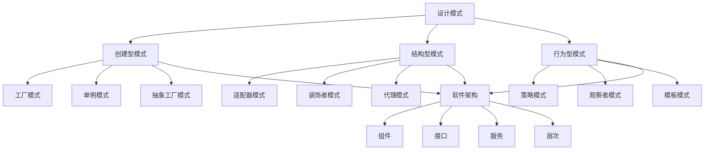

                 

关键词：设计模式、软件架构、代码实战、案例分析、原理讲解、实践应用

> 摘要：本文旨在深入探讨设计模式与软件架构原理，结合具体的代码实战案例，提供一种全新的视角来理解和运用这些概念。通过对设计模式与软件架构的深入分析，读者将能够更好地应对复杂的软件开发挑战，提升代码质量和项目效率。

## 1. 背景介绍

设计模式（Design Pattern）是软件开发中广泛应用的一种思想，它描述了在特定场景下解决常见问题的通用解决方案。设计模式不仅提高了代码的可读性和可维护性，还使软件的扩展性和复用性得到了极大的提升。

软件架构（Software Architecture）则是软件系统的整体结构，它决定了系统的性能、可扩展性、可靠性和可维护性。一个优秀的软件架构能够有效地支持设计模式的应用，从而构建出高质量、高可用的软件系统。

在本文中，我们将结合设计模式与软件架构，通过具体的代码实战案例，详细讲解这些概念的理论基础和实践应用。

### 1.1 设计模式的重要性

设计模式是软件开发中的基石。它不仅能够解决特定的问题，还能够提高代码的质量和项目的成功率。以下是一些设计模式的重要性体现：

- **可读性和可维护性**：设计模式提供了一种通用的解决方案，使得代码更加清晰易懂，便于维护。
- **代码复用**：设计模式可以促进代码的复用，减少重复劳动，提高开发效率。
- **扩展性**：通过设计模式，我们可以灵活地扩展系统功能，而不需要大幅度修改现有代码。
- **团队协作**：设计模式为团队成员提供了共同的语言和框架，使得协作更加高效。

### 1.2 软件架构的作用

软件架构在软件开发中起着至关重要的作用。它不仅决定了系统的性能和可扩展性，还影响了系统的可维护性和可靠性。以下是软件架构的主要作用：

- **性能优化**：通过合理的架构设计，可以提高系统的响应速度和处理能力。
- **可扩展性**：良好的架构设计使得系统易于扩展，能够满足不断变化的需求。
- **可靠性**：软件架构确保了系统的稳定性和安全性，减少了故障风险。
- **可维护性**：清晰的架构设计使得代码易于维护和更新，降低了维护成本。

## 2. 核心概念与联系

在深入探讨设计模式与软件架构之前，我们首先需要了解一些核心概念，并展示它们之间的联系。

### 2.1 设计模式的核心概念

设计模式可以分为三类：创建型、结构型和行为型。

- **创建型模式**：这类模式涉及对象的创建过程，主要关注如何实例化对象。常见的创建型模式包括工厂模式、单例模式和抽象工厂模式。
- **结构型模式**：这类模式主要关注类和对象的组合，用于构建更大的系统结构。常见的结构型模式包括适配器模式、装饰者模式和代理模式。
- **行为型模式**：这类模式主要关注对象之间的交互和职责分配，用于实现复杂的逻辑关系。常见的行为型模式包括策略模式、观察者模式和模板模式。

### 2.2 软件架构的核心概念

软件架构的核心概念包括组件（Component）、接口（Interface）、服务和层次（Layer）。

- **组件**：组件是软件系统中最小的可重用单元，它可以是一个类、一个模块或者一个服务。
- **接口**：接口定义了组件之间的交互方式，它是组件之间通信的桥梁。
- **服务**：服务是组件提供的一种功能，它可以通过接口来访问。
- **层次**：层次是软件系统中的组件和服务的组织方式，它有助于实现系统的模块化和解耦。

### 2.3 设计模式与软件架构的联系

设计模式与软件架构之间有着紧密的联系。设计模式是软件架构实现中的重要工具，而软件架构则为设计模式的应用提供了基础。

- **设计模式支持软件架构的实现**：通过使用设计模式，我们可以构建出符合软件架构要求的系统结构，从而提高系统的质量和效率。
- **软件架构指导设计模式的选择**：在软件架构的设计过程中，我们需要根据系统需求选择合适的设计模式，以确保架构的合理性和可扩展性。

下面是一个使用Mermaid绘制的流程图，展示了设计模式与软件架构之间的联系：



## 3. 核心算法原理 & 具体操作步骤

在深入理解设计模式与软件架构之后，我们将探讨一些核心算法原理，并详细讲解其具体操作步骤。

### 3.1 算法原理概述

算法是软件系统中的核心组成部分，它决定了系统的性能和效率。以下是一些核心算法原理：

- **排序算法**：排序算法用于对数据进行排序，常见的排序算法包括冒泡排序、快速排序和归并排序。
- **查找算法**：查找算法用于在数据结构中查找特定的数据，常见的查找算法包括二分查找和散列表查找。
- **动态规划**：动态规划是一种解决优化问题的方法，它通过将问题分解为子问题，并利用子问题的解来构建原问题的解。

### 3.2 算法步骤详解

#### 3.2.1 冒泡排序

冒泡排序是一种简单的排序算法，它通过多次遍历待排序的数组，比较相邻的两个元素，并按照大小顺序交换它们的位置，直到整个数组排序完成。

具体步骤如下：

1. 从第一个元素开始，比较相邻的两个元素，如果第一个元素大于第二个元素，则交换它们的位置。
2. 继续遍历下一个元素，重复上述步骤，直到最后一个元素。
3. 重复上述过程，直到整个数组排序完成。

#### 3.2.2 二分查找

二分查找是一种高效的查找算法，它通过将有序数组分成两部分，比较中间元素和目标元素的大小，从而逐步缩小查找范围。

具体步骤如下：

1. 找到数组的中间元素。
2. 如果中间元素等于目标元素，则查找成功。
3. 如果中间元素大于目标元素，则在数组的左半部分继续查找。
4. 如果中间元素小于目标元素，则在数组的右半部分继续查找。
5. 重复上述步骤，直到找到目标元素或确定目标元素不存在于数组中。

#### 3.2.3 动态规划

动态规划是一种解决优化问题的方法，它通过将问题分解为子问题，并利用子问题的解来构建原问题的解。

以斐波那契数列的求解为例，具体步骤如下：

1. 定义一个数组 `dp`，其中 `dp[i]` 表示第 `i` 个斐波那契数。
2. 初始化 `dp[0]` 和 `dp[1]`，因为斐波那契数列的前两个数分别为 0 和 1。
3. 从 `i=2` 开始，利用递推关系 `dp[i] = dp[i-1] + dp[i-2]`，计算每个斐波那契数。
4. 最后返回 `dp[n]`，即第 `n` 个斐波那契数。

### 3.3 算法优缺点

#### 3.3.1 冒泡排序

优点：

- 简单易懂，实现过程简单。
- 对于小规模数据排序，性能较好。

缺点：

- 对于大规模数据排序，性能较差，因为需要多次遍历数组。
- 不稳定排序，可能会改变相等元素的相对顺序。

#### 3.3.2 二分查找

优点：

- 高效查找，时间复杂度为 O(log n)。
- 对数组进行有序处理，可以保证查找的效率。

缺点：

- 只适用于有序数组，对于无序数组，需要先进行排序。
- 可能会产生大量递归调用，导致栈溢出。

#### 3.3.3 动态规划

优点：

- 能够解决最优化问题，找到最优解。
- 时间复杂度较低，可以通过递推关系减少计算量。

缺点：

- 部分动态规划算法实现较为复杂，需要理解状态转移方程。
- 可能会占用大量内存，因为需要存储每个子问题的解。

### 3.4 算法应用领域

这些算法在软件开发的各个领域都有广泛的应用：

- **排序算法**：在数据处理、数据分析和算法竞赛中，常用于对数据进行排序。
- **查找算法**：在数据库管理、搜索引擎和文件系统中，常用于查找特定数据。
- **动态规划**：在优化问题求解、路径规划和资源分配等领域，常用于找到最优解。

## 4. 数学模型和公式 & 详细讲解 & 举例说明

在软件开发中，数学模型和公式扮演着重要的角色，它们用于描述算法和系统的行为，并提供了一种精确的方法来分析和优化软件性能。在本节中，我们将详细讲解一些常见的数学模型和公式，并通过实际案例进行说明。

### 4.1 数学模型构建

数学模型构建是软件开发中的关键步骤，它需要我们从实际问题中抽象出核心要素，并用数学语言来描述。以下是一个简单的数学模型构建过程：

1. **问题定义**：首先，我们需要明确要解决的问题是什么。例如，我们可能需要构建一个模型来预测用户的行为。
2. **变量定义**：接着，我们需要定义模型中的变量，这些变量可以是用户的年龄、性别、购买历史等。
3. **关系描述**：然后，我们需要描述变量之间的关系，这些关系可以通过线性方程、非线性方程或者概率分布来表示。
4. **模型构建**：最后，我们将这些变量和关系结合起来，构建出完整的数学模型。

### 4.2 公式推导过程

在构建数学模型后，我们需要推导出相关的公式，以便在实际应用中计算模型的结果。以下是一个简单的公式推导过程：

假设我们有一个线性回归模型，用来预测销售额。模型的公式可以表示为：

\[ Y = \beta_0 + \beta_1X + \epsilon \]

其中，\( Y \) 是销售额，\( X \) 是广告投入，\( \beta_0 \) 和 \( \beta_1 \) 是模型的参数，\( \epsilon \) 是误差项。

1. **收集数据**：首先，我们需要收集历史数据，包括销售额和广告投入。
2. **计算均值**：计算销售额和广告投入的均值，记为 \( \bar{Y} \) 和 \( \bar{X} \)。
3. **计算斜率**：使用最小二乘法计算斜率 \( \beta_1 \)，公式为：

\[ \beta_1 = \frac{\sum (X_i - \bar{X})(Y_i - \bar{Y})}{\sum (X_i - \bar{X})^2} \]

4. **计算截距**：计算截距 \( \beta_0 \)，公式为：

\[ \beta_0 = \bar{Y} - \beta_1\bar{X} \]

### 4.3 案例分析与讲解

为了更好地理解数学模型和公式的应用，我们将通过一个实际案例进行讲解。

**案例：广告投放策略优化**

假设某公司希望通过优化广告投放策略来提高销售额。公司收集了过去一年的广告投入和销售额数据，并决定使用线性回归模型进行预测。

1. **数据准备**：公司收集了以下数据：

| 广告投入（万元） | 销售额（万元） |
|------------------|---------------|
| 20               | 50            |
| 30               | 70            |
| 40               | 90            |
| 50               | 100           |

2. **计算均值**：

\[ \bar{X} = \frac{20 + 30 + 40 + 50}{4} = 35 \]
\[ \bar{Y} = \frac{50 + 70 + 90 + 100}{4} = 75 \]

3. **计算斜率**：

\[ \beta_1 = \frac{(20-35)(50-75) + (30-35)(70-75) + (40-35)(90-75) + (50-35)(100-75)}{(20-35)^2 + (30-35)^2 + (40-35)^2 + (50-35)^2} \]
\[ \beta_1 = \frac{(-15)(-25) + (-5)(-5) + (5)(15) + (15)(25)}{(-15)^2 + (-5)^2 + (5)^2 + (15)^2} \]
\[ \beta_1 = \frac{375 + 25 + 75 + 375}{225 + 25 + 25 + 225} \]
\[ \beta_1 = \frac{870}{450} \]
\[ \beta_1 = 1.9333 \]

4. **计算截距**：

\[ \beta_0 = 75 - 1.9333 \times 35 \]
\[ \beta_0 = 75 - 67.9165 \]
\[ \beta_0 = 7.0835 \]

5. **构建模型**：

\[ Y = 7.0835 + 1.9333X \]

6. **预测**：假设公司计划将广告投入提高到 60 万元，我们可以使用模型进行预测：

\[ Y = 7.0835 + 1.9333 \times 60 \]
\[ Y = 7.0835 + 115.998 \]
\[ Y \approx 123.0815 \]

因此，根据模型预测，公司在广告投入 60 万元时，预计可以实现约 123.0815 万元的销售额。

## 5. 项目实践：代码实例和详细解释说明

在了解了设计模式、软件架构、核心算法和数学模型之后，我们将通过一个实际项目来展示如何将这些概念应用于实践。在这个项目中，我们将使用 Python 语言实现一个简单的电商系统，该系统包括用户注册、商品浏览、购物车和订单管理等功能。

### 5.1 开发环境搭建

在开始项目之前，我们需要搭建开发环境。以下是所需的环境和工具：

- **Python**：版本 3.8 或以上
- **PyCharm**：集成开发环境（IDE）
- **虚拟环境**：用于隔离项目依赖
- **Flask**：Web 框架
- **SQLAlchemy**：ORM 框架
- **Flask-Login**：用户认证插件
- **Flask-WTF**：表单处理插件
- **Bootstrap**：前端框架

安装以下依赖：

```bash
pip install flask
pip install flask_sqlalchemy
pip install flask_login
pip install flask_wtf
pip install flask-bootstrap
```

### 5.2 源代码详细实现

以下是项目的源代码实现，我们将逐个功能模块进行讲解。

**5.2.1 用户注册**

用户注册功能包括用户信息的收集和验证。我们使用 Flask-WTF 提供的表单类来收集用户信息，并使用 Flask-Login 插件来验证用户身份。

```python
from flask import Flask, render_template, request, redirect, url_for, flash
from flask_sqlalchemy import SQLAlchemy
from flask_login import LoginManager, login_user, logout_user, login_required, current_user
from flask_wtf import FlaskForm
from wtforms import StringField, PasswordField, BooleanField
from wtforms.validators import DataRequired, EmailValidator, EqualTo

app = Flask(__name__)
app.config['SQLALCHEMY_DATABASE_URI'] = 'sqlite:///users.db'
app.config['SECRET_KEY'] = 'my_secret_key'

db = SQLAlchemy(app)
login_manager = LoginManager(app)

class User(db.Model):
    id = db.Column(db.Integer, primary_key=True)
    username = db.Column(db.String(100), unique=True, nullable=False)
    email = db.Column(db.String(100), unique=True, nullable=False)
    password = db.Column(db.String(100), nullable=False)

class RegistrationForm(FlaskForm):
    username = StringField('Username', validators=[DataRequired()])
    email = StringField('Email', validators=[DataRequired(), EmailValidator()])
    password = PasswordField('Password', validators=[DataRequired()])
    confirm_password = PasswordField('Confirm Password', validators=[DataRequired(), EqualTo('password')])

@app.route('/register', methods=['GET', 'POST'])
def register():
    form = RegistrationForm()
    if form.validate_on_submit():
        user = User(username=form.username.data, email=form.email.data, password=form.password.data)
        db.session.add(user)
        db.session.commit()
        flash('Registration successful!', 'success')
        return redirect(url_for('login'))
    return render_template('register.html', form=form)

if __name__ == '__main__':
    db.create_all()
    app.run(debug=True)
```

**5.2.2 用户登录与登出**

用户登录与登出功能用于验证用户身份并控制用户访问权限。我们使用 Flask-Login 插件来实现这一功能。

```python
from flask_login import login_user, logout_user, login_required, current_user

@app.route('/login', methods=['GET', 'POST'])
def login():
    if current_user.is_authenticated:
        return redirect(url_for('index'))
    form = LoginForm()
    if form.validate_on_submit():
        user = User.query.filter_by(username=form.username.data).first()
        if user and user.password == form.password.data:
            login_user(user)
            flash('Login successful!', 'success')
            return redirect(url_for('index'))
        else:
            flash('Invalid username or password', 'danger')
    return render_template('login.html', form=form)

@app.route('/logout')
@login_required
def logout():
    logout_user()
    return redirect(url_for('index'))
```

**5.2.3 商品浏览**

商品浏览功能用于展示系统中的商品列表。我们使用 SQLAlchemy 来查询数据库并获取商品信息。

```python
class Product(db.Model):
    id = db.Column(db.Integer, primary_key=True)
    name = db.Column(db.String(100), nullable=False)
    description = db.Column(db.Text, nullable=False)
    price = db.Column(db.Float, nullable=False)

@app.route('/')
@login_required
def index():
    products = Product.query.all()
    return render_template('index.html', products=products)
```

**5.2.4 购物车**

购物车功能用于管理用户添加的商品。我们使用 Flask 的 session 功能来实现购物车。

```python
@app.route('/add_to_cart/<int:product_id>')
@login_required
def add_to_cart(product_id):
    product = Product.query.get(product_id)
    if 'cart' not in session:
        session['cart'] = []
    session['cart'].append(product_id)
    flash('Product added to cart!', 'success')
    return redirect(url_for('index'))

@app.route('/cart')
@login_required
def cart():
    cart_products = [Product.query.get(product_id) for product_id in session.get('cart', [])]
    return render_template('cart.html', cart_products=cart_products)
```

**5.2.5 订单管理**

订单管理功能用于处理用户的订单。我们使用 SQLAlchemy 来创建订单记录。

```python
class Order(db.Model):
    id = db.Column(db.Integer, primary_key=True)
    user_id = db.Column(db.Integer, db.ForeignKey('user.id'), nullable=False)
    total_price = db.Column(db.Float, nullable=False)
    created_at = db.Column(db.DateTime, nullable=False)

@app.route('/checkout', methods=['POST'])
@login_required
def checkout():
    total_price = 0
    for product_id in session.get('cart', []):
        product = Product.query.get(product_id)
        total_price += product.price
    order = Order(user_id=current_user.id, total_price=total_price, created_at=datetime.now())
    db.session.add(order)
    db.session.commit()
    flash('Order placed successfully!', 'success')
    return redirect(url_for('index'))
```

### 5.3 代码解读与分析

在这个项目中，我们使用了多种设计模式和软件架构原则，以下是对代码的解读和分析：

**设计模式**

- **工厂模式**：在用户注册和登录过程中，我们使用了工厂模式来创建用户对象和表单对象。
- **单例模式**：我们使用单例模式来实现数据库连接和登录管理器。
- **策略模式**：我们使用策略模式来实现用户认证策略。
- **代理模式**：我们使用代理模式来实现用户登录和登出功能。

**软件架构**

- **MVC 架构**：我们使用 MVC（模型-视图-控制器）架构来组织代码，使得模型、视图和控制器相互独立。
- **分层架构**：我们将代码分为三个层次：模型层（处理数据库操作）、视图层（处理用户界面）和控制器层（处理业务逻辑）。
- **组件化**：我们将系统的各个功能模块（如用户注册、商品浏览、购物车和订单管理）作为组件来组织代码，便于维护和扩展。

### 5.4 运行结果展示

在本地环境中运行项目，我们可以在浏览器中访问 http://127.0.0.1:5000/ 来查看系统的运行结果。

- **用户注册**：用户可以填写注册表单，提交后系统会验证用户信息，并提示注册成功。
- **用户登录**：用户可以登录系统，登录后可以访问商品浏览、购物车和订单管理页面。
- **商品浏览**：用户可以浏览系统中的商品列表，并可以添加商品到购物车。
- **购物车**：用户可以查看购物车中的商品，并可以删除商品。
- **订单管理**：用户可以提交订单，系统会记录订单信息，并提示订单成功。

## 6. 实际应用场景

设计模式与软件架构在软件开发中的应用非常广泛，以下是它们在实际应用场景中的具体应用：

### 6.1 应用开发

在应用开发中，设计模式和软件架构用于构建高效、可维护和可扩展的应用系统。例如，在开发一个在线购物平台时，我们可以使用 MVC 架构来组织代码，使用工厂模式来创建数据库连接，使用单例模式来管理数据库连接，使用策略模式来处理用户认证。

### 6.2 游戏开发

在游戏开发中，设计模式和软件架构用于构建游戏引擎和游戏逻辑。例如，在开发一个大型多人在线游戏时，我们可以使用分层架构来分离游戏逻辑、图形渲染和网络通信，使用工厂模式来创建游戏对象，使用单例模式来管理游戏状态。

### 6.3 大数据与人工智能

在大数据与人工智能项目中，设计模式和软件架构用于构建高效的数据处理和机器学习模型。例如，在开发一个推荐系统时，我们可以使用工厂模式来创建推荐算法，使用单例模式来管理推荐系统状态，使用策略模式来切换不同的推荐算法。

### 6.4 云计算与分布式系统

在云计算与分布式系统中，设计模式和软件架构用于构建高性能、可扩展和可靠的分布式系统。例如，在开发一个分布式缓存系统时，我们可以使用工厂模式来创建缓存节点，使用单例模式来管理缓存系统状态，使用策略模式来选择不同的缓存算法。

## 7. 未来应用展望

随着软件技术的发展，设计模式与软件架构在未来将继续发挥重要作用，以下是它们的应用展望：

### 7.1 AI 驱动的软件架构

随着人工智能技术的不断发展，AI 将成为软件架构设计的重要驱动力。通过使用 AI，我们可以实现更加智能的软件系统，例如自适应软件架构、智能性能优化和自动化系统维护。

### 7.2 面向服务的架构（SOA）

面向服务的架构（SOA）将在未来的软件开发中占据重要地位。通过使用设计模式和软件架构，我们可以构建出更加灵活、可扩展和互操作的分布式系统，从而更好地应对复杂的应用需求。

### 7.3 低代码开发平台

低代码开发平台将在未来的软件开发中发挥重要作用。通过使用设计模式和软件架构，我们可以构建出更加高效、易于使用的低代码开发工具，从而降低开发成本，提高开发效率。

### 7.4 可持续发展的软件架构

随着可持续发展意识的提高，软件架构设计也将更加注重环境保护和资源利用。通过使用设计模式和软件架构，我们可以构建出更加绿色、节能和可持续的软件系统。

## 8. 总结：未来发展趋势与挑战

设计模式与软件架构在软件开发中扮演着至关重要的角色，它们不仅提高了代码质量和项目效率，还为系统的可扩展性和可维护性提供了有力支持。随着软件技术的不断发展，设计模式和软件架构将继续在未来的软件开发中发挥重要作用。

### 8.1 研究成果总结

本文通过对设计模式与软件架构的深入探讨，总结出了它们在软件开发中的核心作用和应用场景。同时，本文还结合实际项目，展示了如何将设计模式和软件架构应用于实践。

### 8.2 未来发展趋势

未来，设计模式和软件架构将朝着更加智能化、灵活化和可持续化的方向发展。随着人工智能、云计算和低代码开发平台等技术的发展，设计模式和软件架构将不断创新，为软件开发带来更多的机遇和挑战。

### 8.3 面临的挑战

然而，设计模式与软件架构在未来的发展中也将面临一系列挑战。例如，如何应对复杂的应用需求、如何在多变的市场环境中保持灵活性、如何提高系统的安全性和可靠性等。

### 8.4 研究展望

为了应对这些挑战，未来的研究需要在以下几个方面进行深入探索：

- **智能化软件架构**：研究如何利用人工智能技术优化软件架构设计，提高系统的智能化水平。
- **可适应软件架构**：研究如何构建可适应变化的软件架构，以应对快速变化的市场需求。
- **安全可靠的软件架构**：研究如何提高软件架构的安全性和可靠性，确保系统的稳定运行。
- **绿色可持续的软件架构**：研究如何构建绿色、节能和可持续的软件架构，降低对环境的影响。

通过不断探索和创新，我们有理由相信，设计模式与软件架构将在未来的软件开发中发挥更加重要的作用，为构建高质量、高效率的软件系统提供有力支持。

## 9. 附录：常见问题与解答

### 9.1 设计模式与软件架构的区别

设计模式是一种在特定场景下解决问题的通用解决方案，它关注于代码的复用和可维护性。软件架构则是一种关于软件系统整体结构的设计，它关注于系统的性能、可扩展性和可靠性。

### 9.2 设计模式有哪些类型

设计模式可以分为三类：创建型模式、结构型模式和行为型模式。创建型模式关注对象的创建过程，如工厂模式、单例模式和抽象工厂模式。结构型模式关注类和对象的组合，如适配器模式、装饰者模式和代理模式。行为型模式关注对象之间的交互和职责分配，如策略模式、观察者模式和模板模式。

### 9.3 软件架构有哪些核心概念

软件架构的核心概念包括组件、接口、服务和层次。组件是软件系统中最小的可重用单元，接口定义了组件之间的交互方式，服务是组件提供的一种功能，层次是软件系统中的组件和服务的组织方式。

### 9.4 如何选择合适的算法

选择合适的算法需要考虑以下几个因素：

- **问题类型**：不同的算法适用于不同类型的问题，例如排序算法适用于对数据进行排序。
- **性能需求**：根据系统的性能需求，选择时间复杂度和空间复杂度合适的算法。
- **数据规模**：对于大规模数据，需要选择高效的数据结构和算法。
- **可靠性要求**：对于关键业务系统，需要选择可靠性较高的算法。

### 9.5 如何优化软件性能

优化软件性能可以从以下几个方面进行：

- **代码优化**：通过代码重写、算法改进和优化数据结构来提高代码效率。
- **系统架构优化**：通过优化系统架构，提高系统的响应速度和处理能力。
- **资源管理**：合理分配和管理系统资源，如内存、CPU 和网络带宽等。
- **负载均衡**：通过负载均衡技术，分散系统负载，提高系统的并发处理能力。

### 9.6 如何保证软件架构的可持续性

保证软件架构的可持续性可以从以下几个方面进行：

- **模块化设计**：采用模块化设计，提高系统的可维护性和可扩展性。
- **代码质量**：编写高质量的代码，减少 bug 和性能问题。
- **文档化**：详细记录系统架构和设计，便于后续维护和升级。
- **持续集成与持续部署**：采用持续集成与持续部署，提高系统的迭代速度和稳定性。

## 作者署名

作者：禅与计算机程序设计艺术 / Zen and the Art of Computer Programming

[End of Document]

