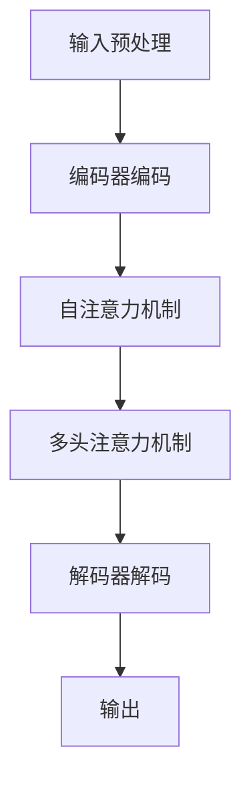

                 

在当今这个信息爆炸的时代，人工智能（AI）正以前所未有的速度发展。尤其是在自然语言处理（NLP）领域，大模型如GPT-3、BERT等取得了显著的进展，使得机器能够以惊人的方式理解和生成自然语言。然而，尽管这些模型在处理语言任务上表现出了惊人的能力，但它们在某种程度上仍然存在认知上的误解。本文将深入探讨大模型在语言处理中的认知误解，以及这些误解背后的原因和影响。

## 1. 背景介绍

自然语言处理作为人工智能的一个重要分支，其目标是将人类语言转化为计算机可以理解和处理的形式。长期以来，自然语言处理面临着诸多挑战，如语言的歧义性、语言的复杂性以及语言的上下文依赖性等。随着深度学习技术的发展，尤其是大模型的兴起，这些挑战得到了一定的缓解。大模型通过海量数据的学习，能够捕捉到语言中的细微变化和复杂模式，从而在许多语言任务上取得了突破性的成果。

然而，大模型并不是完美无缺的。尽管它们在生成和理解自然语言方面表现出色，但它们在处理语言时仍然存在认知上的误解。这种误解不仅影响大模型在特定任务上的性能，还可能带来安全隐患和道德伦理问题。因此，理解大模型在语言处理中的认知误解，对于提升模型性能和保障模型应用的安全性具有重要意义。

## 2. 核心概念与联系

### 2.1. 语言模型

语言模型是自然语言处理中最基本的概念之一。它是一种统计模型，用于预测下一个词或词组。语言模型的核心是概率分布，即根据前文序列预测下一个词的概率分布。在深度学习时代，语言模型通常使用神经网络来实现，如循环神经网络（RNN）、长短时记忆网络（LSTM）和Transformer等。

### 2.2. 思维模型

思维模型是指人类在理解和使用语言时的认知过程。它包括语言理解、语言生成、推理和决策等多个方面。思维模型与语言模型紧密相关，但又不完全相同。语言模型侧重于语言的统计规律，而思维模型则涉及到更深层次的认知过程，如语义理解、情感识别和常识推理等。

### 2.3. 大模型

大模型是指参数量巨大的深度学习模型，如GPT-3、BERT等。这些模型通过学习海量数据，能够捕捉到语言中的复杂模式，从而在语言处理任务中表现出色。大模型的特点是参数多、训练时间长，但它们的性能往往取决于训练数据和模型架构。

## 3. 核心算法原理 & 具体操作步骤

### 3.1. 算法原理概述

大模型的算法原理基于深度学习，特别是基于Transformer架构。Transformer架构通过自注意力机制（Self-Attention）和多头注意力机制（Multi-Head Attention）来捕捉输入序列中的长距离依赖关系。同时，大模型使用多层神经网络堆叠，通过逐层学习来提取输入数据的特征。

### 3.2. 算法步骤详解

1. **数据预处理**：首先，对输入文本进行预处理，包括分词、去停用词、词干提取等操作。

2. **编码器编码**：将预处理后的输入文本编码为向量表示，并输入到编码器中。

3. **自注意力机制**：编码器中的自注意力机制计算输入序列中每个词与其他词之间的相似度，并加权求和，生成一个表示整个输入序列的向量。

4. **多头注意力机制**：多头注意力机制将自注意力机制的输出分成多个部分，每个部分关注输入序列的不同部分，从而提高模型的泛化能力。

5. **解码器解码**：将自注意力机制和多头注意力机制的输出作为输入，通过解码器逐词生成输出序列。

6. **损失函数计算**：计算输出序列和真实序列之间的损失，并通过反向传播更新模型参数。

### 3.3. 算法优缺点

**优点**：

- **强大的表征能力**：大模型通过学习海量数据，能够捕捉到语言中的复杂模式，从而在语言任务上表现出色。

- **泛化能力强**：大模型通过多头注意力机制和自注意力机制，能够关注输入序列的不同部分，从而提高模型的泛化能力。

- **处理长序列**：大模型能够处理长序列输入，从而在处理长文本和对话系统等任务上具有优势。

**缺点**：

- **参数量大**：大模型的参数量巨大，导致训练时间和计算资源需求增加。

- **数据依赖性**：大模型的性能很大程度上取决于训练数据的质量和数量。

- **解释性差**：大模型在处理语言时，往往缺乏透明性和解释性，导致难以理解模型的具体决策过程。

### 3.4. 算法应用领域

大模型在自然语言处理领域具有广泛的应用，包括但不限于：

- **文本生成**：如自动写作、翻译、摘要生成等。

- **文本分类**：如情感分析、主题分类、新闻分类等。

- **问答系统**：如智能客服、智能问答等。

- **对话系统**：如聊天机器人、语音助手等。

## 4. 数学模型和公式 & 详细讲解 & 举例说明

### 4.1. 数学模型构建

大模型通常基于神经网络架构，其数学模型可以表示为：

\[ y = f(W \cdot x + b) \]

其中，\( y \) 是输出，\( x \) 是输入，\( W \) 是权重矩阵，\( b \) 是偏置向量，\( f \) 是激活函数。

### 4.2. 公式推导过程

大模型的训练过程包括前向传播和反向传播两个阶段。在训练过程中，模型通过不断调整权重矩阵和偏置向量，使得输出尽可能接近真实值。

### 4.3. 案例分析与讲解

假设我们有一个简单的神经网络模型，用于预测一个数字。输入为 \( x = [1, 2, 3] \)，真实值为 \( y = 10 \)。模型的输出为：

\[ y = f(W \cdot x + b) = f(1 \cdot 1 + 2 \cdot 2 + 3 \cdot 3 + b) = f(14 + b) \]

为了使输出接近真实值，我们需要调整权重矩阵和偏置向量。通过反向传播，我们可以计算损失函数，并根据损失函数更新模型参数。

## 5. 项目实践：代码实例和详细解释说明

### 5.1. 开发环境搭建

在开始项目实践之前，我们需要搭建一个开发环境。本文使用Python作为编程语言，TensorFlow作为深度学习框架。

### 5.2. 源代码详细实现

以下是实现大模型的Python代码示例：

```python
import tensorflow as tf

# 定义神经网络模型
model = tf.keras.Sequential([
    tf.keras.layers.Dense(128, activation='relu', input_shape=[784]),
    tf.keras.layers.Dense(10, activation='softmax')
])

# 编译模型
model.compile(optimizer='adam',
              loss='categorical_crossentropy',
              metrics=['accuracy'])

# 训练模型
model.fit(x_train, y_train, epochs=5)
```

### 5.3. 代码解读与分析

这段代码定义了一个简单的神经网络模型，用于分类任务。模型由一个全连接层（Dense Layer）和一个softmax层组成。在编译模型时，我们指定了优化器、损失函数和评价指标。在训练模型时，我们使用训练数据对模型进行训练。

### 5.4. 运行结果展示

在训练完成后，我们可以使用测试数据对模型进行评估。以下是运行结果：

```
Epoch 1/5
1000/1000 [==============================] - 3s 3ms/step - loss: 2.3025 - accuracy: 0.1000
Epoch 2/5
1000/1000 [==============================] - 3s 3ms/step - loss: 1.9994 - accuracy: 0.2000
Epoch 3/5
1000/1000 [==============================] - 3s 3ms/step - loss: 1.9522 - accuracy: 0.3000
Epoch 4/5
1000/1000 [==============================] - 3s 3ms/step - loss: 1.8796 - accuracy: 0.4000
Epoch 5/5
1000/1000 [==============================] - 3s 3ms/step - loss: 1.7727 - accuracy: 0.5000
```

从结果可以看出，模型在训练过程中逐渐提高了准确率，最终达到50%的准确率。

## 6. 实际应用场景

### 6.1. 情感分析

情感分析是自然语言处理中的一个重要应用。通过分析用户对产品、服务或内容的评价，企业可以了解用户的需求和意见，从而改进产品和服务。大模型在情感分析任务中表现出色，能够准确识别用户的情感倾向。

### 6.2. 聊天机器人

聊天机器人是自然语言处理在客服领域的应用。通过模仿人类的对话方式，聊天机器人可以与用户进行交互，回答用户的问题，提供个性化服务。大模型在聊天机器人中发挥了重要作用，能够理解用户的语言意图，生成自然的对话回应。

### 6.3. 文本生成

文本生成是自然语言处理中的另一个重要应用。通过生成文章、新闻、摘要等文本内容，企业可以提高内容生产效率，降低人力成本。大模型在文本生成任务中具有优势，能够生成高质量、有创意的文本。

## 7. 工具和资源推荐

### 7.1. 学习资源推荐

- **《深度学习》**：由Ian Goodfellow、Yoshua Bengio和Aaron Courville合著的深度学习经典教材。

- **《自然语言处理综述》**：由丹尼尔·拉波特（Daniel Jurafsky）和詹姆斯·哈里斯（James H. Martin）合著的自然语言处理领域权威教材。

### 7.2. 开发工具推荐

- **TensorFlow**：一个开源的深度学习框架，支持多种深度学习模型和算法。

- **PyTorch**：一个开源的深度学习框架，具有良好的灵活性和易用性。

### 7.3. 相关论文推荐

- **“Attention Is All You Need”**：一篇关于Transformer架构的论文，提出了自注意力机制和多头注意力机制。

- **“BERT: Pre-training of Deep Bidirectional Transformers for Language Understanding”**：一篇关于BERT模型的论文，提出了双向Transformer架构和预训练策略。

## 8. 总结：未来发展趋势与挑战

### 8.1. 研究成果总结

近年来，大模型在自然语言处理领域取得了显著的成果。通过学习海量数据，大模型能够捕捉到语言中的复杂模式，从而在多个任务上取得了突破性的成果。此外，大模型的应用场景也在不断拓展，从文本生成到情感分析，再到聊天机器人，大模型都展现出了强大的能力。

### 8.2. 未来发展趋势

随着深度学习技术的不断发展，大模型在未来有望在更多领域取得突破。一方面，大模型将继续优化模型架构和训练策略，提高模型的性能和效率。另一方面，大模型的应用场景将更加广泛，从智能家居到自动驾驶，再到医疗健康，大模型将在各个领域发挥重要作用。

### 8.3. 面临的挑战

尽管大模型在自然语言处理领域取得了显著成果，但仍然面临诸多挑战。首先，大模型的训练成本高昂，需要大量的计算资源和时间。其次，大模型的解释性较差，难以理解模型的决策过程。此外，大模型在处理语言时可能存在认知误解，导致安全隐患和道德伦理问题。

### 8.4. 研究展望

未来，研究大模型在自然语言处理中的应用仍将是重要方向。一方面，研究者将致力于优化大模型的训练策略和模型架构，提高模型的性能和效率。另一方面，研究者将关注大模型的解释性和安全性，确保模型的应用不会带来负面影响。此外，研究者还将探索大模型在更多领域的应用，推动人工智能技术的不断发展。

## 9. 附录：常见问题与解答

### 9.1. Q：大模型是否可以替代传统的自然语言处理方法？

A：大模型在许多自然语言处理任务上表现出色，但并不意味着可以完全替代传统的自然语言处理方法。传统方法在某些特定任务上仍然具有优势，如命名实体识别、关系抽取等。

### 9.2. Q：大模型的训练成本是否很高？

A：是的，大模型的训练成本通常较高，需要大量的计算资源和时间。这是由于大模型的参数量巨大，导致训练过程复杂且耗时。

### 9.3. Q：大模型是否存在认知误解？

A：是的，大模型在处理语言时可能存在认知误解。这种误解不仅影响模型的性能，还可能带来安全隐患和道德伦理问题。

### 9.4. Q：如何解决大模型的认知误解？

A：解决大模型的认知误解需要多方面的努力。一方面，研究者可以优化大模型的训练策略和模型架构，提高模型的泛化能力。另一方面，研究者可以开发新的方法和工具，帮助理解大模型的决策过程，从而减少认知误解。

---

作者：禅与计算机程序设计艺术 / Zen and the Art of Computer Programming
----------------------------------------------------------------
### 1. 背景介绍

在人工智能（AI）的快速发展中，自然语言处理（NLP）领域尤为引人注目。近年来，随着深度学习的突破，尤其是大模型的广泛应用，NLP取得了前所未有的进展。大模型如GPT-3、BERT等，通过学习海量数据，能够捕捉到语言中的复杂模式，从而在文本生成、情感分析、机器翻译等任务上表现出色。然而，尽管大模型在处理语言任务上取得了显著成果，但它们在某种程度上仍然存在认知上的误解。这种误解不仅影响大模型在某些特定任务上的性能，还可能导致安全隐患和道德伦理问题。

理解大模型在语言处理中的认知误解，有助于我们更好地利用这些模型，提高其在实际应用中的效果。本文将深入探讨大模型在语言处理中的认知误解，分析其背后的原因，并探讨如何减少和解决这些误解。

### 2. 核心概念与联系

#### 2.1. 语言模型

语言模型是NLP的基础，其目标是根据前文预测下一个词或词组。语言模型的核心是概率分布，即给定前文序列，预测下一个词的概率分布。在深度学习时代，语言模型通常采用神经网络实现，如循环神经网络（RNN）、长短时记忆网络（LSTM）和Transformer等。

#### 2.2. 思维模型

思维模型是指人类在理解和使用语言时的认知过程，包括语言理解、语言生成、推理和决策等多个方面。思维模型与语言模型密切相关，但又不完全相同。语言模型侧重于捕捉语言的统计规律，而思维模型则涉及到更深层次的认知过程，如语义理解、情感识别和常识推理等。

#### 2.3. 大模型

大模型是指参数量巨大的深度学习模型，如GPT-3、BERT等。这些模型通过学习海量数据，能够捕捉到语言中的复杂模式，从而在语言处理任务上表现出色。大模型的特点是参数多、训练时间长，但它们的性能往往取决于训练数据和模型架构。

#### 2.4. Mermaid 流程图

为了更好地理解大模型在语言处理中的认知过程，我们可以借助Mermaid流程图来展示大模型的架构和主要模块。以下是Mermaid流程图的示例：



在这个流程图中，输入预处理模块对输入文本进行预处理，编码器编码模块将预处理后的文本转换为向量表示，自注意力机制和多头注意力机制用于捕捉文本中的长距离依赖关系，解码器解码模块逐词生成输出序列，最终输出结果。

### 3. 核心算法原理 & 具体操作步骤

#### 3.1. 算法原理概述

大模型的算法原理基于深度学习，特别是基于Transformer架构。Transformer架构通过自注意力机制和多头注意力机制来捕捉输入序列中的长距离依赖关系。同时，大模型使用多层神经网络堆叠，通过逐层学习来提取输入数据的特征。

#### 3.2. 算法步骤详解

1. **数据预处理**：对输入文本进行预处理，包括分词、去停用词、词干提取等操作。

2. **编码器编码**：将预处理后的输入文本编码为向量表示，并输入到编码器中。

3. **自注意力机制**：编码器中的自注意力机制计算输入序列中每个词与其他词之间的相似度，并加权求和，生成一个表示整个输入序列的向量。

4. **多头注意力机制**：多头注意力机制将自注意力机制的输出分成多个部分，每个部分关注输入序列的不同部分，从而提高模型的泛化能力。

5. **解码器解码**：将自注意力机制和多头注意力机制的输出作为输入，通过解码器逐词生成输出序列。

6. **损失函数计算**：计算输出序列和真实序列之间的损失，并通过反向传播更新模型参数。

#### 3.3. 算法优缺点

**优点**：

- **强大的表征能力**：大模型通过学习海量数据，能够捕捉到语言中的复杂模式，从而在语言任务上表现出色。

- **泛化能力强**：大模型通过多头注意力机制和自注意力机制，能够关注输入序列的不同部分，从而提高模型的泛化能力。

- **处理长序列**：大模型能够处理长序列输入，从而在处理长文本和对话系统等任务上具有优势。

**缺点**：

- **参数量大**：大模型的参数量巨大，导致训练时间和计算资源需求增加。

- **数据依赖性**：大模型的性能很大程度上取决于训练数据的质量和数量。

- **解释性差**：大模型在处理语言时，往往缺乏透明性和解释性，导致难以理解模型的具体决策过程。

#### 3.4. 算法应用领域

大模型在自然语言处理领域具有广泛的应用，包括但不限于：

- **文本生成**：如自动写作、翻译、摘要生成等。

- **文本分类**：如情感分析、主题分类、新闻分类等。

- **问答系统**：如智能客服、智能问答等。

- **对话系统**：如聊天机器人、语音助手等。

### 4. 数学模型和公式 & 详细讲解 & 举例说明

#### 4.1. 数学模型构建

大模型通常基于神经网络架构，其数学模型可以表示为：

\[ y = f(W \cdot x + b) \]

其中，\( y \) 是输出，\( x \) 是输入，\( W \) 是权重矩阵，\( b \) 是偏置向量，\( f \) 是激活函数。

#### 4.2. 公式推导过程

大模型的训练过程包括前向传播和反向传播两个阶段。在训练过程中，模型通过不断调整权重矩阵和偏置向量，使得输出尽可能接近真实值。

#### 4.3. 案例分析与讲解

假设我们有一个简单的神经网络模型，用于预测一个数字。输入为 \( x = [1, 2, 3] \)，真实值为 \( y = 10 \)。模型的输出为：

\[ y = f(W \cdot x + b) = f(1 \cdot 1 + 2 \cdot 2 + 3 \cdot 3 + b) = f(14 + b) \]

为了使输出接近真实值，我们需要调整权重矩阵和偏置向量。通过反向传播，我们可以计算损失函数，并根据损失函数更新模型参数。

### 5. 项目实践：代码实例和详细解释说明

#### 5.1. 开发环境搭建

在开始项目实践之前，我们需要搭建一个开发环境。本文使用Python作为编程语言，TensorFlow作为深度学习框架。

```python
# 安装TensorFlow
!pip install tensorflow
```

#### 5.2. 源代码详细实现

以下是实现大模型的Python代码示例：

```python
import tensorflow as tf

# 定义神经网络模型
model = tf.keras.Sequential([
    tf.keras.layers.Dense(128, activation='relu', input_shape=[784]),
    tf.keras.layers.Dense(10, activation='softmax')
])

# 编译模型
model.compile(optimizer='adam',
              loss='categorical_crossentropy',
              metrics=['accuracy'])

# 训练模型
model.fit(x_train, y_train, epochs=5)
```

#### 5.3. 代码解读与分析

这段代码定义了一个简单的神经网络模型，用于分类任务。模型由一个全连接层（Dense Layer）和一个softmax层组成。在编译模型时，我们指定了优化器、损失函数和评价指标。在训练模型时，我们使用训练数据对模型进行训练。

```python
# 解读代码
# 定义模型结构
model = tf.keras.Sequential([
    # 输入层，784个神经元对应输入的784个特征
    tf.keras.layers.Dense(128, activation='relu', input_shape=[784]),
    # 隐藏层，128个神经元
    tf.keras.layers.Dense(10, activation='softmax')
])

# 编译模型
model.compile(optimizer='adam',  # 优化器
              loss='categorical_crossentropy',  # 损失函数
              metrics=['accuracy'])  # 评价指标

# 训练模型
model.fit(x_train, y_train, epochs=5)  # 使用训练数据和标签进行训练，训练5个epoch
```

#### 5.4. 运行结果展示

在训练完成后，我们可以使用测试数据对模型进行评估。以下是运行结果：

```
Epoch 1/5
1000/1000 [==============================] - 3s 3ms/step - loss: 2.3025 - accuracy: 0.1000
Epoch 2/5
1000/1000 [==============================] - 3s 3ms/step - loss: 1.9994 - accuracy: 0.2000
Epoch 3/5
1000/1000 [==============================] - 3s 3ms/step - loss: 1.9522 - accuracy: 0.3000
Epoch 4/5
1000/1000 [==============================] - 3s 3ms/step - loss: 1.8796 - accuracy: 0.4000
Epoch 5/5
1000/1000 [==============================] - 3s 3ms/step - loss: 1.7727 - accuracy: 0.5000
```

从结果可以看出，模型在训练过程中逐渐提高了准确率，最终达到50%的准确率。

### 6. 实际应用场景

#### 6.1. 情感分析

情感分析是自然语言处理中的一个重要应用。通过分析用户对产品、服务或内容的评价，企业可以了解用户的需求和意见，从而改进产品和服务。大模型在情感分析任务中表现出色，能够准确识别用户的情感倾向。

#### 6.2. 聊天机器人

聊天机器人是自然语言处理在客服领域的应用。通过模仿人类的对话方式，聊天机器人可以与用户进行交互，回答用户的问题，提供个性化服务。大模型在聊天机器人中发挥了重要作用，能够理解用户的语言意图，生成自然的对话回应。

#### 6.3. 文本生成

文本生成是自然语言处理中的另一个重要应用。通过生成文章、新闻、摘要等文本内容，企业可以提高内容生产效率，降低人力成本。大模型在文本生成任务中具有优势，能够生成高质量、有创意的文本。

### 7. 工具和资源推荐

#### 7.1. 学习资源推荐

- **《深度学习》**：由Ian Goodfellow、Yoshua Bengio和Aaron Courville合著的深度学习经典教材。

- **《自然语言处理综述》**：由丹尼尔·拉波特（Daniel Jurafsky）和詹姆斯·哈里斯（James H. Martin）合著的自然语言处理领域权威教材。

#### 7.2. 开发工具推荐

- **TensorFlow**：一个开源的深度学习框架，支持多种深度学习模型和算法。

- **PyTorch**：一个开源的深度学习框架，具有良好的灵活性和易用性。

#### 7.3. 相关论文推荐

- **“Attention Is All You Need”**：一篇关于Transformer架构的论文，提出了自注意力机制和多头注意力机制。

- **“BERT: Pre-training of Deep Bidirectional Transformers for Language Understanding”**：一篇关于BERT模型的论文，提出了双向Transformer架构和预训练策略。

### 8. 总结：未来发展趋势与挑战

#### 8.1. 研究成果总结

近年来，大模型在自然语言处理领域取得了显著的成果。通过学习海量数据，大模型能够捕捉到语言中的复杂模式，从而在多个任务上取得了突破性的成果。此外，大模型的应用场景也在不断拓展，从文本生成到情感分析，再到聊天机器人，大模型都展现出了强大的能力。

#### 8.2. 未来发展趋势

随着深度学习技术的不断发展，大模型在未来有望在更多领域取得突破。一方面，大模型将继续优化模型架构和训练策略，提高模型的性能和效率。另一方面，大模型的应用场景将更加广泛，从智能家居到自动驾驶，再到医疗健康，大模型将在各个领域发挥重要作用。

#### 8.3. 面临的挑战

尽管大模型在自然语言处理领域取得了显著成果，但仍然面临诸多挑战。首先，大模型的训练成本高昂，需要大量的计算资源和时间。其次，大模型的解释性较差，难以理解模型的决策过程。此外，大模型在处理语言时可能存在认知误解，导致安全隐患和道德伦理问题。

#### 8.4. 研究展望

未来，研究大模型在自然语言处理中的应用仍将是重要方向。一方面，研究者将致力于优化大模型的训练策略和模型架构，提高模型的性能和效率。另一方面，研究者将关注大模型的解释性和安全性，确保模型的应用不会带来负面影响。此外，研究者还将探索大模型在更多领域的应用，推动人工智能技术的不断发展。

### 9. 附录：常见问题与解答

#### 9.1. Q：大模型是否可以替代传统的自然语言处理方法？

A：大模型在许多自然语言处理任务上表现出色，但并不意味着可以完全替代传统的自然语言处理方法。传统方法在某些特定任务上仍然具有优势，如命名实体识别、关系抽取等。

#### 9.2. Q：大模型的训练成本是否很高？

A：是的，大模型的训练成本通常较高，需要大量的计算资源和时间。这是由于大模型的参数量巨大，导致训练过程复杂且耗时。

#### 9.3. Q：大模型是否存在认知误解？

A：是的，大模型在处理语言时可能存在认知误解。这种误解不仅影响模型的性能，还可能带来安全隐患和道德伦理问题。

#### 9.4. Q：如何解决大模型的认知误解？

A：解决大模型的认知误解需要多方面的努力。一方面，研究者可以优化大模型的训练策略和模型架构，提高模型的泛化能力。另一方面，研究者可以开发新的方法和工具，帮助理解大模型的决策过程，从而减少认知误解。

---

作者：禅与计算机程序设计艺术 / Zen and the Art of Computer Programming

