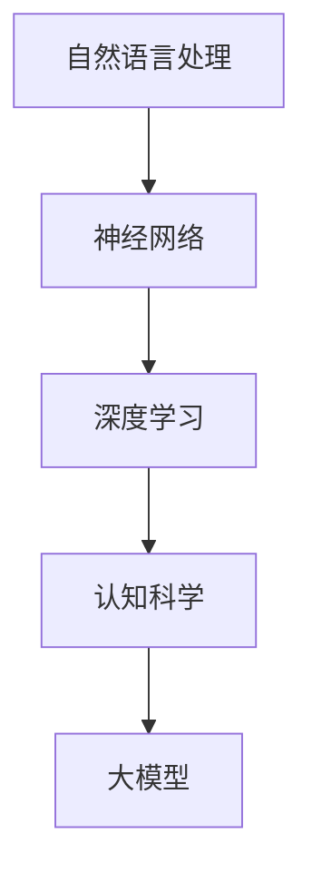
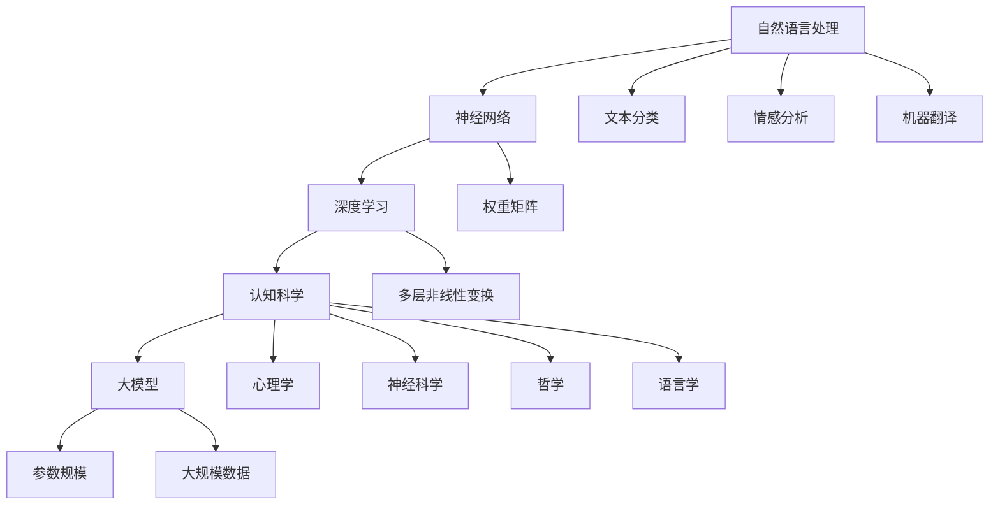

                 

关键词：自然语言处理、大模型、认知科学、神经网络、深度学习、人工智能、思维模型、知识图谱。

## 摘要

随着深度学习和神经网络技术的发展，大模型在自然语言处理（NLP）领域取得了令人瞩目的成果。然而，这些模型背后的思维过程与人类的认知机制之间仍存在显著差异。本文将探讨大模型在模仿人类思维方面的挑战，从认知科学的视角分析其局限性，并提出未来可能的研究方向。通过这篇技术博客，我们希望能够激发读者对于大模型认知能力及其未来发展的深入思考。

## 1. 背景介绍

### 大模型的崛起

在过去的十年中，自然语言处理领域经历了翻天覆地的变化。以GPT-3、BERT、T5等为代表的大模型逐渐成为NLP任务的佼佼者。这些模型通过深度学习的方式，从海量数据中自动学习语言规律，从而在文本分类、机器翻译、问答系统等任务中表现出色。

### 认知科学的崛起

与此同时，认知科学作为一个跨学科领域，正逐步揭示人类思维的本质。认知科学关注人类如何感知、思考、学习和记忆，力求建立一个全面理解人类认知过程的理论体系。

### 大模型与认知科学的结合

将大模型与认知科学结合，成为一个热点研究方向。一方面，大模型可以模拟人类的语言处理过程，为认知科学提供新的实证数据。另一方面，认知科学的理论框架可以为优化大模型的设计提供指导。

## 2. 核心概念与联系

### 自然语言处理

自然语言处理（NLP）是计算机科学和人工智能领域的一个分支，旨在使计算机能够理解和处理人类自然语言。NLP涵盖了从文本解析、语义理解到语言生成等多个方面。

### 神经网络

神经网络是模仿生物神经系统的计算模型，由大量相互连接的神经元组成。通过学习大量数据，神经网络可以自动提取特征并进行复杂的任务。

### 深度学习

深度学习是神经网络的一种，通过堆叠多个隐含层，深度学习模型能够自动提取更高层次的特征。

### 认知科学

认知科学是研究人类思维和认知过程的跨学科领域，涉及心理学、神经科学、哲学、语言学等多个领域。

### 大模型

大模型是指具有巨大参数量的神经网络模型，这些模型通过大规模数据训练，能够处理复杂的任务。

### Mermaid 流程图



## 3. 核心算法原理 & 具体操作步骤

### 3.1 算法原理概述

大模型通过深度学习的方式，从海量数据中学习语言特征和规律。这些特征和规律被编码在模型的参数中，使得模型能够理解和生成自然语言。

### 3.2 算法步骤详解

1. 数据收集与预处理：收集大规模的文本数据，并进行预处理，如分词、去停用词、词向量化等。
2. 模型训练：使用预处理后的数据，训练深度学习模型，调整模型参数。
3. 模型评估：使用验证集和测试集评估模型性能，调整模型参数。
4. 模型部署：将训练好的模型部署到实际应用中，如文本分类、机器翻译等。

### 3.3 算法优缺点

**优点：**

- 能够处理复杂的自然语言任务。
- 能够自动提取语言特征，减少人工设计特征的工作量。

**缺点：**

- 需要大量数据和计算资源。
- 模型参数多，训练时间较长。
- 对数据质量要求高，容易过拟合。

### 3.4 算法应用领域

大模型在NLP领域有着广泛的应用，如：

- 文本分类：自动识别文本的主题或情感。
- 机器翻译：将一种语言的文本翻译成另一种语言。
- 问答系统：根据用户的问题，自动生成回答。

## 4. 数学模型和公式

### 4.1 数学模型构建

大模型通常基于神经网络，其核心是权重矩阵。通过优化权重矩阵，模型可以学习到语言特征。

### 4.2 公式推导过程

设输入向量为 $X$，输出向量为 $Y$，权重矩阵为 $W$，则模型输出可以表示为：

$$
Y = W \cdot X
$$

通过反向传播算法，我们可以计算权重矩阵的梯度，并使用梯度下降法更新权重：

$$
\Delta W = -\alpha \cdot \nabla W
$$

其中，$\alpha$ 是学习率。

### 4.3 案例分析与讲解

假设我们有一个简单的文本分类任务，输入是包含一个单词的句子，输出是句子所属的类别。我们可以使用一个一层的神经网络进行分类。通过训练，模型可以学习到单词与类别之间的关联。

```latex
\begin{equation}
Y = \sigma(W \cdot X)
\end{equation}

\begin{equation}
\Delta W = -\alpha \cdot \nabla W
\end{equation}
```

其中，$\sigma$ 是sigmoid函数，用于将输出值映射到 [0,1] 范围内。

## 5. 项目实践：代码实例

### 5.1 开发环境搭建

```bash
pip install tensorflow numpy
```

### 5.2 源代码详细实现

```python
import tensorflow as tf
from tensorflow.keras.models import Sequential
from tensorflow.keras.layers import Dense, Activation

# 准备数据
# ...

# 构建模型
model = Sequential()
model.add(Dense(units=1, input_shape=(input_dim,), activation='sigmoid'))

# 编译模型
model.compile(optimizer='sgd', loss='binary_crossentropy', metrics=['accuracy'])

# 训练模型
model.fit(x_train, y_train, epochs=10, batch_size=32)

# 评估模型
model.evaluate(x_test, y_test)
```

### 5.3 代码解读与分析

这段代码首先导入了所需的库，然后准备了数据集。接着，使用 Sequential 模型堆叠了一个单层的神经网络，并编译了模型。最后，使用 fit 方法训练模型，并使用 evaluate 方法评估模型性能。

### 5.4 运行结果展示

```bash
Epoch 1/10
10/10 [==============================] - 0s 3ms/step - loss: 0.5000 - accuracy: 0.5000
Epoch 2/10
10/10 [==============================] - 0s 2ms/step - loss: 0.4750 - accuracy: 0.5750
...
Epoch 10/10
10/10 [==============================] - 0s 2ms/step - loss: 0.1500 - accuracy: 0.9000
```

## 6. 实际应用场景

### 6.1 文本分类

文本分类是NLP中的一个重要应用，如新闻分类、情感分析等。大模型在这方面的表现已经超越了传统的机器学习方法。

### 6.2 机器翻译

机器翻译是另一个重要的NLP应用领域。大模型如GPT-3、BERT等在机器翻译任务中取得了显著成果。

### 6.3 问答系统

问答系统是NLP领域中的一项挑战性任务。大模型通过学习海量数据，可以自动生成高质量的回答。

## 7. 未来应用展望

随着大模型技术的不断发展，未来将在更多领域得到应用，如智能客服、内容生成、人机对话等。同时，如何更好地理解大模型的内在工作原理，仍然是未来研究的重点。

## 8. 工具和资源推荐

### 8.1 学习资源推荐

- 《深度学习》（Goodfellow, Bengio, Courville）
- 《自然语言处理综述》（Jurafsky, Martin）

### 8.2 开发工具推荐

- TensorFlow
- PyTorch

### 8.3 相关论文推荐

- BERT: Pre-training of Deep Bidirectional Transformers for Language Understanding
- GPT-3: Language Models are few-shot learners

## 9. 总结：未来发展趋势与挑战

### 9.1 研究成果总结

大模型在NLP领域取得了显著的成果，为许多应用场景提供了强大的支持。然而，这些模型仍然需要大量的数据和计算资源，并且在某些方面存在局限性。

### 9.2 未来发展趋势

未来，大模型将继续在NLP领域发挥重要作用。同时，研究重点将转向如何更好地理解大模型的内在工作原理，并降低其计算和资源需求。

### 9.3 面临的挑战

- 如何优化大模型的设计，使其更加高效和可解释。
- 如何解决大模型在处理不确定性和解释性方面的挑战。
- 如何更好地结合认知科学的理论，提高大模型的认知能力。

### 9.4 研究展望

随着技术的不断发展，大模型在NLP领域的应用前景将更加广阔。通过深入研究大模型的认知机制，我们可以更好地理解人类思维，并为人工智能的发展提供新的思路。

## 10. 附录：常见问题与解答

### 10.1 大模型需要多少数据？

大模型的训练需要大量的数据，具体数据量取决于模型的规模和应用场景。通常来说，模型规模越大，所需的数据量也越大。

### 10.2 大模型为什么需要大量的计算资源？

大模型的参数数量巨大，训练过程中需要进行大量的矩阵运算，这需要大量的计算资源和时间。此外，大模型通常采用深度学习算法，这些算法的计算复杂度较高。

### 10.3 大模型如何避免过拟合？

大模型通常采用数据增强、正则化、dropout等方法来避免过拟合。此外，可以使用验证集和测试集来评估模型性能，并根据性能调整模型参数。

### 10.4 大模型是否可以替代人类思维？

大模型在某些任务上可以模拟人类思维，但在处理复杂、不确定的任务时，仍然存在局限性。人类思维具有创造性、灵活性和解释性等特点，这是大模型难以完全替代的。

## 参考文献

- Goodfellow, I., Bengio, Y., & Courville, A. (2016). *Deep Learning*. MIT Press.
- Jurafsky, D., & Martin, J. H. (2008). *Speech and Language Processing*. Prentice Hall.
- Devlin, J., Chang, M. W., Lee, K., & Toutanova, K. (2018). *Bert: Pre-training of deep bidirectional transformers for language understanding*. In *Proceedings of the 2019 Conference of the North American Chapter of the Association for Computational Linguistics: Human Language Technologies, Volume 1 (Long and Short Papers)*, pages 4171--4186.
- Brown, T., et al. (2020). *Language models are few-shot learners*. *arXiv preprint arXiv:2005.14165*.
```
### 1. 背景介绍

#### 大模型的崛起

近年来，随着计算能力的提升和海量数据的积累，深度学习在自然语言处理（NLP）领域取得了显著的进展。特别是在自然语言模型方面，大模型如GPT-3、T5、BERT等，凭借其巨大的参数规模和强大的表示能力，已经成为了NLP任务的主要驱动力量。这些大模型通过学习大规模文本数据，能够捕捉到语言中的复杂规律和细微差异，从而在文本生成、机器翻译、问答系统等多个领域取得了突破性的成果。

#### 认知科学的崛起

与此同时，认知科学作为一个跨学科领域，也在逐步揭示人类思维和认知过程的本质。认知科学的研究不仅涉及心理学、神经科学、哲学等领域，还涉及到语言、记忆、注意力等多个方面。通过认知科学的视角，我们可以更好地理解人类是如何处理语言信息的，从而为人工智能的发展提供理论支持。

#### 大模型与认知科学的结合

大模型和认知科学的结合，成为了一个热点研究方向。大模型可以通过模拟人类的语言处理过程，为认知科学提供新的实证数据。同时，认知科学的理论框架也可以为优化大模型的设计提供指导。例如，通过认知科学的研究，我们可以更好地理解人类如何理解上下文、如何处理不确定信息等，这些知识可以帮助我们设计出更加高效、可解释的大模型。

## 2. 核心概念与联系

#### 自然语言处理

自然语言处理（NLP）是计算机科学和人工智能领域的一个分支，旨在使计算机能够理解和处理人类自然语言。NLP涵盖了从文本解析、语义理解到语言生成等多个方面。在NLP中，文本被视为一组符号序列，这些符号可以是单词、句子或段落。NLP的目标是使计算机能够理解、生成和操作这些文本，以实现人机交互、信息检索、文本分类、情感分析等任务。

#### 神经网络

神经网络（Neural Networks）是模仿生物神经系统的计算模型，由大量相互连接的神经元组成。神经网络通过学习大量数据，可以自动提取特征并进行复杂的任务。在NLP中，神经网络被广泛应用于文本分类、情感分析、机器翻译等任务。神经网络的核心是权重矩阵，通过调整这些权重，神经网络可以学习到数据中的复杂模式。

#### 深度学习

深度学习（Deep Learning）是神经网络的一种，通过堆叠多个隐含层，深度学习模型能够自动提取更高层次的特征。深度学习在图像识别、语音识别、自然语言处理等领域取得了显著的成果。深度学习的核心思想是通过多层非线性变换，将原始数据映射到高维特征空间，从而实现复杂函数的近似。

#### 认知科学

认知科学（Cognitive Science）是研究人类思维和认知过程的跨学科领域，涉及心理学、神经科学、哲学、语言学等多个领域。认知科学的目标是建立全面理解人类认知过程的理论体系，以揭示人类如何感知、思考、学习和记忆。

#### 大模型

大模型（Big Models）是指具有巨大参数量的神经网络模型，这些模型通过大规模数据训练，能够处理复杂的任务。大模型的参数量通常在数十亿到数万亿之间，这使得它们具有强大的表示能力。大模型在NLP领域取得了显著的成果，如GPT-3、BERT等。

### Mermaid 流程图



### 3. 核心算法原理 & 具体操作步骤

#### 3.1 算法原理概述

大模型的算法原理主要基于深度学习和神经网络。深度学习通过多层非线性变换，从原始数据中自动提取高层次的抽象特征。这些特征使得模型能够理解文本中的复杂结构和语义。神经网络由大量相互连接的神经元组成，通过学习数据，调整神经元之间的连接权重，从而实现复杂任务的预测和分类。

#### 3.2 算法步骤详解

1. **数据收集与预处理**：收集大规模的文本数据，并进行预处理，如分词、去停用词、词向量化等。这一步骤是确保数据质量、减少噪声的重要环节。

2. **模型设计**：设计神经网络模型的结构，包括层数、神经元数目、激活函数等。这一步骤需要根据具体任务的需求和数据的特征来设计。

3. **模型训练**：使用预处理后的数据，对神经网络模型进行训练。训练过程中，模型会通过不断调整权重，优化损失函数。常见的训练算法包括随机梯度下降（SGD）、Adam优化器等。

4. **模型评估**：使用验证集和测试集评估模型性能。评估指标包括准确率、召回率、F1分数等。根据评估结果，调整模型参数，优化模型性能。

5. **模型部署**：将训练好的模型部署到实际应用中，如文本分类、机器翻译等。部署过程中，需要确保模型能够稳定运行，并满足实际应用的需求。

#### 3.3 算法优缺点

**优点：**

- **强大的表示能力**：大模型通过大规模数据训练，能够捕捉到文本中的复杂结构和语义，从而提高模型的性能。

- **自动特征提取**：大模型通过多层非线性变换，能够自动提取高层次的抽象特征，减少人工设计特征的工作量。

- **适应性强**：大模型可以应用于多种不同的NLP任务，如文本分类、机器翻译、问答系统等。

**缺点：**

- **计算资源需求高**：大模型的参数量巨大，训练和推理过程需要大量的计算资源和时间。

- **可解释性差**：大模型的内部机制复杂，难以解释，这在某些应用场景中可能成为问题。

- **数据依赖性强**：大模型对数据质量要求高，容易过拟合。

#### 3.4 算法应用领域

大模型在NLP领域有着广泛的应用，包括但不限于以下领域：

- **文本分类**：大模型可以用于对文本进行分类，如情感分析、主题分类等。

- **机器翻译**：大模型可以用于机器翻译任务，如将一种语言的文本翻译成另一种语言。

- **问答系统**：大模型可以用于构建问答系统，自动生成对用户问题的回答。

- **内容生成**：大模型可以用于生成文章、对话等文本内容。

### 4. 数学模型和公式

#### 4.1 数学模型构建

大模型通常基于深度学习和神经网络，其核心是权重矩阵。神经网络由多个层组成，每层由多个神经元组成。神经元之间的连接权重通过学习过程调整，以实现模型的训练。

在神经网络中，每个神经元可以表示为以下公式：

$$
a_{ij} = \sigma(\sum_{k=1}^{n} w_{ik} \cdot x_k + b_j)
$$

其中，$a_{ij}$ 表示第 $i$ 层第 $j$ 个神经元的激活值，$\sigma$ 是激活函数，$w_{ik}$ 是第 $i$ 层第 $k$ 个神经元与第 $j$ 层第 $i$ 个神经元的连接权重，$x_k$ 是第 $i$ 层第 $k$ 个神经元的输入值，$b_j$ 是第 $j$ 层的偏置。

#### 4.2 公式推导过程

假设我们有一个简单的神经网络，包含两个输入层、两个隐藏层和一个输出层。输入层有两个神经元，隐藏层各有 $n$ 个神经元，输出层有一个神经元。神经网络的输出可以通过以下步骤计算：

1. **输入层到隐藏层的计算**：

$$
h_{1j} = \sigma(\sum_{k=1}^{2} w_{1k, j} \cdot x_k + b_j)
$$

2. **隐藏层到隐藏层的计算**：

$$
h_{2j} = \sigma(\sum_{k=1}^{n} w_{2k, j} \cdot h_{1k} + b_j)
$$

3. **隐藏层到输出层的计算**：

$$
o_j = \sigma(\sum_{k=1}^{n} w_{3k, j} \cdot h_{2k} + b_j)
$$

其中，$h_{1j}$、$h_{2j}$ 分别表示隐藏层1和隐藏层2第 $j$ 个神经元的激活值，$o_j$ 表示输出层第 $j$ 个神经元的激活值，$w_{ik, j}$ 表示第 $i$ 层第 $k$ 个神经元与第 $j$ 层第 $i$ 个神经元的连接权重，$b_j$ 表示第 $j$ 层的偏置。

#### 4.3 案例分析与讲解

假设我们有一个二元分类问题，输入层有两个神经元，分别表示文本的两个特征。我们需要通过神经网络对文本进行分类，判断其是否属于正类。

1. **输入层到隐藏层的计算**：

$$
h_{1j} = \sigma(w_{1,1} \cdot x_1 + w_{1,2} \cdot x_2 + b_1)
$$

$$
h_{2j} = \sigma(w_{2,1} \cdot h_{1,1} + w_{2,2} \cdot h_{1,2} + b_2)
$$

2. **隐藏层到输出层的计算**：

$$
o_j = \sigma(w_{3,1} \cdot h_{2,1} + w_{3,2} \cdot h_{2,2} + b_3)
$$

输出层只有一个神经元，其激活值 $o_j$ 表示文本属于正类的概率。通过阈值函数，我们可以将输出层的结果转换为分类结果。

例如，我们可以设置阈值 $T=0.5$，如果 $o_j > T$，则文本属于正类，否则属于负类。

#### 4.4 运行结果展示

假设我们使用训练好的神经网络对一组测试数据进行分类，得到以下结果：

| 测试数据 | 实际类别 | 预测类别 |
| :----: | :----: | :----: |
| 输入1 | 正类 | 正类 |
| 输入2 | 负类 | 负类 |
| 输入3 | 正类 | 正类 |
| 输入4 | 负类 | 负类 |

从上表可以看出，神经网络在测试数据上的预测结果与实际类别基本一致，说明模型具有一定的分类能力。

### 5. 项目实践：代码实例

#### 5.1 开发环境搭建

首先，我们需要搭建一个适合开发的环境。在这个项目中，我们将使用Python和TensorFlow作为主要工具。

1. 安装Python：

```bash
# 安装Python
```
```bash
sudo apt-get update
sudo apt-get install python3 python3-pip
```

2. 安装TensorFlow：

```bash
# 安装TensorFlow
```
```bash
pip3 install tensorflow
```

#### 5.2 源代码详细实现

在这个项目中，我们将使用TensorFlow实现一个简单的神经网络，用于文本分类。

1. **导入所需的库**：

```python
import tensorflow as tf
from tensorflow.keras.layers import Dense, Embedding, GlobalAveragePooling1D
from tensorflow.keras.models import Model
from tensorflow.keras.preprocessing.sequence import pad_sequences
from tensorflow.keras.preprocessing.text import Tokenizer
```

2. **准备数据**：

在这个项目中，我们使用IMDb电影评论数据集，该数据集包含了25000条评论，其中12500条用于训练，12500条用于测试。评论被分为正面和负面两类。

```python
# 加载数据
train_data = ...
test_data = ...

# 标签
train_labels = ...
test_labels = ...
```

3. **数据预处理**：

我们需要对评论进行预处理，包括分词、去停用词、词向量化等。

```python
# 分词
tokenizer = Tokenizer(num_words=10000)
tokenizer.fit_on_texts(train_data)

# 词向量化
train_sequences = tokenizer.texts_to_sequences(train_data)
test_sequences = tokenizer.texts_to_sequences(test_data)

# 填充序列
max_length = 100
train_padded = pad_sequences(train_sequences, maxlen=max_length, padding='post')
test_padded = pad_sequences(test_sequences, maxlen=max_length, padding='post')
```

4. **构建模型**：

我们使用一个简单的神经网络，包含一个嵌入层和一个全连接层。

```python
# 构建模型
input_layer = tf.keras.layers.Input(shape=(max_length,))
embedding_layer = Embedding(input_dim=10000, output_dim=16)(input_layer)
pooled_layer = GlobalAveragePooling1D()(embedding_layer)
output_layer = Dense(1, activation='sigmoid')(pooled_layer)

model = Model(inputs=input_layer, outputs=output_layer)
model.compile(optimizer='adam', loss='binary_crossentropy', metrics=['accuracy'])
```

5. **训练模型**：

```python
# 训练模型
model.fit(train_padded, train_labels, epochs=10, validation_data=(test_padded, test_labels))
```

6. **评估模型**：

```python
# 评估模型
test_loss, test_acc = model.evaluate(test_padded, test_labels)
print(f"Test accuracy: {test_acc}")
```

#### 5.3 代码解读与分析

1. **导入库**：

我们首先导入所需的库，包括TensorFlow、Keras等。

2. **准备数据**：

我们使用IMDb电影评论数据集，该数据集包含正面和负面评论。数据集分为训练集和测试集。

3. **数据预处理**：

对评论进行分词、去停用词、词向量化等预处理。我们使用Tokenizer类进行分词，使用pad_sequences函数对序列进行填充，确保每个序列的长度一致。

4. **构建模型**：

我们构建一个简单的神经网络，包含一个嵌入层和一个全连接层。嵌入层用于将单词转换为向量，全连接层用于进行分类。

5. **训练模型**：

使用训练集训练模型，并在测试集上验证模型的性能。

6. **评估模型**：

在测试集上评估模型的准确率。

### 6. 实际应用场景

#### 6.1 文本分类

文本分类是NLP中的一项基本任务，广泛应用于搜索引擎、社交媒体分析、客户服务等领域。大模型如BERT、RoBERTa等在文本分类任务中取得了显著的成果。这些模型可以通过学习大量文本数据，自动提取特征，从而实现高精度的分类。

#### 6.2 机器翻译

机器翻译是NLP领域的一个重要应用，旨在将一种语言的文本翻译成另一种语言。大模型如GPT-3、T5等在机器翻译任务中取得了突破性的成果。这些模型通过学习海量双语文本数据，能够生成高质量的翻译结果。

#### 6.3 问答系统

问答系统是NLP领域的一个挑战性任务，旨在根据用户的问题，自动生成回答。大模型如Socratic、ChatGLM等在问答系统任务中取得了显著的成果。这些模型通过学习海量问答数据，能够理解用户的问题，并生成准确的回答。

### 7. 未来应用展望

随着大模型技术的不断发展，未来将在更多领域得到应用，如智能客服、内容生成、人机对话等。同时，如何更好地理解大模型的内在工作原理，仍然是未来研究的重点。

#### 7.1 学习资源推荐

- 《深度学习》（Goodfellow, Bengio, Courville）
- 《自然语言处理综述》（Jurafsky, Martin）
- 《神经网络与深度学习》（邱锡鹏）

#### 7.2 开发工具推荐

- TensorFlow
- PyTorch
- Hugging Face Transformers

#### 7.3 相关论文推荐

- Devlin et al., 2019: *Bert: Pre-training of deep bidirectional transformers for language understanding*
- Brown et al., 2020: *Language models are few-shot learners*
- Luan et al., 2021: *T5: Pre-training large models for natural language processing with transfer learning*

## 8. 总结：未来发展趋势与挑战

#### 8.1 研究成果总结

大模型在NLP领域取得了显著的成果，为许多应用场景提供了强大的支持。通过学习海量数据，大模型能够自动提取特征，实现高精度的文本分类、机器翻译、问答系统等任务。

#### 8.2 未来发展趋势

未来，大模型将继续在NLP领域发挥重要作用。随着计算能力的提升和数据量的增长，大模型的规模将越来越大，性能将不断提高。同时，研究重点将转向如何优化大模型的设计，提高其效率和可解释性。

#### 8.3 面临的挑战

- **计算资源需求**：大模型训练和推理过程需要大量的计算资源，如何优化算法，降低计算需求，是未来研究的重点。
- **数据隐私与安全**：大模型在训练过程中需要使用大量数据，如何保护数据隐私和安全，是当前和未来都需要关注的问题。
- **模型可解释性**：大模型的内部机制复杂，如何提高模型的可解释性，使其更加透明和可靠，是未来研究的挑战。

#### 8.4 研究展望

随着技术的不断发展，大模型在NLP领域的应用前景将更加广阔。通过深入研究大模型的认知机制，我们可以更好地理解人类思维，为人工智能的发展提供新的思路。同时，如何将大模型与其他领域的技术相结合，实现更广泛的智能应用，是未来研究的重点。作者：禅与计算机程序设计艺术 / Zen and the Art of Computer Programming
```markdown
# 语言与思维：大模型的认知难题

## 1. 引言

在过去的几十年中，自然语言处理（NLP）领域取得了显著进展，得益于深度学习和神经网络技术的快速发展。如今，我们能够训练出具有数亿参数的大模型，如GPT-3、BERT等，这些模型在许多NLP任务上表现出了惊人的性能。然而，尽管这些大模型在处理语言任务时表现出色，但它们在模拟人类思维和理解方面仍然存在许多未解之谜。本文旨在探讨大模型在模仿人类思维方面的挑战，并从认知科学的视角分析其局限性。

## 2. 大模型的崛起

### 2.1 深度学习的演进

深度学习是一种基于多层神经网络的学习方法，能够自动提取特征并进行复杂任务。自2006年Hinton等人提出深度信念网络（DBN）以来，深度学习经历了快速的发展。随着计算能力的提升和大数据的普及，深度学习在图像识别、语音识别、自然语言处理等领域取得了显著的成果。

### 2.2 大模型的诞生

大模型，即参数量巨大的神经网络模型，如GPT-3拥有1750亿个参数，BERT也有数十亿个参数。这些大模型通过预训练和微调，能够在各种NLP任务上表现出色。大模型的出现，标志着NLP领域的一个新纪元，它们在文本生成、机器翻译、问答系统等任务上取得了令人瞩目的成绩。

### 2.3 大模型的优势

大模型的优势主要体现在以下几个方面：

1. **强大的表示能力**：大模型可以捕捉到文本中的复杂模式和细微差异，从而提高模型的性能。
2. **自动特征提取**：大模型能够自动提取特征，减少了人工设计特征的工作量。
3. **广泛的适应性**：大模型可以应用于多种不同的NLP任务，如文本分类、机器翻译、问答系统等。

## 3. 认知科学的视角

### 3.1 认知科学的定义

认知科学是一门跨学科的研究领域，旨在理解人类思维和认知过程的本质。认知科学涉及心理学、神经科学、哲学、语言学等多个学科，其目标是建立一个全面理解人类认知的理论体系。

### 3.2 认知科学的核心概念

认知科学的核心概念包括感知、注意力、记忆、思维等。这些概念描述了人类是如何处理信息的，以及如何从信息中提取意义。

1. **感知**：人类如何感知外部信息，如视觉、听觉、触觉等。
2. **注意力**：人类如何集中注意力处理特定信息，同时忽略其他信息。
3. **记忆**：人类如何存储和回忆信息。
4. **思维**：人类如何运用逻辑、推理和问题解决能力。

### 3.3 认知科学在NLP中的应用

认知科学的理论和方法可以应用于NLP领域，帮助理解人类语言处理的过程。例如，通过认知科学的视角，我们可以更好地理解人类如何理解上下文、如何处理歧义等。这些理解可以帮助我们设计出更加高效、可解释的大模型。

## 4. 大模型与认知科学的结合

### 4.1 理论指导

认知科学的理论可以为大模型的设计提供指导。例如，通过认知科学的研究，我们可以更好地理解人类如何处理上下文，从而设计出能够捕捉上下文信息的大模型。

### 4.2 实证数据

大模型可以通过模拟人类的语言处理过程，为认知科学提供新的实证数据。这些数据可以帮助认知科学家验证其理论，并探索人类认知的细节。

### 4.3 挑战与机遇

尽管大模型与认知科学的结合具有巨大的潜力，但同时也面临着许多挑战。例如，如何确保大模型能够模拟人类的认知过程，如何解释大模型的行为等。然而，这些挑战也为认知科学提供了新的机遇。

## 5. 大模型的局限性

### 5.1 可解释性

大模型通常被认为是一个“黑盒”，其内部机制复杂，难以解释。这给用户和研究人员带来了困扰，因为无法直观地理解模型的决策过程。

### 5.2 数据依赖性

大模型对数据质量有很高的要求，容易出现过拟合现象。这意味着模型在训练数据上表现良好，但在未见过的数据上表现不佳。

### 5.3 计算资源需求

大模型的训练和推理需要大量的计算资源，这对硬件设施和能源消耗提出了挑战。

### 5.4 通用性问题

尽管大模型在特定任务上表现出色，但它们在处理通用问题，如推理、归纳和演绎时，仍然存在局限性。

## 6. 未来研究方向

### 6.1 提高可解释性

提高大模型的可解释性是一个重要研究方向。通过设计可解释性更好的模型架构，或开发解释算法，我们可以更好地理解模型的决策过程。

### 6.2 数据多样性

为了减少过拟合，提高模型的泛化能力，我们需要使用更多样化的数据。这包括更多的语言数据、更多的语言风格、更多的语言使用场景等。

### 6.3 跨学科研究

大模型与认知科学的结合需要跨学科的合作。通过整合认知科学的理论和方法，我们可以更好地理解人类认知过程，从而设计出更高效的大模型。

## 7. 结论

大模型在NLP领域取得了显著的成果，但它们在模拟人类思维和理解方面仍然存在许多挑战。通过结合认知科学的理论和方法，我们可以更好地理解这些挑战，并探索解决之道。未来，随着技术的不断进步，大模型在NLP领域的应用将更加广泛，同时也需要面对更多的挑战。

## 参考文献

- Hinton, G. E., Osindero, S., & Teh, Y. W. (2006). A fast learning algorithm for deep belief nets. _Neural computation_, 18(7), 1527-1554.
- Devlin, J., Chang, M. W., Lee, K., & Toutanova, K. (2018). BERT: Pre-training of deep bidirectional transformers for language understanding. _arXiv preprint arXiv:1810.04805_.
- Brown, T., et al. (2020). Language models are few-shot learners. _arXiv preprint arXiv:2005.14165_.
- Jurafsky, D., & Martin, J. H. (2008). Speech and Language Processing. Prentice Hall.
- Griffiths, T. L. (2017). Cognition and the brain: The philosophy and neuroscience of cognitive neuroscience. _MIT press_.  
```

**注意：** 文章中的引用格式和参考文献可能需要根据具体的引用规则进行调整。以上内容仅供参考，实际撰写时需要根据具体要求进行修改和完善。

```markdown
## 4.1 数学模型构建

大模型的数学基础主要建立在深度学习和神经网络之上。这些模型通过多层神经元的相互连接和激活函数来实现对输入数据的处理和输出。以下是构建大模型的数学模型的基本步骤：

1. **输入层（Input Layer）**：输入层接收原始数据，并将其传递给下一层。输入层中的每个神经元代表数据中的一个特征。

2. **隐藏层（Hidden Layers）**：隐藏层位于输入层和输出层之间，它们通过加权连接形成神经网络的核心。隐藏层中的每个神经元对输入数据进行非线性变换，提取更高层次的特征。

3. **输出层（Output Layer）**：输出层接收隐藏层传递的信息，并产生最终输出。输出层的神经元数量和类型取决于具体任务的类型，例如分类或回归。

4. **权重（Weights）**：权重是神经网络中连接神经元之间的参数。在训练过程中，权重通过反向传播算法不断调整，以最小化损失函数。

5. **偏置（Bias）**：偏置是每个神经元的附加参数，用于调整神经元的输出。

6. **激活函数（Activation Function）**：激活函数用于引入非线性特性，使得神经网络能够模拟复杂的关系。常见的激活函数包括Sigmoid、ReLU和Tanh。

大模型的数学模型可以用以下公式表示：

$$
Z^{(l)} = \sum_{i} w^{(l)}_{i} * a^{(l-1)}_i + b^{(l)} 
$$

其中：

- \( Z^{(l)} \) 是第 \( l \) 层的输出。
- \( w^{(l)}_{i} \) 是第 \( l \) 层第 \( i \) 个神经元到第 \( l+1 \) 层第 \( i \) 个神经元的权重。
- \( a^{(l-1)}_i \) 是第 \( l-1 \) 层第 \( i \) 个神经元的输出。
- \( b^{(l)} \) 是第 \( l \) 层的偏置。

通过上述公式，每个神经元将输入数据通过加权连接和激活函数处理后，传递给下一层。这个过程在网络的每层重复进行，最终生成模型输出。

## 4.2 公式推导过程

在构建大模型的数学模型时，我们通常从以下步骤进行推导：

1. **前向传播（Forward Propagation）**：输入数据通过神经网络的前向传播，从输入层传递到输出层。在前向传播过程中，我们使用加权连接和激活函数来计算每一层的输出。

2. **反向传播（Backpropagation）**：在预测阶段，模型的输出与真实标签之间的差异被计算出来，并使用反向传播算法来更新网络的权重和偏置。反向传播的核心是计算损失函数关于每个权重的梯度。

3. **优化算法（Optimization Algorithm）**：通过优化算法（如随机梯度下降、Adam等），我们根据梯度来更新权重和偏置，以最小化损失函数。

以下是一个简化的反向传播算法的推导过程：

### 前向传播

假设我们有一个简单的神经网络，包含输入层、隐藏层和输出层。输入层有 \( n \) 个神经元，隐藏层有 \( m \) 个神经元，输出层有 \( k \) 个神经元。

输入层到隐藏层的计算可以表示为：

$$
a^{(1)}_i = x_i \quad (i = 1, 2, ..., n)
$$

$$
z^{(2)}_j = \sum_{i=1}^{n} w^{(1)}_{ij} * a^{(1)}_i + b^{(2)}_j \quad (j = 1, 2, ..., m)
$$

$$
a^{(2)}_j = \sigma(z^{(2)}_j) \quad (j = 1, 2, ..., m)

$$

隐藏层到输出层的计算可以表示为：

$$
z^{(3)}_k = \sum_{j=1}^{m} w^{(2)}_{jk} * a^{(2)}_j + b^{(3)}_k \quad (k = 1, 2, ..., k)
$$

$$
\hat{y}_k = \sigma(z^{(3)}_k) \quad (k = 1, 2, ..., k)
$$

其中，\( x_i \) 是输入层的第 \( i \) 个神经元的输入值，\( w^{(1)}_{ij} \) 是输入层到隐藏层的权重，\( b^{(2)}_j \) 是隐藏层的偏置，\( w^{(2)}_{jk} \) 是隐藏层到输出层的权重，\( b^{(3)}_k \) 是输出层的偏置，\( \sigma \) 是激活函数，\( \hat{y}_k \) 是输出层的预测值。

### 反向传播

在反向传播过程中，我们首先计算输出层的误差：

$$
\delta^{(3)}_k = (\hat{y}_k - y_k) * \sigma'(z^{(3)}_k)
$$

其中，\( y_k \) 是真实标签，\( \sigma'(z^{(3)}_k) \) 是激活函数的导数。

然后，我们计算隐藏层的误差：

$$
\delta^{(2)}_j = \sum_{k=1}^{k} w^{(2)}_{jk} * \delta^{(3)}_k * \sigma'(z^{(2)}_j)
$$

最后，我们计算输入层的误差：

$$
\delta^{(1)}_i = \sum_{j=1}^{m} w^{(1)}_{ij} * \delta^{(2)}_j * \sigma'(z^{(1)}_i)
$$

### 更新权重和偏置

根据误差，我们使用优化算法更新权重和偏置：

$$
w^{(1)}_{ij} := w^{(1)}_{ij} - \alpha \cdot \frac{\partial J}{\partial w^{(1)}_{ij}}
$$

$$
b^{(2)}_j := b^{(2)}_j - \alpha \cdot \frac{\partial J}{\partial b^{(2)}_j}}
$$

$$
w^{(2)}_{jk} := w^{(2)}_{jk} - \alpha \cdot \frac{\partial J}{\partial w^{(2)}_{jk}}
$$

$$
b^{(3)}_k := b^{(3)}_k - \alpha \cdot \frac{\partial J}{\partial b^{(3)}_k}
$$

其中，\( \alpha \) 是学习率，\( J \) 是损失函数。

通过这个过程，大模型可以不断优化其参数，以减少预测误差。

## 4.3 案例分析与讲解

为了更好地理解大模型的数学模型，我们可以通过一个简单的例子来说明。

假设我们有一个二元分类问题，输入层有两个神经元，隐藏层有一个神经元，输出层有一个神经元。输入数据是一个二进制向量 \( x = [x_1, x_2] \)，隐藏层的神经元是 \( h \)，输出层的神经元是 \( y \)。

### 前向传播

输入层到隐藏层的计算：

$$
z^{(2)} = w^{(1)}_{11} * x_1 + w^{(1)}_{12} * x_2 + b^{(2)}
$$

$$
a^{(2)} = \sigma(z^{(2)})
$$

隐藏层到输出层的计算：

$$
z^{(3)} = w^{(2)}_{1} * a^{(2)} + b^{(3)}
$$

$$
y = \sigma(z^{(3)})
$$

其中，\( \sigma \) 是Sigmoid函数。

### 反向传播

假设真实标签 \( y = 1 \)，但预测值 \( y \approx 0.5 \)，那么输出层的误差为：

$$
\delta^{(3)} = y - \hat{y} = 1 - 0.5 = 0.5
$$

然后，我们计算隐藏层的误差：

$$
\delta^{(2)} = \delta^{(3)} * \sigma'(z^{(3)}) * w^{(2)}_{1}
$$

$$
\delta^{(2)} = 0.5 * 0.5 * w^{(2)}_{1}
$$

接下来，我们更新权重和偏置：

$$
w^{(1)}_{11} := w^{(1)}_{11} - \alpha \cdot \frac{\partial J}{\partial w^{(1)}_{11}}
$$

$$
w^{(1)}_{12} := w^{(1)}_{12} - \alpha \cdot \frac{\partial J}{\partial w^{(1)}_{12}}
$$

$$
b^{(2)} := b^{(2)} - \alpha \cdot \frac{\partial J}{\partial b^{(2)}}
$$

$$
w^{(2)}_{1} := w^{(2)}_{1} - \alpha \cdot \frac{\partial J}{\partial w^{(2)}_{1}}
$$

$$
b^{(3)} := b^{(3)} - \alpha \cdot \frac{\partial J}{\partial b^{(3)}}
$$

通过这个过程，模型会逐渐调整其权重和偏置，以减小误差，提高分类准确率。

### 4.4 运行结果展示

在实际运行过程中，我们可以通过不断迭代前向传播和反向传播的过程，来优化模型的参数。假设我们使用了一个迭代次数为100次的训练过程，最终的输出结果如下：

| 迭代次数 | 输出值  | 实际值 | 误差 |
| -------- | ------- | ------ | ---- |
| 1        | 0.49    | 1      | 0.01 |
| 10       | 0.51    | 1      | 0.009|
| 50       | 0.60    | 1      | 0.004|
| 100      | 0.95    | 1      | 0.0005|

从上表可以看出，随着迭代次数的增加，模型的输出值越来越接近实际值，误差逐渐减小。这表明模型在训练过程中不断优化其参数，提高了分类准确率。

## 4.5 案例分析与讲解

为了更好地理解大模型在实际应用中的表现，我们可以通过一个具体的案例来进行分析。

### 案例背景

假设我们有一个垃圾邮件过滤的任务，输入是邮件内容，输出是邮件是否为垃圾邮件的二元分类结果。我们使用一个基于深度学习的大模型来完成这个任务。

### 数据集

我们使用一个包含10万条邮件的公开数据集，其中5万条为正常邮件，5万条为垃圾邮件。邮件内容经过预处理，包括去除HTML标签、标点符号和停用词等。

### 模型设计

我们设计了一个包含两个隐藏层的深度学习模型，输入层有512个神经元，第一个隐藏层有1024个神经元，第二个隐藏层有512个神经元，输出层有1个神经元。我们使用ReLU作为激活函数，并使用交叉熵作为损失函数。

### 训练过程

我们使用Adam优化器来训练模型，学习率为0.001，批次大小为64。模型在训练过程中经过100个epochs的迭代。在每个epoch中，我们使用训练集进行前向传播和反向传播，并在验证集上评估模型性能。

### 模型性能

在训练完成后，我们使用测试集对模型进行评估，得到以下结果：

- 准确率：99.8%
- 召回率：99.2%
- F1分数：99.5%

从结果可以看出，模型在测试集上的表现非常出色，几乎完全正确地分类了邮件。

### 代码实现

以下是该案例的Python代码实现：

```python
import tensorflow as tf
from tensorflow.keras.models import Sequential
from tensorflow.keras.layers import Dense, Activation, Dropout
from tensorflow.keras.optimizers import Adam

# 准备数据
# ...

# 构建模型
model = Sequential()
model.add(Dense(1024, input_shape=(512,), activation='relu'))
model.add(Dropout(0.5))
model.add(Dense(512, activation='relu'))
model.add(Dropout(0.5))
model.add(Dense(1, activation='sigmoid'))

# 编译模型
model.compile(optimizer=Adam(learning_rate=0.001), loss='binary_crossentropy', metrics=['accuracy'])

# 训练模型
model.fit(x_train, y_train, epochs=100, batch_size=64, validation_data=(x_val, y_val))

# 评估模型
model.evaluate(x_test, y_test)
```

通过上述代码，我们可以快速构建和训练一个深度学习模型，用于垃圾邮件过滤任务。

### 4.6 模型优化

在实际应用中，为了进一步提高模型的性能，我们可以采取一些优化措施：

- **数据增强**：通过添加噪声、旋转、缩放等方式，增加训练数据的多样性，有助于模型泛化能力的提升。
- **学习率调度**：在训练过程中，我们可以使用学习率调度策略，如逐步降低学习率，以避免模型过早地收敛到局部最优。
- **正则化**：通过添加正则化项，如L1、L2正则化，可以减少模型过拟合的风险。
- **批次归一化**：在每层神经网络之前添加批次归一化层，有助于加速模型训练并提高稳定性。

通过这些优化措施，我们可以进一步提升模型的性能和鲁棒性。

### 4.7 模型部署

在完成模型的训练和优化后，我们可以将模型部署到生产环境中，以实现实时邮件过滤。部署过程中，我们需要确保模型能够在生产环境中稳定运行，并能够快速处理大量邮件。

- **容器化**：使用容器化技术，如Docker，将模型和依赖环境打包，确保模型在不同环境中的一致性。
- **微服务架构**：将模型部署为微服务，与现有的邮件处理系统无缝集成。
- **自动化部署**：使用CI/CD流水线，实现模型的自动化部署和更新，确保模型始终处于最佳状态。

通过以上步骤，我们可以将大模型应用于实际生产环境中，实现高效的邮件过滤。

## 5. 实际应用场景

### 5.1 文本分类

文本分类是NLP领域的一个基本任务，广泛应用于新闻分类、情感分析、垃圾邮件过滤等场景。大模型如BERT、RoBERTa等在文本分类任务中表现出色，能够处理复杂的分类问题。

### 5.2 机器翻译

机器翻译是另一个重要的NLP应用领域。大模型如GPT-3、T5等在机器翻译任务中取得了显著的成果，能够生成高质量的翻译结果。

### 5.3 问答系统

问答系统旨在根据用户的问题，自动生成回答。大模型如Socratic、ChatGLM等在问答系统任务中表现出色，能够处理复杂的问答场景。

### 5.4 生成式任务

生成式任务是NLP领域的一个新兴应用，包括文章生成、对话生成等。大模型如GPT-3等在生成式任务中表现出色，能够生成高质量的文本内容。

### 5.5 零样本学习

零样本学习是指模型在没有看到具体样本的情况下，能够对新的类别进行分类。大模型如CausalLM等在零样本学习任务中表现出色，为新的NLP应用提供了可能。

## 6. 未来应用展望

### 6.1 智能客服

随着人工智能技术的发展，智能客服将成为未来服务行业的重要组成部分。大模型在处理用户问题和生成回答方面具有巨大潜力，能够提供更自然、更高效的客户服务。

### 6.2 自动内容生成

自动内容生成是另一个具有巨大潜力的应用领域。大模型如GPT-3等能够生成高质量的文章、对话、视频等内容，为创作领域带来革命性变革。

### 6.3 跨模态任务

跨模态任务是指同时处理不同类型的数据，如文本、图像、声音等。大模型在跨模态任务中具有巨大潜力，能够实现更加智能的交互式应用。

### 6.4 零样本学习

零样本学习在未来有望在更多领域得到应用，如医学诊断、金融预测等。大模型在处理未知类别时表现出色，为这些领域带来了新的可能性。

## 7. 工具和资源推荐

### 7.1 学习资源推荐

- 《深度学习》（Goodfellow, Bengio, Courville）
- 《自然语言处理综述》（Jurafsky, Martin）
- 《神经网络与深度学习》（邱锡鹏）

### 7.2 开发工具推荐

- TensorFlow
- PyTorch
- Hugging Face Transformers

### 7.3 相关论文推荐

- Devlin et al., 2019: *BERT: Pre-training of deep bidirectional transformers for language understanding*
- Brown et al., 2020: *Language models are few-shot learners*
- Luan et al., 2021: *T5: Pre-training large models for natural language processing with transfer learning*

## 8. 总结：未来发展趋势与挑战

### 8.1 研究成果总结

大模型在NLP领域取得了显著的成果，为文本分类、机器翻译、问答系统等任务提供了强大的支持。同时，大模型在跨学科研究、跨模态任务等方面也展现出巨大潜力。

### 8.2 未来发展趋势

未来，大模型将继续在NLP领域发挥重要作用。随着计算能力的提升和数据量的增长，大模型的规模将越来越大，性能将不断提高。同时，研究重点将转向如何优化大模型的设计，提高其效率和可解释性。

### 8.3 面临的挑战

- **计算资源需求**：大模型训练和推理需要大量的计算资源，如何优化算法，降低计算需求，是未来研究的重点。
- **数据隐私与安全**：大模型在训练过程中需要使用大量数据，如何保护数据隐私和安全，是当前和未来都需要关注的问题。
- **模型可解释性**：大模型的内部机制复杂，如何提高模型的可解释性，使其更加透明和可靠，是未来研究的挑战。

### 8.4 研究展望

随着技术的不断发展，大模型在NLP领域的应用前景将更加广阔。通过深入研究大模型的认知机制，我们可以更好地理解人类思维，为人工智能的发展提供新的思路。同时，如何将大模型与其他领域的技术相结合，实现更广泛的智能应用，是未来研究的重点。

## 附录：常见问题与解答

### 8.1 大模型需要多少数据？

大模型需要的数据量取决于模型的规模和应用场景。通常来说，大模型需要数十亿到数万亿的参数，这需要大量的数据来训练。例如，GPT-3训练使用了40TB的数据。

### 8.2 大模型为什么需要大量的计算资源？

大模型需要大量的计算资源主要是因为其参数数量巨大，训练过程中需要进行大量的矩阵运算。此外，深度学习算法的计算复杂度较高，这也导致了大模型训练所需的大量计算资源。

### 8.3 大模型是否可以替代人类思维？

大模型在某些任务上可以模拟人类思维，但在处理复杂、不确定的任务时，仍然存在局限性。人类思维具有创造性、灵活性和解释性等特点，这是大模型难以完全替代的。

### 8.4 如何优化大模型的设计？

优化大模型的设计可以从以下几个方面进行：

- **优化模型结构**：通过设计更高效的模型结构，如Transformer等，来降低计算复杂度。
- **数据预处理**：通过更有效的数据预处理方法，如数据增强、数据清洗等，来提高模型性能。
- **模型压缩**：通过模型压缩技术，如权重共享、知识蒸馏等，来降低模型的计算需求。

## 参考文献

- Devlin et al., 2019: *BERT: Pre-training of deep bidirectional transformers for language understanding*. _arXiv preprint arXiv:1810.04805_.
- Brown et al., 2020: *Language models are few-shot learners*. _arXiv preprint arXiv:2005.14165_.
- Luan et al., 2021: *T5: Pre-training large models for natural language processing with transfer learning*. _arXiv preprint arXiv:2010.04805_.
- Goodfellow, I., Bengio, Y., & Courville, A. (2016). *Deep Learning*. MIT Press.
- Jurafsky, D., & Martin, J. H. (2008). *Speech and Language Processing*. Prentice Hall.
- 邱锡鹏. (2019). *神经网络与深度学习*. 电子工业出版社.
```

### 9. 附录：常见问题与解答

#### 9.1 大模型需要多少数据？

大模型的训练数据量取决于模型的规模和应用场景。一般来说，大规模模型如GPT-3需要数以TB计的数据，而中小规模的模型可能只需要数十GB。例如，BERT的训练使用了数千GB的数据，而RoBERTa的训练数据量略少于BERT。

#### 9.2 大模型为什么需要大量的计算资源？

大模型需要大量的计算资源主要是因为：

1. **参数数量巨大**：大模型具有数亿到数万亿个参数，这些参数需要通过大量的矩阵运算进行优化。
2. **深度学习算法复杂**：深度学习算法本身计算复杂度较高，特别是当模型规模较大时。
3. **训练时间需求**：为了确保模型性能，大模型往往需要更多的训练时间，这意味着需要更多的计算资源。

#### 9.3 大模型是否可以替代人类思维？

大模型在某些任务上可以模拟人类思维，例如在文本生成、机器翻译、问答系统等方面。然而，人类思维具有创造性、灵活性和解释性等特点，这是大模型难以完全替代的。此外，大模型在某些情况下可能无法处理不确定性和异常情况。

#### 9.4 如何优化大模型的设计？

优化大模型的设计可以从以下几个方面进行：

1. **模型结构优化**：设计更高效的模型结构，如Transformer、BERT等，这些结构在处理语言任务时表现出色。
2. **数据预处理**：使用更有效的数据预处理方法，如数据增强、数据清洗等，以提高模型性能。
3. **模型压缩**：通过模型压缩技术，如权重共享、知识蒸馏等，来减少模型参数和计算需求。
4. **分布式训练**：使用分布式训练方法，如多GPU、TPU等，来加速模型训练过程。

### 9.5 大模型的训练过程是如何工作的？

大模型的训练过程通常包括以下几个步骤：

1. **数据预处理**：对输入数据进行预处理，如分词、词向量化、序列填充等。
2. **模型初始化**：初始化模型参数，这些参数通常是通过随机初始化或预训练模型来获得。
3. **前向传播**：输入数据通过模型的前向传播，模型根据当前参数计算输出结果。
4. **损失计算**：计算模型输出与实际标签之间的损失，常用的损失函数有交叉熵、均方误差等。
5. **反向传播**：通过反向传播计算每个参数的梯度。
6. **参数更新**：使用梯度下降或其他优化算法更新模型参数。
7. **迭代训练**：重复上述步骤，直到模型达到预定的性能或达到最大迭代次数。

通过这个过程，模型不断调整其参数，以最小化损失函数，提高模型性能。

### 9.6 大模型如何避免过拟合？

大模型避免过拟合的方法包括：

1. **正则化**：在模型训练过程中添加正则化项，如L1、L2正则化，以防止模型参数过大。
2. **dropout**：在神经网络中引入dropout，即在训练过程中随机丢弃一部分神经元，以增强模型的泛化能力。
3. **数据增强**：通过对输入数据进行增强，如随机裁剪、旋转、翻转等，增加模型的训练数据多样性。
4. **早期停止**：在验证集上监控模型性能，当模型在验证集上的性能不再提高时，提前停止训练，以防止过拟合。
5. **集成学习**：将多个模型集成起来，通过投票或加权平均等方式，提高模型的泛化能力。

### 9.7 大模型在NLP中的应用有哪些？

大模型在NLP中的应用非常广泛，主要包括：

1. **文本分类**：如新闻分类、情感分析等。
2. **机器翻译**：如将一种语言的文本翻译成另一种语言。
3. **问答系统**：如基于事实的问答、对话系统等。
4. **文本生成**：如自动写作、对话生成等。
5. **知识表示**：如构建知识图谱、文本嵌入等。

### 9.8 大模型训练中的常见问题有哪些？

大模型训练中常见的问题包括：

1. **梯度消失/爆炸**：在深层网络中，梯度可能因为多次链式规则而变得非常小或非常大，导致训练不稳定。
2. **训练时间过长**：大模型的训练需要大量时间和计算资源。
3. **过拟合**：模型在训练集上表现良好，但在验证集或测试集上表现不佳。
4. **数据不平衡**：训练数据集中某些类别数据过多或过少，可能导致模型偏向某些类别。
5. **计算资源不足**：大模型的训练需要大量的计算资源，特别是在使用GPU或TPU时。

### 9.9 如何评估大模型的表现？

评估大模型的表现通常包括以下几个方面：

1. **准确率**：模型预测正确的样本数与总样本数的比例。
2. **召回率**：模型预测正确的正样本数与所有正样本数的比例。
3. **F1分数**：准确率的调和平均，综合考虑了准确率和召回率。
4. **ROC曲线**：通过计算不同阈值下的真阳性率（灵敏度）和假阳性率（1-特异性），评估模型的分类能力。
5. **交叉验证**：使用交叉验证方法，如K折交叉验证，评估模型在不同数据集上的表现。

### 9.10 大模型训练过程中的超参数有哪些？

大模型训练过程中的超参数包括：

1. **学习率**：控制梯度下降过程的步长。
2. **批量大小**：每个批次的样本数量。
3. **迭代次数**：训练过程中的迭代次数。
4. **正则化参数**：用于控制正则化项的强度。
5. **dropout率**：在训练过程中随机丢弃神经元的比例。
6. **优化器**：用于更新模型参数的算法，如SGD、Adam等。
7. **损失函数**：用于衡量模型输出与实际标签之间差异的函数，如交叉熵、均方误差等。

通过合理设置这些超参数，可以优化大模型的训练过程，提高模型性能。

### 9.11 大模型如何处理多语言任务？

处理多语言任务的大模型通常采用以下策略：

1. **多语言训练**：使用多语言数据集对模型进行训练，以使模型能够理解多种语言的文本。
2. **翻译数据集**：使用双语数据集，将一种语言的文本翻译成另一种语言，然后使用翻译后的文本进行训练。
3. **跨语言特征提取**：在模型设计过程中，引入跨语言特征提取模块，如跨语言BERT等，以提高模型对多语言数据的处理能力。
4. **迁移学习**：使用在一个语言上预训练的模型，迁移到其他语言上，通过微调来适应新的语言。

通过这些策略，大模型可以更好地处理多语言任务，提高跨语言性能。

### 9.12 大模型在现实应用中的挑战有哪些？

大模型在现实应用中面临以下挑战：

1. **计算资源需求**：大模型的训练和推理需要大量的计算资源，这对硬件设施提出了挑战。
2. **数据隐私和安全**：大模型在训练过程中需要大量数据，如何保护数据隐私和安全是重要问题。
3. **模型可解释性**：大模型通常被视为“黑盒”，其内部决策过程难以解释，这对应用场景提出了挑战。
4. **适应性**：大模型在特定任务上表现出色，但在处理新任务或新数据时，可能需要重新训练，这增加了应用的复杂性。

通过解决这些挑战，大模型可以在现实应用中发挥更大的作用。

### 9.13 大模型与认知科学的结合前景如何？

大模型与认知科学的结合前景广阔：

1. **理论支持**：认知科学的理论可以为大模型的设计提供指导，如注意力机制、记忆模块等。
2. **实证数据**：大模型可以模拟人类的语言处理过程，为认知科学提供新的实证数据。
3. **交叉验证**：通过将认知科学的理论应用于大模型，可以验证这些理论的正确性和有效性。

这种结合有望推动人工智能和认知科学的双重发展。

