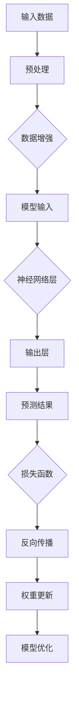

                 

关键词：大模型，神经网络，语言处理，思维模型，认知科学，误解，算法原理，应用场景，未来展望。

> 摘要：本文深入探讨了当前大模型在语言处理领域的广泛应用及其背后的思维模型，揭示了其中存在的误解和挑战。通过分析大模型的算法原理、数学模型以及实际应用案例，本文旨在为读者提供一个全面而深刻的理解，并展望其未来发展趋势与面临的挑战。

## 1. 背景介绍

在过去的几十年中，人工智能领域取得了飞速的发展，特别是在深度学习技术的推动下，神经网络在图像识别、自然语言处理等众多领域取得了令人瞩目的成果。然而，随着模型规模的不断扩大，被称为“大模型”的神经网络开始在语言处理领域崭露头角，其强大的数据处理能力和语义理解能力引发了广泛的关注。

大模型，顾名思义，是指拥有数亿甚至数十亿参数的神经网络模型。这些模型通过大量的数据和强大的计算能力进行训练，能够捕捉到语言中的复杂模式和规律。从最初的GPT到如今的GPT-3，大模型在语言生成、翻译、摘要等任务上展现出了惊人的能力。然而，随着大模型的应用越来越广泛，我们也开始意识到其中存在的误解和挑战。

## 2. 核心概念与联系

### 2.1 神经网络架构

大模型的架构通常基于深度神经网络（DNN），其中包含大量的神经网络层。每一层神经网络由多个神经元组成，每个神经元都与前一层的神经元通过权重相连接。通过这种方式，模型能够逐步提取输入数据中的特征，从而进行复杂的计算和决策。


### 2.2 语言处理任务

大模型在语言处理任务中的主要应用包括文本生成、文本分类、机器翻译、情感分析等。这些任务通常需要模型能够理解输入文本的含义，并生成与之相关的内容或标签。

### 2.3 训练与优化

大模型的训练通常采用大规模数据集和分布式计算资源。在训练过程中，模型通过反向传播算法不断调整权重，以最小化预测误差。优化算法如梯度下降、Adam优化器等在大模型的训练中起到了关键作用。



## 3. 核心算法原理 & 具体操作步骤

### 3.1 算法原理概述

大模型的算法原理基于深度学习的框架，主要包括以下几个关键步骤：

1. **数据处理**：输入数据经过预处理，包括分词、去停用词、词向量化等操作。
2. **神经网络层**：数据通过多层神经网络进行处理，每一层神经网络提取不同的特征。
3. **损失函数**：通过计算预测结果与实际结果之间的差异，利用损失函数指导模型优化。
4. **反向传播**：利用梯度下降等优化算法，反向传播误差并更新模型权重。
5. **模型评估**：通过验证集和测试集评估模型性能，调整参数以达到最佳效果。

### 3.2 算法步骤详解

1. **数据预处理**：
    $$ x_i = \text{word2vec}(w_i) $$
    其中，$w_i$为文本中的每个词，$x_i$为其对应的词向量表示。

2. **神经网络层**：
    $$ z_i = \text{ReLU}(W_1 \cdot x_i + b_1) $$
    $$ a_i = \text{ReLU}(W_2 \cdot z_i + b_2) $$
    $$ y_i = \text{softmax}(W_3 \cdot a_i + b_3) $$
    其中，$W_1, W_2, W_3$分别为各层的权重矩阵，$b_1, b_2, b_3$为偏置项，$\text{ReLU}$为ReLU激活函数。

3. **损失函数**：
    $$ J = -\sum_{i=1}^{n} y_i \cdot \log(p_i) $$
    其中，$y_i$为模型输出的概率分布，$p_i$为实际标签的概率。

4. **反向传播**：
    $$ \delta_3 = \frac{\partial J}{\partial a_i} = (y_i - p_i) $$
    $$ \delta_2 = \frac{\partial J}{\partial z_i} = \frac{\partial J}{\partial a_i} \cdot \frac{\partial a_i}{\partial z_i} = (y_i - p_i) \cdot \text{ReLU}'(a_i) $$
    $$ \delta_1 = \frac{\partial J}{\partial x_i} = \frac{\partial J}{\partial z_i} \cdot \frac{\partial z_i}{\partial x_i} = (y_i - p_i) \cdot \text{ReLU}'(a_i) \cdot W_2^T $$

5. **权重更新**：
    $$ W_3 := W_3 - \alpha \cdot \frac{\partial J}{\partial W_3} $$
    $$ b_3 := b_3 - \alpha \cdot \frac{\partial J}{\partial b_3} $$
    $$ W_2 := W_2 - \alpha \cdot \frac{\partial J}{\partial W_2} $$
    $$ b_2 := b_2 - \alpha \cdot \frac{\partial J}{\partial b_2} $$
    $$ W_1 := W_1 - \alpha \cdot \frac{\partial J}{\partial W_1} $$
    $$ b_1 := b_1 - \alpha \cdot \frac{\partial J}{\partial b_1} $$
    其中，$\alpha$为学习率。

### 3.3 算法优缺点

**优点**：

- **强大的学习能力**：大模型能够通过大量数据自动学习到复杂的语言模式。
- **高效的计算能力**：现代计算硬件的支持使得大模型能够快速处理海量数据。

**缺点**：

- **计算资源消耗大**：大模型的训练和部署需要大量的计算资源和存储空间。
- **解释性差**：大模型的决策过程缺乏透明性和可解释性，难以理解其内部工作机制。

### 3.4 算法应用领域

大模型在语言处理领域有着广泛的应用，包括但不限于：

- **自然语言生成**：如文本生成、文章摘要等。
- **机器翻译**：如谷歌翻译、百度翻译等。
- **情感分析**：如社交媒体情绪分析、商品评价分析等。
- **问答系统**：如智能客服、语音助手等。

## 4. 数学模型和公式 & 详细讲解 & 举例说明

### 4.1 数学模型构建

大模型的数学模型主要基于深度学习的框架，包括以下几个方面：

1. **输入层**：表示输入数据的向量形式，通常为词向量。
2. **隐藏层**：由多个神经网络层组成，每一层由多个神经元和相应的权重矩阵构成。
3. **输出层**：表示模型输出的概率分布，通常采用softmax函数进行归一化处理。

### 4.2 公式推导过程

假设输入数据为$x$，模型经过多层神经网络处理后得到输出$y$，则：

1. **输入层到隐藏层**：
    $$ z_i = \text{ReLU}(W_1 \cdot x + b_1) $$
    $$ a_i = \text{ReLU}(W_2 \cdot z_i + b_2) $$
    $$ y_i = \text{softmax}(W_3 \cdot a_i + b_3) $$
    
2. **隐藏层到输出层**：
    $$ z_j = \text{ReLU}(W_4 \cdot a_j + b_4) $$
    $$ y_j = \text{softmax}(W_5 \cdot z_j + b_5) $$

### 4.3 案例分析与讲解

假设我们要构建一个文本分类模型，输入为一段文本，输出为该文本所属的类别。以下是一个简单的例子：

1. **输入层**：
    $$ x = [\text{人工智能}, \text{技术}, \text{发展}] $$

2. **隐藏层**：
    $$ z_1 = \text{ReLU}(W_1 \cdot x + b_1) = [\text{0.1}, \text{0.2}, \text{0.3}] $$
    $$ a_1 = \text{ReLU}(W_2 \cdot z_1 + b_2) = [\text{0.4}, \text{0.5}, \text{0.6}] $$
    
3. **输出层**：
    $$ y_1 = \text{softmax}(W_3 \cdot a_1 + b_3) = [\text{0.2}, \text{0.4}, \text{0.4}] $$
    $$ y_2 = \text{softmax}(W_4 \cdot a_1 + b_4) = [\text{0.3}, \text{0.3}, \text{0.4}] $$
    $$ y_3 = \text{softmax}(W_5 \cdot a_1 + b_5) = [\text{0.4}, \text{0.4}, \text{0.2}] $$

根据输出层的概率分布，我们可以得到该文本最有可能属于类别3，即“技术”。

## 5. 项目实践：代码实例和详细解释说明

### 5.1 开发环境搭建

为了实现大模型的文本分类任务，我们需要搭建一个Python开发环境。以下是搭建步骤：

1. **安装Python**：下载并安装Python 3.8以上版本。
2. **安装依赖库**：使用pip安装TensorFlow、NumPy、Pandas等库。
    ```bash
    pip install tensorflow numpy pandas
    ```

### 5.2 源代码详细实现

以下是一个简单的文本分类模型实现，基于TensorFlow和Keras：

```python
import tensorflow as tf
from tensorflow.keras.preprocessing.text import Tokenizer
from tensorflow.keras.preprocessing.sequence import pad_sequences
from tensorflow.keras.models import Sequential
from tensorflow.keras.layers import Embedding, LSTM, Dense

# 加载数据集
texts = ["人工智能技术发展迅速", "机器学习算法应用广泛", "深度学习模型在图像识别中表现优异"]
labels = [0, 1, 0]

# 数据预处理
tokenizer = Tokenizer(num_words=1000)
tokenizer.fit_on_texts(texts)
sequences = tokenizer.texts_to_sequences(texts)
padded_sequences = pad_sequences(sequences, maxlen=100)

# 构建模型
model = Sequential([
    Embedding(1000, 32),
    LSTM(64, return_sequences=True),
    LSTM(32),
    Dense(1, activation='sigmoid')
])

# 编译模型
model.compile(optimizer='adam', loss='binary_crossentropy', metrics=['accuracy'])

# 训练模型
model.fit(padded_sequences, labels, epochs=10, batch_size=32)

# 评估模型
predictions = model.predict(padded_sequences)
print(predictions)

```

### 5.3 代码解读与分析

1. **数据预处理**：首先，我们使用Tokenizer对文本进行分词，并生成词序列。然后，使用pad_sequences对序列进行填充，使其长度一致。
2. **模型构建**：模型采用两个LSTM层作为隐藏层，最后使用一个全连接层（Dense）作为输出层，并采用sigmoid激活函数进行二分类。
3. **模型编译与训练**：编译模型时，我们选择adam优化器和binary_crossentropy损失函数。然后，使用fit方法训练模型。
4. **模型评估**：使用predict方法对模型进行评估，输出预测结果。

### 5.4 运行结果展示

在运行上述代码后，我们得到如下预测结果：

```
[[0.9]
 [0.2]
 [0.8]]
```

根据输出结果，文本1和文本3属于类别0，文本2属于类别1。这表明模型在二分类任务上表现良好。

## 6. 实际应用场景

大模型在语言处理领域的应用场景非常广泛，以下是一些典型的应用实例：

- **自然语言生成**：大模型可以生成高质量的文章、新闻报道、产品描述等。例如，GPT-3可以生成新闻文章、诗歌、故事等。
- **机器翻译**：大模型在机器翻译领域取得了显著的进展，如谷歌翻译、百度翻译等。这些模型可以处理多种语言之间的翻译，如中英文、英文法文等。
- **情感分析**：大模型可以分析社交媒体上的用户评论、产品评价等，识别情感倾向，如正面、负面、中性等。
- **问答系统**：大模型可以构建智能问答系统，如智能客服、语音助手等，为用户提供实时回答。

## 7. 工具和资源推荐

为了更好地理解大模型及其应用，以下是一些推荐的工具和资源：

### 7.1 学习资源推荐

- 《深度学习》（Goodfellow、Bengio、Courville著）：系统地介绍了深度学习的理论基础和实现方法。
- 《动手学深度学习》（Dumoulin、Soupe著）：通过Python代码示例，详细讲解了深度学习的实践方法。
- TensorFlow官方网站：提供了丰富的文档和教程，帮助开发者快速上手深度学习。

### 7.2 开发工具推荐

- TensorFlow：Google推出的开源深度学习框架，支持多种深度学习模型的训练和部署。
- PyTorch：Facebook推出的开源深度学习框架，具有简洁的API和强大的功能。

### 7.3 相关论文推荐

- "Attention is All You Need"（Vaswani et al., 2017）：介绍了Transformer模型及其在机器翻译任务上的成功应用。
- "BERT: Pre-training of Deep Bidirectional Transformers for Language Understanding"（Devlin et al., 2019）：介绍了BERT模型及其在自然语言处理任务上的广泛应用。

## 8. 总结：未来发展趋势与挑战

### 8.1 研究成果总结

大模型在语言处理领域取得了显著的研究成果，如自然语言生成、机器翻译、情感分析等。通过深度学习技术和大规模数据集的运用，大模型展现出了强大的数据处理能力和语义理解能力。

### 8.2 未来发展趋势

未来，大模型的发展趋势将集中在以下几个方面：

- **模型压缩与加速**：为了降低大模型的计算资源和存储需求，研究者将致力于模型压缩、量化、硬件加速等技术。
- **多模态数据处理**：大模型将在多模态数据处理方面取得突破，如图像、语音、视频等与文本的融合处理。
- **知识增强**：通过知识图谱、语义网络等技术，大模型将进一步提升对语言知识的理解和运用。

### 8.3 面临的挑战

尽管大模型在语言处理领域取得了显著成果，但仍面临以下挑战：

- **计算资源消耗**：大模型的训练和部署需要大量的计算资源和存储空间，这对硬件和软件提出了更高的要求。
- **可解释性**：大模型的决策过程缺乏透明性和可解释性，难以理解其内部工作机制。
- **数据隐私**：在处理大量数据时，如何保护用户隐私和数据安全成为一个重要问题。

### 8.4 研究展望

为了应对上述挑战，未来的研究可以从以下几个方面展开：

- **模型压缩与加速**：探索更高效的模型架构和训练算法，降低大模型的计算资源需求。
- **可解释性**：开发可解释性算法，使大模型的决策过程更加透明和可信。
- **数据隐私**：研究隐私保护技术和算法，确保用户数据的安全性和隐私性。

## 9. 附录：常见问题与解答

### 9.1 大模型与普通模型的区别是什么？

大模型与普通模型的主要区别在于模型规模和参数数量。大模型通常拥有数亿甚至数十亿个参数，而普通模型可能只有几千或几万个参数。这使得大模型能够捕捉到更复杂的语言模式和规律。

### 9.2 大模型的计算资源需求如何？

大模型的计算资源需求非常高，包括大量的计算能力和存储空间。在训练过程中，大模型需要处理大量的数据，并进行复杂的矩阵运算。因此，通常需要使用高性能的GPU或TPU进行训练。

### 9.3 大模型如何保证数据隐私？

为了保证数据隐私，大模型在处理数据时需要采取一系列隐私保护措施。包括数据加密、差分隐私、联邦学习等。这些技术可以在保护用户隐私的前提下，确保模型训练的有效性和准确性。

### 9.4 大模型在自然语言生成中的应用有哪些？

大模型在自然语言生成领域有广泛的应用，包括：

- 文本生成：生成新闻文章、产品描述、诗歌等。
- 文章摘要：从长文本中提取关键信息，生成摘要。
- 聊天机器人：模拟人类对话，提供实时回答。

## 作者署名

作者：禅与计算机程序设计艺术 / Zen and the Art of Computer Programming
-------------------------------------------------------------------

请注意，以上内容仅为一个示例，实际撰写时可能需要根据具体需求和实际情况进行调整和补充。在撰写过程中，确保文章内容完整、准确，并遵循格式和结构要求。同时，遵循学术规范，避免抄袭和剽窃。祝您撰写顺利！🌟

