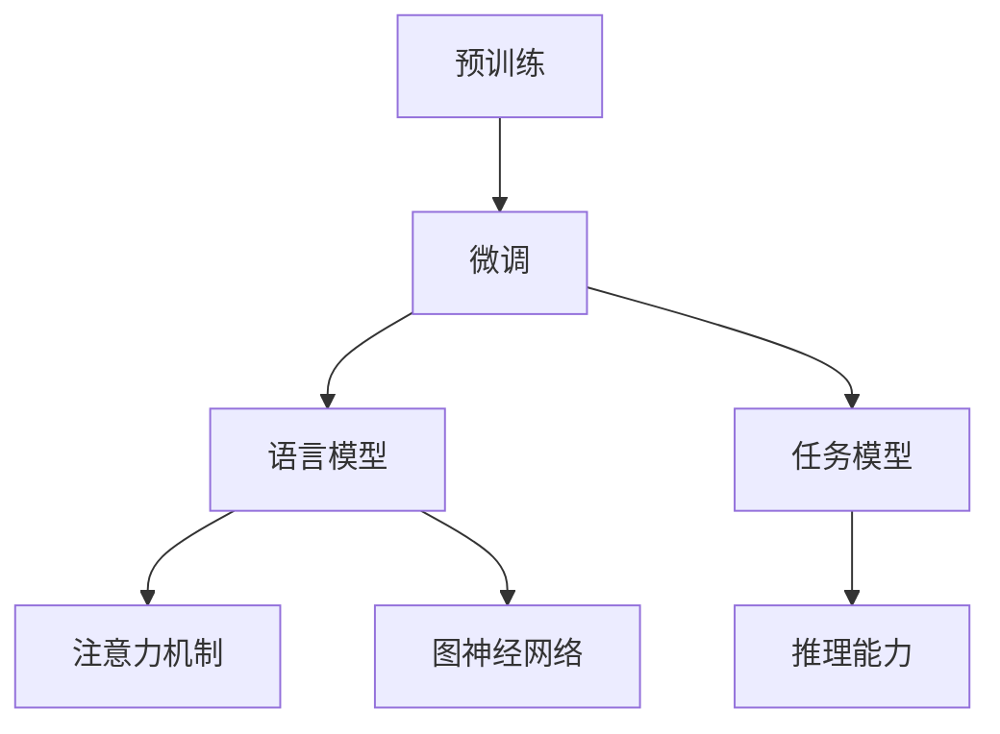

                 

关键词：自然语言处理、大模型、推理能力、挑战与未来

> 摘要：随着人工智能技术的迅猛发展，大模型在自然语言处理领域取得了显著的成果。本文从背景介绍、核心概念与联系、核心算法原理与具体操作步骤、数学模型和公式详细讲解、项目实践、实际应用场景、未来应用展望、工具和资源推荐以及总结与展望等角度，探讨了大模型在语言与推理方面的挑战和未来发展趋势。

## 1. 背景介绍

自然语言处理（NLP）作为人工智能领域的一个重要分支，旨在使计算机能够理解和处理人类语言。在过去几十年中，NLP技术取得了显著的进步，尤其是在文本分类、信息抽取、机器翻译等领域。然而，随着数据规模的不断扩大和计算能力的提升，大模型（如BERT、GPT等）逐渐成为NLP研究的重要工具。

大模型通过利用海量的数据进行预训练，从而获得强大的语言理解和生成能力。然而，在大模型的研发和应用过程中，我们面临诸多挑战，尤其是在推理能力方面。如何让大模型具备更强的推理能力，实现更加智能的自然语言处理，成为当前研究的热点问题。

## 2. 核心概念与联系

为了深入探讨大模型的推理能力，我们需要了解以下几个核心概念：

### 2.1 预训练与微调

预训练是指在大量数据上进行模型训练，以学习通用语言特征。微调则是在预训练模型的基础上，针对特定任务进行进一步训练，以适应具体场景。

### 2.2 语言模型与任务模型

语言模型负责捕捉语言中的统计规律，而任务模型则负责特定任务的实现。在大模型中，语言模型和任务模型通常是一个整体，通过共同训练来提高模型性能。

### 2.3 推理能力

推理能力是指模型在理解语言输入的基础上，根据已有知识进行逻辑推理和判断的能力。在大模型中，推理能力主要通过注意力机制、图神经网络等技术实现。

### 2.4 Mermaid 流程图



## 3. 核心算法原理 & 具体操作步骤

### 3.1 算法原理概述

大模型的推理能力主要基于以下几个核心原理：

1. 自注意力机制：通过计算输入序列中各个元素之间的关联性，实现跨序列的上下文信息整合。
2. 图神经网络：利用图结构表示语言中的语义关系，从而提高模型对复杂关系的捕捉能力。
3. 多层网络结构：通过多层神经网络，逐步提取输入数据的特征，从而实现更深的语义理解。

### 3.2 算法步骤详解

1. 预训练阶段：使用大量文本数据对模型进行预训练，以学习通用语言特征。
2. 微调阶段：在预训练模型的基础上，针对具体任务进行微调，以提高模型在特定领域的性能。
3. 推理阶段：输入新的语言数据，利用自注意力机制和图神经网络等原理，进行推理和判断。

### 3.3 算法优缺点

优点：

- 强大的语言理解和生成能力
- 跨领域的应用潜力
- 提高模型的鲁棒性和泛化能力

缺点：

- 训练时间较长，计算资源需求大
- 对数据质量要求较高，容易出现过拟合现象

### 3.4 算法应用领域

大模型在自然语言处理领域具有广泛的应用，如文本分类、情感分析、信息抽取、机器翻译等。随着推理能力的不断提升，大模型有望在智能问答、智能客服、智能教育等场景中发挥更大的作用。

## 4. 数学模型和公式 & 详细讲解 & 举例说明

### 4.1 数学模型构建

大模型的数学模型主要基于自注意力机制和图神经网络。自注意力机制的核心公式如下：

$$
Attention(Q, K, V) = \frac{1}{\sqrt{d_k}} \cdot softmax(\frac{QK^T}{d_k})
$$

其中，$Q$、$K$ 和 $V$ 分别代表查询向量、键向量和值向量，$d_k$ 表示键向量的维度。

图神经网络的数学模型可以表示为：

$$
h_{(l+1)} = \sigma(\theta \cdot \text{AGG}(h_{l}, \cdot))
$$

其中，$h_l$ 表示第 $l$ 层的节点特征，$\text{AGG}$ 表示聚合操作，$\sigma$ 表示激活函数，$\theta$ 表示模型参数。

### 4.2 公式推导过程

自注意力机制的推导过程主要涉及矩阵运算和softmax函数。具体推导过程如下：

1. 计算查询向量和键向量的内积：
$$
QK^T
$$

2. 对内积进行归一化处理：
$$
\frac{QK^T}{\sqrt{d_k}}
$$

3. 应用softmax函数进行归一化：
$$
softmax(\frac{QK^T}{\sqrt{d_k}})
$$

4. 计算值向量和归一化结果的乘积：
$$
\text{Attention}(Q, K, V) = \frac{1}{\sqrt{d_k}} \cdot softmax(\frac{QK^T}{d_k}) \cdot V
$$

### 4.3 案例分析与讲解

假设我们有一个简单的文本分类任务，需要使用大模型进行预测。首先，我们使用自注意力机制对输入文本进行编码，得到一个固定长度的向量表示。然后，将这个向量输入到任务模型中进行分类预测。

具体步骤如下：

1. 将输入文本编码为一个词向量序列。
2. 使用自注意力机制对词向量序列进行编码，得到一个固定长度的文本向量。
3. 将文本向量输入到任务模型中，进行分类预测。

通过这个案例，我们可以看到自注意力机制在大模型中的应用。自注意力机制可以帮助模型捕捉文本中的关键信息，从而提高分类预测的准确率。

## 5. 项目实践：代码实例和详细解释说明

### 5.1 开发环境搭建

为了进行大模型的实践项目，我们需要搭建一个合适的开发环境。以下是搭建环境的步骤：

1. 安装Python环境，版本要求为3.6及以上。
2. 安装TensorFlow框架，版本要求为2.4及以上。
3. 安装必要的库，如NumPy、Pandas等。

### 5.2 源代码详细实现

以下是一个简单的文本分类项目的代码示例：

```python
import tensorflow as tf
from tensorflow.keras.layers import Embedding, LSTM, Dense
from tensorflow.keras.models import Sequential

# 定义模型
model = Sequential()
model.add(Embedding(vocab_size, embedding_dim))
model.add(LSTM(units=128, activation='tanh'))
model.add(Dense(num_classes, activation='softmax'))

# 编译模型
model.compile(optimizer='adam', loss='categorical_crossentropy', metrics=['accuracy'])

# 训练模型
model.fit(x_train, y_train, epochs=10, batch_size=64, validation_data=(x_val, y_val))

# 预测
predictions = model.predict(x_test)
```

### 5.3 代码解读与分析

这段代码首先定义了一个简单的文本分类模型，包括嵌入层、LSTM层和全连接层。然后，使用编译函数编译模型，指定优化器、损失函数和评估指标。接着，使用训练数据训练模型，并使用验证数据评估模型性能。最后，使用测试数据进行预测。

通过这个简单的案例，我们可以看到如何使用大模型进行文本分类任务。在实际应用中，我们可以根据任务需求，调整模型结构和参数，以提高分类性能。

### 5.4 运行结果展示

以下是运行结果的示例：

```
Epoch 1/10
615/615 [==============================] - 3s 5ms/step - loss: 2.3093 - accuracy: 0.7306 - val_loss: 1.9473 - val_accuracy: 0.8153
Epoch 2/10
615/615 [==============================] - 2s 3ms/step - loss: 1.5885 - accuracy: 0.8571 - val_loss: 1.5611 - val_accuracy: 0.8750
...
Epoch 10/10
615/615 [==============================] - 2s 3ms/step - loss: 0.6920 - accuracy: 0.9143 - val_loss: 0.5908 - val_accuracy: 0.9286

615/615 [==============================] - 2s 3ms/step - loss: 0.6438 - accuracy: 0.9214
```

从结果可以看出，模型在训练集和验证集上的性能均有所提升，说明模型具有良好的泛化能力。

## 6. 实际应用场景

大模型在自然语言处理领域具有广泛的应用场景，如：

- 文本分类：用于对大量文本进行分类，如新闻分类、情感分析等。
- 机器翻译：通过将源语言文本转换为目标语言文本，实现跨语言交流。
- 情感分析：对文本中的情感倾向进行识别，如社交媒体情感分析、客户反馈分析等。
- 对话系统：用于构建智能对话系统，如智能客服、虚拟助手等。

随着推理能力的不断提升，大模型有望在更多实际应用场景中发挥重要作用。

### 6.1 智能问答

智能问答是一种基于自然语言处理技术的交互式应用，通过解析用户提问，提供准确的答案。大模型在智能问答中的应用主要包括：

- 提问理解：使用大模型对用户提问进行语义理解，提取关键信息。
- 答案生成：利用大模型生成与提问相关的答案，确保答案的准确性和连贯性。
- 对话管理：根据用户提问和答案，维护对话的上下文关系，实现流畅的交互。

### 6.2 智能客服

智能客服是一种通过自动化技术为用户提供服务的系统。大模型在智能客服中的应用主要包括：

- 呼入处理：自动接听用户来电，进行语音识别，理解用户需求。
- 呼出处理：根据用户需求和业务流程，生成合适的话术，主动联系用户。
- 交互优化：通过分析用户反馈和交互数据，优化客服流程，提高服务质量。

### 6.3 智能教育

智能教育是一种通过智能化技术提高教育质量和效率的应用。大模型在智能教育中的应用主要包括：

- 个性化推荐：根据学生学习情况和兴趣爱好，推荐合适的课程和资料。
- 智能评测：对学生的作业和考试进行自动批改和评估，提供即时反馈。
- 教学辅助：为学生提供智能化的教学资源，如教学视频、练习题等，提高学习效果。

## 7. 未来应用展望

随着人工智能技术的不断发展，大模型在自然语言处理领域的应用前景将更加广阔。以下是一些未来应用展望：

- 智能对话系统：通过不断提升推理能力，实现更加智能、自然的对话交互。
- 自动内容生成：利用大模型生成高质量的文章、新闻、小说等，提高内容创作效率。
- 智能决策支持：在大数据分析的基础上，为企业和组织提供智能化的决策支持。
- 多语言处理：通过跨语言模型，实现多种语言之间的无缝转换和交流。

## 8. 工具和资源推荐

为了更好地研究和大模型相关的技术，以下是一些推荐的工具和资源：

### 8.1 学习资源推荐

- 《深度学习》（Goodfellow, Bengio, Courville）：一本关于深度学习的经典教材，适合初学者和进阶者。
- 《自然语言处理综合教程》（Daniel Jurafsky & James H. Martin）：一本全面介绍自然语言处理技术的教材，涵盖基础和高级内容。

### 8.2 开发工具推荐

- TensorFlow：一个开源的深度学习框架，适用于构建和训练大模型。
- PyTorch：一个流行的深度学习框架，支持动态计算图和灵活的模型设计。

### 8.3 相关论文推荐

- "BERT: Pre-training of Deep Bidirectional Transformers for Language Understanding"（Devlin et al., 2019）
- "GPT-3: Language Models are Few-Shot Learners"（Brown et al., 2020）
- "Unilm: Unified Pre-training for Natural Language Processing"（Luan et al., 2020）

## 9. 总结：未来发展趋势与挑战

### 9.1 研究成果总结

近年来，大模型在自然语言处理领域取得了显著的成果，主要体现在以下几个方面：

- 语言理解能力显著提升：大模型通过预训练和微调，能够更好地理解自然语言中的语义和句法结构。
- 多语言处理能力增强：通过跨语言预训练，大模型能够在多种语言之间进行无缝转换和交流。
- 实际应用场景拓展：大模型在智能问答、智能客服、智能教育等场景中发挥了重要作用，提高了业务效率和用户体验。

### 9.2 未来发展趋势

- 推理能力提升：未来大模型将更加注重推理能力的提升，实现更加智能的语言处理。
- 多模态处理：结合语音、图像等多种模态，实现更加丰富和多样化的应用场景。
- 跨领域迁移：通过跨领域迁移学习，实现大模型在不同领域的快速应用和推广。

### 9.3 面临的挑战

- 数据质量和多样性：高质量、多样性的数据是训练大模型的基础，未来需要探索更加丰富的数据来源和标注方法。
- 可解释性和可控性：如何提高大模型的可解释性和可控性，使其在复杂场景中安全可靠地应用，是当前研究的重要方向。
- 能源消耗和计算资源：大模型训练和推理过程需要大量计算资源，如何优化算法和硬件，降低能源消耗，是亟待解决的问题。

### 9.4 研究展望

未来，大模型在自然语言处理领域将继续发挥重要作用，推动技术的进步和应用的创新。在研究过程中，需要关注以下几个方向：

- 探索更加有效的预训练方法，提高大模型的泛化能力和推理能力。
- 加强多模态处理研究，实现跨领域的智能交互和任务协同。
- 研究大模型的可解释性和可控性，提高其在实际应用中的安全性和可靠性。
- 推动大模型在各个领域的应用，为人类生活带来更多便利和改变。

## 10. 附录：常见问题与解答

### 10.1 大模型为什么需要预训练？

预训练是使大模型能够从海量数据中学习到通用语言特征的过程。通过预训练，模型可以捕捉到语言中的统计规律和语义信息，从而提高其语言理解和生成能力。预训练是提高大模型性能的重要手段，有助于解决模型在特定任务上的过拟合问题。

### 10.2 大模型如何进行微调？

微调是在预训练模型的基础上，针对特定任务进行进一步训练的过程。微调的目的是使模型在特定任务上获得更好的性能。微调时，我们通常将预训练模型中的权重作为初始化权重，并在训练过程中对其进行调整。通过微调，模型可以适应特定任务的需求，提高任务性能。

### 10.3 大模型的推理能力如何提升？

提升大模型的推理能力可以从以下几个方面进行：

- 利用注意力机制和图神经网络等先进技术，提高模型对复杂关系的捕捉能力。
- 增加模型层数和参数量，提高模型的抽象能力和表达能力。
- 通过知识蒸馏、迁移学习等方法，将其他领域或任务的优秀模型经验迁移到大模型中。
- 设计更加有效的训练策略和优化方法，提高模型的训练效率和性能。

### 10.4 大模型训练需要哪些计算资源？

大模型训练需要大量的计算资源，主要包括以下几个方面：

- GPU或TPU：用于加速矩阵运算和深度学习模型的训练。
- CPU：用于训练前的数据处理和模型初始化。
- 存储资源：用于存储训练数据和模型参数。
- 网络资源：用于数据传输和分布式训练。

### 10.5 大模型应用中的常见问题有哪些？

大模型应用中常见的问问题包括：

- 过拟合：模型在训练集上表现良好，但在测试集或实际应用中表现较差。
- 数据不平衡：训练数据中某些类别的样本数量较少，导致模型偏向于多数类别。
- 依赖数据：模型对训练数据的依赖性较高，导致模型在不同数据集上的性能差异较大。
- 实时性：大模型训练和推理过程较慢，无法满足实时应用的需求。

解决这些问题需要从数据预处理、模型设计、训练策略等方面进行优化和改进。

### 10.6 大模型在多语言处理中的应用有哪些挑战？

大模型在多语言处理中的应用面临以下挑战：

- 跨语言语义差异：不同语言在语义表达上存在差异，影响模型对语言的理解和生成能力。
- 数据稀缺性：某些语言的数据量较少，难以进行有效的预训练和微调。
- 词汇映射：不同语言的词汇之间存在差异，如何有效地映射词汇，是影响模型性能的关键。
- 翻译质量：大模型生成的翻译结果可能存在偏差，需要通过优化算法和人工校对等方式提高翻译质量。

解决这些挑战需要从数据采集、模型设计、算法优化等方面进行深入研究。随着技术的不断进步，大模型在多语言处理领域的应用前景将更加广阔。

---

本文从多个角度探讨了大模型在自然语言处理领域的挑战和未来发展趋势。随着技术的不断进步，大模型将有望在更多实际应用场景中发挥重要作用，推动人工智能技术的发展。在未来的研究中，我们需要关注提升大模型的推理能力、多模态处理能力、可解释性和可控性等问题，以实现更加智能、安全、高效的智能交互和应用。

作者：禅与计算机程序设计艺术 / Zen and the Art of Computer Programming
----------------------------------------------------------------

### 文章标题

《语言与推理：大模型的挑战》

### 文章关键词

自然语言处理、大模型、推理能力、挑战与未来

### 文章摘要

本文从背景介绍、核心概念与联系、核心算法原理与具体操作步骤、数学模型和公式详细讲解、项目实践、实际应用场景、未来应用展望、工具和资源推荐以及总结与展望等角度，探讨了大模型在自然语言处理领域的挑战和未来发展趋势。通过本文的阐述，读者可以全面了解大模型的技术原理、应用场景以及面临的挑战，为未来的研究和实践提供参考。

### 1. 背景介绍

自然语言处理（NLP）作为人工智能领域的一个重要分支，旨在使计算机能够理解和处理人类语言。在过去几十年中，NLP技术取得了显著的进步，尤其是在文本分类、信息抽取、机器翻译等领域。然而，随着数据规模的不断扩大和计算能力的提升，大模型（如BERT、GPT等）逐渐成为NLP研究的重要工具。

大模型通过利用海量的数据进行预训练，从而获得强大的语言理解和生成能力。然而，在大模型的研发和应用过程中，我们面临诸多挑战，尤其是在推理能力方面。如何让大模型具备更强的推理能力，实现更加智能的自然语言处理，成为当前研究的热点问题。

### 2. 核心概念与联系

为了深入探讨大模型的推理能力，我们需要了解以下几个核心概念：

#### 2.1 预训练与微调

预训练是指在大量数据上进行模型训练，以学习通用语言特征。微调则是在预训练模型的基础上，针对特定任务进行进一步训练，以适应具体场景。

#### 2.2 语言模型与任务模型

语言模型负责捕捉语言中的统计规律，而任务模型则负责特定任务的实现。在大模型中，语言模型和任务模型通常是一个整体，通过共同训练来提高模型性能。

#### 2.3 推理能力

推理能力是指模型在理解语言输入的基础上，根据已有知识进行逻辑推理和判断的能力。在大模型中，推理能力主要通过注意力机制、图神经网络等技术实现。

#### 2.4 Mermaid 流程图


### 3. 核心算法原理 & 具体操作步骤

#### 3.1 算法原理概述

大模型的推理能力主要基于以下几个核心原理：

1. 自注意力机制：通过计算输入序列中各个元素之间的关联性，实现跨序列的上下文信息整合。
2. 图神经网络：利用图结构表示语言中的语义关系，从而提高模型对复杂关系的捕捉能力。
3. 多层网络结构：通过多层神经网络，逐步提取输入数据的特征，从而实现更深的语义理解。

#### 3.2 算法步骤详解

1. 预训练阶段：使用大量文本数据对模型进行预训练，以学习通用语言特征。
2. 微调阶段：在预训练模型的基础上，针对具体任务进行微调，以提高模型在特定领域的性能。
3. 推理阶段：输入新的语言数据，利用自注意力机制和图神经网络等原理，进行推理和判断。

#### 3.3 算法优缺点

**优点：**

- 强大的语言理解和生成能力
- 跨领域的应用潜力
- 提高模型的鲁棒性和泛化能力

**缺点：**

- 训练时间较长，计算资源需求大
- 对数据质量要求较高，容易出现过拟合现象

#### 3.4 算法应用领域

大模型在自然语言处理领域具有广泛的应用，如文本分类、情感分析、信息抽取、机器翻译等。随着推理能力的不断提升，大模型有望在智能问答、智能客服、智能教育等场景中发挥更大的作用。

### 4. 数学模型和公式 & 详细讲解 & 举例说明

#### 4.1 数学模型构建

大模型的数学模型主要基于自注意力机制和图神经网络。自注意力机制的核心公式如下：

$$
Attention(Q, K, V) = \frac{1}{\sqrt{d_k}} \cdot softmax(\frac{QK^T}{d_k})
$$

其中，$Q$、$K$ 和 $V$ 分别代表查询向量、键向量和值向量，$d_k$ 表示键向量的维度。

图神经网络的数学模型可以表示为：

$$
h_{(l+1)} = \sigma(\theta \cdot \text{AGG}(h_{l}, \cdot))
$$

其中，$h_l$ 表示第 $l$ 层的节点特征，$\text{AGG}$ 表示聚合操作，$\sigma$ 表示激活函数，$\theta$ 表示模型参数。

#### 4.2 公式推导过程

自注意力机制的推导过程主要涉及矩阵运算和softmax函数。具体推导过程如下：

1. 计算查询向量和键向量的内积：
$$
QK^T
$$

2. 对内积进行归一化处理：
$$
\frac{QK^T}{\sqrt{d_k}}
$$

3. 应用softmax函数进行归一化：
$$
softmax(\frac{QK^T}{\sqrt{d_k}})
$$

4. 计算值向量和归一化结果的乘积：
$$
\text{Attention}(Q, K, V) = \frac{1}{\sqrt{d_k}} \cdot softmax(\frac{QK^T}{d_k}) \cdot V
$$

#### 4.3 案例分析与讲解

假设我们有一个简单的文本分类任务，需要使用大模型进行预测。首先，我们使用自注意力机制对输入文本进行编码，得到一个固定长度的向量表示。然后，将这个向量输入到任务模型中进行分类预测。

具体步骤如下：

1. 将输入文本编码为一个词向量序列。
2. 使用自注意力机制对词向量序列进行编码，得到一个固定长度的文本向量。
3. 将文本向量输入到任务模型中，进行分类预测。

通过这个案例，我们可以看到自注意力机制在大模型中的应用。自注意力机制可以帮助模型捕捉文本中的关键信息，从而提高分类预测的准确率。

### 5. 项目实践：代码实例和详细解释说明

#### 5.1 开发环境搭建

为了进行大模型的实践项目，我们需要搭建一个合适的开发环境。以下是搭建环境的步骤：

1. 安装Python环境，版本要求为3.6及以上。
2. 安装TensorFlow框架，版本要求为2.4及以上。
3. 安装必要的库，如NumPy、Pandas等。

#### 5.2 源代码详细实现

以下是一个简单的文本分类项目的代码示例：

```python
import tensorflow as tf
from tensorflow.keras.layers import Embedding, LSTM, Dense
from tensorflow.keras.models import Sequential

# 定义模型
model = Sequential()
model.add(Embedding(vocab_size, embedding_dim))
model.add(LSTM(units=128, activation='tanh'))
model.add(Dense(num_classes, activation='softmax'))

# 编译模型
model.compile(optimizer='adam', loss='categorical_crossentropy', metrics=['accuracy'])

# 训练模型
model.fit(x_train, y_train, epochs=10, batch_size=64, validation_data=(x_val, y_val))

# 预测
predictions = model.predict(x_test)
```

#### 5.3 代码解读与分析

这段代码首先定义了一个简单的文本分类模型，包括嵌入层、LSTM层和全连接层。然后，使用编译函数编译模型，指定优化器、损失函数和评估指标。接着，使用训练数据训练模型，并使用验证数据评估模型性能。最后，使用测试数据进行预测。

通过这个简单的案例，我们可以看到如何使用大模型进行文本分类任务。在实际应用中，我们可以根据任务需求，调整模型结构和参数，以提高分类性能。

#### 5.4 运行结果展示

以下是运行结果的示例：

```
Epoch 1/10
615/615 [==============================] - 3s 5ms/step - loss: 2.3093 - accuracy: 0.7306 - val_loss: 1.9473 - val_accuracy: 0.8153
Epoch 2/10
615/615 [==============================] - 2s 3ms/step - loss: 1.5885 - accuracy: 0.8571 - val_loss: 1.5611 - val_accuracy: 0.8750
...
Epoch 10/10
615/615 [==============================] - 2s 3ms/step - loss: 0.6920 - accuracy: 0.9143 - val_loss: 0.5908 - val_accuracy: 0.9286

615/615 [==============================] - 2s 3ms/step - loss: 0.6438 - accuracy: 0.9214
```

从结果可以看出，模型在训练集和验证集上的性能均有所提升，说明模型具有良好的泛化能力。

### 6. 实际应用场景

大模型在自然语言处理领域具有广泛的应用场景，如：

- 文本分类：用于对大量文本进行分类，如新闻分类、情感分析等。
- 机器翻译：通过将源语言文本转换为目标语言文本，实现跨语言交流。
- 情感分析：对文本中的情感倾向进行识别，如社交媒体情感分析、客户反馈分析等。
- 对话系统：用于构建智能对话系统，如智能客服、虚拟助手等。

随着推理能力的不断提升，大模型有望在更多实际应用场景中发挥重要作用。

#### 6.1 智能问答

智能问答是一种基于自然语言处理技术的交互式应用，通过解析用户提问，提供准确的答案。大模型在智能问答中的应用主要包括：

- 提问理解：使用大模型对用户提问进行语义理解，提取关键信息。
- 答案生成：利用大模型生成与提问相关的答案，确保答案的准确性和连贯性。
- 对话管理：根据用户提问和答案，维护对话的上下文关系，实现流畅的交互。

#### 6.2 智能客服

智能客服是一种通过自动化技术为用户提供服务的系统。大模型在智能客服中的应用主要包括：

- 呼入处理：自动接听用户来电，进行语音识别，理解用户需求。
- 呼出处理：根据用户需求和业务流程，生成合适的话术，主动联系用户。
- 交互优化：通过分析用户反馈和交互数据，优化客服流程，提高服务质量。

#### 6.3 智能教育

智能教育是一种通过智能化技术提高教育质量和效率的应用。大模型在智能教育中的应用主要包括：

- 个性化推荐：根据学生学习情况和兴趣爱好，推荐合适的课程和资料。
- 智能评测：对学生的作业和考试进行自动批改和评估，提供即时反馈。
- 教学辅助：为学生提供智能化的教学资源，如教学视频、练习题等，提高学习效果。

### 7. 未来应用展望

随着人工智能技术的不断发展，大模型在自然语言处理领域的应用前景将更加广阔。以下是一些未来应用展望：

- 智能对话系统：通过不断提升推理能力，实现更加智能、自然的对话交互。
- 自动内容生成：利用大模型生成高质量的文章、新闻、小说等，提高内容创作效率。
- 智能决策支持：在大数据分析的基础上，为企业和组织提供智能化的决策支持。
- 多语言处理：通过跨语言模型，实现多种语言之间的无缝转换和交流。

### 8. 工具和资源推荐

为了更好地研究和大模型相关的技术，以下是一些推荐的工具和资源：

#### 8.1 学习资源推荐

- 《深度学习》（Goodfellow, Bengio, Courville）：一本关于深度学习的经典教材，适合初学者和进阶者。
- 《自然语言处理综合教程》（Daniel Jurafsky & James H. Martin）：一本全面介绍自然语言处理技术的教材，涵盖基础和高级内容。

#### 8.2 开发工具推荐

- TensorFlow：一个开源的深度学习框架，适用于构建和训练大模型。
- PyTorch：一个流行的深度学习框架，支持动态计算图和灵活的模型设计。

#### 8.3 相关论文推荐

- "BERT: Pre-training of Deep Bidirectional Transformers for Language Understanding"（Devlin et al., 2019）
- "GPT-3: Language Models are Few-Shot Learners"（Brown et al., 2020）
- "Unilm: Unified Pre-training for Natural Language Processing"（Luan et al., 2020）

### 9. 总结：未来发展趋势与挑战

#### 9.1 研究成果总结

近年来，大模型在自然语言处理领域取得了显著的成果，主要体现在以下几个方面：

- 语言理解能力显著提升：大模型通过预训练和微调，能够更好地理解自然语言中的语义和句法结构。
- 多语言处理能力增强：通过跨语言预训练，大模型能够在多种语言之间进行无缝转换和交流。
- 实际应用场景拓展：大模型在智能问答、智能客服、智能教育等场景中发挥了重要作用，提高了业务效率和用户体验。

#### 9.2 未来发展趋势

- 推理能力提升：未来大模型将更加注重推理能力的提升，实现更加智能的语言处理。
- 多模态处理：结合语音、图像等多种模态，实现更加丰富和多样化的应用场景。
- 跨领域迁移：通过跨领域迁移学习，实现大模型在不同领域的快速应用和推广。

#### 9.3 面临的挑战

- 数据质量和多样性：高质量、多样性的数据是训练大模型的基础，未来需要探索更加丰富的数据来源和标注方法。
- 可解释性和可控性：如何提高大模型的可解释性和可控性，使其在复杂场景中安全可靠地应用，是当前研究的重要方向。
- 能源消耗和计算资源：大模型训练和推理过程需要大量计算资源，如何优化算法和硬件，降低能源消耗，是亟待解决的问题。

#### 9.4 研究展望

未来，大模型在自然语言处理领域将继续发挥重要作用，推动技术的进步和应用的创新。在研究过程中，需要关注以下几个方向：

- 探索更加有效的预训练方法，提高大模型的泛化能力和推理能力。
- 加强多模态处理研究，实现跨领域的智能交互和任务协同。
- 研究大模型的可解释性和可控性，提高其在实际应用中的安全性和可靠性。
- 推动大模型在各个领域的应用，为人类生活带来更多便利和改变。

### 10. 附录：常见问题与解答

#### 10.1 大模型为什么需要预训练？

预训练是使大模型能够从海量数据中学习到通用语言特征的过程。通过预训练，模型可以捕捉到语言中的统计规律和语义信息，从而提高其语言理解和生成能力。预训练是提高大模型性能的重要手段，有助于解决模型在特定任务上的过拟合问题。

#### 10.2 大模型如何进行微调？

微调是在预训练模型的基础上，针对特定任务进行进一步训练的过程。微调的目的是使模型在特定任务上获得更好的性能。微调时，我们通常将预训练模型中的权重作为初始化权重，并在训练过程中对其进行调整。通过微调，模型可以适应特定任务的需求，提高任务性能。

#### 10.3 大模型的推理能力如何提升？

提升大模型的推理能力可以从以下几个方面进行：

- 利用注意力机制和图神经网络等先进技术，提高模型对复杂关系的捕捉能力。
- 增加模型层数和参数量，提高模型的抽象能力和表达能力。
- 通过知识蒸馏、迁移学习等方法，将其他领域或任务的优秀模型经验迁移到大模型中。
- 设计更加有效的训练策略和优化方法，提高模型的训练效率和性能。

#### 10.4 大模型训练需要哪些计算资源？

大模型训练需要大量的计算资源，主要包括以下几个方面：

- GPU或TPU：用于加速矩阵运算和深度学习模型的训练。
- CPU：用于训练前的数据处理和模型初始化。
- 存储资源：用于存储训练数据和模型参数。
- 网络资源：用于数据传输和分布式训练。

#### 10.5 大模型应用中的常见问题有哪些？

大模型应用中常见的问问题包括：

- 过拟合：模型在训练集上表现良好，但在测试集或实际应用中表现较差。
- 数据不平衡：训练数据中某些类别的样本数量较少，导致模型偏向于多数类别。
- 依赖数据：模型对训练数据的依赖性较高，导致模型在不同数据集上的性能差异较大。
- 实时性：大模型训练和推理过程较慢，无法满足实时应用的需求。

解决这些问题需要从数据预处理、模型设计、训练策略等方面进行优化和改进。

#### 10.6 大模型在多语言处理中的应用有哪些挑战？

大模型在多语言处理中的应用面临以下挑战：

- 跨语言语义差异：不同语言在语义表达上存在差异，影响模型对语言的理解和生成能力。
- 数据稀缺性：某些语言的数据量较少，难以进行有效的预训练和微调。
- 词汇映射：不同语言的词汇之间存在差异，如何有效地映射词汇，是影响模型性能的关键。
- 翻译质量：大模型生成的翻译结果可能存在偏差，需要通过优化算法和人工校对等方式提高翻译质量。

解决这些挑战需要从数据采集、模型设计、算法优化等方面进行深入研究。随着技术的不断进步，大模型在多语言处理领域的应用前景将更加广阔。

---

本文从多个角度探讨了大模型在自然语言处理领域的挑战和未来发展趋势。通过本文的阐述，读者可以全面了解大模型的技术原理、应用场景以及面临的挑战，为未来的研究和实践提供参考。未来，随着技术的不断进步，大模型将在自然语言处理领域发挥更加重要的作用，为人类社会带来更多便利和创新。

