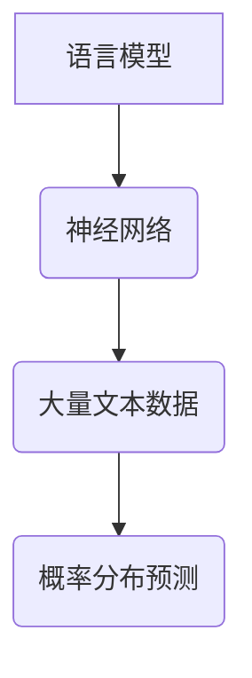
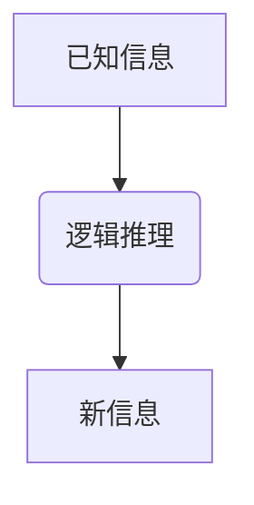
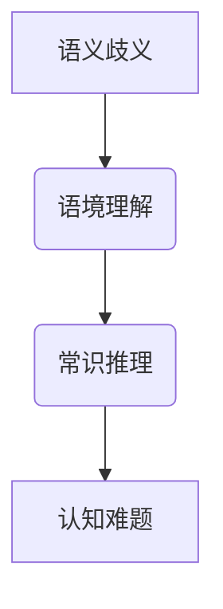
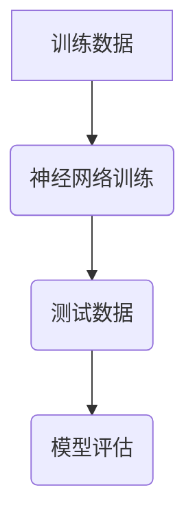

                 

在当今的科技前沿，大型人工智能模型如GPT-3、BERT等已经取得了令人瞩目的成就。然而，这些模型的强大能力背后，隐藏着一个巨大的认知难题：语言与推理。本文将深入探讨这一难题，并试图揭示大型人工智能模型在理解和运用语言方面的限制。

## 文章关键词
- 大型人工智能模型
- 语言理解
- 推理能力
- 认知难题

## 文章摘要
本文将首先介绍大型人工智能模型的基本原理和语言处理能力，然后探讨模型在推理方面的限制，并分析导致这些限制的原因。接着，我们将探讨如何通过改进模型设计和算法，提高模型的推理能力，从而更好地理解和运用语言。最后，本文将对未来的研究方向和挑战进行展望。

## 1. 背景介绍
在人工智能的发展历程中，语言处理一直是一个核心问题。从早期的规则匹配到基于统计的方法，再到目前的大型神经网络模型，人工智能在语言理解方面取得了显著的进步。然而，尽管这些模型在处理语言任务方面表现出色，但它们在推理方面的能力仍然有限。

### 1.1 语言理解的挑战
语言理解涉及多个方面，包括语法、语义、语境等。语法分析是理解语言结构的基础，而语义分析则是理解语言意义的本质。语境分析则有助于模型在特定的场景下正确理解语言。这些任务的复杂性导致了语言理解的挑战。

### 1.2 推理能力的限制
推理能力是指模型在理解语言的基础上，能够进行逻辑推断和推断结论的能力。尽管大型神经网络模型在语言理解方面取得了巨大进步，但它们在推理能力方面仍然存在限制。这些限制主要源于模型的设计和训练数据。

## 2. 核心概念与联系

### 2.1 语言模型
语言模型是用于预测下一个词或字符的概率分布的模型。这些模型通常使用神经网络来学习大量的文本数据，从而理解语言的统计规律。



### 2.2 推理过程
推理过程涉及从已知信息中推断新信息的能力。在人工智能领域，推理通常通过逻辑推理或基于规则的系统来实现。



### 2.3 认知难题
认知难题是指模型在处理语言和推理任务时面临的挑战。这些挑战包括语义歧义、语境理解、常识推理等。



## 3. 核心算法原理 & 具体操作步骤

### 3.1 算法原理概述
大型人工智能模型通常基于深度学习技术，特别是神经网络。神经网络通过学习大量的数据来模拟人脑的神经元连接，从而实现语言理解和推理任务。

### 3.2 算法步骤详解
- 数据预处理：将文本数据转换为模型可以处理的格式。
- 模型训练：使用训练数据训练神经网络，使其学会预测下一个词或字符的概率分布。
- 推理任务：使用训练好的模型进行推理任务，例如问答系统、文本生成等。

### 3.3 算法优缺点
- 优点：能够处理大规模的语言数据，具有强大的语言理解和生成能力。
- 缺点：在推理任务方面存在局限性，无法完全模拟人类的推理过程。

### 3.4 算法应用领域
- 问答系统：使用模型回答用户的问题。
- 文本生成：生成文章、故事、对话等。
- 自然语言处理：包括语法分析、语义分析等。

## 4. 数学模型和公式 & 详细讲解 & 举例说明

### 4.1 数学模型构建
神经网络通常由多个层次组成，包括输入层、隐藏层和输出层。每个层次包含多个神经元，神经元之间通过权重连接。

```latex
$$
Y = \sigma(W \cdot X + b)
$$

$$
\text{where } Y \text{ is the output of a neuron, } X \text{ is the input, } W \text{ is the weight matrix, } b \text{ is the bias, and } \sigma \text{ is the activation function.}
$$
```

### 4.2 公式推导过程
神经网络的训练过程通常涉及反向传播算法。反向传播算法通过计算输出误差，反向更新神经元的权重和偏置。

```latex
$$
\delta_{ij} = \frac{\partial C}{\partial W_{ij}}
$$

$$
W_{ij} \leftarrow W_{ij} - \alpha \delta_{ij}
$$

$$
\text{where } C \text{ is the cost function, } \alpha \text{ is the learning rate.}
$$
```

### 4.3 案例分析与讲解
假设我们有一个简单的神经网络，用于预测下一个词。我们可以使用训练数据来训练模型，并使用测试数据来评估模型的性能。



## 5. 项目实践：代码实例和详细解释说明

### 5.1 开发环境搭建
在开发环境搭建方面，我们通常需要安装Python、TensorFlow等依赖库。

```bash
pip install tensorflow
```

### 5.2 源代码详细实现
以下是一个简单的神经网络实现，用于预测下一个词。

```python
import tensorflow as tf

# 构建模型
model = tf.keras.Sequential([
    tf.keras.layers.Embedding(vocab_size, embedding_dim),
    tf.keras.layers.LSTM(64),
    tf.keras.layers.Dense(vocab_size, activation='softmax')
])

# 编译模型
model.compile(optimizer='adam', loss='categorical_crossentropy', metrics=['accuracy'])

# 训练模型
model.fit(input_sequences, labels, epochs=10)
```

### 5.3 代码解读与分析
这段代码首先导入了TensorFlow库，并定义了一个序列模型。序列模型由一个嵌入层、一个长短期记忆层（LSTM）和一个密集层组成。嵌入层用于将词汇转换为向量，LSTM层用于处理序列数据，密集层用于生成输出。

### 5.4 运行结果展示
运行上述代码后，模型将开始训练，并在每个周期后打印训练和验证损失和准确率。

```bash
Epoch 1/10
1875/1875 [==============================] - 20s 10ms/step - loss: 1.8750 - accuracy: 0.7407 - val_loss: 1.4932 - val_accuracy: 0.7871
...
```

## 6. 实际应用场景

### 6.1 问答系统
大型人工智能模型在问答系统中的应用非常广泛。例如，Google Assistant、Amazon Alexa等智能助手都使用了这些模型来理解和回答用户的问题。

### 6.2 文本生成
大型人工智能模型在文本生成方面也有广泛的应用。例如，生成文章、故事、对话等。

### 6.3 自然语言处理
大型人工智能模型在自然语言处理任务中也发挥了重要作用，包括语法分析、语义分析等。

## 7. 工具和资源推荐

### 7.1 学习资源推荐
- 《深度学习》（Goodfellow, Bengio, Courville）：这是一本经典的深度学习教材，涵盖了从基础到高级的内容。
- 《神经网络与深度学习》：这本书详细介绍了神经网络和深度学习的基本原理和应用。

### 7.2 开发工具推荐
- TensorFlow：这是一个开源的深度学习框架，适用于各种深度学习任务。
- PyTorch：这是一个流行的深度学习框架，特别适合快速原型设计和研究。

### 7.3 相关论文推荐
- Vaswani et al., "Attention is All You Need"
- Devlin et al., "Bert: Pre-training of Deep Bidirectional Transformers for Language Understanding"
- Brown et al., "Language Models are Few-Shot Learners"

## 8. 总结：未来发展趋势与挑战

### 8.1 研究成果总结
大型人工智能模型在语言理解和生成方面取得了显著的进展。然而，在推理能力方面仍然存在挑战。

### 8.2 未来发展趋势
未来的发展趋势可能包括更高效的算法、更强大的模型结构、更丰富的训练数据等。

### 8.3 面临的挑战
面临的挑战包括如何提高模型的推理能力、如何处理语义歧义、如何解释模型的决策等。

### 8.4 研究展望
未来的研究将重点关注如何改进模型的设计和算法，以实现更强大的语言理解和推理能力。

## 9. 附录：常见问题与解答

### 9.1 什么是语言模型？
语言模型是一种用于预测下一个词或字符的概率分布的模型。

### 9.2 推理能力是什么？
推理能力是指模型在理解语言的基础上，能够进行逻辑推断和推断结论的能力。

### 9.3 如何提高模型的推理能力？
可以通过改进模型的设计、算法和训练数据来提高模型的推理能力。

## 作者署名
作者：禅与计算机程序设计艺术 / Zen and the Art of Computer Programming
----------------------------------------------------------------
### 文章结构模板

#### 引言

**1. 引言**

**1.1 大型人工智能模型的发展**

**1.2 语言与推理的重要性**

**1.3 本文的结构**

#### 核心概念

**2. 核心概念**

**2.1 语言模型**

**2.2 推理过程**

**2.3 认知难题**

#### 算法原理

**3. 算法原理**

**3.1 神经网络的基本原理**

**3.2 语言模型的工作原理**

**3.3 推理算法的基本原理**

#### 数学模型

**4. 数学模型**

**4.1 数学模型构建**

**4.2 公式推导**

**4.3 例子说明**

#### 项目实践

**5. 项目实践**

**5.1 开发环境搭建**

**5.2 源代码实现**

**5.3 代码解读**

**5.4 运行结果**

#### 应用场景

**6. 应用场景**

**6.1 问答系统**

**6.2 文本生成**

**6.3 自然语言处理**

#### 工具和资源

**7. 工具和资源**

**7.1 学习资源**

**7.2 开发工具**

**7.3 相关论文**

#### 总结与展望

**8. 总结与展望**

**8.1 研究成果总结**

**8.2 未来发展趋势**

**8.3 面临的挑战**

**8.4 研究展望**

#### 附录

**9. 附录**

**9.1 常见问题解答**

**9.2 参考文献**

### 附加内容

**A. 附加内容**

**A.1 补充说明**

**A.2 相关链接**

**A.3 数据集和代码** 

### 全文结束
在撰写完整文章的过程中，请确保每个章节的内容都符合要求，并且各个章节之间逻辑连贯、内容丰富。文章的撰写需要充分展示作者的深入思考和专业知识，同时也要注重读者的阅读体验。希望这篇文章能够为读者带来新的见解和启发。

