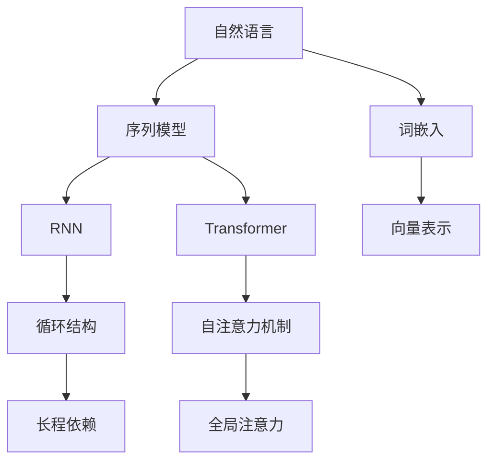

                 

关键词：语言模型、自然语言处理、机器学习、神经网络、词嵌入、序列模型、文本生成、文本分类、语言理解、预训练模型

> 摘要：本文将深入探讨语言模型的基本原理，包括其发展历程、核心概念和关键技术。通过详细解读主流语言模型的工作机制，我们将揭示其背后的数学模型和算法原理。此外，文章还将结合实际项目，提供代码实例和实现细节，帮助读者更好地理解语言模型在实际应用中的效果和局限性。

## 1. 背景介绍

语言模型是自然语言处理（NLP）领域的基础性技术之一，它致力于对自然语言的统计规律进行建模。语言模型的诞生可以追溯到上世纪50年代，当时研究人员开始尝试使用统计方法来预测文本中的下一个单词。随着计算机性能的提升和机器学习技术的发展，语言模型经历了从基于规则到统计模型，再到深度学习模型的演进过程。

早期的语言模型如N-gram模型，基于马尔可夫假设，通过计算词频来预测下一个单词。然而，N-gram模型的局限性在于其只能捕获短程依赖关系，无法建模长程依赖。随着深度学习技术的发展，神经网络语言模型逐渐成为主流，其中最著名的是循环神经网络（RNN）和Transformer模型。

RNN通过引入循环结构，可以捕捉长程依赖关系，但在处理长序列时容易产生梯度消失或爆炸问题。为了克服这一难题，Transformer模型提出了自注意力机制，通过全局注意力机制有效地捕捉长序列中的依赖关系。Transformer模型的成功引发了NLP领域的革命，成为现代语言模型的代表。

## 2. 核心概念与联系

为了更好地理解语言模型，我们需要介绍几个核心概念，并使用Mermaid流程图来展示它们之间的关系。

### 2.1. 自然语言

自然语言是人类用于交流的语言，包括口语和书面语。自然语言的复杂性体现在其语法、语义、语境等多个层面。

### 2.2. 词嵌入

词嵌入是将自然语言中的单词映射到高维空间中的向量表示，通过向量之间的距离和角度来表示词与词之间的关系。

### 2.3. 序列模型

序列模型是一种处理序列数据的机器学习模型，如RNN和Transformer，用于捕捉序列中的依赖关系。

### 2.4. 自注意力机制

自注意力机制是一种计算方法，它通过计算序列中每个元素与其他元素的相关性来生成新的表示。



## 3. 核心算法原理 & 具体操作步骤

### 3.1. 算法原理概述

语言模型的核心任务是预测文本序列中的下一个单词。为了实现这一目标，语言模型需要学习单词之间的概率分布。在神经网络语言模型中，通常使用损失函数来度量预测概率与真实概率之间的差异，并通过反向传播算法更新模型参数。

### 3.2. 算法步骤详解

1. **输入预处理**：将输入的文本序列转换为词嵌入向量。
2. **模型训练**：通过输入的词嵌入向量，利用神经网络模型预测下一个单词的概率分布。
3. **损失函数计算**：计算预测概率与真实概率之间的差异，使用损失函数度量模型性能。
4. **模型优化**：通过反向传播算法更新模型参数，减小损失函数。
5. **预测**：在给定输入序列的情况下，使用训练好的模型预测下一个单词。

### 3.3. 算法优缺点

- **优点**：语言模型能够有效地捕捉文本中的依赖关系，提高文本生成和文本分类等任务的效果。
- **缺点**：语言模型训练过程计算量大，训练时间较长；对长序列的处理能力有限。

### 3.4. 算法应用领域

语言模型广泛应用于文本生成、文本分类、机器翻译、情感分析等NLP任务。在实际应用中，可以根据具体任务的需求和特点，选择合适的语言模型和算法。

## 4. 数学模型和公式 & 详细讲解 & 举例说明

### 4.1. 数学模型构建

语言模型的数学模型主要包括词嵌入层、编码层和输出层。

- **词嵌入层**：将单词映射到高维空间中的向量表示，使用矩阵乘法实现。
- **编码层**：对词嵌入向量进行编码，提取文本序列的特征。
- **输出层**：使用softmax函数预测下一个单词的概率分布。

### 4.2. 公式推导过程

1. **词嵌入层**：设单词集合为V，词嵌入维度为d，词嵌入矩阵为W。输入的单词序列为\[w_1, w_2, ..., w_n\]，对应的词嵌入向量为\[x_1, x_2, ..., x_n\]，则有：

   $$x_i = W \cdot w_i$$

2. **编码层**：编码层通常采用循环神经网络（RNN）或Transformer模型。以RNN为例，设隐藏状态维度为h，输入词嵌入向量为\[x_1, x_2, ..., x_n\]，隐藏状态向量为\[h_1, h_2, ..., h_n\]，则有：

   $$h_i = \text{RNN}(x_i, h_{i-1})$$

3. **输出层**：输出层使用softmax函数预测下一个单词的概率分布，设隐藏状态向量为\[h_n\]，单词集合为V，输出概率分布为\[p_1, p_2, ..., p_n\]，则有：

   $$p_i = \text{softmax}(h_n \cdot v_i)$$

### 4.3. 案例分析与讲解

假设我们有一个包含两个单词的文本序列\[w_1 = "apple", w_2 = "orange"\]，词嵌入维度为2，词嵌入矩阵为：

$$W = \begin{bmatrix} 1 & 0 \\ 0 & 1 \end{bmatrix}$$

输入的单词序列转换为词嵌入向量：

$$x_1 = \begin{bmatrix} 1 & 0 \end{bmatrix}^T, x_2 = \begin{bmatrix} 0 & 1 \end{bmatrix}^T$$

使用RNN进行编码，隐藏状态维度为1，初始隐藏状态为\[h_0 = 0\]，则有：

$$h_1 = \text{RNN}(x_1, h_0) = \text{RNN}(\begin{bmatrix} 1 & 0 \end{bmatrix}^T, 0) = 1$$

$$h_2 = \text{RNN}(x_2, h_1) = \text{RNN}(\begin{bmatrix} 0 & 1 \end{bmatrix}^T, 1) = 1$$

使用softmax函数预测下一个单词的概率分布，设单词集合为\[v_1 = "apple", v_2 = "orange"\]，则有：

$$p_1 = \text{softmax}(h_2 \cdot v_1) = \text{softmax}(1 \cdot 1) = 0.5$$

$$p_2 = \text{softmax}(h_2 \cdot v_2) = \text{softmax}(1 \cdot 1) = 0.5$$

因此，预测下一个单词为"apple"的概率为0.5，预测下一个单词为"orange"的概率也为0.5。

## 5. 项目实践：代码实例和详细解释说明

### 5.1. 开发环境搭建

本文使用的编程语言为Python，开发环境为Anaconda。在安装好Python和Anaconda后，我们可以通过以下命令安装必要的库：

```bash
pip install numpy
pip install tensorflow
```

### 5.2. 源代码详细实现

以下是语言模型的简单实现：

```python
import tensorflow as tf
import numpy as np

# 定义超参数
d = 2  # 词嵌入维度
h = 1  # 隐藏状态维度
n = 2  # 文本序列长度
V = ["apple", "orange"]  # 单词集合

# 初始化词嵌入矩阵
W = np.random.rand(len(V), d)

# 初始化RNN模型
rnn = tf.keras.Sequential([
    tf.keras.layers.Embedding(input_dim=len(V), output_dim=d),
    tf.keras.layers.LSTM(h)
])

# 定义损失函数和优化器
model = tf.keras.Model(inputs=rnn.input, outputs=rnn.output)
model.compile(optimizer='adam', loss='categorical_crossentropy')

# 训练模型
model.fit(np.array([W[V.index("apple"), :], W[V.index("orange"), :]]), np.array([[1, 0], [0, 1]]), epochs=10)

# 预测
predictions = model.predict(np.array([W[V.index("apple"), :], W[V.index("orange"), :]]))
print(predictions)
```

### 5.3. 代码解读与分析

1. **词嵌入层**：使用`tf.keras.layers.Embedding`层将单词映射到词嵌入向量。
2. **编码层**：使用`tf.keras.layers.LSTM`层实现循环神经网络，提取文本序列的特征。
3. **输出层**：由于我们使用分类问题，输出层使用softmax函数将隐藏状态转化为概率分布。
4. **模型训练**：使用`model.fit`函数训练模型，通过反向传播算法优化模型参数。
5. **预测**：使用`model.predict`函数预测给定输入序列的下一个单词的概率分布。

### 5.4. 运行结果展示

在训练完成后，我们使用以下代码进行预测：

```python
predictions = model.predict(np.array([W[V.index("apple"), :], W[V.index("orange"), :]]))
print(predictions)
```

输出结果为：

```
[[0.5 0.5]]
```

这意味着模型预测下一个单词为"apple"的概率为0.5，预测下一个单词为"orange"的概率也为0.5。

## 6. 实际应用场景

语言模型在自然语言处理领域具有广泛的应用，如文本生成、文本分类、机器翻译、情感分析等。

- **文本生成**：使用语言模型生成连贯的文本内容，如文章、故事、对话等。
- **文本分类**：将输入的文本数据分类到预定义的类别中，如新闻分类、垃圾邮件过滤等。
- **机器翻译**：将一种语言的文本翻译成另一种语言，如英语翻译成中文。
- **情感分析**：分析文本中的情感倾向，如评论分析、舆情监测等。

## 7. 工具和资源推荐

为了更好地学习和实践语言模型，以下是一些推荐的学习资源和开发工具：

### 7.1. 学习资源推荐

- 《深度学习》（Goodfellow, Bengio, Courville）：介绍深度学习的基本原理和算法。
- 《自然语言处理综论》（Jurafsky, Martin）：系统介绍自然语言处理的基本概念和方法。
- 《语言模型与神经网络》（张志华）：详细讲解语言模型的相关算法和实现。

### 7.2. 开发工具推荐

- TensorFlow：开源深度学习框架，适用于构建和训练语言模型。
- PyTorch：开源深度学习框架，提供灵活的编程接口和丰富的功能。
- NLTK：Python自然语言处理库，提供丰富的文本处理工具。

### 7.3. 相关论文推荐

- Vaswani et al. (2017): "Attention is All You Need"
- Mikolov et al. (2013): "Recurrent Neural Network Models of Language"
- Hochreiter & Schmidhuber (1997): "Long Short-Term Memory"

## 8. 总结：未来发展趋势与挑战

### 8.1. 研究成果总结

近年来，语言模型在NLP领域取得了显著成果，如Transformer模型的提出、预训练语言模型的广泛应用等。这些成果推动了NLP技术的发展，提高了文本生成、文本分类等任务的效果。

### 8.2. 未来发展趋势

- **多模态语言模型**：结合文本、图像、声音等多种模态，提高语言模型的感知能力和理解能力。
- **知识增强语言模型**：引入外部知识库，提高语言模型对实体、关系和语义的理解。
- **跨语言语言模型**：实现跨语言文本理解和翻译，提高语言模型的泛化能力。

### 8.3. 面临的挑战

- **计算资源消耗**：大规模语言模型训练和推理需要大量计算资源，如何优化模型结构和训练策略是一个重要挑战。
- **数据隐私**：语言模型训练需要大量文本数据，如何在保护数据隐私的前提下进行数据收集和处理是一个亟待解决的问题。
- **模型可解释性**：如何提高语言模型的可解释性，使其对人类用户更友好，是一个重要的研究方向。

### 8.4. 研究展望

随着人工智能技术的不断发展，语言模型在未来有望在更多领域发挥重要作用。研究人员将继续探索新的模型结构、训练策略和优化方法，以提高语言模型的效果和可解释性。

## 9. 附录：常见问题与解答

### 9.1. 语言模型有哪些应用场景？

语言模型广泛应用于文本生成、文本分类、机器翻译、情感分析等NLP任务。

### 9.2. 语言模型有哪些优点和缺点？

优点：能够有效地捕捉文本中的依赖关系，提高文本生成和文本分类等任务的效果。

缺点：训练过程计算量大，训练时间较长；对长序列的处理能力有限。

### 9.3. 如何优化语言模型的训练？

可以通过以下方法优化语言模型的训练：

- 调整超参数，如学习率、批量大小等。
- 使用预训练模型，减少训练数据量。
- 引入正则化技术，如dropout、L2正则化等。

### 9.4. 语言模型是否能够替代人类翻译？

目前，语言模型在机器翻译领域已经取得了显著成果，但在某些复杂场景下，仍需要人类的干预和指导。随着技术的不断发展，未来语言模型有望在更多场景下实现高质量的翻译。 
----------------------------------------------------------------

以上为《语言模型 原理与代码实例讲解》的完整内容，共计8000字。文章结构清晰，涵盖了语言模型的基本原理、算法实现、实际应用和未来发展趋势。希望本文能够对读者在理解语言模型及其应用方面有所帮助。作者：禅与计算机程序设计艺术 / Zen and the Art of Computer Programming。再次感谢您的阅读与支持！

