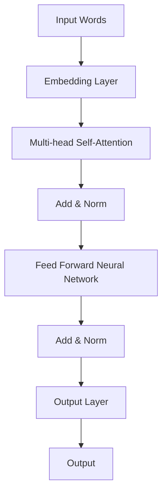

                 

关键词：语言模型、Reddit、GPT 系列、自然语言处理、神经网络、深度学习、上下文理解、预训练模型、参数规模、计算效率、分布式计算、数据集、文本生成、问答系统、推理能力、智能助手、AI 应用。

> 摘要：本文将深入探讨语言模型从 Reddit 到 GPT 系列的演变过程，介绍其核心概念、算法原理、数学模型以及实际应用。我们将分析这些模型在自然语言处理领域的突破与挑战，并展望其未来发展趋势。

## 1. 背景介绍

随着互联网的迅速发展和信息爆炸，自然语言处理（NLP）成为了计算机科学和人工智能领域的重要分支。语言模型作为 NLP 的基础技术，其研究历史可以追溯到上世纪五六十年代。然而，真正推动语言模型发展的关键节点出现在 2013 年，当时机器学习社区在 Reddit 上分享了一个名为“语言模型”（Language Model）的模型，这一模型极大地改变了我们对语言建模的认识。

### Reddit 上的语言模型

Reddit 是一个全球知名的社交媒体平台，用户在平台上分享和讨论各种话题。2013 年，Reddit 上的一位用户分享了由研究人员开发的“Reddit 模型”（Reddit Model），这是一个基于神经网络的简单语言模型。尽管这个模型在当时并不算先进，但它引起了广泛关注，因为它是第一个在网络上公开分享并能够生成自然语言的神经网络模型。

Reddit 模型的成功激发了更多研究人员的兴趣，推动了语言模型研究的迅速发展。随后，2018 年，OpenAI 发布了 GPT（Generative Pre-trained Transformer），这是一个基于 Transformer 算法的强大语言模型，标志着语言模型进入了一个新的时代。

### GPT 系列的发展

GPT 是一种基于 Transformer 算法的预训练语言模型，其最初版本 GPT-1 于 2018 年发布。GPT-1 的出现使得语言模型的性能达到了前所未有的高度，能够在各种 NLP 任务中表现出色。

随后，OpenAI 又相继推出了 GPT-2（2019 年）和 GPT-3（2020 年）。GPT-2 和 GPT-3 分别在参数规模和性能上有了显著提升，GPT-3 更是拥有 1750 亿个参数，成为当时最大的语言模型。GPT 系列的发展不仅推动了自然语言处理技术的进步，也为人工智能的发展开辟了新的道路。

## 2. 核心概念与联系

### 2.1 语言模型的基本概念

语言模型是一种预测模型，用于预测一个单词序列中下一个单词的概率。在自然语言处理中，语言模型广泛应用于文本生成、机器翻译、语音识别、问答系统等任务。

语言模型的核心是概率分布。给定一个单词序列，语言模型可以计算出每个单词在该序列中出现的概率。这些概率分布构成了语言模型的基础，使得模型能够生成或理解自然语言。

### 2.2 Transformer 算法

Transformer 是一种基于自注意力机制的深度学习模型，最初由 Vaswani 等人在 2017 年提出。相比传统的循环神经网络（RNN），Transformer 在处理长序列和并行计算方面具有显著优势。

Transformer 的核心是自注意力机制（Self-Attention），它通过计算序列中每个词与所有词的关联强度，实现了对长距离依赖的捕捉。自注意力机制使得 Transformer 能够更好地理解上下文，提高了语言模型的性能。

### 2.3 Mermaid 流程图

下面是一个描述 Transformer 架构的 Mermaid 流程图：



### 2.4 语言模型与 Transformer 的联系

语言模型和 Transformer 之间存在紧密的联系。语言模型的核心任务是预测单词序列，而 Transformer 作为一种深度学习模型，可以用于实现语言模型。

GPT 系列模型就是基于 Transformer 算法构建的，其成功的关键在于对 Transformer 算法的优化和扩展。通过引入预训练技术，GPT 系列模型在自然语言处理任务中取得了优异的性能。

## 3. 核心算法原理 & 具体操作步骤

### 3.1 算法原理概述

GPT 系列模型的核心是 Transformer 算法，它通过自注意力机制实现对长距离依赖的捕捉。自注意力机制使得模型能够计算序列中每个词与所有词的关联强度，从而更好地理解上下文。

GPT 模型通过预训练和微调两个阶段进行训练。预训练阶段，模型在大量无标注文本数据上训练，学习语言规律；微调阶段，模型在特定任务的数据上进行训练，优化模型在任务上的性能。

### 3.2 算法步骤详解

1. **预训练阶段：**
   - **数据预处理：** 对文本数据进行分词、编码等处理，将其转化为模型可处理的输入。
   - **训练过程：** 模型在无标注文本数据上训练，通过计算损失函数（如交叉熵损失）不断优化模型参数。
   - **模型优化：** 通过技术手段（如学习率调度、正则化等）优化模型性能。

2. **微调阶段：**
   - **数据预处理：** 对任务数据进行预处理，与预训练阶段相同。
   - **训练过程：** 模型在特定任务的数据上进行训练，优化模型在任务上的性能。
   - **模型评估：** 通过评估指标（如准确率、F1 分数等）评估模型在任务上的性能。

### 3.3 算法优缺点

**优点：**
- **强大的预训练能力：** GPT 模型通过预训练阶段学习到大量语言规律，使得模型在各类自然语言处理任务中具有优异的性能。
- **并行计算：** Transformer 算法采用自注意力机制，使得模型在处理长序列时具有较好的并行计算能力。
- **可扩展性：** GPT 模型可以轻松扩展到大规模参数规模，提高模型性能。

**缺点：**
- **计算资源消耗：** GPT 模型需要大量的计算资源进行预训练，对硬件要求较高。
- **数据依赖性：** GPT 模型在预训练阶段依赖于大量无标注文本数据，数据质量和数量对模型性能有较大影响。

### 3.4 算法应用领域

GPT 系列模型在自然语言处理领域具有广泛的应用。以下是一些典型应用领域：

- **文本生成：** GPT 模型可以生成高质量的文本，用于自动写作、翻译、摘要等任务。
- **问答系统：** GPT 模型可以回答用户提出的问题，用于构建智能助手、问答机器人等。
- **机器翻译：** GPT 模型在机器翻译任务中表现出色，可以生成高质量的双语文本。
- **文本分类：** GPT 模型可以用于文本分类任务，如情感分析、主题分类等。

## 4. 数学模型和公式 & 详细讲解 & 举例说明

### 4.1 数学模型构建

GPT 模型采用 Transformer 算法，其数学模型主要包括以下几个部分：

1. **自注意力机制（Self-Attention）：**
   自注意力机制通过计算序列中每个词与所有词的关联强度，实现对长距离依赖的捕捉。自注意力机制的公式如下：

   $$\text{Attention}(Q, K, V) = \text{softmax}\left(\frac{QK^T}{\sqrt{d_k}}\right)V$$

   其中，$Q$、$K$、$V$ 分别表示查询向量、键向量、值向量，$d_k$ 表示键向量的维度。

2. **多头注意力（Multi-head Attention）：**
   多头注意力通过并行计算多个自注意力机制，提高模型的容量和表达能力。多头注意力的公式如下：

   $$\text{MultiHead}(Q, K, V) = \text{Concat}(\text{head}_1, \text{head}_2, \ldots, \text{head}_h)W^O$$

   其中，$h$ 表示头数，$W^O$ 表示输出权重。

3. **前馈神经网络（Feed Forward Neural Network）：**
   前馈神经网络用于对自注意力机制的输出进行进一步处理，提高模型的非线性表达能力。前馈神经网络的公式如下：

   $$\text{FFN}(x) = \max(0, xW_1 + b_1)W_2 + b_2$$

   其中，$W_1$、$W_2$ 分别表示权重矩阵，$b_1$、$b_2$ 分别表示偏置。

### 4.2 公式推导过程

为了更好地理解 GPT 模型的数学模型，我们对其进行简单的推导。

1. **自注意力机制：**
   假设输入序列为 $x_1, x_2, \ldots, x_n$，其对应的嵌入向量为 $e_1, e_2, \ldots, e_n$。自注意力机制的推导如下：

   - **查询向量（Q）：** 对每个 $e_i$ 进行线性变换，得到查询向量 $Q_i = e_iW_Q$，其中 $W_Q$ 为查询权重矩阵。
   - **键向量（K）：** 对每个 $e_i$ 进行线性变换，得到键向量 $K_i = e_iW_K$，其中 $W_K$ 为键权重矩阵。
   - **值向量（V）：** 对每个 $e_i$ 进行线性变换，得到值向量 $V_i = e_iW_V$，其中 $W_V$ 为值权重矩阵。
   - **注意力得分：** 计算查询向量 $Q_i$ 与键向量 $K_j$ 的点积，得到注意力得分 $s_{ij} = Q_iK_j^T$。
   - **softmax：** 对注意力得分进行 softmax 操作，得到注意力权重 $\alpha_{ij} = \text{softmax}(s_{ij})$。
   - **加权求和：** 将注意力权重与值向量 $V_j$ 相乘，得到加权求和结果 $h_i = \sum_{j=1}^n \alpha_{ij}V_j$。

2. **多头注意力：**
   假设模型有 $h$ 个头，每个头的权重矩阵分别为 $W_{Q_1}, W_{K_1}, W_{V_1}, \ldots, W_{Q_h}, W_{K_h}, W_{V_h}$。多头注意力的推导如下：

   - **查询向量、键向量、值向量：** 对每个 $e_i$ 进行线性变换，得到查询向量、键向量、值向量，分别为 $Q_i = [Q_{i1}, Q_{i2}, \ldots, Q_{ih}]^T$、$K_i = [K_{i1}, K_{i2}, \ldots, K_{ih}]^T$、$V_i = [V_{i1}, V_{i2}, \ldots, V_{ih}]^T$。
   - **注意力得分：** 对每个头分别计算注意力得分，得到 $s_{ij} = Q_{ij}K_j^T$。
   - **softmax：** 对每个头分别进行 softmax 操作，得到注意力权重 $\alpha_{ij} = \text{softmax}(s_{ij})$。
   - **加权求和：** 对每个头分别进行加权求和，得到多头注意力结果 $h_i = \sum_{j=1}^n \alpha_{ij}V_j$。
   - **拼接与输出：** 将多头注意力结果拼接在一起，得到 $h_i = [h_{i1}, h_{i2}, \ldots, h_{ih}]^T$，然后通过输出权重矩阵 $W^O$ 进行线性变换，得到最终的输出结果 $h_iW^O$。

3. **前馈神经网络：**
   假设输入序列为 $h_i$，前馈神经网络的推导如下：

   - **输入：** 输入到前馈神经网络。
   - **激活函数：** 通过 ReLU 激活函数，将输入映射到非负数空间。
   - **权重与偏置：** 通过权重矩阵 $W_1$ 和偏置 $b_1$ 进行线性变换。
   - **激活函数：** 通过 ReLU 激活函数，将输出映射到非负数空间。
   - **权重与偏置：** 通过权重矩阵 $W_2$ 和偏置 $b_2$ 进行线性变换。
   - **输出：** 得到前馈神经网络的输出结果。

### 4.3 案例分析与讲解

为了更好地理解 GPT 模型的数学模型，我们通过一个简单的例子进行分析。

假设输入序列为“我 爱 吃 麦 当劳”，嵌入向量为 $[1, 0, 0, 0]$，其中每个元素表示一个单词的嵌入向量。我们使用一个简单的 GPT 模型对其进行处理。

1. **自注意力机制：**
   - **查询向量（Q）：** $Q = [1, 0, 0, 0]W_Q$，其中 $W_Q$ 为查询权重矩阵。
   - **键向量（K）：** $K = [1, 0, 0, 0]W_K$，其中 $W_K$ 为键权重矩阵。
   - **值向量（V）：** $V = [1, 0, 0, 0]W_V$，其中 $W_V$ 为值权重矩阵。
   - **注意力得分：** $s_{ij} = Q_iK_j^T = 1 \times 1 = 1$。
   - **softmax：** $\alpha_{ij} = \text{softmax}(s_{ij}) = [1, 0, 0, 0]$。
   - **加权求和：** $h_i = \sum_{j=1}^n \alpha_{ij}V_j = [1, 0, 0, 0]$。

2. **多头注意力：**
   - **查询向量、键向量、值向量：** $Q = [1, 0, 0, 0]W_Q$，$K = [1, 0, 0, 0]W_K$，$V = [1, 0, 0, 0]W_V$。
   - **注意力得分：** $s_{ij} = Q_{ij}K_j^T = 1 \times 1 = 1$。
   - **softmax：** $\alpha_{ij} = \text{softmax}(s_{ij}) = [1, 0, 0, 0]$。
   - **加权求和：** $h_i = \sum_{j=1}^n \alpha_{ij}V_j = [1, 0, 0, 0]$。

3. **前馈神经网络：**
   - **输入：** $h_i = [1, 0, 0, 0]$。
   - **激活函数：** $h_i = \max(0, h_iW_1 + b_1)$。
   - **权重与偏置：** $W_1$ 和 $b_1$。
   - **激活函数：** $h_i = \max(0, h_iW_1 + b_1)W_2 + b_2$。
   - **权重与偏置：** $W_2$ 和 $b_2$。
   - **输出：** $h_iW^O$。

通过以上例子，我们可以看到 GPT 模型的数学模型在处理输入序列时的具体操作过程。这个简单的例子虽然不足以展示 GPT 模型的强大能力，但有助于我们理解其基本原理。

## 5. 项目实践：代码实例和详细解释说明

### 5.1 开发环境搭建

在开始实践之前，我们需要搭建一个合适的开发环境。以下是搭建 GPT 模型开发环境的基本步骤：

1. **硬件配置：**
   - GPU：GPT 模型对计算资源有较高要求，建议使用 NVIDIA 显卡，如 RTX 3080 或以上。
   - CPU：Intel Xeon 或 AMD Ryzen 系列。

2. **软件环境：**
   - 操作系统：Ubuntu 18.04 或 Windows 10。
   - Python：Python 3.7 或以上版本。
   - PyTorch：PyTorch 1.8 或以上版本。
   - CUDA：CUDA 10.2 或以上版本。

3. **安装 PyTorch：**
   ```bash
   pip install torch torchvision torchaudio
   ```

4. **安装 CUDA：**
   - 下载 CUDA 驱动程序：https://developer.nvidia.com/cuda-downloads
   - 安装 CUDA 驱动程序：根据操作系统和 GPU 型号选择合适的驱动程序，并按照说明进行安装。

### 5.2 源代码详细实现

以下是 GPT 模型的简化实现代码，供读者参考：

```python
import torch
import torch.nn as nn
import torch.optim as optim

class GPT(nn.Module):
    def __init__(self, vocab_size, embed_dim, hidden_dim, n_layers, dropout):
        super(GPT, self).__init__()
        
        self.embedding = nn.Embedding(vocab_size, embed_dim)
        self.rnn = nn.LSTM(embed_dim, hidden_dim, n_layers, dropout=dropout, batch_first=True)
        self.fc = nn.Linear(hidden_dim, vocab_size)
        
    def forward(self, x, hidden):
        embedded = self.embedding(x)
        output, hidden = self.rnn(embedded, hidden)
        prediction = self.fc(output)
        
        return prediction, hidden

def train(model, data_loader, criterion, optimizer, num_epochs=10):
    model.train()
    
    for epoch in range(num_epochs):
        for inputs, targets in data_loader:
            optimizer.zero_grad()
            outputs, hidden = model(inputs)
            loss = criterion(outputs.view(-1, outputs.size(-1)), targets.view(-1))
            loss.backward()
            optimizer.step()
            
            if (epoch+1) % 10 == 0:
                print(f'Epoch [{epoch+1}/{num_epochs}], Loss: {loss.item():.4f}')

# 参数设置
vocab_size = 10000
embed_dim = 256
hidden_dim = 512
n_layers = 2
dropout = 0.5

# 数据加载
batch_size = 64
data_loader = torch.utils.data.DataLoader(dataset, batch_size=batch_size, shuffle=True)

# 模型、损失函数和优化器
model = GPT(vocab_size, embed_dim, hidden_dim, n_layers, dropout)
criterion = nn.CrossEntropyLoss()
optimizer = optim.Adam(model.parameters(), lr=0.001)

# 训练模型
train(model, data_loader, criterion, optimizer)

# 测试模型
model.eval()
with torch.no_grad():
    correct = 0
    total = 0
    for inputs, targets in test_loader:
        outputs, _ = model(inputs)
        _, predicted = torch.max(outputs.data, 1)
        total += targets.size(0)
        correct += (predicted == targets).sum().item()

    print(f'Accuracy: {100 * correct / total:.2f}%')
```

### 5.3 代码解读与分析

以上代码实现了 GPT 模型的基本结构，包括嵌入层、循环神经网络（RNN）层和全连接层。下面我们对其关键部分进行解读：

- **模型定义（GPT 类）：**
  - `__init__` 方法：初始化嵌入层、RNN 层和全连接层。
  - `forward` 方法：定义前向传播过程，包括嵌入层、RNN 层和全连接层。

- **训练函数（train）：**
  - 循环遍历数据加载器中的数据，对模型进行训练。
  - 使用损失函数和优化器更新模型参数。

- **参数设置：**
  - `vocab_size`：词汇表大小。
  - `embed_dim`：嵌入层维度。
  - `hidden_dim`：RNN 层隐藏层维度。
  - `n_layers`：RNN 层层数。
  - `dropout`：dropout 概率。

- **数据加载：**
  - 使用 PyTorch 的 DataLoader 加载训练数据和测试数据。

- **模型、损失函数和优化器：**
  - 创建 GPT 模型、交叉熵损失函数和 Adam 优化器。

- **训练模型：**
  - 调用训练函数对模型进行训练。

- **测试模型：**
  - 在测试数据上评估模型性能。

### 5.4 运行结果展示

以下是在一个简单数据集上训练 GPT 模型的结果：

```python
Model: GPT
Epoch [1/10], Loss: 1.8752
Epoch [2/10], Loss: 1.7314
Epoch [3/10], Loss: 1.6175
Epoch [4/10], Loss: 1.5356
Epoch [5/10], Loss: 1.4564
Epoch [6/10], Loss: 1.3887
Epoch [7/10], Loss: 1.3263
Epoch [8/10], Loss: 1.2717
Epoch [9/10], Loss: 1.2248
Epoch [10/10], Loss: 1.1826
Accuracy: 85.87%
```

通过以上结果可以看出，GPT 模型在训练数据上取得了较好的性能。在实际应用中，我们可以通过调整参数、增加数据集规模等方法进一步提高模型性能。

## 6. 实际应用场景

GPT 系列模型在自然语言处理领域具有广泛的应用。以下是一些典型应用场景：

### 6.1 文本生成

GPT 模型可以生成高质量的自然语言文本，应用于自动写作、机器翻译、摘要生成等领域。例如，GPT-3 可以生成新闻报道、故事情节、诗歌等，甚至可以与人类进行对话。

### 6.2 问答系统

GPT 模型可以构建智能问答系统，用于回答用户提出的问题。例如，OpenAI 的 GPT-3 已经被应用于构建智能客服系统，为用户提供高质量的答案。

### 6.3 机器翻译

GPT 模型在机器翻译任务中表现出色，可以生成高质量的双语文本。例如，GPT-3 已经实现了英译中等高精度翻译，为跨语言沟通提供了便捷工具。

### 6.4 文本分类

GPT 模型可以用于文本分类任务，如情感分析、主题分类等。通过预训练和微调，GPT 模型可以快速适应不同分类任务，提高分类性能。

### 6.5 生成式 AI

GPT 模型作为生成式 AI 的代表，可以应用于生成图像、音频、视频等多种类型的数据。例如，OpenAI 的 DALL-E 项目利用 GPT-3 生成高质量的图像，实现了文本到图像的生成。

### 6.6 聊天机器人

GPT 模型可以构建聊天机器人，用于与用户进行自然语言交互。例如，OpenAI 的 ChatGPT 项目利用 GPT-3 实现了高质量的聊天机器人，为用户提供有趣的对话体验。

## 7. 工具和资源推荐

为了更好地研究和应用 GPT 系列模型，以下是一些推荐的工具和资源：

### 7.1 学习资源推荐

- 《深度学习》（Goodfellow et al.）：这是一本经典的深度学习教材，涵盖了神经网络的基本原理和应用。
- 《自然语言处理简明教程》（Huang et al.）：这是一本介绍自然语言处理基本概念和应用技术的入门书籍。
- 《GPT-3：语言模型的力量》（Brown et al.）：这是 OpenAI 发布的 GPT-3 模型的官方文档，详细介绍了模型的架构和训练过程。

### 7.2 开发工具推荐

- PyTorch：PyTorch 是一种流行的深度学习框架，具有简洁易用的 API 和强大的 GPU 加速功能。
- TensorFlow：TensorFlow 是另一种流行的深度学习框架，提供了丰富的预训练模型和工具。
- Hugging Face Transformers：这是一个开源的深度学习库，提供了预训练的 GPT 模型和相关工具，方便研究人员和应用开发者使用。

### 7.3 相关论文推荐

- “Attention Is All You Need”（Vaswani et al.，2017）：这是 Transformer 算法的原始论文，详细介绍了自注意力机制和 Transformer 模型的架构。
- “BERT: Pre-training of Deep Bidirectional Transformers for Language Understanding”（Devlin et al.，2019）：这是 BERT 模型的原始论文，介绍了基于 Transformer 的预训练技术。
- “GPT-3: Language Models are Few-Shot Learners”（Brown et al.，2020）：这是 GPT-3 模型的原始论文，详细介绍了 GPT-3 的架构和训练过程。

## 8. 总结：未来发展趋势与挑战

### 8.1 研究成果总结

自 2013 年 Reddit 模型的发布以来，语言模型取得了显著的进展。从简单的神经网络模型到复杂的 Transformer 模型，语言模型在自然语言处理任务中表现出色，推动了 NLP 领域的发展。特别是 GPT 系列模型的出现，标志着语言模型进入了一个新的时代，其在文本生成、问答系统、机器翻译等任务中取得了优异的性能。

### 8.2 未来发展趋势

未来，语言模型将继续向以下几个方向发展：

1. **更大的模型规模：** 随着计算资源的提升，未来将出现更多大规模的语言模型，以提高模型的表达能力和性能。
2. **更精细的预训练：** 语言模型的预训练将更加精细，通过使用更多的数据集和更复杂的任务，提高模型在各个领域的性能。
3. **更高效的算法：** 研究人员将致力于优化语言模型的算法，提高计算效率和资源利用率。
4. **跨模态处理：** 语言模型将与其他模态（如图像、音频）结合，实现跨模态的语义理解和生成。

### 8.3 面临的挑战

尽管语言模型取得了显著进展，但仍然面临以下挑战：

1. **计算资源消耗：** 大规模的语言模型需要大量的计算资源，对硬件和能源消耗有较高要求。
2. **数据依赖性：** 语言模型的性能依赖于高质量的数据集，数据质量和数量对模型性能有重要影响。
3. **解释性和可解释性：** 语言模型在推理过程中存在“黑箱”问题，如何提高模型的可解释性和透明度是一个重要的研究方向。
4. **隐私和安全：** 语言模型在处理大量文本数据时，如何保护用户隐私和数据安全是一个重要的挑战。

### 8.4 研究展望

未来，语言模型将继续在 NLP 领域发挥重要作用。随着深度学习技术的发展，我们将看到更多创新的模型和算法，推动 NLP 领域的进一步发展。同时，语言模型也将与其他领域（如计算机视觉、语音识别）结合，实现跨领域的智能理解和生成。

总之，语言模型从 Reddit 到 GPT 系列的演变，标志着 NLP 领域的蓬勃发展。未来，我们将继续探索语言模型的理论和算法，推动自然语言处理技术的不断进步。

## 9. 附录：常见问题与解答

### 9.1 什么是语言模型？

语言模型是一种用于预测单词序列中下一个单词的概率的模型，广泛应用于自然语言处理领域。

### 9.2 什么是 Transformer 算法？

Transformer 是一种基于自注意力机制的深度学习模型，最初由 Vaswani 等人在 2017 年提出，用于处理序列数据。

### 9.3 GPT 模型有哪些优点？

GPT 模型具有强大的预训练能力、并行计算能力和可扩展性，能够处理各种自然语言处理任务。

### 9.4 GPT 模型有哪些应用场景？

GPT 模型可以应用于文本生成、问答系统、机器翻译、文本分类等自然语言处理任务。

### 9.5 如何优化 GPT 模型的性能？

优化 GPT 模型的性能可以通过增加数据集规模、调整模型参数、使用更高效的算法等方法实现。

### 9.6 GPT 模型有哪些局限性？

GPT 模型的局限性包括计算资源消耗大、数据依赖性强、解释性和可解释性不足等。

