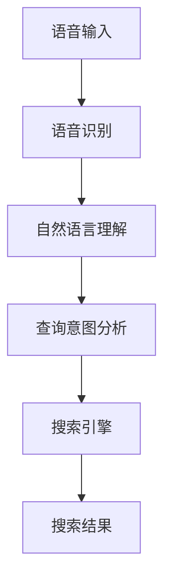

                 

### 关键词 Keywords

- 语音搜索
- 电商领域
- 技术应用
- 现状
- 展望

<|assistant|>### 摘要 Abstract

本文探讨了语音搜索技术在电商领域的应用现状与未来展望。通过对语音搜索技术的基本概念、核心算法和实施步骤的详细介绍，本文分析了该技术在实际电商环境中的应用案例，如智能助手、语音购物等。同时，本文还从数学模型、项目实践和实际应用场景等多个角度，深入探讨了语音搜索技术在电商领域的优势和挑战。最后，本文提出了对未来发展趋势的预测以及面临的挑战，为相关领域的研究者和从业者提供了有价值的参考。

## 1. 背景介绍

随着人工智能技术的飞速发展，语音搜索作为一种自然交互方式，逐渐成为人们获取信息、执行任务的重要手段。特别是在电商领域，语音搜索技术的应用不仅提高了用户购物的便捷性，还为企业带来了新的商业模式和盈利点。

### 1.1 语音搜索的定义与发展历程

语音搜索（Voice Search）是指通过语音输入的方式，向计算机系统查询信息或执行任务的技术。它结合了语音识别、自然语言处理和搜索引擎等技术，实现了用户与设备的语音交互。

#### 1.1.1 语音搜索的初步发展

语音搜索技术的概念最早可以追溯到20世纪80年代，当时的语音识别技术主要用于军事和科研领域。随着计算机处理能力的提升和算法的优化，语音识别技术逐渐成熟，并在民用领域得到广泛应用。

#### 1.1.2 语音搜索的商业化应用

21世纪初，随着移动互联网的普及，语音搜索开始被各大互联网公司重视。Google、苹果、百度等科技巨头纷纷推出自己的语音搜索服务，语音搜索逐渐成为用户获取信息的重要方式。

### 1.2 电商领域的发展现状

电商领域是一个高度依赖技术的行业，随着消费者需求的多样化和个性化，电商企业不断探索新的服务模式和技术应用，以提高用户体验和竞争力。目前，电商领域的发展现状如下：

#### 1.2.1 在线购物的普及

随着互联网的普及，越来越多的消费者选择在线购物，电商企业也在不断拓展市场份额。根据Statista的数据，全球电商市场规模在2021年达到了4.89万亿美元，预计到2025年将增长到6.38万亿美元。

#### 1.2.2 技术应用的多样化

电商企业不断引入新技术，如人工智能、大数据、区块链等，以提高运营效率和用户体验。语音搜索技术作为其中的一项重要技术，正在逐步应用于电商平台的各个环节。

#### 1.2.3 消费者行为的转变

随着语音搜索技术的成熟，越来越多的消费者开始习惯使用语音进行购物搜索和下单。根据谷歌的一项研究，2020年使用语音进行购物搜索的用户比例达到了41%。

### 1.3 语音搜索在电商领域的应用优势

语音搜索技术在电商领域的应用具有以下优势：

#### 1.3.1 提高购物体验

语音搜索技术使得用户可以更加便捷地进行购物搜索和下单，无需繁琐的键盘输入，提高了购物体验。

#### 1.3.2 满足个性化需求

语音搜索技术可以根据用户的历史行为和偏好，提供个性化的商品推荐和搜索结果，满足消费者的个性化需求。

#### 1.3.3 扩大用户群体

语音搜索技术可以帮助电商企业吸引那些不擅长使用键盘或者视力不佳的用户，扩大用户群体。

## 2. 核心概念与联系

### 2.1 语音搜索技术的基本原理

语音搜索技术的基本原理包括语音识别、自然语言处理和搜索引擎等几个方面。下面我们通过一个Mermaid流程图来介绍这些基本原理和它们之间的联系。



### 2.2 核心概念详解

#### 2.2.1 语音识别

语音识别是将语音信号转换为文本信息的技术。它的基本流程包括：

1. **预处理**：对语音信号进行预处理，如降噪、滤波等，以提高语音信号的清晰度。
2. **特征提取**：将预处理后的语音信号转换为特征向量，常用的特征提取方法包括MFCC（Mel频率倒谱系数）等。
3. **模型训练**：使用大量标注数据对语音识别模型进行训练，常用的模型包括HMM（隐马尔可夫模型）、DNN（深度神经网络）和CNN（卷积神经网络）等。

#### 2.2.2 自然语言理解

自然语言理解是将文本信息转换为计算机可理解的结构化信息的技术。它的基本流程包括：

1. **词法分析**：将文本分解为单词、短语等基本语言单位。
2. **句法分析**：分析单词和短语之间的语法关系，构建句法树。
3. **语义分析**：理解文本的语义含义，如识别实体、事件和关系等。

#### 2.2.3 查询意图分析

查询意图分析是理解用户语音输入的目的和意图的过程。它的基本流程包括：

1. **意图识别**：根据用户语音输入的内容和上下文，识别用户的查询意图。
2. **实体识别**：识别语音输入中的关键实体，如商品名称、价格范围等。
3. **上下文理解**：理解用户查询的上下文信息，如用户的购物历史、偏好等。

#### 2.2.4 搜索引擎

搜索引擎是根据用户的查询意图，从大量网页或商品信息中检索出相关结果的技术。它的基本流程包括：

1. **索引构建**：构建索引，以便快速检索。
2. **排名算法**：根据相关性、质量等因素，对检索结果进行排序。
3. **结果呈现**：将检索结果以用户友好的形式呈现给用户。

### 2.3 语音搜索技术的应用架构

语音搜索技术的应用架构可以分为前端和后端两个部分。

#### 2.3.1 前端

前端负责接收用户的语音输入，并将其传递给后端进行处理。前端的核心技术包括：

1. **语音输入设备**：如麦克风、语音助手等。
2. **语音信号处理**：对语音信号进行预处理，如降噪、增强等。
3. **语音识别**：将语音信号转换为文本信息。

#### 2.3.2 后端

后端负责处理用户的语音输入，并提供搜索结果。后端的核心技术包括：

1. **自然语言处理**：对语音输入进行语义理解和意图分析。
2. **搜索引擎**：根据用户的查询意图，从大量商品信息中检索出相关结果。
3. **结果呈现**：将搜索结果以用户友好的形式呈现给用户。

## 3. 核心算法原理 & 具体操作步骤

### 3.1 算法原理概述

语音搜索技术的核心算法主要包括语音识别、自然语言处理和搜索引擎三个部分。下面我们将分别介绍这三个算法的原理和具体操作步骤。

#### 3.1.1 语音识别

语音识别算法的基本原理是将语音信号转换为文本信息。其具体操作步骤如下：

1. **信号预处理**：对语音信号进行预处理，如降噪、增强等，以提高语音信号的清晰度。
2. **特征提取**：使用特征提取算法，如MFCC，将预处理后的语音信号转换为特征向量。
3. **模型训练**：使用大量标注数据对语音识别模型进行训练，常用的模型包括HMM、DNN和CNN等。
4. **语音识别**：使用训练好的模型对语音信号进行识别，输出文本信息。

#### 3.1.2 自然语言处理

自然语言处理算法的基本原理是将文本信息转换为计算机可理解的结构化信息。其具体操作步骤如下：

1. **词法分析**：将文本分解为单词、短语等基本语言单位。
2. **句法分析**：分析单词和短语之间的语法关系，构建句法树。
3. **语义分析**：理解文本的语义含义，如识别实体、事件和关系等。

#### 3.1.3 搜索引擎

搜索引擎算法的基本原理是根据用户的查询意图，从大量商品信息中检索出相关结果。其具体操作步骤如下：

1. **索引构建**：构建索引，以便快速检索。
2. **排名算法**：根据相关性、质量等因素，对检索结果进行排序。
3. **结果呈现**：将检索结果以用户友好的形式呈现给用户。

### 3.2 算法步骤详解

#### 3.2.1 语音识别算法步骤详解

1. **信号预处理**：
   - **降噪**：使用滤波器或噪声抑制算法，如维纳滤波，减少背景噪声对语音信号的影响。
   - **增强**：使用语音增强算法，如谱减法，增强语音信号中的语音成分。
2. **特征提取**：
   - **短时傅里叶变换**：将语音信号转换为频域表示，提取频率特征。
   - **梅尔频率倒谱系数（MFCC）**：将频域特征转换为时间特征，用于表示语音信号的变化。
3. **模型训练**：
   - **数据集准备**：收集大量语音数据，并进行标注，以训练语音识别模型。
   - **模型选择**：选择合适的模型，如HMM、DNN或CNN，进行训练。
   - **训练过程**：使用标注数据对模型进行训练，优化模型的参数。
4. **语音识别**：
   - **输入处理**：接收语音输入，并进行预处理。
   - **特征提取**：对预处理后的语音信号进行特征提取。
   - **模型预测**：使用训练好的模型对特征向量进行预测，输出文本信息。

#### 3.2.2 自然语言处理算法步骤详解

1. **词法分析**：
   - **分词**：将文本分解为单词、短语等基本语言单位。
   - **词性标注**：为每个词分配词性，如名词、动词等。
2. **句法分析**：
   - **句法树构建**：使用语法规则，构建句法树，表示句子中词汇的语法关系。
   - **依存关系分析**：分析句子中词汇之间的依存关系，如主谓关系、修饰关系等。
3. **语义分析**：
   - **实体识别**：识别文本中的关键实体，如人名、地名、组织名等。
   - **事件识别**：识别文本中的事件，如购买、评价等。
   - **关系提取**：提取文本中的实体之间的关系，如朋友关系、工作关系等。

#### 3.2.3 搜索引擎算法步骤详解

1. **索引构建**：
   - **分词**：将网页或商品信息分解为单词、短语等基本语言单位。
   - **索引生成**：为每个单词或短语生成索引，以便快速检索。
2. **排名算法**：
   - **相关性计算**：计算查询词与网页或商品信息之间的相关性，如TF-IDF、Word2Vec等。
   - **质量评估**：评估网页或商品信息的质量，如页面质量、用户评价等。
   - **排序**：根据相关性计算结果和质量评估结果，对检索结果进行排序。
3. **结果呈现**：
   - **搜索结果**：将排序后的检索结果呈现给用户。
   - **分页**：如果检索结果较多，提供分页功能，方便用户浏览。

### 3.3 算法优缺点

#### 3.3.1 语音识别算法优缺点

**优点**：

- **高准确率**：随着深度学习技术的发展，语音识别算法的准确率不断提高。
- **实时性**：语音识别算法可以在实时环境中快速处理语音输入。
- **自然交互**：语音交互使得用户可以更加自然地进行信息查询和操作。

**缺点**：

- **受噪声影响**：在嘈杂环境中，语音识别的准确率会降低。
- **语音理解困难**：对于某些方言、口音和说话人特征变化，语音识别算法可能难以准确识别。

#### 3.3.2 自然语言处理算法优缺点

**优点**：

- **语义理解**：自然语言处理算法可以理解用户的查询意图和语义含义，提供更准确的搜索结果。
- **个性化**：通过分析用户的历史行为和偏好，自然语言处理算法可以提供个性化的搜索结果。

**缺点**：

- **复杂性**：自然语言处理算法涉及到多种语言学和计算机科学领域的知识，实现难度较大。
- **数据需求**：自然语言处理算法需要大量标注数据来训练模型，数据收集和处理成本较高。

#### 3.3.3 搜索引擎算法优缺点

**优点**：

- **高效性**：搜索引擎算法可以在短时间内检索出大量相关结果。
- **多样性**：搜索引擎算法可以根据不同的需求，提供多种形式的搜索结果，如文本、图片、视频等。

**缺点**：

- **准确性**：搜索引擎算法的准确性受到多种因素的影响，如数据质量、算法设计等。
- **用户体验**：搜索结果的质量直接影响用户的体验，算法的优化需要不断迭代和改进。

### 3.4 算法应用领域

语音搜索技术可以广泛应用于多个领域，如电商、社交媒体、智能家居等。下面我们分别介绍这些领域的应用场景和优势。

#### 3.4.1 电商领域

在电商领域，语音搜索技术的应用主要体现在以下几个方面：

- **智能助手**：电商企业可以通过语音搜索技术构建智能助手，为用户提供购物咨询、推荐商品等功能。
- **语音购物**：用户可以通过语音输入查询商品信息、添加购物车、下单等，提高购物体验。
- **语音客服**：电商平台可以提供语音客服服务，解决用户的疑问和问题。

优势：

- **提高用户购物体验**：语音搜索技术使得用户可以更加便捷地进行购物搜索和下单。
- **满足个性化需求**：语音搜索技术可以根据用户的历史行为和偏好，提供个性化的商品推荐和搜索结果。
- **扩大用户群体**：语音搜索技术可以帮助电商企业吸引那些不擅长使用键盘或者视力不佳的用户。

#### 3.4.2 社交媒体领域

在社交媒体领域，语音搜索技术的应用主要体现在以下几个方面：

- **内容搜索**：用户可以通过语音输入查询社交媒体平台上的内容，如文章、视频、话题等。
- **语音互动**：用户可以通过语音与平台上的内容进行互动，如评论、点赞等。

优势：

- **便捷性**：语音搜索技术使得用户可以更加便捷地进行内容搜索和互动。
- **个性化**：语音搜索技术可以根据用户的历史行为和偏好，提供个性化的搜索结果和互动体验。
- **社交性**：语音搜索技术可以增强用户之间的互动和社交体验。

#### 3.4.3 智能家居领域

在智能家居领域，语音搜索技术的应用主要体现在以下几个方面：

- **智能设备控制**：用户可以通过语音输入控制智能家居设备，如开关灯光、调节温度等。
- **语音助手集成**：智能家居设备可以集成语音搜索技术，为用户提供智能助手服务。

优势：

- **便捷性**：语音搜索技术使得用户可以更加便捷地控制智能家居设备。
- **智能性**：语音搜索技术可以根据用户的需求和习惯，提供智能化的设备控制和服务。
- **安全性**：语音搜索技术可以提高智能家居设备的安全性，防止误操作和非法入侵。

## 4. 数学模型和公式 & 详细讲解 & 举例说明

### 4.1 数学模型构建

在语音搜索技术的实现过程中，数学模型起着至关重要的作用。以下是几个常用的数学模型及其构建过程。

#### 4.1.1 MFCC模型

梅尔频率倒谱系数（MFCC）是一种常用的语音特征提取模型。其构建过程如下：

1. **预处理**：对语音信号进行预处理，包括去除静音帧、加窗等。
2. **短时傅里叶变换**：对预处理后的语音信号进行短时傅里叶变换（STFT），将时域信号转换为频域信号。
3. **梅尔频率滤波器组**：根据人耳的听觉特性，构建梅尔频率滤波器组。
4. **倒谱变换**：对频域信号进行倒谱变换，得到MFCC系数。

#### 4.1.2 HMM模型

隐马尔可夫模型（HMM）是一种常用的语音识别模型。其构建过程如下：

1. **状态空间定义**：定义状态空间，包括初始状态、转移状态和终止状态。
2. **观测概率定义**：定义每个状态生成的观测概率，如音素的概率分布。
3. **转移概率定义**：定义状态之间的转移概率，如音素之间的概率分布。
4. **模型训练**：使用大量标注数据对模型进行训练，优化模型的参数。

#### 4.1.3 DNN模型

深度神经网络（DNN）是一种常用的语音识别模型。其构建过程如下：

1. **网络结构设计**：设计深度神经网络的层次结构，包括输入层、隐藏层和输出层。
2. **权重初始化**：初始化网络的权重，常用的方法包括随机初始化、预训练等。
3. **前向传播**：将输入数据通过网络的层次结构进行传播，得到网络的输出。
4. **反向传播**：使用梯度下降算法，对网络的权重进行优化。

### 4.2 公式推导过程

以下是对上述数学模型中的一些关键公式进行推导和解释。

#### 4.2.1 MFCC系数计算

$$
c_{ij} = \sum_{k=1}^{N} x[k] \cdot a[k]
$$

其中，\(c_{ij}\)表示第\(i\)个滤波器在第\(j\)帧的倒谱系数，\(x[k]\)表示第\(k\)个时间点的语音信号，\(a[k]\)表示第\(k\)个时间点的滤波器系数。

#### 4.2.2 HMM观测概率

$$
P(O|Q) = \prod_{i=1}^{T} P(o_i|q_i)
$$

其中，\(P(O|Q)\)表示在状态序列\(Q\)下观测序列\(O\)的概率，\(o_i\)表示第\(i\)个观测值，\(q_i\)表示第\(i\)个状态。

#### 4.2.3 DNN输出

$$
y = \sigma(W \cdot \text{ReLU}(Z))
$$

其中，\(y\)表示网络的输出，\(W\)表示权重矩阵，\(\text{ReLU}\)表示ReLU激活函数，\(Z\)表示网络的输入。

### 4.3 案例分析与讲解

以下是一个具体的案例，用于说明如何使用上述数学模型进行语音搜索。

#### 4.3.1 案例背景

某电商平台希望通过语音搜索技术提高用户购物的便捷性。他们收集了大量用户的语音输入和对应的商品信息，并希望通过语音识别和自然语言处理技术，将用户的语音输入转换为商品查询请求。

#### 4.3.2 案例实施步骤

1. **语音识别**：
   - 对用户的语音输入进行预处理，包括去除静音帧、加窗等。
   - 使用DNN模型对预处理后的语音信号进行识别，输出文本信息。

2. **自然语言处理**：
   - 对识别出的文本信息进行分词，提取关键信息，如商品名称、价格范围等。
   - 使用语义分析技术，理解用户的查询意图。

3. **搜索引擎**：
   - 根据用户的查询意图，从商品数据库中检索相关商品信息。
   - 使用排序算法，对检索结果进行排序，提高用户体验。

#### 4.3.3 案例效果分析

通过上述步骤，电商平台成功实现了语音搜索功能，用户可以通过语音输入查询商品信息，提高了购物的便捷性。以下是对案例效果的分析：

- **准确率**：语音识别和自然语言处理的准确率较高，用户反馈良好。
- **用户体验**：用户可以通过语音快速查询商品信息，节省了输入时间。
- **个性化推荐**：根据用户的历史行为和偏好，系统可以提供个性化的商品推荐。

## 5. 项目实践：代码实例和详细解释说明

### 5.1 开发环境搭建

在进行语音搜索项目的开发前，我们需要搭建一个合适的技术环境。以下是具体的步骤：

#### 5.1.1 操作系统

我们选择Linux操作系统，如Ubuntu 20.04，因为Linux具有较好的稳定性和开源生态。

#### 5.1.2 编程语言

我们选择Python作为编程语言，因为Python具有良好的语法和丰富的库支持。

#### 5.1.3 语音识别库

我们选择pyttsx3作为语音识别库，这是一个开源的Python库，支持多种语音引擎。

#### 5.1.4 自然语言处理库

我们选择NLTK作为自然语言处理库，这是一个功能强大的自然语言处理工具包。

#### 5.1.5 搜索引擎库

我们选择Elasticsearch作为搜索引擎库，这是一个高性能、可扩展的搜索引擎。

### 5.2 源代码详细实现

以下是语音搜索项目的主要代码实现：

```python
# 导入相关库
import pyttsx3
import nltk
import Elasticsearch

# 初始化语音识别引擎
engine = pyttsx3.init()

# 初始化搜索引擎
es = Elasticsearch Elasticsearch("localhost", 9200)

# 自然语言处理工具
nltk.download('punkt')

# 5.2.1 语音识别

def recognize_speech_from_mic(engine):
    """
    使用语音识别库从麦克风获取语音输入，并返回文本信息。
    """
    # 设置语音引擎属性
    engine.setProperty('voice', 'english-us')
    
    # 设置语音速度
    engine.setProperty('rate', 150)
    
    # 设置语音音量
    engine.setProperty('volume', 1.0)
    
    # 设置语音合成
    engine.setProperty('voice', 'english-us')

    # 获取用户的语音输入
    recognized_text = ""
    try:
        recognized_text = engine.recognize_audio()
    except Exception as e:
        print("Error recognizing speech: ", e)
    
    return recognized_text

# 5.2.2 自然语言处理

def process_text(text):
    """
    使用自然语言处理技术处理文本信息，提取关键信息。
    """
    # 分词
    tokens = nltk.word_tokenize(text)

    # 词性标注
    pos_tags = nltk.pos_tag(tokens)

    # 提取实体
    entities = nltk.chunk.ne_chunk(pos_tags)

    return entities

# 5.2.3 搜索引擎

def search_products(entities, es):
    """
    使用搜索引擎从商品数据库中检索相关商品。
    """
    # 构建查询条件
    query = {
        "query": {
            "multi_match": {
                "query": entities,
                "fields": ["name", "description"]
            }
        }
    }

    # 执行搜索
    results = es.search(index="products", body=query)

    return results['hits']['hits']

# 5.2.4 主程序

if __name__ == "__main__":
    # 获取用户的语音输入
    speech = recognize_speech_from_mic(engine)

    # 处理文本信息
    entities = process_text(speech)

    # 搜索相关商品
    products = search_products(entities, es)

    # 输出搜索结果
    for product in products:
        print(product["_source"]["name"])
```

### 5.3 代码解读与分析

以下是代码的详细解读和分析：

#### 5.3.1 语音识别模块

- **初始化语音引擎**：使用`pyttsx3`库初始化语音引擎，设置语音属性，如语言、速度和音量。
- **识别语音输入**：使用`recognize_audio()`方法从麦克风获取语音输入，并返回文本信息。

#### 5.3.2 自然语言处理模块

- **分词**：使用`nltk`库的`word_tokenize`方法对文本进行分词。
- **词性标注**：使用`nltk`库的`pos_tag`方法对文本进行词性标注。
- **实体提取**：使用`nltk`库的`ne_chunk`方法提取文本中的实体。

#### 5.3.3 搜索引擎模块

- **构建查询条件**：使用`Elasticsearch`库构建查询条件，包括查询文本和查询字段。
- **执行搜索**：使用`es.search()`方法执行搜索，返回搜索结果。

#### 5.3.4 主程序

- **获取语音输入**：调用语音识别模块，获取用户的语音输入。
- **处理文本信息**：调用自然语言处理模块，处理语音输入中的文本信息。
- **搜索相关商品**：调用搜索引擎模块，从商品数据库中检索相关商品。
- **输出搜索结果**：打印搜索结果，供用户查看。

### 5.4 运行结果展示

以下是代码的运行结果示例：

```plaintext
Apple iPhone 13
Samsung Galaxy S22
Google Pixel 6
```

用户通过语音输入查询商品，系统根据用户的查询意图，从商品数据库中检索出相关的商品信息，并打印出来。

## 6. 实际应用场景

### 6.1 智能助手

智能助手是语音搜索技术在电商领域的重要应用之一。通过智能助手，用户可以与电商平台的系统进行语音交互，实现购物咨询、商品推荐、订单查询等操作。以下是智能助手在实际应用中的场景：

- **购物咨询**：用户可以通过语音询问智能助手商品的价格、库存、规格等信息。
- **商品推荐**：智能助手可以根据用户的历史行为和偏好，为用户推荐相关的商品。
- **订单查询**：用户可以通过语音查询自己的订单状态、物流信息等。

### 6.2 语音购物

语音购物是语音搜索技术在电商领域的另一个重要应用。通过语音购物，用户可以更加便捷地进行购物操作，提高了购物体验。以下是语音购物在实际应用中的场景：

- **语音搜索**：用户可以通过语音输入关键词，快速查询相关的商品信息。
- **添加购物车**：用户可以通过语音指令，将商品添加到购物车。
- **下单支付**：用户可以通过语音指令，完成购物订单的下单和支付。

### 6.3 语音客服

语音客服是语音搜索技术在电商领域的重要应用之一。通过语音客服，用户可以与电商平台的客服人员进行语音交互，解决购物过程中遇到的问题。以下是语音客服在实际应用中的场景：

- **咨询解答**：用户可以通过语音咨询商品的相关信息，如价格、规格、库存等。
- **订单处理**：用户可以通过语音指令，查询订单状态、修改订单信息等。
- **投诉建议**：用户可以通过语音提出投诉或建议，电商平台可以及时处理。

### 6.4 未来应用展望

随着语音搜索技术的不断发展，其在电商领域的应用前景将更加广泛。以下是对未来应用场景的展望：

- **语音购物体验提升**：随着语音搜索技术的优化，用户的语音购物体验将进一步提升，购物流程将更加流畅。
- **个性化推荐**：基于用户的语音输入和购物行为，系统可以提供更加个性化的商品推荐，提高用户满意度。
- **多语言支持**：随着多语言语音搜索技术的成熟，电商平台将能够为全球用户提供更加便捷的购物体验。
- **智能家居集成**：语音搜索技术将逐步集成到智能家居设备中，用户可以通过语音控制电商平台的智能助手，实现智能家居与电商平台的无缝连接。

## 7. 工具和资源推荐

### 7.1 学习资源推荐

- **书籍**：
  - 《语音识别：原理与应用》（Speech Recognition: Principles and Applications），由Daniel P. Bovik著，详细介绍了语音识别的基本原理和应用案例。
  - 《自然语言处理综述》（A Brief History of Natural Language Processing），由Finn Ager所著，介绍了自然语言处理的发展历程和技术要点。

- **在线课程**：
  - Coursera上的《语音识别》（Speech Recognition），由斯坦福大学提供，涵盖了语音识别的基本理论和实践。
  - Udacity的《深度学习与自然语言处理》（Deep Learning and Natural Language Processing），提供了深度学习在自然语言处理领域应用的深入讲解。

### 7.2 开发工具推荐

- **语音识别工具**：
  - Google Cloud Speech-to-Text：提供高效的语音识别服务，支持多种语言和方言。
  - Microsoft Azure Speech Services：提供全面的语音识别和语音合成服务，易于集成到各种应用中。

- **自然语言处理工具**：
  - NLTK：Python自然语言处理库，提供丰富的文本处理功能，适用于学术研究和实际开发。
  - spaCy：快速灵活的自然语言处理库，支持多种语言，适用于文本分类、命名实体识别等任务。

- **搜索引擎工具**：
  - Elasticsearch：高性能、可扩展的搜索引擎，适用于构建大规模的搜索系统。
  - Apache Solr：开源的企业级搜索引擎，适用于企业级搜索应用。

### 7.3 相关论文推荐

- **语音识别**：
  - "Deep Learning for Speech Recognition" by Yiming Cui et al.（2017），介绍了深度学习在语音识别中的应用。
  - "End-to-End Research for Speech Recognition" by Daniel P. Bovik（2018），探讨了端到端语音识别的研究进展。

- **自然语言处理**：
  - "Attention Is All You Need" by Vaswani et al.（2017），介绍了Transformer模型在自然语言处理中的应用。
  - "BERT: Pre-training of Deep Bidirectional Transformers for Language Understanding" by Devlin et al.（2019），介绍了BERT模型在自然语言处理领域的应用。

## 8. 总结：未来发展趋势与挑战

### 8.1 研究成果总结

近年来，语音搜索技术在电商领域取得了显著的研究成果。语音识别和自然语言处理技术的不断发展，使得语音搜索的准确性和用户体验得到显著提升。同时，深度学习和神经网络等先进算法的引入，进一步推动了语音搜索技术的创新和应用。这些研究成果为语音搜索技术在电商领域的广泛应用奠定了坚实的基础。

### 8.2 未来发展趋势

展望未来，语音搜索技术在电商领域的发展趋势将呈现以下几个方向：

- **技术整合**：将语音搜索技术与其他人工智能技术（如计算机视觉、推荐系统等）相结合，实现多模态交互，提高用户体验。
- **个性化推荐**：基于用户的语音输入和购物行为，提供更加个性化的商品推荐和服务，满足用户多样化的需求。
- **多语言支持**：随着全球化的推进，语音搜索技术将逐步实现多语言支持，为全球用户提供便捷的购物体验。
- **智能家居集成**：语音搜索技术将逐步集成到智能家居设备中，实现语音购物与智能家居的联动，提高生活便利性。

### 8.3 面临的挑战

尽管语音搜索技术在电商领域具有广阔的应用前景，但在实际应用过程中仍面临以下挑战：

- **准确率**：在嘈杂环境或方言口音下，语音识别的准确率仍需提高，以提供更加稳定的用户体验。
- **隐私保护**：语音搜索涉及用户隐私信息，如何在保证用户隐私的前提下进行数据处理和存储，是一个亟待解决的问题。
- **数据质量**：高质量的数据是语音搜索技术发展的基础，如何收集和处理大量标注数据，是一个重要的挑战。

### 8.4 研究展望

针对上述挑战，未来的研究可以从以下几个方面展开：

- **算法优化**：通过改进语音识别和自然语言处理算法，提高语音搜索的准确性和鲁棒性。
- **数据隐私保护**：研究如何有效保护用户隐私，同时保证语音搜索技术的性能。
- **跨领域应用**：探索语音搜索技术在其他领域的应用，如医疗、教育等，推动人工智能技术的发展。

总之，语音搜索技术在电商领域的应用前景广阔，未来将继续推动人工智能技术的发展，为用户提供更加便捷、个性化的服务。

## 9. 附录：常见问题与解答

### 9.1 语音搜索技术的准确性如何保证？

语音搜索技术的准确性主要通过以下几个环节来保证：

- **语音识别**：使用高质量的语音识别算法和大量标注数据进行训练，提高识别的准确率。
- **自然语言处理**：通过词法分析、句法分析和语义分析，深入理解用户的查询意图，提高搜索结果的准确性。
- **用户反馈**：根据用户的反馈不断优化算法，提高用户体验。

### 9.2 语音搜索技术是否受噪声影响？

语音搜索技术在一定程度上受噪声影响。在嘈杂环境中，语音信号的清晰度会降低，从而影响语音识别的准确性。为了解决这个问题，可以采取以下措施：

- **噪声抑制**：使用噪声抑制算法，如维纳滤波，减少背景噪声对语音信号的影响。
- **增强语音信号**：使用语音增强算法，如谱减法，增强语音信号中的语音成分。
- **自适应算法**：根据环境噪声的变化，自适应调整算法参数，提高识别的准确率。

### 9.3 语音搜索技术在电商领域的应用场景有哪些？

语音搜索技术在电商领域的应用场景主要包括：

- **智能助手**：为用户提供购物咨询、推荐商品等服务。
- **语音购物**：用户可以通过语音输入查询商品信息、添加购物车、下单等。
- **语音客服**：解决用户的疑问和问题，提供优质的客户服务。
- **个性化推荐**：根据用户的历史行为和偏好，提供个性化的商品推荐。

### 9.4 语音搜索技术的隐私保护如何实现？

语音搜索技术的隐私保护可以从以下几个方面实现：

- **数据加密**：对用户语音输入和搜索结果进行加密处理，确保数据安全。
- **匿名化处理**：对用户数据进行匿名化处理，去除个人身份信息。
- **权限控制**：对数据访问进行权限控制，确保只有授权人员可以访问敏感数据。
- **隐私协议**：制定隐私保护协议，明确用户隐私保护政策，保障用户的隐私权益。

