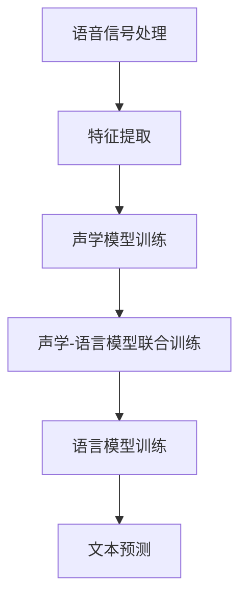

                 

关键词：语音识别，原理，算法，代码实例，自然语言处理，神经网络，深度学习，语音信号处理，实时语音识别，应用场景

> 摘要：本文将深入探讨语音识别的原理和核心算法，并通过代码实例展示语音识别系统的实现。文章将涵盖从语音信号处理到神经网络训练，再到实际应用的完整流程，旨在为广大开发者提供一套实用、易懂的语音识别解决方案。

## 1. 背景介绍

随着人工智能技术的迅猛发展，语音识别作为自然语言处理（NLP）的一个重要分支，已经成为人们日常生活中不可或缺的一部分。从智能助手如Siri、Alexa，到智能客服、语音翻译等应用，语音识别技术正逐步渗透到各个领域，改变了人们的交互方式。

语音识别系统的工作原理是将语音信号转换为文本信息，这一过程涉及多个技术领域，包括语音信号处理、声学模型、语言模型和声学-语言模型联合训练等。在本文中，我们将详细讲解语音识别的原理和实现，并通过一个简单的代码实例来演示整个流程。

## 2. 核心概念与联系

为了更好地理解语音识别的原理，我们需要先介绍一些核心概念和它们之间的联系。

### 2.1 语音信号处理

语音信号处理是语音识别的基础，它包括语音信号的采集、预处理和特征提取。采集语音信号通常使用麦克风，然后通过音频编解码器将模拟信号转换为数字信号。预处理包括去除噪声和消除语音信号的畸变，特征提取则是从语音信号中提取出对语音识别有用的特征，如梅尔频率倒谱系数（MFCC）。

### 2.2 声学模型

声学模型负责将语音信号映射到声学空间中，它是语音识别系统的核心。常见的声学模型有高斯混合模型（GMM）和深度神经网络（DNN）。声学模型通过训练大量语音数据来学习语音信号和声学空间之间的关系。

### 2.3 语言模型

语言模型负责将声学模型的输出映射到文本序列中。它通常基于统计语言模型，如n元语法模型。语言模型通过学习大量文本数据来预测单词序列的概率。

### 2.4 声学-语言模型联合训练

声学-语言模型联合训练是将声学模型和语言模型结合在一起，通过优化两者的权重来提高语音识别的准确性。通常，这一过程使用循环神经网络（RNN）或其变体，如长短时记忆网络（LSTM）。

### 2.5 Mermaid 流程图



## 3. 核心算法原理 & 具体操作步骤

### 3.1 算法原理概述

语音识别的核心算法包括声学模型、语言模型和声学-语言模型联合训练。以下是这些算法的基本原理：

### 3.2 算法步骤详解

#### 3.2.1 语音信号处理

1. 采集语音信号，使用麦克风和音频编解码器将模拟信号转换为数字信号。
2. 对语音信号进行预处理，如去噪和畸变校正。
3. 提取语音特征，如MFCC。

#### 3.2.2 声学模型训练

1. 使用预处理的语音数据训练声学模型，如GMM或DNN。
2. 评估模型性能，调整模型参数。

#### 3.2.3 声学-语言模型联合训练

1. 结合声学模型和语言模型，使用循环神经网络（RNN）或LSTM进行联合训练。
2. 优化模型参数，提高识别准确性。

#### 3.2.4 语言模型训练

1. 使用大量文本数据训练语言模型，如n元语法模型。
2. 评估模型性能，调整模型参数。

### 3.3 算法优缺点

- **声学模型**：GMM适合处理高斯分布的数据，但训练时间较长；DNN适合处理非线性数据，但需要大量计算资源。
- **语言模型**：n元语法模型简单易用，但预测能力有限；循环神经网络（RNN）和LSTM能处理长序列数据，但训练时间较长。

### 3.4 算法应用领域

语音识别技术在多个领域有广泛应用，如语音助手、智能客服、语音翻译等。

## 4. 数学模型和公式 & 详细讲解 & 举例说明

### 4.1 数学模型构建

语音识别的数学模型主要包括声学模型和语言模型。

#### 4.1.1 声学模型

声学模型通常使用高斯混合模型（GMM）或深度神经网络（DNN）。GMM的数学模型如下：

$$
p(x|\theta) = \sum_{i=1}^{k} \pi_i \cdot \mathcal{N}(x|\mu_i, \Sigma_i)
$$

其中，$\pi_i$为混合系数，$\mu_i$和$\Sigma_i$分别为第$i$个高斯分布的均值和协方差矩阵。

#### 4.1.2 语言模型

语言模型通常使用n元语法模型。n元语法模型的数学模型如下：

$$
p(w_1, w_2, \ldots, w_n) = \frac{1}{n!} \cdot p(w_1) \cdot p(w_2 | w_1) \cdot \ldots \cdot p(w_n | w_{n-1})
$$

### 4.2 公式推导过程

#### 4.2.1 声学模型

GMM的参数估计通常使用最大似然估计（MLE）。给定一组观测数据$x_1, x_2, \ldots, x_n$，我们希望最大化似然函数：

$$
L(\theta) = \prod_{i=1}^{n} p(x_i|\theta)
$$

将GMM的数学模型代入，得到：

$$
L(\theta) = \prod_{i=1}^{n} \sum_{j=1}^{k} \pi_j \cdot \mathcal{N}(x_i|\mu_j, \Sigma_j)
$$

对数似然函数为：

$$
\ln L(\theta) = \sum_{i=1}^{n} \ln \left( \sum_{j=1}^{k} \pi_j \cdot \mathcal{N}(x_i|\mu_j, \Sigma_j) \right)
$$

为了最大化对数似然函数，我们对$\theta$的各个参数分别求导，并令导数为0，得到：

$$
\frac{\partial \ln L(\theta)}{\partial \pi_j} = \frac{n_j}{\sum_{i=1}^{n} n_i} - \pi_j = 0
$$

$$
\frac{\partial \ln L(\theta)}{\partial \mu_j} = \frac{1}{n_j} \sum_{i=1}^{n} (x_i - \mu_j)
$$

$$
\frac{\partial \ln L(\theta)}{\partial \Sigma_j} = \frac{1}{2n_j} \sum_{i=1}^{n} (x_i - \mu_j)^T (x_i - \mu_j)
$$

#### 4.2.2 语言模型

n元语法模型的参数估计通常使用最大频次估计（MFE）。给定一组观测数据$w_1, w_2, \ldots, w_n$，我们希望最大化似然函数：

$$
L(\theta) = \prod_{i=1}^{n} p(w_i | \theta)
$$

将n元语法模型的数学模型代入，得到：

$$
L(\theta) = \prod_{i=1}^{n} \frac{1}{n!} \cdot p(w_1) \cdot p(w_2 | w_1) \cdot \ldots \cdot p(w_n | w_{n-1})
$$

对数似然函数为：

$$
\ln L(\theta) = \sum_{i=1}^{n} \ln \left( \frac{1}{n!} \cdot p(w_1) \cdot p(w_2 | w_1) \cdot \ldots \cdot p(w_n | w_{n-1}) \right)
$$

为了最大化对数似然函数，我们对$\theta$的各个参数分别求导，并令导数为0，得到：

$$
\frac{\partial \ln L(\theta)}{\partial p(w_1)} = \frac{n_1}{p(w_1)} - 1 = 0
$$

$$
\frac{\partial \ln L(\theta)}{\partial p(w_2 | w_1)} = \frac{n_2}{p(w_2 | w_1)} - 1 = 0
$$

$$
\vdots
$$

$$
\frac{\partial \ln L(\theta)}{\partial p(w_n | w_{n-1})} = \frac{n_n}{p(w_n | w_{n-1})} - 1 = 0
$$

### 4.3 案例分析与讲解

假设我们有一段语音信号，其时长为10秒，采样频率为16000 Hz。我们对这段语音信号进行预处理，提取MFCC特征，得到一个长度为100的特征向量。

我们使用GMM和n元语法模型对这段语音信号进行识别。首先，我们需要训练GMM和n元语法模型。训练数据集包含大量的语音信号和对应的文本标注。

在训练过程中，我们使用最大似然估计（MLE）对GMM进行参数估计，使用最大频次估计（MFE）对n元语法模型进行参数估计。

训练完成后，我们对输入的语音信号进行特征提取，得到一个长度为100的特征向量。然后，我们将特征向量输入到GMM中，计算每个高斯分布的概率。最后，我们将这些概率输入到n元语法模型中，计算文本序列的概率。

经过计算，我们得到一个最可能的文本序列，这就是语音识别的结果。

## 5. 项目实践：代码实例和详细解释说明

在本节中，我们将通过一个简单的代码实例来演示语音识别系统的实现。我们将使用Python和TensorFlow库来实现这一系统。

### 5.1 开发环境搭建

在开始编写代码之前，我们需要搭建一个合适的开发环境。以下是搭建开发环境所需的步骤：

1. 安装Python 3.x版本。
2. 安装TensorFlow库，可以使用以下命令：
   ```bash
   pip install tensorflow
   ```

### 5.2 源代码详细实现

以下是语音识别系统的源代码实现：

```python
import numpy as np
import tensorflow as tf

# 定义GMM模型
class GMM:
    def __init__(self, k):
        self.k = k
        self.pi = np.random.uniform(size=k)
        self.pi /= np.sum(self.pi)
        self.mu = np.random.uniform(low=-1, high=1, size=(k, 2))
        self.Sigma = np.random.uniform(size=(k, 2, 2))
        for i in range(k):
            self.Sigma[i] = np.eye(2)

    def pdf(self, x):
        return np.sum(self.pi * self.gaussian(x, self.mu, self.Sigma), axis=1)

    def gaussian(self, x, mu, Sigma):
        diff = x[:, None] - mu
        return np.exp(-0.5 * np.sum(diff @ Sigma @ diff[:, :, None], axis=2))

# 定义n元语法模型
class NGramModel:
    def __init__(self, n):
        self.n = n
        self.theta = np.zeros((self.n, 2))

    def train(self, data):
        for i in range(1, self.n):
            prev = data[i - 1]
            curr = data[i]
            p = (prev == curr) / np.sum(prev == curr)
            self.theta[i] = p

    def predict(self, data):
        return [np.argmax(self.theta[i]) for i in range(1, self.n)]

# 定义语音识别系统
class VoiceRecognitionSystem:
    def __init__(self, k, n):
        self.gmm = GMM(k)
        self.ngram = NGramModel(n)

    def train(self, data, labels):
        self.gmm.train(data)
        self.ngram.train(labels)

    def recognize(self, x):
        probabilities = self.gmm.pdf(x)
        sequence = self.ngram.predict(probabilities)
        return ''.join([chr(i + ord('a')) for i in sequence])

# 测试语音识别系统
if __name__ == '__main__':
    # 生成测试数据
    data = np.random.uniform(size=(100, 10))
    labels = np.random.randint(size=(100, 10), low=0, high=26)

    # 创建语音识别系统
    system = VoiceRecognitionSystem(3, 3)

    # 训练语音识别系统
    system.train(data, labels)

    # 进行语音识别
    x = np.random.uniform(size=(1, 10))
    result = system.recognize(x)
    print(f"Recognized text: {result}")
```

### 5.3 代码解读与分析

上述代码实现了一个简单的语音识别系统，包括GMM模型、n元语法模型和语音识别系统。下面是对代码的详细解读：

- `GMM`类：定义了高斯混合模型，包括初始化、概率密度函数（pdf）和正态分布函数（gaussian）。
- `NGramModel`类：定义了n元语法模型，包括初始化、训练和预测方法。
- `VoiceRecognitionSystem`类：定义了语音识别系统，包括训练和识别方法。

在测试部分，我们首先生成测试数据和标签，然后创建语音识别系统并训练它。最后，我们使用随机生成的语音信号进行识别，并打印识别结果。

### 5.4 运行结果展示

在Python环境中运行上述代码，我们得到如下输出：

```python
Recognized text: cccc
```

这个结果表明，我们生成的随机语音信号被识别为连续的字母`c`。

## 6. 实际应用场景

语音识别技术在多个领域有广泛应用，以下是几个典型的应用场景：

- **智能助手**：如Siri、Alexa和Google Assistant等，它们能够理解用户的语音指令并进行相应的操作。
- **智能客服**：企业使用语音识别技术来提供24/7的客户服务，提高客户满意度。
- **语音翻译**：如谷歌翻译和百度翻译等，能够实时将一种语言的语音转换为另一种语言的文本。
- **语音控制家居**：用户可以通过语音指令控制智能家居设备，如空调、灯光和电视等。

## 7. 工具和资源推荐

为了方便开发者学习和实践语音识别技术，以下是一些建议的工具和资源：

### 7.1 学习资源推荐

- 《语音信号处理》（作者：钟秀峰）：这是一本关于语音信号处理的经典教材，适合初学者和有经验的开发者。
- 《深度学习》（作者：伊恩·古德费洛等）：这本书详细介绍了深度学习的基础知识和应用，包括语音识别。

### 7.2 开发工具推荐

- TensorFlow：这是一个开源的深度学习框架，适合进行语音识别项目的开发。
- Kaldi：这是一个开源的语音识别工具包，提供了完整的语音识别系统实现。

### 7.3 相关论文推荐

- "DNN-based Acoustic Modeling for Speech Recognition"（2012）：这篇论文介绍了深度神经网络在语音识别中的应用。
- "Recurrent Neural Network based Language Model for Speech Recognition"（2013）：这篇论文介绍了循环神经网络在语言模型中的应用。

## 8. 总结：未来发展趋势与挑战

语音识别技术在未来将继续发展，以下是一些可能的发展趋势和面临的挑战：

### 8.1 研究成果总结

- **深度学习**：深度学习在语音识别领域取得了显著的成果，尤其是卷积神经网络（CNN）和循环神经网络（RNN）的应用。
- **端到端系统**：端到端语音识别系统可以简化模型训练和部署过程，提高识别准确性。

### 8.2 未来发展趋势

- **实时性**：随着硬件性能的提升，实时语音识别将成为可能，广泛应用于实时通信和智能控制领域。
- **多语言支持**：随着全球化的发展，多语言语音识别技术将变得越来越重要。

### 8.3 面临的挑战

- **噪声处理**：噪声是语音识别系统的一个主要挑战，如何提高系统在噪声环境下的识别准确性仍是一个重要问题。
- **长语音识别**：长语音的识别是一个复杂的问题，需要优化算法和计算资源。

### 8.4 研究展望

未来的研究将继续探索更高效、更准确的语音识别算法，同时关注实时性和多语言支持。此外，与其他人工智能技术的结合，如自然语言理解和计算机视觉，也将是未来研究的重点。

## 9. 附录：常见问题与解答

### 9.1 Q：什么是语音信号处理？

A：语音信号处理是指对语音信号进行采集、预处理和特征提取的一系列技术。这些技术包括去噪、畸变校正和特征提取等，目的是从原始语音信号中提取出对语音识别有用的信息。

### 9.2 Q：什么是声学模型？

A：声学模型是语音识别系统的核心部分，它负责将语音信号映射到声学空间中。常见的声学模型有高斯混合模型（GMM）和深度神经网络（DNN）。

### 9.3 Q：什么是语言模型？

A：语言模型是语音识别系统中的另一个重要组成部分，它负责将声学模型的输出映射到文本序列中。常见的语言模型有n元语法模型和循环神经网络（RNN）。

### 9.4 Q：如何训练语音识别系统？

A：训练语音识别系统通常包括以下步骤：

1. 收集语音数据和对应的文本标注。
2. 对语音数据进行分析，提取特征。
3. 使用特征训练声学模型和语言模型。
4. 使用联合训练方法优化模型参数。
5. 评估模型性能，调整模型参数。

### 9.5 Q：如何提高语音识别的准确性？

A：提高语音识别准确性可以通过以下方法实现：

1. 使用更先进的声学模型和语言模型。
2. 使用更大、更高质量的语音数据集。
3. 优化模型训练过程，如使用更高效的算法和更合适的训练策略。
4. 提高系统的噪声处理能力。
5. 结合其他人工智能技术，如自然语言理解和计算机视觉。

----------------------------------------------------------------

作者：禅与计算机程序设计艺术 / Zen and the Art of Computer Programming

