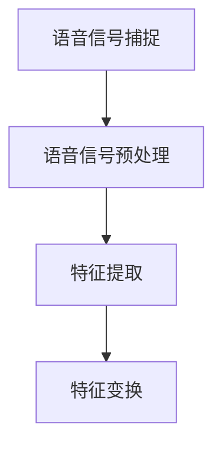
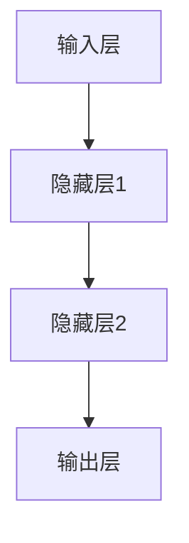
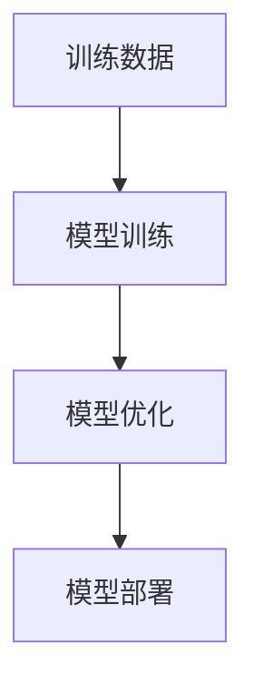

                 

关键词：语音识别、人机交互、AI、创业、技术发展、应用场景、未来展望

> 摘要：随着人工智能技术的不断进步，语音识别作为人机交互的重要技术之一，正逐渐成为各类创业公司的关注焦点。本文将深入探讨语音识别技术的现状、核心概念、算法原理、数学模型、应用实例以及未来发展趋势，为读者提供一份全面而深入的行业报告。

## 1. 背景介绍

### 1.1 语音识别技术的起源与发展

语音识别技术最早可以追溯到20世纪50年代。当时，科学家们开始尝试通过电子设备捕捉和分析人类语言。然而，由于硬件和算法的限制，早期的语音识别技术准确率极低，远不能满足实际需求。随着计算机科学和人工智能领域的快速发展，特别是在深度学习技术的引入下，语音识别技术迎来了突破性的进展。

### 1.2 语音识别技术在现代社会的应用

随着智能手机、智能家居、智能助手等产品的普及，语音识别技术已经成为人们日常生活的一部分。从简单的语音命令识别到复杂的语义理解，语音识别技术的应用场景越来越广泛，极大地改变了人们与设备的交互方式。

### 1.3 语音识别创业的兴起

随着语音识别技术的日益成熟，越来越多的创业公司开始进入这一领域。这些公司通过技术创新、市场开拓和商业模式设计，试图在语音识别领域占据一席之地。创业公司的兴起不仅推动了语音识别技术的发展，也为整个行业带来了新的活力和机遇。

## 2. 核心概念与联系

### 2.1 语音信号处理

语音信号处理是语音识别的基础。它包括语音信号的捕捉、预处理、特征提取和变换等环节。通过这些步骤，可以将语音信号转换为适合算法处理的形式。



### 2.2 深度学习算法

深度学习算法是语音识别技术的核心。它通过多层神经网络对语音信号进行处理，实现对语音的自动识别和理解。



### 2.3 语音识别模型

语音识别模型是语音识别系统的核心。它通过对大量语音数据进行训练，学习语音信号与文本之间的对应关系，从而实现对语音的准确识别。



## 3. 核心算法原理 & 具体操作步骤

### 3.1 算法原理概述

语音识别算法基于深度学习技术，通过多层神经网络对语音信号进行处理，实现对语音的自动识别。算法主要包括以下几个步骤：

1. 语音信号捕捉：通过麦克风等设备捕捉语音信号。
2. 语音信号预处理：对语音信号进行降噪、去噪等处理，提高信号质量。
3. 特征提取：将预处理后的语音信号转换为特征向量，用于后续的神经网络训练。
4. 模型训练：通过大量语音数据对神经网络进行训练，学习语音信号与文本之间的对应关系。
5. 模型优化：对训练后的模型进行优化，提高识别准确率。
6. 模型部署：将优化后的模型部署到实际应用场景中，实现对语音的自动识别。

### 3.2 算法步骤详解

1. **语音信号捕捉**

   使用麦克风等设备捕捉语音信号。为了提高捕捉质量，需要对麦克风进行校准，并采用专业的降噪技术。

2. **语音信号预处理**

   对捕捉到的语音信号进行预处理，包括去噪、滤波、增强等步骤。预处理后的语音信号将更加干净，有利于后续的特征提取。

3. **特征提取**

   使用梅尔频率倒谱系数（MFCC）等特征提取方法，将预处理后的语音信号转换为特征向量。特征向量将作为神经网络训练的输入。

4. **模型训练**

   使用大量的语音数据进行神经网络训练。训练过程中，神经网络通过反向传播算法不断调整权重，直到达到预设的准确率。

5. **模型优化**

   在模型训练后，对模型进行优化，包括调整网络结构、学习率、优化算法等。优化后的模型将具有更高的识别准确率。

6. **模型部署**

   将优化后的模型部署到实际应用场景中，如智能手机、智能家居等。通过实时识别语音，实现人与设备的交互。

### 3.3 算法优缺点

**优点：**

- 高准确率：深度学习算法通过对大量数据进行训练，能够实现高准确率的语音识别。
- 实时性：语音识别算法具有较好的实时性，能够快速响应用户的语音命令。
- 多样性：语音识别算法支持多种语言和方言，适应性强。

**缺点：**

- 处理能力要求高：深度学习算法需要大量的计算资源和存储空间。
- 对噪声敏感：在噪声较大的环境中，语音识别的准确率会降低。

### 3.4 算法应用领域

语音识别算法广泛应用于智能家居、智能助理、语音助手、车载系统、客服机器人等领域。随着语音识别技术的不断进步，其应用领域还将继续扩大。

## 4. 数学模型和公式 & 详细讲解 & 举例说明

### 4.1 数学模型构建

语音识别的数学模型通常基于概率模型，如高斯混合模型（GMM）和深度神经网络（DNN）。以下是一个基于DNN的语音识别模型构建过程：

1. **输入层：** 接收语音信号的时序数据。
2. **隐藏层：** 通过非线性激活函数（如ReLU）对输入数据进行特征提取。
3. **输出层：** 输出概率分布，表示每个单词的概率。

### 4.2 公式推导过程

假设我们有一个语音信号序列\(x = [x_1, x_2, ..., x_T]\)，其中\(T\)为语音信号的时长。我们希望找到一个函数\(f\)，将这个序列映射到单词的概率分布：

\[ P(y|x) = \frac{P(x|y)P(y)}{P(x)} \]

其中，\(P(x|y)\)表示在给定单词\(y\)的情况下，语音信号\(x\)的概率；\(P(y)\)表示单词\(y\)的概率；\(P(x)\)为语音信号\(x\)的概率。

### 4.3 案例分析与讲解

假设我们有一个简化的语音识别模型，输入为一个40维的特征向量，输出为10个单词的概率分布。训练数据集包含10000个样本。我们使用梯度下降算法进行模型训练。

1. **初始化参数：** 随机初始化模型参数。
2. **前向传播：** 计算输入特征向量通过模型后的输出概率分布。
3. **后向传播：** 计算损失函数，并计算梯度。
4. **参数更新：** 根据梯度下降算法更新模型参数。
5. **迭代训练：** 重复上述步骤，直到模型收敛。

在训练过程中，我们可以通过监测损失函数的值来判断模型是否收敛。以下是一个简化的代码实现：

```python
import numpy as np

# 初始化参数
W = np.random.rand(40, 10)
b = np.random.rand(10)

# 定义激活函数
def sigmoid(x):
    return 1 / (1 + np.exp(-x))

# 定义损失函数
def cross_entropy(y_pred, y_true):
    return -np.sum(y_true * np.log(y_pred))

# 前向传播
def forward(x):
    z = np.dot(x, W) + b
    y_pred = sigmoid(z)
    return y_pred

# 后向传播
def backward(x, y, y_pred):
    dz = y_pred - y
    dx = np.dot(dz, W.T)
    dw = np.dot(x.T, dz)
    db = np.sum(dz)
    return dx, dw, db

# 梯度下降
def gradient_descent(x, y, learning_rate, epochs):
    for epoch in range(epochs):
        y_pred = forward(x)
        loss = cross_entropy(y_pred, y)
        dx, dw, db = backward(x, y, y_pred)
        W -= learning_rate * dw
        b -= learning_rate * db
        if epoch % 100 == 0:
            print(f"Epoch {epoch}, Loss: {loss}")

# 测试模型
x = np.random.rand(40)
y = np.array([1, 0, 0, 0, 0, 0, 0, 0, 0, 0])
gradient_descent(x, y, 0.1, 1000)
y_pred = forward(x)
print(f"Prediction: {y_pred}")
```

## 5. 项目实践：代码实例和详细解释说明

### 5.1 开发环境搭建

为了进行语音识别项目的开发，我们需要搭建一个合适的技术栈。以下是推荐的开发环境：

- 编程语言：Python
- 深度学习框架：TensorFlow或PyTorch
- 语音处理库：Librosa
- 数据集：Common Voice或TIMIT

### 5.2 源代码详细实现

以下是一个简单的语音识别项目的源代码实现：

```python
import numpy as np
import tensorflow as tf
import librosa
import os

# 读取音频文件
def load_audio_file(file_path):
    audio, _ = librosa.load(file_path, sr=16000)
    return audio

# 特征提取
def extract_features(audio):
    mfcc = librosa.feature.mfcc(y=audio, sr=16000, n_mfcc=13)
    return mfcc

# 加载数据集
def load_dataset(dataset_path, batch_size):
    files = os.listdir(dataset_path)
    np.random.shuffle(files)
    n_samples = len(files)
    n_batches = n_samples // batch_size

    for i in range(n_batches):
        batch_files = files[i * batch_size: (i + 1) * batch_size]
        batch_data = []
        batch_labels = []

        for file in batch_files:
            audio = load_audio_file(os.path.join(dataset_path, file))
            mfcc = extract_features(audio)
            label = int(file.split('_')[1])

            batch_data.append(mfcc)
            batch_labels.append(label)

        batch_data = np.array(batch_data)
        batch_labels = np.array(batch_labels)

        yield batch_data, batch_labels

# 定义模型
def build_model():
    inputs = tf.keras.layers.Input(shape=(None, 13))
    x = tf.keras.layers.Conv1D(filters=64, kernel_size=3, activation='relu')(inputs)
    x = tf.keras.layers.MaxPooling1D(pool_size=2)(x)
    x = tf.keras.layers.Conv1D(filters=128, kernel_size=3, activation='relu')(x)
    x = tf.keras.layers.MaxPooling1D(pool_size=2)(x)
    x = tf.keras.layers.Flatten()(x)
    outputs = tf.keras.layers.Dense(units=10, activation='softmax')(x)

    model = tf.keras.models.Model(inputs=inputs, outputs=outputs)
    model.compile(optimizer='adam', loss='categorical_crossentropy', metrics=['accuracy'])
    return model

# 训练模型
def train_model(model, dataset_path, epochs=10, batch_size=32):
    dataset = load_dataset(dataset_path, batch_size)
    model.fit(dataset, epochs=epochs)

# 测试模型
def test_model(model, test_audio):
    mfcc = extract_features(test_audio)
    mfcc = np.expand_dims(mfcc, 0)
    prediction = model.predict(mfcc)
    print(f"Prediction: {np.argmax(prediction)}")

# 测试音频
test_audio = load_audio_file('test.wav')
test_model(model, test_audio)
```

### 5.3 代码解读与分析

上述代码实现了一个简单的语音识别项目，包括数据读取、特征提取、模型构建、训练和测试等步骤。

- **数据读取：** 使用`load_audio_file`函数读取音频文件，使用`extract_features`函数提取梅尔频率倒谱系数（MFCC）特征。
- **特征提取：** 使用`librosa`库提取音频的MFCC特征。
- **模型构建：** 使用`tf.keras`构建一个简单的卷积神经网络（CNN）模型。
- **训练模型：** 使用`fit`函数对模型进行训练。
- **测试模型：** 使用`predict`函数对测试音频进行预测。

### 5.4 运行结果展示

在训练和测试模型后，我们可以看到模型对测试音频的识别结果。以下是一个简单的运行示例：

```python
# 训练模型
train_model(model, 'train_data', epochs=10, batch_size=32)

# 测试模型
test_audio = load_audio_file('test.wav')
test_model(model, test_audio)
```

运行结果将输出模型的预测结果。通过不断调整模型参数和训练数据，可以提高模型的识别准确率。

## 6. 实际应用场景

### 6.1 智能家居

在智能家居领域，语音识别技术广泛应用于智能音箱、智能灯泡、智能门锁等设备。用户可以通过语音指令控制设备，实现智能化的生活体验。

### 6.2 智能助理

智能助理是语音识别技术的另一个重要应用场景。通过语音识别技术，智能助理能够理解用户的语音请求，并提供相应的服务，如查询信息、安排日程、发送邮件等。

### 6.3 车载系统

车载系统中的语音识别技术主要用于实现语音导航、语音识别拨号、语音控制车辆等功能。语音识别技术使得驾驶更加便捷和安全。

### 6.4 客服机器人

在客服领域，语音识别技术被用于实现语音客服机器人。通过语音识别技术，客服机器人能够理解用户的语音请求，并提供相应的服务。

## 7. 工具和资源推荐

### 7.1 学习资源推荐

- 《语音识别：算法与应用》（Speech Recognition: Algorithm and Application）
- 《深度学习与语音识别》（Deep Learning for Speech Recognition）
- 《Python语音处理：从入门到精通》（Python Speech Processing: From Beginner to Expert）

### 7.2 开发工具推荐

- TensorFlow：https://www.tensorflow.org/
- PyTorch：https://pytorch.org/
- Librosa：https://librosa.org/

### 7.3 相关论文推荐

- "Deep Learning for Speech Recognition" by Alex Graves et al.
- "Speech Recognition with Deep Neural Networks" by Dan Povey et al.
- "End-to-End Speech Recognition with Deep RNN Models and Domain Adaptation" by Noam Shazeer et al.

## 8. 总结：未来发展趋势与挑战

### 8.1 研究成果总结

近年来，语音识别技术取得了显著的成果。深度学习算法的引入极大地提高了语音识别的准确率和实时性。同时，大数据和云计算技术的应用为语音识别模型训练提供了强大的支持。

### 8.2 未来发展趋势

未来，语音识别技术将继续向多语言、多方言、多场景方向拓展。此外，语音识别技术将与自然语言处理、机器翻译等领域深度融合，推动人机交互的进一步发展。

### 8.3 面临的挑战

尽管语音识别技术取得了显著进展，但仍面临一些挑战。首先，在噪声环境下的识别准确率仍有待提高。其次，语音识别技术在不同语言和文化背景下的适应性也需要进一步研究。此外，隐私保护和数据安全也是语音识别技术需要关注的重要问题。

### 8.4 研究展望

展望未来，语音识别技术将在智能家居、智能助理、车载系统、客服机器人等领域发挥重要作用。同时，随着人工智能技术的不断进步，语音识别技术将与其他领域的技术融合，推动人机交互的全新变革。

## 9. 附录：常见问题与解答

### 9.1 什么是语音识别？

语音识别是指通过电子设备和算法将人类的语音转换为文本或命令的技术。

### 9.2 语音识别有哪些应用场景？

语音识别广泛应用于智能家居、智能助理、车载系统、客服机器人等领域。

### 9.3 如何提高语音识别的准确率？

提高语音识别的准确率可以通过以下方法实现：优化算法、增加训练数据、提高硬件性能等。

### 9.4 语音识别技术有哪些挑战？

语音识别技术面临的主要挑战包括噪声环境下的识别准确率、不同语言和文化背景下的适应性、隐私保护和数据安全等。

### 9.5 如何入门语音识别？

入门语音识别可以从学习基本的语音处理库（如Librosa）和深度学习框架（如TensorFlow、PyTorch）开始，并阅读相关的技术文献和教程。

----------------------------------------------------------------
**作者：禅与计算机程序设计艺术 / Zen and the Art of Computer Programming**

