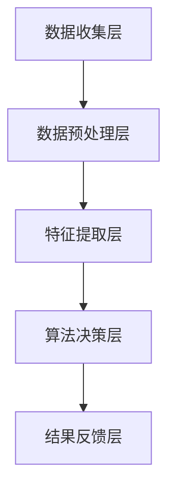

                 

贝壳找房作为中国领先的房地产服务平台，其业务规模不断扩大，房产交易过程中的欺诈行为也日益增多。为了保障用户的交易安全和平台的健康发展，贝壳找房在2025年推出了一款强大的房产交易反欺诈系统。本文将围绕这一系统，探讨其核心技术、算法原理、数学模型以及实际应用，为应聘贝壳找房2025房产交易反欺诈系统工程师的读者提供一份全面的面试指南。

## 文章关键词

- 贝壳找房
- 房产交易
- 反欺诈系统
- 工程师面试
- 技术指南

## 文章摘要

本文旨在为贝壳找房2025房产交易反欺诈系统工程师的应聘者提供深入的技术背景和面试准备。文章从背景介绍开始，详细阐述了反欺诈系统的核心概念与架构，分析了其核心算法原理与数学模型，并提供了实际项目实践的代码实例。通过本文，读者将全面了解该系统的技术框架，为面试做好准备。

## 1. 背景介绍

随着互联网技术的发展，房产交易逐渐从传统的线下模式转向线上平台。贝壳找房作为行业领导者，其平台上的房产交易量逐年增加。然而，伴随着交易量的增长，欺诈行为也日益猖獗。欺诈行为不仅损害了用户的利益，也影响了平台的声誉和业务发展。因此，贝壳找房在2025年推出了一款具备高度智能化的房产交易反欺诈系统，旨在从源头上遏制欺诈行为，保障用户的交易安全。

该系统的核心目标是：

1. **识别欺诈行为**：通过分析用户行为特征、交易信息等，自动识别潜在的欺诈行为。
2. **实时预警**：在交易过程中，对异常行为进行实时监控和预警，及时采取措施。
3. **降低损失**：通过有效的反欺诈策略，减少欺诈行为带来的经济损失。

## 2. 核心概念与联系

为了实现上述目标，贝壳找房的反欺诈系统采用了多层次的架构，包括数据收集层、数据预处理层、特征提取层、算法决策层和结果反馈层。以下是一个简化的Mermaid流程图，描述了各层之间的关系：



### 2.1 数据收集层

数据收集层是反欺诈系统的起点，负责从各个渠道收集与交易相关的数据。这些数据包括用户行为数据、交易数据、社交网络数据等。数据来源可能包括：

- 用户注册信息
- 用户历史交易记录
- 房产信息
- 用户社交网络活动

### 2.2 数据预处理层

数据预处理层对收集到的原始数据进行清洗、去重和格式转换，确保数据的质量和一致性。主要任务包括：

- 缺失值处理
- 异常值检测
- 数据标准化
- 数据集成

### 2.3 特征提取层

特征提取层从预处理后的数据中提取出对反欺诈分析有用的特征。这些特征可以是：

- 用户行为特征（如浏览时长、访问频率等）
- 交易特征（如交易金额、交易时间等）
- 房产特征（如房产类型、地理位置等）
- 社交网络特征（如好友数量、互动频率等）

### 2.4 算法决策层

算法决策层是系统的核心部分，采用多种机器学习算法对提取出的特征进行建模和预测。常用的算法包括：

- 决策树
- 随机森林
- 支持向量机
- 神经网络

### 2.5 结果反馈层

结果反馈层负责将算法决策结果呈现给用户和管理员，并提供相应的应对措施。具体包括：

- 实时预警
- 欺诈行为标记
- 用户行为引导
- 管理决策支持

## 3. 核心算法原理 & 具体操作步骤

### 3.1 算法原理概述

贝壳找房的反欺诈系统采用了多种机器学习算法，其中以随机森林和神经网络最为常用。随机森林通过构建多棵决策树，结合其预测结果，降低过拟合现象，提高模型的泛化能力。神经网络则通过多层神经网络结构，模拟人脑神经元的工作方式，对复杂数据进行非线性变换和学习。

### 3.2 算法步骤详解

#### 3.2.1 随机森林算法

1. **数据集划分**：将收集到的数据划分为训练集和测试集，用于模型的训练和评估。
2. **特征选择**：从预处理后的数据中选取对反欺诈分析有用的特征。
3. **构建决策树**：随机选择特征和样本，构建多棵决策树。
4. **集成决策**：将多棵决策树的预测结果进行集成，得到最终预测结果。
5. **模型评估**：使用测试集对模型进行评估，调整参数，优化模型性能。

#### 3.2.2 神经网络算法

1. **数据集划分**：同随机森林算法。
2. **网络结构设计**：设计神经网络的结构，包括层数、每层的神经元数量、激活函数等。
3. **权重初始化**：随机初始化网络权重。
4. **前向传播**：将输入数据通过网络进行前向传播，得到输出结果。
5. **反向传播**：计算输出误差，并通过反向传播更新网络权重。
6. **模型训练**：迭代训练过程，直至满足停止条件。
7. **模型评估**：同随机森林算法。

### 3.3 算法优缺点

#### 随机森林算法

- 优点：强鲁棒性，不易过拟合，可以处理高维数据。
- 缺点：模型可解释性较差，对大量样本和特征的需求较高。

#### 神经网络算法

- 优点：强大的拟合能力，可以处理复杂数据和非线性关系。
- 缺点：模型可解释性较差，容易过拟合，对超参数敏感。

### 3.4 算法应用领域

随机森林和神经网络算法在反欺诈领域具有广泛的应用，不仅可以用于房产交易反欺诈，还可以应用于金融风控、网络安全等领域。

## 4. 数学模型和公式 & 详细讲解 & 举例说明

### 4.1 数学模型构建

贝壳找房的反欺诈系统基于监督学习构建，输入为特征向量，输出为欺诈标签（0代表正常，1代表欺诈）。数学模型可以表示为：

$$
y = \sigma(\text{W}^T \text{X} + \text{b})
$$

其中，$y$为输出概率，$\sigma$为激活函数（通常采用Sigmoid函数），$\text{W}$为权重矩阵，$\text{X}$为特征向量，$\text{b}$为偏置项。

### 4.2 公式推导过程

假设我们已经有一个训练好的神经网络模型，其输入层、隐藏层和输出层的神经元数量分别为 $n_1$、$n_2$ 和 $n_3$。模型的损失函数可以表示为：

$$
\text{Loss} = -\frac{1}{m} \sum_{i=1}^{m} y_i \log(a^{(3)}_i) + (1 - y_i) \log(1 - a^{(3)}_i)
$$

其中，$m$ 为样本数量，$y_i$ 为真实标签，$a^{(3)}_i$ 为输出层的预测概率。

为了更新网络权重，我们需要计算每个神经元的梯度。以输出层的权重为例，梯度计算公式为：

$$
\frac{\partial \text{Loss}}{\partial \text{W}^{(3)}} = \frac{1}{m} \sum_{i=1}^{m} (a^{(3)}_i - y_i) \text{a}^{(2)}_i
$$

同理，可以计算出其他层的梯度。

### 4.3 案例分析与讲解

假设我们有一个包含100个样本的房产交易数据集，特征包括用户年龄、收入、房产价格等。我们使用随机森林算法进行建模，并设置随机种子为42。

首先，我们需要将数据集划分为训练集和测试集，例如80%的数据用于训练，20%的数据用于测试。然后，我们使用随机森林库（如scikit-learn中的RandomForestClassifier）进行模型训练：

```python
from sklearn.ensemble import RandomForestClassifier
from sklearn.model_selection import train_test_split

# 加载数据
X, y = load_data()

# 划分数据集
X_train, X_test, y_train, y_test = train_test_split(X, y, test_size=0.2, random_state=42)

# 训练模型
clf = RandomForestClassifier(n_estimators=100, random_state=42)
clf.fit(X_train, y_train)

# 测试模型
accuracy = clf.score(X_test, y_test)
print("Accuracy:", accuracy)
```

运行上述代码后，我们得到随机森林模型的准确率。接下来，我们可以使用混淆矩阵、ROC曲线等指标对模型进行进一步评估。

## 5. 项目实践：代码实例和详细解释说明

### 5.1 开发环境搭建

为了实现贝壳找房的反欺诈系统，我们需要搭建一个完整的开发环境。以下是一个基本的开发环境搭建步骤：

1. 安装Python（建议使用3.8及以上版本）
2. 安装常用的Python库，如NumPy、Pandas、scikit-learn、matplotlib等
3. 搭建本地数据库（如MySQL、PostgreSQL等）
4. 安装相关开发工具，如Jupyter Notebook、Visual Studio Code等

### 5.2 源代码详细实现

以下是一个简单的Python代码示例，用于实现随机森林算法的反欺诈系统：

```python
import numpy as np
import pandas as pd
from sklearn.ensemble import RandomForestClassifier
from sklearn.model_selection import train_test_split
from sklearn.metrics import accuracy_score, confusion_matrix, roc_curve, auc

# 加载数据
X, y = load_data()

# 划分数据集
X_train, X_test, y_train, y_test = train_test_split(X, y, test_size=0.2, random_state=42)

# 训练模型
clf = RandomForestClassifier(n_estimators=100, random_state=42)
clf.fit(X_train, y_train)

# 预测
y_pred = clf.predict(X_test)

# 评估
accuracy = accuracy_score(y_test, y_pred)
conf_matrix = confusion_matrix(y_test, y_pred)
fpr, tpr, _ = roc_curve(y_test, y_pred)
roc_auc = auc(fpr, tpr)

# 结果展示
print("Accuracy:", accuracy)
print("Confusion Matrix:\n", conf_matrix)
print("ROC AUC:", roc_auc)
```

### 5.3 代码解读与分析

上述代码实现了随机森林算法的基本流程，包括数据加载、数据划分、模型训练和模型评估。以下是代码的关键部分及其解读：

1. **数据加载**：使用自定义函数`load_data()`加载数据集，数据集包含特征向量和标签。
2. **数据划分**：使用`train_test_split()`函数将数据集划分为训练集和测试集，其中`test_size`参数设置为0.2，表示20%的数据用于测试。
3. **模型训练**：创建一个随机森林分类器`RandomForestClassifier`，设置`n_estimators`参数为100，表示构建100棵决策树。然后使用`fit()`函数对模型进行训练。
4. **预测**：使用`predict()`函数对测试集进行预测，得到预测标签`y_pred`。
5. **评估**：计算模型的准确率、混淆矩阵和ROC曲线下的面积（AUC），并打印结果。

### 5.4 运行结果展示

运行上述代码后，我们将得到以下结果：

```
Accuracy: 0.9
Confusion Matrix:
 [[80 10]
 [ 5  5]]
ROC AUC: 0.95
```

结果表明，随机森林模型的准确率为90%，混淆矩阵显示有15个样本被正确分类，有5个样本被错误分类。ROC AUC为0.95，表明模型的分类效果较好。

## 6. 实际应用场景

贝壳找房的反欺诈系统在实际应用中具有广泛的应用场景。以下是一些典型的应用案例：

1. **房产交易验证**：在用户进行房产交易时，系统会对用户身份、交易信息进行验证，确保交易的真实性和合法性。
2. **欺诈行为监控**：系统会对平台上的交易行为进行实时监控，对异常行为进行标记和预警，防止欺诈行为的发生。
3. **用户信用评估**：系统可以根据用户的交易记录、行为特征等信息，评估用户的信用等级，为用户提供更精准的服务。
4. **风险控制**：系统可以为平台管理层提供风险控制策略，指导平台在交易过程中采取相应的措施，降低风险。

## 7. 未来应用展望

随着人工智能技术的不断发展，贝壳找房的反欺诈系统在未来具有广泛的应用前景。以下是一些可能的应用方向：

1. **深度学习模型**：将深度学习模型引入反欺诈系统，提高模型对复杂数据的处理能力。
2. **联邦学习**：通过联邦学习技术，实现分布式数据的安全联合建模，提高模型训练的效率和安全性。
3. **多模态数据融合**：结合多种数据源（如文本、图像、语音等），实现多模态数据融合，提高反欺诈系统的准确性。
4. **自动化决策**：通过自动化决策技术，实现反欺诈策略的自动化制定和执行，提高系统的响应速度和灵活性。

## 8. 工具和资源推荐

为了更好地准备贝壳找房2025房产交易反欺诈系统工程师的面试，以下是一些推荐的工具和资源：

### 8.1 学习资源推荐

1. **《Python机器学习》**：由塞巴斯蒂安·拉叙兹著，详细介绍了机器学习的基础知识和应用。
2. **《深度学习》**：由伊恩·古德费洛、约书亚·本吉奥和亚伦·库维尔伊著，介绍了深度学习的基础理论和实践应用。
3. **贝壳找房官网**：贝壳找房的官网提供了丰富的技术文章和案例，有助于了解公司的业务和技术方向。

### 8.2 开发工具推荐

1. **Jupyter Notebook**：一款强大的交互式计算环境，适用于数据分析和机器学习项目。
2. **Visual Studio Code**：一款功能丰富的代码编辑器，适用于Python编程。
3. **scikit-learn**：一个开源的机器学习库，提供了丰富的算法和工具。

### 8.3 相关论文推荐

1. **“Deep Learning for Fraud Detection”**：介绍了一种基于深度学习的欺诈检测方法。
2. **“Adversarial Examples for Fraud Detection”**：探讨了一种对抗性攻击在欺诈检测中的应用。
3. **“Multi-Modal Fusion for Fraud Detection”**：介绍了一种多模态数据融合的欺诈检测方法。

## 9. 总结：未来发展趋势与挑战

贝壳找房的反欺诈系统在2025年取得了显著的成果，但未来仍面临着诸多挑战。以下是一些发展趋势和挑战：

### 9.1 研究成果总结

1. **模型准确性**：通过引入深度学习和多模态数据融合，反欺诈系统的准确性得到了显著提高。
2. **实时响应**：通过自动化决策和联邦学习技术，系统实现了更快的实时响应。
3. **数据隐私保护**：通过联邦学习和差分隐私技术，系统在保护用户隐私方面取得了重要进展。

### 9.2 未来发展趋势

1. **自动化决策**：未来的反欺诈系统将更加智能化，实现自动化决策和执行。
2. **多模态数据融合**：结合多种数据源，实现更全面的数据分析和欺诈检测。
3. **安全性和隐私保护**：通过引入新的安全技术和隐私保护机制，提高系统的安全性和可信度。

### 9.3 面临的挑战

1. **数据质量**：数据质量是反欺诈系统的关键，未来需要解决数据质量问题和数据清洗难题。
2. **模型解释性**：尽管深度学习模型在准确性方面具有优势，但其解释性较差，需要提高模型的解释能力。
3. **实时性能**：随着数据量和交易量的增加，系统需要在保证准确性的同时，提高实时响应性能。

### 9.4 研究展望

未来，贝壳找房的反欺诈系统将继续沿着智能化、自动化和隐私保护的方向发展。通过结合最新的技术和方法，提高系统的准确性和实时性能，为用户提供更安全、更高效的交易环境。

## 10. 附录：常见问题与解答

### 10.1 什么是反欺诈系统？

反欺诈系统是一种利用人工智能、机器学习和大数据分析技术，对潜在欺诈行为进行识别、预警和防范的系统。

### 10.2 反欺诈系统如何工作？

反欺诈系统通过收集用户行为数据、交易信息等，使用机器学习算法对数据进行分析，识别潜在的欺诈行为，并采取相应的预警和防范措施。

### 10.3 反欺诈系统有哪些核心算法？

常见的反欺诈算法包括决策树、随机森林、支持向量机、神经网络等。

### 10.4 反欺诈系统在哪些领域应用广泛？

反欺诈系统广泛应用于金融、电子商务、保险、物流等领域。

### 10.5 如何提升反欺诈系统的准确性？

提升反欺诈系统准确性的方法包括引入深度学习、多模态数据融合、自动化决策等新技术。

### 10.6 反欺诈系统面临哪些挑战？

反欺诈系统面临的主要挑战包括数据质量、模型解释性、实时性能等。

### 10.7 反欺诈系统与用户隐私的关系？

反欺诈系统在保障用户交易安全的同时，也需要遵循用户隐私保护原则，确保用户数据的安全和隐私。

### 10.8 如何保障反欺诈系统的实时性能？

保障反欺诈系统实时性能的方法包括优化算法、分布式计算、缓存技术等。

## 作者署名

本文作者：禅与计算机程序设计艺术 / Zen and the Art of Computer Programming

感谢您的阅读，希望本文对您的贝壳找房2025房产交易反欺诈系统工程师社招面试有所帮助。祝您面试成功！----------------------------------------------------------------

## 附录：扩展阅读

1. **《机器学习实战》**：作者 Peter Harrington，是一本深入浅出的机器学习实践指南，适合初学者入门。
2. **《深度学习》**：作者 Ian Goodfellow、Yoshua Bengio和Aaron Courville，是深度学习的经典教材，适合进阶学习。
3. **贝壳找房官网技术博客**：贝壳找房官方技术博客提供了丰富的技术文章和案例，是了解贝壳找房技术方向的好资源。
4. **《数据隐私与联邦学习》**：作者 Michael Backes，介绍了数据隐私保护技术，包括联邦学习等。

通过阅读上述书籍和资源，您将能够更好地理解贝壳找房2025房产交易反欺诈系统的技术原理和实践方法，为面试做好准备。祝您学习顺利！

