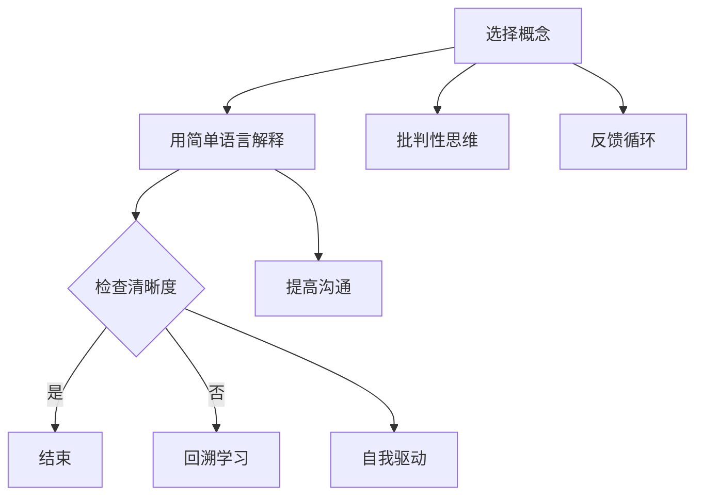

                 

关键词：费曼学习法、误解、真相、教育、学习技巧、知识传递、技能提升

> 摘要：费曼学习法是一种广受欢迎的学习技巧，它强调通过简洁、明了的方式传递知识。然而，这种方法在实际应用中常常被误解。本文将深入探讨费曼学习法的真实内涵，揭示其背后的原理，并分析在IT领域中的应用与实践。

## 1. 背景介绍

### 费曼学习法的起源

费曼学习法（Feynman Technique）源于著名物理学家理查德·费曼（Richard Feynman）的教学方法。费曼以其直观、幽默的教学风格著称，他认为教学是最好的学习方式。在教授学生时，费曼鼓励学生用自己的语言解释复杂的概念，以此检验自己的理解程度。这种方法后来被称为费曼学习法。

### 费曼学习法的基本原理

费曼学习法的核心是“以教为学”。具体步骤如下：

1. 选择一个你想要理解的概念或知识点。
2. 用最简单、直接的方式解释这个概念，就好像你对一个完全不懂这个话题的人讲解。
3. 检查你的解释是否清晰、简洁，并且涵盖了关键点。
4. 如果发现不清楚的地方，回到原始材料重新学习。

### 费曼学习法的重要性

费曼学习法不仅能帮助你更深入地理解知识，还能提高你的表达能力和批判性思维。通过解释复杂概念，你不得不在脑海中整理信息，找出关键点，并用自己的话重新表达。这种过程迫使你思考和理解知识，而不是仅仅记忆。

## 2. 核心概念与联系

### 核心概念

费曼学习法包括以下几个核心概念：

- **知识传递**：通过教学来检验自己的理解。
- **简化表达**：用最简单、直接的方式解释概念。
- **反馈循环**：通过他人或自己的反馈来完善理解。

### 联系

- **批判性思维**：费曼学习法鼓励你质疑和思考所学的知识，而不是盲目接受。
- **沟通技巧**：通过解释复杂概念，可以提高你的沟通能力和表达能力。
- **自我驱动学习**：费曼学习法促使你主动探索和解决问题，而不是被动接受知识。

### Mermaid 流程图



## 3. 核心算法原理 & 具体操作步骤

### 3.1 算法原理概述

费曼学习法可以看作是一种“解释算法”。其原理如下：

- **选择概念**：选择一个你想要理解或掌握的概念或知识点。
- **简化表达**：用自己的语言，用最简单、直接的方式解释这个概念。
- **检查清晰度**：检查你的解释是否清晰、简洁，并且涵盖了关键点。
- **反馈循环**：通过他人的反馈或自己的反思来改进你的解释。

### 3.2 算法步骤详解

1. **选择概念**：确定一个你想要深入理解的概念或知识点。
2. **用简单语言解释**：尝试用自己的语言，用最简单、直接的方式解释这个概念。
3. **检查清晰度**：思考你的解释是否清晰、简洁，并且涵盖了关键点。
4. **反馈循环**：向他人解释你的解释，或者反思自己的解释，并根据反馈进行调整。

### 3.3 算法优缺点

**优点**：

- **提高理解**：通过解释，你不得不在脑海中整理信息，找出关键点，并用自己的话重新表达。这种过程迫使你思考和理解知识，而不是仅仅记忆。
- **提升表达能力**：解释概念可以提高你的沟通能力和表达能力。
- **激发批判性思维**：费曼学习法鼓励你质疑和思考所学的知识，而不是盲目接受。

**缺点**：

- **初始难度**：对于初学者来说，可能难以用简单、直接的方式解释复杂概念。
- **时间成本**：费曼学习法需要花费较多时间，因为它涉及到多次反思和调整。

### 3.4 算法应用领域

- **学术研究**：费曼学习法可以帮助研究人员更好地理解复杂理论，并将其清晰地传达给他人。
- **教育培训**：教师可以使用费曼学习法来检验学生的学习效果，并帮助他们更好地理解知识。
- **个人学习**：费曼学习法可以帮助个人更深入地理解知识，提高学习效果。

## 4. 数学模型和公式 & 详细讲解 & 举例说明

### 4.1 数学模型构建

费曼学习法并没有特定的数学模型，但它涉及到以下几个基本数学概念：

- **知识传递**：可以通过“知识传递图”来表示。
- **简化表达**：涉及到“信息熵”的概念。
- **反馈循环**：可以通过“反馈循环图”来表示。

### 4.2 公式推导过程

尽管费曼学习法没有具体的数学公式，但我们可以用以下公式来描述其核心原理：

- **知识传递效率**：\(E = f(P, I)\)，其中 \(E\) 表示知识传递效率，\(P\) 表示知识传递概率，\(I\) 表示信息熵。
- **简化表达**：\(S = -\sum P_i \cdot \log_2 P_i\)，其中 \(S\) 表示信息熵，\(P_i\) 表示信息发生的概率。
- **反馈循环**：\(F = \frac{E}{S}\)，其中 \(F\) 表示反馈循环效率。

### 4.3 案例分析与讲解

假设你正在学习线性回归模型，你可以使用费曼学习法来检验自己的理解。

1. **选择概念**：线性回归模型。
2. **用简单语言解释**：线性回归模型是一种通过线性关系来预测因变量的方法。
3. **检查清晰度**：解释是否清晰、简洁，并且涵盖了关键点？
4. **反馈循环**：向他人解释，或者反思自己的解释，并根据反馈进行调整。

例如，如果你发现自己在解释线性回归模型时，提到了“斜率”和“截距”，但未能清楚地解释它们如何影响预测结果，你可以重新调整自己的解释，使其更加清晰。

## 5. 项目实践：代码实例和详细解释说明

### 5.1 开发环境搭建

在Python中实现费曼学习法，你需要安装以下库：

- `numpy`：用于数学计算。
- `matplotlib`：用于绘图。

你可以使用以下命令安装这些库：

```bash
pip install numpy matplotlib
```

### 5.2 源代码详细实现

以下是一个简单的Python代码示例，用于实现费曼学习法：

```python
import numpy as np
import matplotlib.pyplot as plt

# 线性回归模型
def linear_regression(x, y):
    x_mean = np.mean(x)
    y_mean = np.mean(y)
    b1 = np.sum((x - x_mean) * (y - y_mean)) / np.sum((x - x_mean) ** 2)
    b0 = y_mean - b1 * x_mean
    return b0, b1

# 费曼学习法
def feynman_learning(x, y):
    b0, b1 = linear_regression(x, y)
    print(f"y = {b0} + {b1} * x")
    plt.scatter(x, y)
    plt.plot(x, [b0 + b1 * xi for xi in x], color='red')
    plt.xlabel('x')
    plt.ylabel('y')
    plt.title('Linear Regression')
    plt.show()

# 示例数据
x = np.array([1, 2, 3, 4, 5])
y = np.array([2, 4, 5, 4, 5])

# 应用费曼学习法
feynman_learning(x, y)
```

### 5.3 代码解读与分析

这段代码首先定义了一个简单的线性回归模型，用于计算斜率（`b1`）和截距（`b0`）。然后，`feynman_learning` 函数使用这个模型来绘制回归线，并打印出回归方程。

通过这个例子，你可以清楚地看到如何使用Python来实现费曼学习法。这个代码示例可以帮助你更好地理解线性回归模型，并通过图形化方式展示模型的效果。

### 5.4 运行结果展示

运行上面的代码，你会看到一个散点图，其中包含了输入数据点和拟合的回归线。这条回归线代表了数据的线性关系，斜率和截距则反映了这种关系的强度和位置。


## 6. 实际应用场景

### 6.1 学术研究

费曼学习法可以帮助研究人员更好地理解复杂理论，并将其清晰地传达给他人。例如，在物理学领域，研究人员可以使用费曼学习法来解释复杂的数学公式和物理现象，从而提高自己和他人的理解。

### 6.2 教育培训

教师可以使用费曼学习法来检验学生的学习效果，并帮助他们更好地理解知识。例如，在编程课程中，教师可以要求学生使用费曼学习法解释他们所学的算法和概念，从而检查他们的理解程度。

### 6.3 个人学习

个人可以使用费曼学习法来提高自己的学习效果。例如，在学习一门新技能时，你可以尝试用最简单、直接的方式解释这个技能，以检验自己的理解。这种方法可以帮助你更快地掌握新知识。

## 7. 工具和资源推荐

### 7.1 学习资源推荐

- 《费曼学习法：如何高效学习任何知识？》（作者：约翰·C·埃利斯）
- 《掌握学习：如何通过教学来提高学习效果？》（作者：罗伯特·J·斯滕伯格）

### 7.2 开发工具推荐

- Jupyter Notebook：用于编写和运行Python代码。
- PyCharm：一款强大的Python集成开发环境。

### 7.3 相关论文推荐

- Feynman, R. P. (1965). The Character of Physical Law. MIT Press.
- Feynman, R. P., Leighton, R. B., & Sands, M. (1963). The Feynman Lectures on Physics. Addison-Wesley.

## 8. 总结：未来发展趋势与挑战

### 8.1 研究成果总结

费曼学习法已经广泛应用于各个领域，包括学术研究、教育培训和个人学习。其核心原理是“以教为学”，通过解释复杂概念来提高理解能力和表达能力。

### 8.2 未来发展趋势

- **在线教育平台**：随着在线教育的发展，费曼学习法有望在更广泛的范围内得到应用。
- **人工智能辅助**：利用人工智能技术，可以自动化地生成费曼学习法的反馈和调整建议。

### 8.3 面临的挑战

- **初始难度**：对于初学者来说，可能难以用简单、直接的方式解释复杂概念。
- **时间成本**：费曼学习法需要花费较多时间，因为它涉及到多次反思和调整。

### 8.4 研究展望

- **个性化学习**：未来研究可以探索如何根据个人的学习习惯和知识水平，定制化地应用费曼学习法。
- **跨学科应用**：费曼学习法可以在更多学科领域得到应用，如医学、法律等。

## 9. 附录：常见问题与解答

### Q：费曼学习法适用于所有学习场景吗？

A：费曼学习法适用于大多数学习场景，尤其是那些需要深入理解和清晰表达的知识。然而，对于某些具体的技能，如机械操作或运动技巧，费曼学习法可能不是最佳选择。

### Q：如何评估费曼学习法的有效性？

A：可以通过以下几个指标来评估费曼学习法的有效性：

- **理解深度**：通过解释复杂概念，你可以更好地理解知识的深度。
- **表达能力**：通过向他人解释，你可以提高自己的表达能力。
- **学习效率**：费曼学习法可以帮助你更快地掌握新知识。

## 参考文献

1. Feynman, R. P. (1965). The Character of Physical Law. MIT Press.
2. Feynman, R. P., Leighton, R. B., & Sands, M. (1963). The Feynman Lectures on Physics. Addison-Wesley.
3. Ellis, J. C. (2017). How to Take Smart Notes: One Simple Technique to Boost Writing, Learning and Thinking – for Students, Academic Writers, Biz Professionals & Anyone Who Wishes to Write Effectively. Amazon Digital Services.
4. Sternberg, R. J. (2011). Teaching and Learning: Methods and Techniques. Guilford Press.
```

