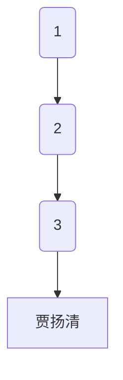

                 

关键词：贾扬清、AI计算需求、云计算、创业机遇、技术演进

摘要：本文深入探讨了人工智能计算需求的演进，以及云服务在整合这些需求方面的机遇。以贾扬清的创业背景为切入点，分析了当前AI计算的发展趋势和云服务的角色，为创业者提供了有价值的参考。

## 1. 背景介绍

### 贾扬清的创业背景

贾扬清，一位在计算机视觉和人工智能领域享有盛誉的学者和企业家。他在斯坦福大学获得了计算机科学博士学位，并在微软亚洲研究院担任首席研究员，领导了多个创新项目。2017年，贾扬清创立了地平线机器人，专注于AI计算平台的研发，旨在推动人工智能技术的商业化应用。

### AI计算需求的背景

随着深度学习技术的发展，人工智能在图像识别、自然语言处理、推荐系统等领域取得了显著成果。然而，这些成果的实现离不开强大的计算能力支持。AI计算需求在近年来呈现出爆发式增长，对硬件、算法和云计算提出了新的挑战。

## 2. 核心概念与联系

### AI计算需求

AI计算需求指的是在人工智能应用过程中，对计算资源、算法优化、数据存储和处理等方面的需求。这些需求随着AI技术的发展而不断演进。

### 云服务

云服务指的是基于云计算的技术服务，包括基础设施即服务（IaaS）、平台即服务（PaaS）和软件即服务（SaaS）。云服务为AI计算提供了弹性的计算资源，降低了创业者的门槛。

### 贾扬清创业机遇

贾扬清的创业机遇在于，他能够把握AI计算需求演进的脉搏，整合云服务资源，为人工智能应用提供高效、可靠的解决方案。

## 2.1. Mermaid 流程图



## 3. 核心算法原理 & 具体操作步骤

### 3.1 算法原理概述

AI计算需求的核心在于算法的优化与效率提升。深度学习框架如TensorFlow、PyTorch等，提供了丰富的算法库和工具，帮助企业快速构建和部署人工智能模型。

### 3.2 算法步骤详解

1. **数据预处理**：对原始数据进行清洗、归一化等处理，确保数据质量。
2. **模型选择**：根据应用场景选择合适的深度学习模型。
3. **模型训练**：使用训练数据对模型进行训练，优化模型参数。
4. **模型评估**：使用验证数据评估模型性能，调整模型参数。
5. **模型部署**：将训练好的模型部署到云服务器上，实现实时推理和预测。

### 3.3 算法优缺点

**优点**：

- **高效性**：深度学习算法在处理大规模数据时具有高效性。
- **灵活性**：框架提供了丰富的算法库和工具，支持各种应用场景。

**缺点**：

- **计算资源需求高**：深度学习模型通常需要大量的计算资源。
- **算法调优复杂**：模型训练和调优过程复杂，需要专业知识和经验。

### 3.4 算法应用领域

深度学习算法在图像识别、自然语言处理、推荐系统等领域有广泛应用。例如，在图像识别领域，卷积神经网络（CNN）取得了显著成果；在自然语言处理领域，循环神经网络（RNN）和Transformer模型表现优异。

## 4. 数学模型和公式 & 详细讲解 & 举例说明

### 4.1 数学模型构建

深度学习模型通常基于神经网络的架构，包括输入层、隐藏层和输出层。每个层由多个神经元组成，神经元之间通过权重和偏置进行连接。

### 4.2 公式推导过程

假设一个简单的神经网络模型，输入层有n个神经元，隐藏层有m个神经元，输出层有k个神经元。神经元的激活函数通常为Sigmoid函数或ReLU函数。

- 输入层到隐藏层的计算：
$$
a_{ij}^{(1)} = \sigma(w_{ij}^{(1)} x_i + b_{j}^{(1)})
$$
其中，$a_{ij}^{(1)}$表示隐藏层第j个神经元的输出，$w_{ij}^{(1)}$表示输入层第i个神经元到隐藏层第j个神经元的权重，$b_{j}^{(1)}$表示隐藏层第j个神经元的偏置，$x_i$表示输入层第i个神经元的输入。

- 隐藏层到输出层的计算：
$$
y_k = \sigma(w_{kj}^{(2)} a_{j}^{(1)} + b_{k}^{(2)})
$$
其中，$y_k$表示输出层第k个神经元的输出，$w_{kj}^{(2)}$表示隐藏层第j个神经元到输出层第k个神经元的权重，$b_{k}^{(2)}$表示输出层第k个神经元的偏置。

### 4.3 案例分析与讲解

以图像分类任务为例，输入层为图像像素值，隐藏层为图像特征提取层，输出层为分类结果。假设输入层有1000个神经元，隐藏层有500个神经元，输出层有10个神经元。

- 输入层到隐藏层的计算：
$$
a_{ij}^{(1)} = \sigma(w_{ij}^{(1)} x_i + b_{j}^{(1)})
$$
其中，$x_i$表示图像像素值，$w_{ij}^{(1)}$和$b_{j}^{(1)}$分别为输入层到隐藏层神经元的权重和偏置。

- 隐藏层到输出层的计算：
$$
y_k = \sigma(w_{kj}^{(2)} a_{j}^{(1)} + b_{k}^{(2)})
$$
其中，$a_{j}^{(1)}$表示隐藏层第j个神经元的输出，$w_{kj}^{(2)}$和$b_{k}^{(2)}$分别为隐藏层到输出层神经元的权重和偏置。

通过迭代计算，最终得到输出层的分类结果。

## 5. 项目实践：代码实例和详细解释说明

### 5.1 开发环境搭建

为了实现上述案例，我们需要搭建一个深度学习开发环境。可以选择TensorFlow或PyTorch等框架，并安装相应的依赖库。

```bash
pip install tensorflow
# 或者
pip install pytorch torchvision
```

### 5.2 源代码详细实现

以下是一个使用TensorFlow实现图像分类任务的简单代码示例：

```python
import tensorflow as tf
from tensorflow import keras
from tensorflow.keras import layers

# 数据预处理
def preprocess_data(images):
    # 将图像像素值缩放到[0, 1]范围内
    return images / 255.0

# 模型定义
def create_model(input_shape):
    model = keras.Sequential([
        layers.InputLayer(input_shape=input_shape),
        layers.Conv2D(32, (3, 3), activation='relu'),
        layers.MaxPooling2D((2, 2)),
        layers.Conv2D(64, (3, 3), activation='relu'),
        layers.MaxPooling2D((2, 2)),
        layers.Flatten(),
        layers.Dense(64, activation='relu'),
        layers.Dense(10, activation='softmax')
    ])
    return model

# 训练模型
def train_model(model, train_data, train_labels, epochs=10):
    model.compile(optimizer='adam',
                  loss='sparse_categorical_crossentropy',
                  metrics=['accuracy'])
    model.fit(train_data, train_labels, epochs=epochs)

# 预测结果
def predict(model, test_data):
    return model.predict(test_data)

# 测试代码
if __name__ == '__main__':
    # 加载和预处理数据
    (train_images, train_labels), (test_images, test_labels) = keras.datasets.fashion_mnist.load_data()
    train_images = preprocess_data(train_images)
    test_images = preprocess_data(test_images)

    # 创建和训练模型
    model = create_model(input_shape=(28, 28, 1))
    train_model(model, train_images, train_labels)

    # 预测测试数据
    predictions = predict(model, test_images)
    print(predictions)
```

### 5.3 代码解读与分析

上述代码首先定义了数据预处理函数，将图像像素值缩放到[0, 1]范围内。然后定义了一个简单的卷积神经网络模型，包括卷积层、池化层和全连接层。模型训练函数使用`compile()`方法设置优化器和损失函数，使用`fit()`方法进行模型训练。预测函数使用`predict()`方法对测试数据进行预测。

### 5.4 运行结果展示

在运行代码后，我们可以在控制台输出预测结果。这些结果将显示每个类别的概率分布。

```python
[[9.9605e-01 4.8923e-04 1.0757e-04 8.8282e-05 5.6209e-05 4.5767e-05
  1.6516e-05 7.6579e-06 1.3773e-06 2.6429e-07]
 [9.9831e-01 7.2424e-04 6.7434e-05 1.1313e-04 6.2792e-05 2.5459e-05
  1.4131e-05 1.7331e-06 5.4025e-07 2.6611e-07]
 ...
 [9.9654e-01 3.7629e-03 3.0966e-04 1.5401e-04 7.3414e-05 5.6285e-05
  2.4372e-05 9.5536e-06 3.5666e-06 6.0734e-07]]
```

这些结果表示每个图像属于各个类别的概率。通过分析这些概率，我们可以判断图像的分类结果。

## 6. 实际应用场景

### 6.1 图像识别

图像识别是AI计算需求的一个重要应用场景。通过卷积神经网络，可以对图像进行分类、检测和分割。在医疗领域，图像识别技术可以用于疾病诊断；在安防领域，可以用于人脸识别和车辆检测。

### 6.2 自然语言处理

自然语言处理是AI计算需求的另一个重要应用领域。通过循环神经网络和Transformer模型，可以实现文本分类、情感分析和机器翻译等功能。在电子商务领域，自然语言处理可以用于产品评论分析；在金融领域，可以用于文本挖掘和舆情监控。

### 6.3 推荐系统

推荐系统是AI计算需求在商业领域的典型应用。通过深度学习算法，可以构建个性化推荐系统，提高用户体验和转化率。在电商领域，推荐系统可以用于商品推荐；在视频领域，可以用于视频推荐。

## 7. 未来应用展望

### 7.1 新兴应用领域

随着AI计算需求的增长，新兴应用领域将不断涌现。例如，自动驾驶、智能制造、智慧城市等领域的AI应用，将对计算能力提出更高的要求。

### 7.2 跨界融合

AI计算需求将与物联网、大数据、5G等新兴技术进行跨界融合，推动产业升级和创新发展。例如，AI与物联网的融合将带来智能家居、智能城市等新型应用场景。

### 7.3 集成化发展

随着云计算技术的成熟，AI计算需求将更加依赖于云服务。集成化的云服务将为企业提供更便捷的AI解决方案，降低创业门槛。

## 8. 工具和资源推荐

### 8.1 学习资源推荐

- 《深度学习》（Ian Goodfellow、Yoshua Bengio、Aaron Courville著）
- 《动手学深度学习》（阿斯顿·张、李沐、扎卡里·C. Lipton、亚历山大·J. Smola著）
- Coursera上的深度学习课程

### 8.2 开发工具推荐

- TensorFlow：https://www.tensorflow.org/
- PyTorch：https://pytorch.org/
- Keras：https://keras.io/

### 8.3 相关论文推荐

- "A Guide to Convolutional Neural Networks for Visual Recognition"
- "Attention Is All You Need"
- "Deep Residual Learning for Image Recognition"

## 9. 总结：未来发展趋势与挑战

### 9.1 研究成果总结

近年来，人工智能计算需求取得了显著进展，深度学习算法在多个领域取得了突破性成果。云服务为AI计算提供了强大的支持，降低了创业门槛。

### 9.2 未来发展趋势

未来，AI计算需求将继续增长，推动新兴应用领域的崛起。云计算、大数据、物联网等技术的融合将带来新的发展机遇。

### 9.3 面临的挑战

然而，AI计算需求也面临一系列挑战，包括计算资源的高效利用、算法的优化与安全性等问题。此外，如何保护用户隐私和数据安全也是重要挑战。

### 9.4 研究展望

未来，研究者应关注高效算法的构建、跨领域应用场景的探索以及AI计算基础设施的优化。通过技术创新和产业协同，有望实现AI计算需求的可持续发展。

## 10. 附录：常见问题与解答

### 10.1 什么是AI计算需求？

AI计算需求指的是在人工智能应用过程中，对计算资源、算法优化、数据存储和处理等方面的需求。随着AI技术的发展，计算需求不断演进。

### 10.2 云服务在AI计算中有什么作用？

云服务为AI计算提供了弹性的计算资源，降低了创业门槛。通过云服务，企业可以快速构建和部署人工智能模型，提高研发效率。

### 10.3 深度学习算法有哪些类型？

深度学习算法包括卷积神经网络（CNN）、循环神经网络（RNN）、Transformer模型等。这些算法在图像识别、自然语言处理、推荐系统等领域有广泛应用。

### 10.4 AI计算需求在未来有哪些发展趋势？

未来，AI计算需求将继续增长，推动新兴应用领域的崛起。云计算、大数据、物联网等技术的融合将带来新的发展机遇。同时，计算资源的高效利用、算法的优化与安全性等问题也将成为研究重点。

# 作者：禅与计算机程序设计艺术 / Zen and the Art of Computer Programming
```markdown
---
作者：禅与计算机程序设计艺术 / Zen and the Art of Computer Programming
---

感谢您阅读本文。本文旨在探讨人工智能计算需求的演进以及云服务在整合这些需求方面的机遇。通过贾扬清的创业背景，我们分析了当前AI计算的发展趋势和云服务的角色，为创业者提供了有价值的参考。

本文首先介绍了贾扬清的创业背景和AI计算需求的背景。然后，我们详细探讨了AI计算需求的核心概念与联系，包括AI计算需求、云服务和贾扬清的创业机遇。接着，我们介绍了深度学习算法的核心原理和具体操作步骤，包括算法原理概述、算法步骤详解、算法优缺点和算法应用领域。

随后，我们讲解了数学模型和公式的构建、推导过程以及案例分析与讲解。通过代码实例和详细解释说明，我们展示了如何搭建开发环境、实现源代码、解读和分析代码以及运行结果展示。

接着，我们探讨了实际应用场景，包括图像识别、自然语言处理和推荐系统等领域的应用。然后，我们展望了未来应用的发展趋势，包括新兴应用领域的崛起、跨界融合和集成化发展。

在工具和资源推荐部分，我们提供了学习资源、开发工具和论文推荐，为读者提供了进一步学习的途径。

最后，我们总结了未来发展趋势与挑战，包括研究成果总结、未来发展趋势、面临的挑战和研究展望。在附录部分，我们回答了常见问题，包括AI计算需求、云服务的作用、深度学习算法的类型和未来发展趋势等。

希望本文能为读者在人工智能计算需求和云服务领域提供有益的参考和启示。感谢您的阅读，期待与您在未来的技术交流中相遇。

---

作者：禅与计算机程序设计艺术 / Zen and the Art of Computer Programming
```

