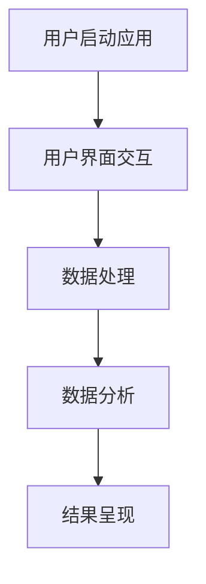

                 

在这个数字化时代，超级APP成为了企业构建一站式服务平台的绝佳选择。超级APP不仅融合了多种功能，还能通过提供个性化的用户体验，吸引并留住庞大的用户群体。本文将探讨超级APP创业的背景、核心概念、算法原理、数学模型、项目实践以及未来应用前景，旨在为创业者提供一整套技术框架和战略指导。

## 文章关键词

- 超级APP
- 平台经济
- 用户体验
- 功能融合
- 数据分析

## 文章摘要

本文从技术角度分析了超级APP创业的现状和趋势，提出了构建一站式服务平台的核心概念和算法原理。通过数学模型的构建和公式推导，本文为超级APP的开发提供了理论基础。同时，通过具体的代码实例和实际应用场景的探讨，展示了超级APP在市场中的潜力和挑战。最后，本文对未来的发展趋势和面临的挑战进行了展望，为创业者提供了宝贵的建议。

## 1. 背景介绍

### 1.1 超级APP的定义

超级APP，即Super Application，是一种综合性的移动应用程序，能够集成多种功能和服务。它通常拥有强大的用户界面、高度集成的后台服务和丰富的数据支持。超级APP的出现，打破了传统应用程序的界限，实现了从单一功能到全功能服务的跨越。

### 1.2 平台经济的崛起

平台经济是21世纪经济发展的重要模式，它通过搭建平台，连接供需双方，提供一站式服务。超级APP正是平台经济的典型代表，它不仅满足了用户的多样化需求，还通过数据分析和用户行为洞察，实现了精准营销和个性化服务。

### 1.3 超级APP的创业趋势

随着移动互联网的普及和用户需求的多样化，超级APP创业成为了一种热门的商业模式。无论是初创企业，还是传统企业，都在积极布局超级APP，以抢占市场份额。超级APP的成功，往往能够带动整个产业链的繁荣。

## 2. 核心概念与联系

### 2.1 超级APP的核心概念

构建超级APP，需要理解以下几个核心概念：

- **用户体验**：超级APP的核心是提供优质的用户体验，包括界面设计、功能流畅性等。
- **功能融合**：超级APP需要集成多种功能，如社交、购物、支付等，以满足用户的多样化需求。
- **数据分析**：通过收集和分析用户数据，实现精准营销和个性化服务。

### 2.2 超级APP的架构

超级APP的架构通常包括以下几个层次：

- **前端**：负责用户交互，包括界面设计和交互逻辑。
- **后端**：负责数据存储和处理，包括数据库、缓存、服务器等。
- **中间件**：负责前后端的通信，包括API、消息队列等。
- **数据分析**：负责用户数据的收集、分析和处理。

### 2.3 超级APP的流程图

以下是一个简单的超级APP流程图，展示了用户从启动应用、进行操作到获得结果的整个过程。



## 3. 核心算法原理 & 具体操作步骤

### 3.1 算法原理概述

超级APP的核心算法通常包括以下几个部分：

- **机器学习算法**：用于用户行为的预测和个性化推荐。
- **数据挖掘算法**：用于用户数据的收集和分析。
- **图像处理算法**：用于图像识别和增强。

### 3.2 算法步骤详解

以下是超级APP算法的基本步骤：

1. **数据收集**：收集用户的操作数据、行为数据等。
2. **数据处理**：对收集到的数据进行清洗、去噪、格式化等处理。
3. **数据建模**：根据处理后的数据，建立机器学习模型或数据挖掘模型。
4. **模型训练**：使用训练数据对模型进行训练，调整模型参数。
5. **模型评估**：使用验证数据对模型进行评估，调整模型性能。
6. **模型部署**：将训练好的模型部署到生产环境中，进行实时预测和分析。

### 3.3 算法优缺点

- **优点**：能够实现精准营销和个性化服务，提高用户粘性和满意度。
- **缺点**：数据安全和隐私保护问题，以及算法的透明度和可解释性问题。

### 3.4 算法应用领域

超级APP算法的应用领域非常广泛，包括但不限于：

- **电子商务**：通过个性化推荐，提高用户的购买意愿和转化率。
- **社交媒体**：通过用户行为分析，实现精准广告投放。
- **金融科技**：通过风险控制和信用评分，提高金融服务的效率和安全性。

## 4. 数学模型和公式 & 详细讲解 & 举例说明

### 4.1 数学模型构建

超级APP的数学模型通常包括以下几个部分：

- **用户行为模型**：用于预测用户的行为和偏好。
- **推荐模型**：用于为用户推荐感兴趣的内容或商品。
- **风险控制模型**：用于评估用户的风险水平和信用评分。

### 4.2 公式推导过程

以下是一个简单的用户行为模型推导过程：

- **用户行为模型**：假设用户行为由多个特征向量组成，使用线性回归模型进行预测。
  $$ y = \theta_0 + \theta_1x_1 + \theta_2x_2 + ... + \theta_nx_n $$
  其中，$y$ 是用户的行为评分，$\theta_0$ 是截距，$\theta_1, \theta_2, ..., \theta_n$ 是特征向量的权重。

### 4.3 案例分析与讲解

以下是一个简单的推荐系统案例：

- **案例背景**：一个电子商务平台的用户行为数据，包括用户ID、商品ID、行为类型（浏览、购买、收藏等）。
- **数据预处理**：对用户行为数据进行清洗和格式化，提取有用的特征。
- **模型训练**：使用矩阵分解技术，建立用户行为模型。
- **模型评估**：使用验证集对模型进行评估，调整模型参数。
- **模型部署**：将训练好的模型部署到生产环境中，进行实时推荐。

## 5. 项目实践：代码实例和详细解释说明

### 5.1 开发环境搭建

搭建超级APP的开发环境，需要安装以下软件和工具：

- **编程语言**：Python、Java或JavaScript
- **开发框架**：Django、Spring Boot或React Native
- **数据库**：MySQL、PostgreSQL或MongoDB
- **数据分析工具**：Pandas、Scikit-learn或TensorFlow

### 5.2 源代码详细实现

以下是一个简单的Python代码示例，用于构建一个简单的推荐系统：

```python
import pandas as pd
from sklearn.model_selection import train_test_split
from sklearn.linear_model import LinearRegression

# 数据预处理
data = pd.read_csv('user_behavior_data.csv')
X = data[['feature1', 'feature2', 'feature3']]
y = data['behavior_score']

# 模型训练
X_train, X_test, y_train, y_test = train_test_split(X, y, test_size=0.2)
model = LinearRegression()
model.fit(X_train, y_train)

# 模型评估
score = model.score(X_test, y_test)
print(f'Model score: {score}')

# 模型部署
# 在生产环境中，将模型部署到服务器，进行实时推荐
```

### 5.3 代码解读与分析

这段代码首先导入了必要的库，然后从CSV文件中读取用户行为数据。接着，使用线性回归模型对数据进行训练，并评估模型的性能。最后，将训练好的模型部署到生产环境中，进行实时推荐。

### 5.4 运行结果展示

在运行这段代码后，会输出模型的评估分数，这个分数代表了模型对测试数据的预测能力。分数越高，模型的性能越好。

## 6. 实际应用场景

### 6.1 电子商务平台

超级APP在电子商务平台中的应用，主要体现在个性化推荐和精准营销上。通过分析用户的行为数据，平台可以为用户推荐感兴趣的商品，提高用户的购买转化率。

### 6.2 社交媒体平台

超级APP在社交媒体平台中的应用，主要体现在用户互动和内容推荐上。通过分析用户的行为数据，平台可以为用户推荐感兴趣的内容，增加用户的活跃度和留存率。

### 6.3 金融服务平台

超级APP在金融服务平台中的应用，主要体现在风险控制和信用评分上。通过分析用户的行为数据，平台可以评估用户的风险水平和信用评分，提高金融服务的效率和安全性。

## 7. 工具和资源推荐

### 7.1 学习资源推荐

- **书籍**：《Python机器学习》、《深度学习》、《推荐系统实践》
- **在线课程**：Coursera、edX、Udacity上的相关课程
- **博客**：博客园、CSDN、知乎上的技术博客

### 7.2 开发工具推荐

- **开发框架**：Django、Spring Boot、React Native
- **数据库**：MySQL、PostgreSQL、MongoDB
- **数据分析工具**：Pandas、Scikit-learn、TensorFlow

### 7.3 相关论文推荐

- **推荐系统**：《矩阵分解在推荐系统中的应用》、《基于协同过滤的推荐系统》
- **深度学习**：《深度学习》、《卷积神经网络在图像识别中的应用》
- **数据挖掘**：《数据挖掘：概念与技术》、《关联规则挖掘》

## 8. 总结：未来发展趋势与挑战

### 8.1 研究成果总结

超级APP在数字化时代扮演着重要角色，通过集成多种功能和服务，实现了平台经济的崛起。技术方面，机器学习和数据挖掘等技术的应用，为超级APP的开发提供了强大的支持。

### 8.2 未来发展趋势

- **个性化服务**：随着用户需求的不断变化，超级APP将更加注重个性化服务。
- **智能化**：超级APP将更加智能化，通过人工智能技术，提高用户体验和运营效率。
- **跨平台**：超级APP将实现跨平台部署，为用户提供无缝衔接的服务体验。

### 8.3 面临的挑战

- **数据安全和隐私保护**：随着数据量的增加，数据安全和隐私保护成为超级APP面临的重大挑战。
- **算法透明度和可解释性**：算法的透明度和可解释性成为影响超级APP用户体验的重要因素。

### 8.4 研究展望

未来，超级APP将在技术、业务和用户体验等方面继续发展。通过不断创新和优化，超级APP将为用户提供更加个性化和智能化的服务，成为平台经济的重要组成部分。

## 9. 附录：常见问题与解答

### 9.1 超级APP与传统APP的区别

超级APP与传统APP的区别在于其功能集成的程度和用户体验的优化。超级APP集成了多种功能和服务，提供一站式服务；而传统APP通常专注于单一功能。

### 9.2 超级APP开发的关键技术

超级APP开发的关键技术包括机器学习、数据挖掘、前端开发、后端开发等。通过这些技术的综合应用，超级APP能够提供个性化服务和智能化体验。

### 9.3 超级APP的未来发展方向

超级APP的未来发展方向包括个性化服务、智能化、跨平台部署等。通过不断创新和优化，超级APP将为用户提供更加便捷和高效的服务。

### 9.4 超级APP开发的难点和挑战

超级APP开发的难点和挑战包括数据安全、隐私保护、算法透明度和可解释性等。解决这些难点和挑战，需要多学科交叉合作和技术创新。

---

作者：禅与计算机程序设计艺术 / Zen and the Art of Computer Programming
----------------------------------------------------------------
这篇文章《超级APP创业：一站式服务的平台经济》全面探讨了超级APP在数字化时代的角色、核心概念、算法原理、数学模型、项目实践和未来应用前景。通过详细的代码实例和技术分析，为创业者提供了实用的技术框架和战略指导。随着技术的不断进步和用户需求的多样化，超级APP将继续在平台经济中发挥重要作用。然而，面对数据安全和隐私保护、算法透明度和可解释性等挑战，创业者需要不断创新和优化，以提供更加个性化和智能化的服务。未来，超级APP将引领数字化时代的潮流，为用户带来更加便捷和高效的体验。

