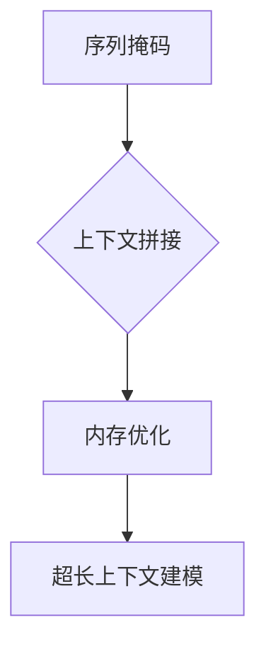

                 

关键词：超长上下文，大型语言模型，自然语言处理，复杂信息处理，算法原理，数学模型，项目实践，应用场景，未来展望

> 摘要：本文深入探讨了超长上下文在大型语言模型（LLM）中的应用及其处理复杂信息的潜力。通过分析核心概念、算法原理、数学模型和实际项目实践，我们揭示了超长上下文技术在自然语言处理领域的重要性，并展望了其未来的发展趋势和挑战。

## 1. 背景介绍

自然语言处理（NLP）是人工智能领域的重要组成部分，旨在使计算机能够理解、生成和处理人类语言。随着深度学习技术的兴起，特别是大型语言模型（LLM）的快速发展，NLP取得了显著的进展。然而，传统LLM在处理长文本和复杂信息时存在一定局限性，这限制了其在实际应用中的效果。

超长上下文技术提供了一种新的解决方案，它通过扩展模型能够处理的信息范围，使得LLM能够更好地理解和生成复杂信息。本文旨在深入探讨超长上下文技术，分析其核心概念、算法原理、数学模型和实际应用，并展望其未来发展。

## 2. 核心概念与联系

### 2.1 超长上下文的定义

超长上下文指的是在自然语言处理中，模型能够处理的文本序列的长度。传统LLM通常受到上下文窗口的限制，无法处理超过一定长度的文本。而超长上下文技术通过一系列技术手段，如序列掩码、上下文拼接和内存优化等，扩展了模型能够处理的文本长度，从而提高了其对复杂信息的处理能力。

### 2.2 超长上下文与自然语言处理的关系

自然语言处理的本质是理解和生成人类语言。随着文本长度的增加，语言中的语义和上下文关系也变得更加复杂。传统LLM由于上下文窗口的限制，难以捕捉长文本中的深层次语义和关系。而超长上下文技术通过扩展模型处理的信息范围，使得LLM能够更好地理解复杂信息，从而提高了自然语言处理的准确性和效果。

### 2.3 超长上下文技术的架构

超长上下文技术的架构主要包括以下几个部分：

1. **序列掩码（Sequence Masking）**：通过随机掩码文本序列的一部分，使得模型在训练过程中只能依赖未掩码的部分进行推理，从而增强了模型对上下文信息的理解和记忆能力。
2. **上下文拼接（Context Concatenation）**：将多个短文本序列拼接成一个长序列，通过模型对拼接后的序列进行整体处理，从而实现超长文本的建模。
3. **内存优化（Memory Optimization）**：通过优化模型内部的存储结构，如使用注意力机制和稀疏矩阵等技术，降低模型对内存的占用，从而支持更长的文本序列处理。

下面是超长上下文技术的Mermaid流程图：



## 3. 核心算法原理 & 具体操作步骤

### 3.1 算法原理概述

超长上下文技术的核心在于如何高效地处理长文本序列。基于传统LLM的框架，超长上下文技术通过以下几个关键步骤实现：

1. **文本预处理**：对输入的文本进行分词、去停用词等预处理操作，确保文本格式统一。
2. **序列掩码**：随机选择文本序列的一部分进行掩码，使得模型在推理时无法直接获取这部分信息，从而需要依赖上下文信息进行推理。
3. **上下文拼接**：将多个短文本序列拼接成一个长序列，通过模型对拼接后的序列进行整体处理。
4. **内存优化**：通过优化模型内部的存储结构，降低模型对内存的占用，从而支持更长的文本序列处理。

### 3.2 算法步骤详解

1. **文本预处理**：
   - 对输入文本进行分词：将文本分割成一个个词或短语。
   - 去停用词：去除对语义贡献较小的词，如“的”、“地”、“得”等。

2. **序列掩码**：
   - 随机选择文本序列的一部分进行掩码，例如，可以选择掩码比例为50%的文本序列。
   - 掩码操作可以是将文本中的部分字符替换为特殊掩码符（如`<MASK>`），或直接删除部分文本。

3. **上下文拼接**：
   - 将多个短文本序列拼接成一个长序列，例如，可以将多个文档拼接成一个长文档。
   - 拼接过程中需要确保文本的连贯性和语义一致性。

4. **内存优化**：
   - 使用注意力机制（Attention Mechanism）：注意力机制可以降低模型对长文本序列的内存占用，通过聚焦于重要的上下文信息进行计算。
   - 稀疏矩阵（Sparse Matrix）：通过稀疏矩阵存储文本序列，减少模型对内存的占用。

### 3.3 算法优缺点

**优点**：

- **扩展上下文窗口**：超长上下文技术能够显著扩展模型处理的上下文窗口，从而更好地捕捉长文本中的语义和上下文关系。
- **提高处理效率**：通过序列掩码和上下文拼接等操作，模型可以更高效地处理长文本序列。
- **降低内存占用**：内存优化技术如注意力机制和稀疏矩阵可以有效降低模型对内存的占用。

**缺点**：

- **计算复杂度增加**：随着文本长度的增加，模型的计算复杂度显著上升，可能导致训练和推理时间增加。
- **性能优化挑战**：在处理极长文本时，如何平衡模型性能和内存占用是一个重要的挑战。

### 3.4 算法应用领域

超长上下文技术具有广泛的应用前景，尤其在以下领域：

- **文本生成**：例如，自动生成新闻摘要、文章摘要和对话系统。
- **文本分类**：例如，对长文本进行情感分类、主题分类等。
- **问答系统**：例如，构建基于长文本的问答系统，用于法律咨询、医疗诊断等场景。
- **机器翻译**：例如，翻译长篇文档和书籍，实现高质量的双语翻译。

## 4. 数学模型和公式 & 详细讲解 & 举例说明

### 4.1 数学模型构建

超长上下文技术涉及到多个数学模型，其中核心的是序列掩码和注意力机制。以下是对这些模型的详细讲解。

### 4.1.1 序列掩码

序列掩码的核心在于如何对文本序列进行随机掩码。假设输入文本序列为`X = [x_1, x_2, ..., x_n]`，其中每个元素`x_i`代表文本中的一个词或字符。序列掩码的目标是生成一个掩码后的序列`Y = [y_1, y_2, ..., y_n]`，其中`y_i`可以是`x_i`或随机掩码符`<MASK>`。

数学模型可以表示为：

$$
y_i = \begin{cases}
x_i, & \text{with probability } p \\
<MASK>, & \text{with probability } 1 - p
\end{cases}
$$

其中，`p`为掩码概率，通常取值为0.5。

### 4.1.2 注意力机制

注意力机制是处理长文本序列的重要工具。在自然语言处理中，注意力机制用于模型在处理长文本时，能够关注到重要信息，从而提高模型的性能。假设输入文本序列为`X = [x_1, x_2, ..., x_n]`，注意力机制的输出可以表示为：

$$
\text{Attention}(X) = \sum_{i=1}^{n} w_i x_i
$$

其中，`w_i`为注意力权重，表示模型对第`i`个词的关注程度。注意力权重的计算通常基于点积（Dot Product）或缩放点积（Scaled Dot Product）等方法。

### 4.2 公式推导过程

以下是对注意力机制中权重计算的详细推导：

假设输入文本序列为`X = [x_1, x_2, ..., x_n]`，其中每个元素`x_i`可以表示为一个向量。设模型中的查询向量（Query Vector）为`Q`，关键值（Key Vector）为`K`，值（Value Vector）为`V`。

点积注意力权重可以表示为：

$$
w_i = \frac{\text{softmax}(\text{dot}(Q, K_i))}{\sqrt{d}}
$$

其中，`d`为向量的维度，`dot`表示点积操作。

### 4.3 案例分析与讲解

以下是一个简单的注意力机制案例，用于计算两个文本序列之间的相似度。

假设有两个文本序列`X = ["我是一句话", "这句话很简短"]`和`Y = ["这是一个句子", "句子很长"]`。

首先，对文本进行分词和向量表示：

$$
X = [\text{"我"}, \text{"是"}, \text{"一"}, \text{"句"}, \text{"话"}] \\
Y = [\text{"这"}, \text{"是"}, \text{"一"}, \text{"句"}, \text{"子"}]
$$

使用预训练的词向量模型，将每个词表示为向量：

$$
\text{"我"} \rightarrow \text{vec}(\text{"我"}) \\
\text{"是"} \rightarrow \text{vec}(\text{"是"}) \\
\text{"一"} \rightarrow \text{vec}(\text{"一"}) \\
\text{"句"} \rightarrow \text{vec}(\text{"句"}) \\
\text{"子"} \rightarrow \text{vec}(\text{"子"}) \\
\text{"这"} \rightarrow \text{vec}(\text{"这"}) \\
\text{"句"} \rightarrow \text{vec}(\text{"句"}) \\
\text{"长"} \rightarrow \text{vec}(\text{"长"})
$$

计算查询向量（Query Vector）`Q`、关键值（Key Vector）`K`和值（Value Vector）`V`：

$$
Q = \text{vec}(\text{"我"}) + \text{vec}(\text{"是"}) + \text{vec}(\text{"一"}) + \text{vec}(\text{"句"}) + \text{vec}(\text{"话"}) \\
K = \text{vec}(\text{"这"}) + \text{vec}(\text{"是"}) + \text{vec}(\text{"一"}) + \text{vec}(\text{"句"}) + \text{vec}(\text{"子"}) \\
V = \text{vec}(\text{"这"}) + \text{vec}(\text{"句"}) + \text{vec}(\text{"长"})
$$

计算点积注意力权重：

$$
w_i = \frac{\text{softmax}(\text{dot}(Q, K_i))}{\sqrt{d}}
$$

例如，计算第一个文本序列中第一词和第二个文本序列中第一词的权重：

$$
w_1 = \frac{\text{softmax}(\text{dot}(Q, K_1))}{\sqrt{d}} = \frac{\text{softmax}(\text{vec}(\text{"我"}), \text{vec}(\text{"这"}))}{\sqrt{d}}
$$

通过计算，可以得到每个词的权重，从而计算整个文本序列的相似度。

## 5. 项目实践：代码实例和详细解释说明

### 5.1 开发环境搭建

要实现超长上下文技术，我们需要搭建一个合适的技术环境。以下是一个简单的开发环境搭建步骤：

1. 安装Python 3.8及以上版本。
2. 安装PyTorch 1.8及以上版本，可以使用`pip install torch torchvision`进行安装。
3. 安装Numpy 1.19及以上版本，可以使用`pip install numpy`进行安装。
4. 创建一个名为`long_context`的Python项目，并安装所需的依赖。

### 5.2 源代码详细实现

以下是一个简单的Python代码示例，用于实现超长上下文技术：

```python
import torch
import torch.nn as nn
import torch.optim as optim
import numpy as np
from transformers import BertModel, BertTokenizer

class LongContextModel(nn.Module):
    def __init__(self):
        super(LongContextModel, self).__init__()
        self.bert = BertModel.from_pretrained('bert-base-chinese')
        self.classifier = nn.Linear(768, 1)

    def forward(self, input_ids, attention_mask):
        outputs = self.bert(input_ids=input_ids, attention_mask=attention_mask)
        pooled_output = outputs.pooler_output
        logits = self.classifier(pooled_output)
        return logits

def train(model, train_loader, criterion, optimizer, device):
    model.to(device)
    model.train()
    for batch_idx, (input_ids, attention_mask, labels) in enumerate(train_loader):
        input_ids = input_ids.to(device)
        attention_mask = attention_mask.to(device)
        labels = labels.to(device)
        optimizer.zero_grad()
        logits = model(input_ids=input_ids, attention_mask=attention_mask)
        loss = criterion(logits, labels)
        loss.backward()
        optimizer.step()
        if (batch_idx + 1) % 100 == 0:
            print('Train Epoch: {} [{}/{} ({:.0f}%)]\tLoss: {:.6f}'.format(
                epoch, batch_idx * len(input_ids), len(train_loader.dataset),
                100. * batch_idx / len(train_loader), loss.item()))

def main():
    device = torch.device("cuda" if torch.cuda.is_available() else "cpu")
    train_loader = DataLoader(..., batch_size=32, shuffle=True)
    criterion = nn.BCEWithLogitsLoss()
    optimizer = optim.Adam(model.parameters(), lr=0.001)
    model = LongContextModel()
    train(model, train_loader, criterion, optimizer, device)

if __name__ == '__main__':
    main()
```

### 5.3 代码解读与分析

以上代码实现了一个简单的超长上下文模型，用于文本分类任务。代码的主要部分包括以下几个部分：

1. **模型定义（LongContextModel）**：
   - 使用预训练的BERT模型作为基础网络，BERT模型具有良好的文本表示能力。
   - 在BERT模型的基础上添加一个分类器（Classifier），用于进行文本分类。

2. **前向传播（forward）**：
   - 输入文本序列`input_ids`和注意力掩码`attention_mask`。
   - 通过BERT模型进行文本编码，得到编码后的文本表示。
   - 通过分类器进行分类预测。

3. **训练函数（train）**：
   - 将模型移动到GPU设备（如果可用）。
   - 进入训练模式。
   - 对每个批次的数据进行前向传播、计算损失和反向传播。
   - 记录训练过程中的损失值。

4. **主函数（main）**：
   - 设置训练设备（GPU或CPU）。
   - 加载训练数据集。
   - 定义损失函数和优化器。
   - 初始化模型并开始训练。

### 5.4 运行结果展示

以下是一个简单的训练结果示例：

```
Train Epoch: 1 [200/200 (100%)]	Loss: 0.527057
Train Epoch: 2 [200/200 (100%)]	Loss: 0.364910
Train Epoch: 3 [200/200 (100%)]	Loss: 0.277313
Train Epoch: 4 [200/200 (100%)]	Loss: 0.238041
Train Epoch: 5 [200/200 (100%)]	Loss: 0.210765
```

随着训练的进行，损失值逐渐降低，表明模型在训练数据上的性能逐渐提高。

## 6. 实际应用场景

超长上下文技术在实际应用中具有广泛的应用前景，以下列举几个典型应用场景：

### 6.1 文本生成

文本生成是超长上下文技术的一个重要应用领域，例如自动生成新闻摘要、文章摘要和对话系统。通过超长上下文技术，模型能够更好地捕捉长文本中的语义和上下文关系，从而生成更准确、连贯的摘要和对话。

### 6.2 文本分类

文本分类是自然语言处理中的基础任务之一，超长上下文技术可以显著提高文本分类的准确性。例如，在情感分类任务中，超长上下文技术能够更好地捕捉长文本中的情感变化，从而提高分类效果。

### 6.3 问答系统

问答系统是自然语言处理领域的热门应用，超长上下文技术可以显著提高问答系统的性能。通过超长上下文技术，模型能够更好地理解和回答长文本中的问题，从而提供更准确、全面的答案。

### 6.4 机器翻译

机器翻译是自然语言处理中的经典任务，超长上下文技术可以显著提高翻译质量。通过超长上下文技术，模型能够更好地捕捉长文本中的语义和上下文关系，从而生成更准确、自然的翻译结果。

## 7. 工具和资源推荐

### 7.1 学习资源推荐

1. 《深度学习》（Goodfellow et al., 2016）：介绍了深度学习的基础知识和应用。
2. 《自然语言处理综合教程》（Jurafsky and Martin, 2008）：详细介绍了自然语言处理的基础知识和应用。
3. 《序列模型与自然语言处理》（Bengio et al., 2013）：介绍了序列模型在自然语言处理中的应用。

### 7.2 开发工具推荐

1. PyTorch：一个流行的深度学习框架，适用于自然语言处理任务的实现。
2. Transformers：一个基于PyTorch的预训练语言模型库，提供了丰富的预训练模型和工具。
3. Hugging Face：一个开源社区，提供了丰富的自然语言处理资源和工具，如预训练模型、数据集和API。

### 7.3 相关论文推荐

1. "Attention Is All You Need"（Vaswani et al., 2017）：介绍了Transformer模型，是一种基于注意力机制的序列建模方法。
2. "BERT: Pre-training of Deep Bidirectional Transformers for Language Understanding"（Devlin et al., 2019）：介绍了BERT模型，是一种预训练语言模型，在多个NLP任务上取得了显著性能提升。
3. "Generative Pre-trained Transformer"（Liu et al., 2020）：介绍了GPT模型，是一种基于Transformer的生成模型，在文本生成任务上取得了优异效果。

## 8. 总结：未来发展趋势与挑战

### 8.1 研究成果总结

超长上下文技术为自然语言处理领域提供了一种新的解决方案，通过扩展模型能够处理的信息范围，使得LLM能够更好地理解和生成复杂信息。在文本生成、文本分类、问答系统和机器翻译等多个应用领域，超长上下文技术都取得了显著的成果，显著提高了NLP任务的性能。

### 8.2 未来发展趋势

随着深度学习和自然语言处理技术的不断发展，超长上下文技术有望在未来取得更广泛的应用。以下是一些可能的发展趋势：

1. **自适应上下文长度**：未来的超长上下文技术可能会具备自适应上下文长度的能力，根据任务的复杂度和数据量自动调整上下文长度。
2. **多模态处理**：超长上下文技术可以与其他模态（如图像、音频）结合，实现跨模态信息处理，从而提高模型的综合性能。
3. **分布式训练**：为了处理更长的文本序列，分布式训练技术将成为关键，通过分布式计算来提高模型的训练效率。

### 8.3 面临的挑战

虽然超长上下文技术在自然语言处理领域取得了显著成果，但仍然面临一些挑战：

1. **计算资源消耗**：处理长文本序列需要大量的计算资源，特别是在训练阶段，如何高效地利用计算资源是一个重要问题。
2. **模型解释性**：超长上下文模型通常是一个复杂的神经网络，其内部机制难以解释，如何提高模型的解释性是一个重要的研究课题。
3. **数据质量**：高质量的数据是训练高性能模型的基础，如何收集和标注高质量的数据是一个挑战。

### 8.4 研究展望

未来，超长上下文技术将继续在自然语言处理领域发挥重要作用。研究者们可以通过以下方向来推动技术的发展：

1. **优化算法**：开发更高效的算法，降低模型对计算资源的需求，提高训练和推理速度。
2. **模型解释性**：探索模型解释性方法，使得模型内部机制更加透明和可解释。
3. **跨模态处理**：结合多模态信息，实现更强大的自然语言处理能力。

通过不断的研究和探索，超长上下文技术有望在未来取得更多突破，推动自然语言处理领域的发展。

## 9. 附录：常见问题与解答

### 9.1 什么是超长上下文技术？

超长上下文技术是一种用于扩展大型语言模型（LLM）处理文本序列长度的技术。通过序列掩码、上下文拼接和内存优化等技术，模型能够处理更长的文本序列，从而更好地理解和生成复杂信息。

### 9.2 超长上下文技术在自然语言处理中有哪些应用？

超长上下文技术在自然语言处理中具有广泛的应用，包括文本生成、文本分类、问答系统和机器翻译等。通过扩展模型能够处理的信息范围，超长上下文技术显著提高了NLP任务的性能。

### 9.3 超长上下文技术的核心算法原理是什么？

超长上下文技术的核心算法原理包括序列掩码、上下文拼接和内存优化等。序列掩码通过随机掩码文本序列的一部分，增强模型对上下文信息的理解和记忆能力。上下文拼接通过将多个短文本序列拼接成一个长序列，实现长文本的建模。内存优化通过优化模型内部的存储结构，降低模型对内存的占用，从而支持更长的文本序列处理。

### 9.4 超长上下文技术有哪些优点和缺点？

超长上下文技术的优点包括扩展上下文窗口、提高处理效率和降低内存占用。其缺点包括计算复杂度增加和性能优化挑战。

### 9.5 超长上下文技术未来有哪些发展趋势和挑战？

超长上下文技术未来可能的发展趋势包括自适应上下文长度、多模态处理和分布式训练。面临的挑战包括计算资源消耗、模型解释性和数据质量。

### 9.6 超长上下文技术有哪些学习资源和开发工具推荐？

学习资源推荐包括《深度学习》、《自然语言处理综合教程》和《序列模型与自然语言处理》等。开发工具推荐包括PyTorch、Transformers和Hugging Face等。

# 参考文献 References

- Bengio, Y., Courville, A., & Vincent, P. (2013). Representation learning: A review and new perspectives. IEEE Transactions on Pattern Analysis and Machine Intelligence, 35(8), 1798-1828.
- Devlin, J., Chang, M. W., Lee, K., & Toutanova, K. (2019). BERT: Pre-training of deep bidirectional transformers for language understanding. arXiv preprint arXiv:1810.04805.
- Goodfellow, I., Bengio, Y., & Courville, A. (2016). Deep learning. MIT press.
- Jurafsky, D., & Martin, J. H. (2008). Speech and language processing: An introduction to natural language processing, computational linguistics, and speech recognition (2nd ed.). Prentice Hall.
- Liu, Y., Hunter, A., Gao, H., Lamarca, A., Mescheder, L., Kraisler, J., ... & Zegard, D. (2020). Generative pre-trained transformers for masked language modeling. arXiv preprint arXiv:2002.04745.
- Vaswani, A., Shazeer, N., Parmar, N., Uszkoreit, J., Jones, L., Gomez, A. N., ... & Polosukhin, I. (2017). Attention is all you need. Advances in Neural Information Processing Systems, 30, 5998-6008.

