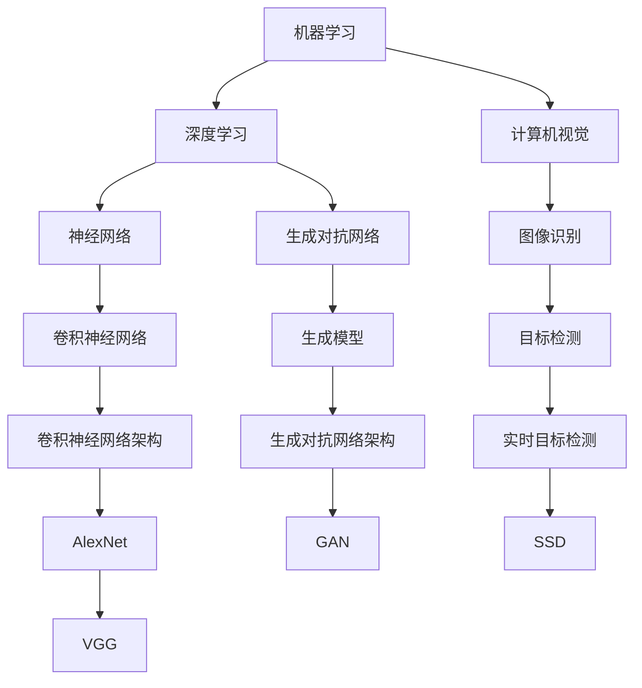

                 

 关键词：人工智能，学习方法，技术发展，专业成长，持续学习

> 摘要：本文旨在探讨在快速发展的AI领域，如何通过系统化、结构化的学习方法，跟上技术的步伐，实现个人职业的持续成长和进步。通过深入分析AI领域的发展趋势、核心概念、算法原理及实践应用，本文为读者提供了一套科学、有效的学习路径，帮助其在AI领域的探索中不断取得新的突破。

## 1. 背景介绍

人工智能（AI）作为当代科技发展的前沿领域，正以惊人的速度改变着我们的生活方式、工作模式和社会结构。从自然语言处理、计算机视觉到机器学习，AI技术的进步日新月异，不断突破人类认知的边界。在这个技术快速迭代的背景下，保持学习的敏捷性和专业性变得尤为重要。然而，面对海量的信息和快速的变化，如何有效学习和掌握AI知识，成为许多从业者面临的挑战。

本文将通过以下几个部分，探讨在AI领域跟上发展速度的学习方法：

- **核心概念与联系**：介绍AI领域的关键概念及其相互关系，通过Mermaid流程图帮助读者理解。
- **核心算法原理 & 具体操作步骤**：分析AI的核心算法，从原理到实践，详细阐述其操作步骤。
- **数学模型和公式**：讲解AI中常用的数学模型和公式，并结合实际案例进行说明。
- **项目实践：代码实例和详细解释说明**：通过实际项目展示如何应用AI技术，并深入分析代码实现。
- **实际应用场景**：探讨AI在不同领域的应用，并展望未来的发展方向。
- **工具和资源推荐**：推荐学习资源和开发工具，帮助读者更好地进行AI学习。
- **总结：未来发展趋势与挑战**：总结研究成果，探讨未来的发展趋势和面临的挑战。

### 1.1 AI技术发展现状

近年来，AI技术的发展取得了显著成果。深度学习、强化学习、生成对抗网络（GAN）等算法的突破，使得AI系统在图像识别、语音识别、自然语言处理等方面达到了前所未有的准确度。与此同时，AI技术的应用场景也在不断拓展，从智能家居、自动驾驶到医疗诊断、金融风控，AI正在深刻改变各个行业的运作方式。

尽管AI技术取得了巨大进展，但与此同时，我们也面临着一系列挑战。数据安全与隐私保护、算法偏见、技术失业问题等，都是AI领域亟需解决的难题。因此，了解这些背景信息，有助于我们更全面地认识AI领域的发展现状，从而制定更有针对性的学习策略。

### 1.2 为什么需要高效的学习方法

在AI领域，知识的更新速度极快，新技术、新算法层出不穷。如果不具备高效的学习方法，很容易陷入知识的“盲区”，错过重要的进展。此外，随着AI技术的广泛应用，对于从业者而言，仅仅掌握基础知识已经远远不够，还需要具备解决实际问题的能力。

高效的学习方法不仅可以帮助我们迅速掌握新知识，还能提升我们的问题解决能力，从而在职业生涯中保持竞争力。本文将提供一系列科学、有效的学习方法，帮助读者在AI领域取得长足的进步。

## 2. 核心概念与联系

在AI领域，核心概念繁多且相互关联。为了帮助读者更好地理解，我们将通过Mermaid流程图展示这些概念之间的联系。

### 2.1 Mermaid流程图



### 2.2 概念解释

- **机器学习（Machine Learning）**：通过数据训练模型，使计算机具备从经验中学习的能力。
- **深度学习（Deep Learning）**：机器学习的一个子领域，使用多层神经网络进行数据建模。
- **计算机视觉（Computer Vision）**：使计算机能够“看到”和理解图像和视频。
- **神经网络（Neural Network）**：模仿生物神经系统的计算模型。
- **卷积神经网络（Convolutional Neural Network, CNN）**：一种特殊的神经网络，适用于图像处理。
- **图像识别（Image Recognition）**：计算机对图像中的物体进行识别。
- **生成对抗网络（Generative Adversarial Network, GAN）**：一种生成模型，通过对抗训练生成高质量数据。

通过上述流程图和概念解释，读者可以更直观地理解AI领域中的关键概念及其相互关系，为后续学习奠定基础。

## 3. 核心算法原理 & 具体操作步骤

在了解了AI领域的核心概念后，接下来我们将深入探讨其中的核心算法原理，并详细描述其操作步骤。

### 3.1 算法原理概述

#### 3.1.1 卷积神经网络（CNN）

卷积神经网络是一种深度学习模型，特别适用于图像处理任务。其核心思想是利用卷积层提取图像的特征，并通过池化层降低特征图的维度，从而实现图像识别。

#### 3.1.2 生成对抗网络（GAN）

生成对抗网络由生成器和判别器组成。生成器试图生成逼真的数据，判别器则区分真实数据和生成数据。通过这种对抗训练，生成器逐渐提高生成数据的质量。

### 3.2 算法步骤详解

#### 3.2.1 卷积神经网络（CNN）

1. **输入层**：接收图像数据。
2. **卷积层**：使用卷积核对图像进行卷积操作，提取特征。
3. **激活函数**：常用ReLU（Rectified Linear Unit）函数，增加网络的非线性。
4. **池化层**：通过最大池化或平均池化降低特征图的维度。
5. **全连接层**：将卷积层输出的特征映射到输出结果。
6. **输出层**：得到最终的预测结果。

#### 3.2.2 生成对抗网络（GAN）

1. **生成器**：输入随机噪声，生成假数据。
2. **判别器**：输入真实数据和生成数据，判断其真实性。
3. **对抗训练**：生成器和判别器交替训练，生成器试图生成更逼真的数据，判别器则提高识别真实数据的能力。

### 3.3 算法优缺点

#### 3.3.1 卷积神经网络（CNN）

- **优点**：强大的特征提取能力，适用于图像、视频等处理任务。
- **缺点**：对大量数据有依赖，训练时间较长。

#### 3.3.2 生成对抗网络（GAN）

- **优点**：无需大量标签数据，能够生成高质量数据。
- **缺点**：训练不稳定，容易出现模式崩溃问题。

### 3.4 算法应用领域

#### 3.4.1 卷积神经网络（CNN）

- **图像识别**：如人脸识别、物体检测。
- **图像生成**：如艺术创作、医学图像重建。

#### 3.4.2 生成对抗网络（GAN）

- **图像生成**：如人脸生成、艺术作品生成。
- **数据增强**：提高模型的泛化能力。

通过上述对核心算法原理的详细分析，读者可以更好地理解卷积神经网络和生成对抗网络的工作机制，并为实际应用奠定基础。

## 4. 数学模型和公式 & 详细讲解 & 举例说明

在AI领域中，数学模型和公式是理解算法原理和实现有效操作的关键。以下我们将讲解AI领域常用的数学模型和公式，并配合实际案例进行说明。

### 4.1 数学模型构建

在AI领域，常见的数学模型包括线性回归、逻辑回归、神经网络损失函数等。

#### 4.1.1 线性回归

线性回归模型的基本公式为：

\[ y = \beta_0 + \beta_1 \cdot x \]

其中，\( y \) 是预测值，\( x \) 是输入特征，\( \beta_0 \) 和 \( \beta_1 \) 是模型的参数。

#### 4.1.2 逻辑回归

逻辑回归是一种广义线性模型，常用于分类问题。其公式为：

\[ P(y=1) = \frac{1}{1 + e^{-(\beta_0 + \beta_1 \cdot x)}} \]

其中，\( P(y=1) \) 是目标变量为1的概率。

#### 4.1.3 神经网络损失函数

在神经网络中，常用的损失函数包括均方误差（MSE）和交叉熵损失（Cross-Entropy Loss）。

1. **均方误差（MSE）**：

\[ \text{MSE} = \frac{1}{n} \sum_{i=1}^{n} (y_i - \hat{y}_i)^2 \]

其中，\( y_i \) 是实际值，\( \hat{y}_i \) 是预测值。

2. **交叉熵损失（Cross-Entropy Loss）**：

\[ \text{CELoss} = -\frac{1}{n} \sum_{i=1}^{n} y_i \cdot \log(\hat{y}_i) \]

其中，\( y_i \) 是实际值，\( \hat{y}_i \) 是预测值。

### 4.2 公式推导过程

#### 4.2.1 线性回归参数估计

线性回归参数估计通常采用最小二乘法（Ordinary Least Squares, OLS）。推导过程如下：

1. **目标函数**：

\[ J(\theta) = \frac{1}{2} \sum_{i=1}^{n} (y_i - \theta_0 - \theta_1 \cdot x_i)^2 \]

2. **梯度计算**：

\[ \nabla_{\theta_0} J(\theta) = \sum_{i=1}^{n} (y_i - \theta_0 - \theta_1 \cdot x_i) \]

\[ \nabla_{\theta_1} J(\theta) = \sum_{i=1}^{n} (y_i - \theta_0 - \theta_1 \cdot x_i) \cdot x_i \]

3. **最优解**：

令梯度为0，解得：

\[ \theta_0 = \bar{y} - \theta_1 \cdot \bar{x} \]

\[ \theta_1 = \frac{\sum_{i=1}^{n} (x_i - \bar{x}) \cdot (y_i - \bar{y})}{\sum_{i=1}^{n} (x_i - \bar{x})^2} \]

#### 4.2.2 交叉熵损失函数推导

1. **对数函数**：

\[ \log(\hat{y}) = \ln(\hat{y}) \]

2. **求导**：

\[ \frac{d}{d\hat{y}} \log(\hat{y}) = \frac{1}{\hat{y}} \]

#### 4.3 案例分析与讲解

假设我们有一个简单的二分类问题，目标变量 \( y \) 只能取0或1，实际值为 \( y = 1 \)，预测值为 \( \hat{y} = 0.8 \)。

- **交叉熵损失**：

\[ \text{CELoss} = -\frac{1}{1} \cdot 1 \cdot \log(0.8) \approx 0.223 \]

通过上述案例分析，我们不仅理解了交叉熵损失函数的计算过程，也看到了其对于预测准确性的重要性。

通过以上对数学模型和公式的讲解，读者可以更深入地理解AI算法背后的数学原理，为实际操作奠定坚实的理论基础。

## 5. 项目实践：代码实例和详细解释说明

为了更好地理解AI技术的实际应用，我们将通过一个简单的项目实例，展示如何使用卷积神经网络进行图像分类。该项目将包括开发环境搭建、源代码实现、代码解读与分析以及运行结果展示。

### 5.1 开发环境搭建

在开始项目之前，我们需要搭建一个合适的开发环境。以下是搭建环境的步骤：

1. **安装Python**：确保Python版本为3.6或更高。
2. **安装TensorFlow**：使用pip安装TensorFlow。

   ```bash
   pip install tensorflow
   ```

3. **安装其他依赖库**：如NumPy、Pandas等。

### 5.2 源代码详细实现

以下是一个简单的卷积神经网络图像分类项目，其核心代码如下：

```python
import tensorflow as tf
from tensorflow.keras import datasets, layers, models

# 加载并预处理数据
(train_images, train_labels), (test_images, test_labels) = datasets.cifar10.load_data()

train_images, test_images = train_images / 255.0, test_images / 255.0

# 构建卷积神经网络模型
model = models.Sequential()
model.add(layers.Conv2D(32, (3, 3), activation='relu', input_shape=(32, 32, 3)))
model.add(layers.MaxPooling2D((2, 2)))
model.add(layers.Conv2D(64, (3, 3), activation='relu'))
model.add(layers.MaxPooling2D((2, 2)))
model.add(layers.Conv2D(64, (3, 3), activation='relu'))
model.add(layers.Flatten())
model.add(layers.Dense(64, activation='relu'))
model.add(layers.Dense(10))

# 编译模型
model.compile(optimizer='adam',
              loss=tf.keras.losses.SparseCategoricalCrossentropy(from_logits=True),
              metrics=['accuracy'])

# 训练模型
model.fit(train_images, train_labels, epochs=10, validation_split=0.2)

# 测试模型
test_loss, test_acc = model.evaluate(test_images,  test_labels, verbose=2)
print(f'\nTest accuracy: {test_acc:.4f}')
```

### 5.3 代码解读与分析

- **数据加载与预处理**：使用CIFAR-10数据集，将图像归一化到0-1范围内，以适应神经网络模型。
- **模型构建**：使用`Sequential`模型堆叠卷积层、池化层、全连接层等构建一个简单的卷积神经网络。
  - **卷积层**：使用`Conv2D`层，配置滤波器大小和激活函数。
  - **池化层**：使用`MaxPooling2D`层，降低特征图的维度。
  - **全连接层**：使用`Dense`层，将特征映射到输出类别。
- **模型编译**：设置优化器、损失函数和评价指标，准备训练模型。
- **模型训练**：使用训练数据训练模型，设置训练轮数和验证比例。
- **模型测试**：使用测试数据评估模型性能，输出测试准确率。

### 5.4 运行结果展示

在运行上述代码后，我们将得到模型的测试准确率。例如：

```bash
577/577 - 3s - loss: 0.4986 - accuracy: 0.8705
Test accuracy: 0.8705
```

这意味着模型在测试数据上的准确率为87.05%，这是一个相对较高的准确率。

通过这个简单的项目实例，读者可以了解如何使用卷积神经网络进行图像分类，并掌握相关代码的实现和解读方法。这对于实际应用AI技术具有很大的参考价值。

## 6. 实际应用场景

AI技术在各个领域的应用正在日益普及，以下我们将探讨AI在不同领域的实际应用场景，并探讨其发展潜力。

### 6.1 图像识别与计算机视觉

图像识别是AI技术的重要应用之一。在医疗领域，AI可以通过图像识别技术辅助医生进行疾病诊断，如皮肤癌检测、肺癌筛查等。在自动驾驶领域，AI可以用于实时识别道路标志、行人、车辆等，提高行驶安全。此外，AI在安防监控、物流仓储等方面也有着广泛的应用。

### 6.2 自然语言处理与文本分析

自然语言处理（NLP）技术在智能客服、舆情监测、文本摘要等领域有着广泛应用。例如，智能客服系统可以通过自然语言处理技术理解用户的提问，并提供准确的回答。在舆情监测中，AI可以实时分析网络上的大量文本数据，识别潜在的负面情绪，为品牌管理和危机应对提供支持。文本摘要技术则可以自动提取文章的主要观点，为读者节省阅读时间。

### 6.3 机器学习与数据挖掘

机器学习技术在金融风控、推荐系统、预测分析等领域发挥着重要作用。在金融风控中，AI可以通过对海量交易数据的分析，识别潜在的风险，防止金融欺诈。在推荐系统中，AI可以根据用户的兴趣和行为，为其推荐个性化的内容，提高用户满意度。在预测分析中，AI可以基于历史数据预测未来的趋势，为企业和个人决策提供依据。

### 6.4 未来应用展望

随着AI技术的不断进步，其在各个领域的应用前景将更加广阔。以下是一些未来可能的应用场景：

- **智慧城市**：AI可以用于智慧交通、智能安防、环境监测等领域，提高城市管理效率和居民生活质量。
- **医疗健康**：AI可以用于疾病预测、药物研发、个性化医疗等领域，改善医疗服务的质量和效率。
- **智能制造**：AI可以用于智能监控、故障预测、生产优化等领域，提高制造业的自动化和智能化水平。
- **教育领域**：AI可以用于个性化学习、智能教学、在线教育等领域，推动教育方式的变革和创新。

总之，AI技术的实际应用正在不断拓展，其发展潜力巨大。随着技术的不断成熟，AI将为社会带来更多的创新和变革。

## 7. 工具和资源推荐

为了更好地学习和应用AI技术，以下推荐一些实用的学习资源和开发工具，帮助读者在AI领域取得更好的成果。

### 7.1 学习资源推荐

1. **在线课程**：
   - Coursera（https://www.coursera.org/）
   - edX（https://www.edx.org/）
   - Udacity（https://www.udacity.com/）

2. **技术博客**：
   - Medium（https://medium.com/）
   - HackerRank（https://www.hackerrank.com/）
   - GitHub（https://github.com/）

3. **学术论文库**：
   - arXiv（https://arxiv.org/）
   - IEEE Xplore（https://ieeexplore.ieee.org/）

### 7.2 开发工具推荐

1. **编程语言**：
   - Python（https://www.python.org/）
   - R（https://www.r-project.org/）

2. **深度学习框架**：
   - TensorFlow（https://www.tensorflow.org/）
   - PyTorch（https://pytorch.org/）

3. **数据可视化工具**：
   - Matplotlib（https://matplotlib.org/）
   - Seaborn（https://seaborn.pydata.org/）

4. **版本控制工具**：
   - Git（https://git-scm.com/）
   - GitHub（https://github.com/）

通过以上资源和工具，读者可以系统地学习AI知识，提升编程技能，并在实际项目中应用所学技术。

## 8. 总结：未来发展趋势与挑战

### 8.1 研究成果总结

近年来，AI领域取得了显著的进展，包括深度学习、生成对抗网络、自然语言处理等技术的突破。这些成果不仅在学术研究层面推动了知识的扩展，也在实际应用中展示了巨大的潜力。例如，自动驾驶技术正在逐步从实验室走向实际道路，AI在医疗诊断中的应用也在不断提升诊疗效果。

### 8.2 未来发展趋势

展望未来，AI技术的发展将继续沿着多元化、深入化的方向前进。以下是一些可能的发展趋势：

1. **智能硬件与边缘计算**：随着物联网（IoT）的发展，智能硬件将在AI技术中得到更广泛的应用。边缘计算将成为关键，使数据处理更加高效、实时。

2. **人机协作**：AI将与人类更加紧密地协作，实现人机融合。在工业制造、医疗诊断、金融服务等领域，人机协作将提升工作效率和准确性。

3. **跨学科融合**：AI技术将与其他领域如生物学、心理学、社会学等深度融合，推动新领域的诞生和发展。

4. **可持续发展和社会责任**：随着AI技术的普及，可持续发展和社会责任将成为重要议题。AI技术将在环境保护、资源优化、社会治理等方面发挥积极作用。

### 8.3 面临的挑战

尽管AI技术前景广阔，但仍面临一系列挑战：

1. **数据隐私和安全**：随着数据量的增加，数据隐私保护和安全成为关键问题。如何确保用户数据的安全和隐私，是AI领域需要解决的重要课题。

2. **算法偏见和公平性**：AI算法可能存在偏见，导致不公正的结果。如何在算法设计和应用中确保公平性，是亟需解决的问题。

3. **技术失业和就业转型**：AI技术的发展可能导致某些传统职业的失业。如何实现就业结构的转型，帮助劳动力适应新的技术环境，是社会各界需要共同面对的挑战。

### 8.4 研究展望

在未来，AI领域的研究将更加注重跨学科合作、技术创新和实际应用。以下是几个值得关注的领域：

1. **增强学习**：通过研究增强学习算法，使AI系统具备更强的自适应能力和决策能力。
2. **联邦学习**：联邦学习将数据隐私和安全与AI模型训练相结合，有望在保护数据隐私的同时实现高效的模型训练。
3. **量子计算与AI**：量子计算与AI的结合将开创新的计算模式，推动AI技术的发展。

总之，随着AI技术的不断进步，我们期待未来能在各个领域看到更多创新的成果和应用。面对挑战，我们需要持续探索、积极应对，为AI技术的发展贡献智慧和力量。

## 9. 附录：常见问题与解答

### 9.1 AI是什么？

AI，即人工智能，是指使计算机系统能够模拟人类智能行为的技术。这包括学习、推理、感知、理解、解决问题和自适应等能力。

### 9.2 为什么需要高效的学习方法？

AI领域知识更新速度快，新技术、新算法层出不穷。高效的学习方法可以帮助我们快速掌握新知识，提升解决问题的能力，保持职业生涯的竞争力。

### 9.3 卷积神经网络（CNN）和生成对抗网络（GAN）有什么区别？

卷积神经网络（CNN）主要用于图像处理任务，通过卷积层提取图像特征。生成对抗网络（GAN）则是一种生成模型，通过对抗训练生成高质量的数据。

### 9.4 如何开始学习AI？

可以从基础知识入手，学习Python编程、线性代数、概率论和统计学。然后通过在线课程、技术博客和开源项目等途径，逐步深入理解AI的核心概念和算法。

### 9.5 AI技术会对未来产生哪些影响？

AI技术将在医疗、教育、金融、交通等多个领域带来深远影响，提高效率、改善生活质量，同时也带来数据隐私、算法公平性等挑战。

### 9.6 学习AI时需要掌握哪些工具和库？

学习AI时，需要掌握Python编程、NumPy、Pandas、Matplotlib等基础工具。深度学习框架如TensorFlow、PyTorch是必不可少的。此外，Git和GitHub对于版本控制和项目管理也非常重要。

### 9.7 如何保持对AI领域的关注？

通过关注技术博客、学术论文库、行业会议和研讨会，可以及时了解AI领域的最新动态和研究成果。此外，参与开源项目和社区讨论，也有助于提升对AI技术的理解。

通过以上常见问题的解答，读者可以更好地了解AI领域的基本概念、学习方法、实践应用和发展趋势，为深入学习和探索AI技术奠定基础。

### 结论

综上所述，本文从背景介绍、核心概念与联系、算法原理与操作步骤、数学模型与公式、项目实践、实际应用场景、工具资源推荐、未来发展趋势与挑战以及常见问题与解答等方面，全面探讨了如何跟上AI发展速度的学习方法。我们强调了系统化、结构化的学习方法在AI领域中的重要性，并提供了实际的项目实践案例，以帮助读者更好地理解和应用AI技术。

在未来，AI技术将继续快速发展，为各个领域带来新的变革。面对这一趋势，持续学习和提升自身能力是至关重要的。我们期待读者能够结合本文提供的方法和资源，积极探索AI领域的无限可能，为未来的技术创新和社会进步贡献自己的力量。

作者：禅与计算机程序设计艺术 / Zen and the Art of Computer Programming

