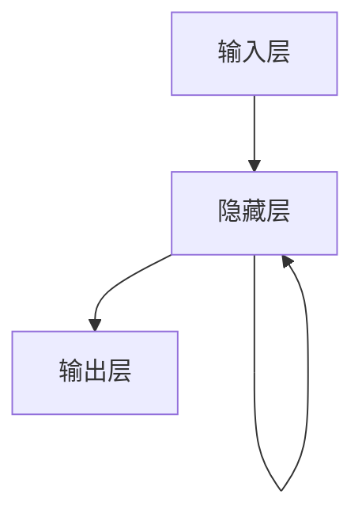

# AI人工智能深度学习算法：循环神经网络的理解与使用

## 1.背景介绍

在人工智能和深度学习的领域中，循环神经网络（Recurrent Neural Networks, RNNs）因其在处理序列数据方面的卓越表现而备受关注。无论是自然语言处理、时间序列预测，还是语音识别，RNNs 都展现出了强大的能力。本文将深入探讨 RNNs 的核心概念、算法原理、数学模型、实际应用以及未来发展趋势。

## 2.核心概念与联系

### 2.1 循环神经网络的基本概念

循环神经网络是一种能够处理序列数据的神经网络，其独特之处在于它具有“记忆”功能。RNNs 通过在网络中引入循环连接，使得当前时刻的输出不仅依赖于当前的输入，还依赖于前一时刻的状态。

### 2.2 RNNs 与传统神经网络的区别

传统的前馈神经网络（Feedforward Neural Networks, FNNs）在处理独立同分布的数据时表现良好，但在处理序列数据时却显得力不从心。RNNs 通过其循环结构，能够捕捉到数据中的时间依赖性，从而在处理序列数据时表现出色。

### 2.3 RNNs 的变种

RNNs 有多种变种，包括长短期记忆网络（Long Short-Term Memory, LSTM）和门控循环单元（Gated Recurrent Unit, GRU）。这些变种通过引入门控机制，解决了传统 RNNs 中的梯度消失和梯度爆炸问题。

## 3.核心算法原理具体操作步骤

### 3.1 RNNs 的基本结构

RNNs 的基本结构可以用以下 Mermaid 流程图表示：



### 3.2 前向传播

在 RNNs 中，前向传播的过程如下：

1. 输入序列 $x = (x_1, x_2, ..., x_T)$ 逐步输入到网络中。
2. 在每个时间步 $t$，计算隐藏状态 $h_t$：
   $$
   h_t = \sigma(W_{xh} x_t + W_{hh} h_{t-1} + b_h)
   $$
3. 计算输出 $y_t$：
   $$
   y_t = \phi(W_{hy} h_t + b_y)
   $$

### 3.3 反向传播

RNNs 的反向传播过程称为“反向传播通过时间”（Backpropagation Through Time, BPTT）。其基本步骤如下：

1. 计算损失函数 $L$ 对输出 $y_t$ 的梯度。
2. 通过时间反向传播，计算损失函数 $L$ 对隐藏状态 $h_t$ 的梯度。
3. 更新权重矩阵 $W_{xh}$、$W_{hh}$ 和 $W_{hy}$。

## 4.数学模型和公式详细讲解举例说明

### 4.1 数学模型

RNNs 的数学模型可以用以下公式表示：

1. 隐藏状态更新公式：
   $$
   h_t = \sigma(W_{xh} x_t + W_{hh} h_{t-1} + b_h)
   $$
2. 输出计算公式：
   $$
   y_t = \phi(W_{hy} h_t + b_y)
   $$

### 4.2 举例说明

假设我们有一个简单的序列预测任务，输入序列为 $x = (1, 2, 3)$，目标输出为 $y = (2, 3, 4)$。我们可以通过以下步骤进行计算：

1. 初始化权重矩阵和偏置向量。
2. 逐步输入序列 $x$，计算每个时间步的隐藏状态 $h_t$ 和输出 $y_t$。
3. 计算损失函数，并通过 BPTT 更新权重。

## 5.项目实践：代码实例和详细解释说明

### 5.1 环境准备

首先，我们需要安装必要的库：

```bash
pip install numpy tensorflow
```

### 5.2 代码实例

以下是一个简单的 RNN 实现示例：

```python
import numpy as np
import tensorflow as tf
from tensorflow.keras.models import Sequential
from tensorflow.keras.layers import SimpleRNN, Dense

# 数据准备
x_train = np.array([[1, 2, 3], [2, 3, 4], [3, 4, 5]])
y_train = np.array([[2, 3, 4], [3, 4, 5], [4, 5, 6]])

# 模型构建
model = Sequential()
model.add(SimpleRNN(10, input_shape=(3, 1)))
model.add(Dense(3))

# 模型编译
model.compile(optimizer='adam', loss='mse')

# 模型训练
model.fit(x_train, y_train, epochs=100)

# 模型预测
x_test = np.array([[4, 5, 6]])
y_pred = model.predict(x_test)
print(y_pred)
```

### 5.3 详细解释

1. 数据准备：我们构建了一个简单的序列数据集。
2. 模型构建：使用 Keras 构建一个包含一个 RNN 层和一个全连接层的模型。
3. 模型编译：使用 Adam 优化器和均方误差损失函数。
4. 模型训练：训练模型 100 个 epoch。
5. 模型预测：使用训练好的模型进行预测。

## 6.实际应用场景

### 6.1 自然语言处理

RNNs 在自然语言处理（NLP）中的应用非常广泛，包括语言模型、机器翻译、文本生成等。

### 6.2 时间序列预测

RNNs 在时间序列预测中的应用也非常成功，如股票价格预测、天气预报等。

### 6.3 语音识别

RNNs 在语音识别中的应用包括语音到文本转换、语音情感分析等。

## 7.工具和资源推荐

### 7.1 开发工具

- TensorFlow：一个开源的深度学习框架，支持 RNNs 的实现。
- PyTorch：另一个流行的深度学习框架，具有灵活的 RNNs 实现。

### 7.2 学习资源

- 《深度学习》：Ian Goodfellow 等人编写的经典教材，详细介绍了 RNNs 的原理和应用。
- Coursera 和 Udacity 上的深度学习课程：提供了丰富的 RNNs 学习资源和实践项目。

## 8.总结：未来发展趋势与挑战

### 8.1 未来发展趋势

随着计算能力的提升和数据量的增加，RNNs 的应用前景将更加广阔。未来，RNNs 将在更多领域展现其强大的能力，如自动驾驶、智能家居等。

### 8.2 挑战

尽管 RNNs 在许多领域取得了成功，但其训练过程中的梯度消失和梯度爆炸问题仍然是一个挑战。此外，RNNs 的计算复杂度较高，训练时间较长，这也是需要解决的问题。

## 9.附录：常见问题与解答

### 9.1 什么是梯度消失和梯度爆炸？

梯度消失和梯度爆炸是 RNNs 训练过程中常见的问题。梯度消失指的是在反向传播过程中，梯度逐渐变小，导致网络无法更新权重。梯度爆炸则是梯度逐渐变大，导致网络权重更新过大。

### 9.2 如何解决梯度消失和梯度爆炸问题？

可以通过使用 LSTM 和 GRU 等变种 RNNs 来解决这些问题。这些变种引入了门控机制，有效地控制了梯度的传播。

### 9.3 RNNs 与 LSTM、GRU 有何区别？

RNNs 是一种基本的循环神经网络结构，而 LSTM 和 GRU 是其变种。LSTM 和 GRU 通过引入门控机制，解决了 RNNs 中的梯度消失和梯度爆炸问题。

---

作者：禅与计算机程序设计艺术 / Zen and the Art of Computer Programming