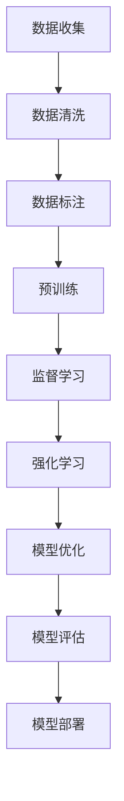

# InstructGPT原理与代码实例讲解

## 1.背景介绍

InstructGPT是OpenAI推出的一种基于GPT-3的改进模型，旨在通过更好地理解和执行用户指令来提升自然语言处理的效果。传统的GPT-3模型虽然在生成自然语言文本方面表现出色，但在执行具体指令时往往会出现理解偏差或生成不相关内容的问题。InstructGPT通过引入人类反馈和优化训练过程，显著提升了模型在执行指令方面的准确性和可靠性。

## 2.核心概念与联系

### 2.1 GPT-3简介

GPT-3（Generative Pre-trained Transformer 3）是OpenAI开发的第三代语言生成模型，基于Transformer架构，具有1750亿个参数。它通过大规模的无监督学习，从海量文本数据中学习语言模式和结构，能够生成高质量的自然语言文本。

### 2.2 InstructGPT的改进

InstructGPT在GPT-3的基础上进行了以下改进：
- **人类反馈**：通过收集和利用人类反馈，指导模型更好地理解和执行指令。
- **优化训练**：采用强化学习和监督学习相结合的方法，优化模型的训练过程。
- **指令数据集**：构建了一个专门的指令数据集，用于训练和评估模型。

### 2.3 核心联系

InstructGPT与GPT-3的核心联系在于它们都基于Transformer架构，并且通过大规模预训练来学习语言模式。然而，InstructGPT通过引入人类反馈和优化训练过程，显著提升了模型在执行具体指令方面的表现。

## 3.核心算法原理具体操作步骤

### 3.1 数据收集与预处理

InstructGPT的训练数据包括大量的指令和相应的执行结果。这些数据通过以下步骤进行收集和预处理：
1. **数据收集**：从各种来源收集包含指令和执行结果的文本数据。
2. **数据清洗**：去除噪声数据，确保数据的质量和一致性。
3. **数据标注**：通过人类标注，确保指令和执行结果的准确性。

### 3.2 模型训练

InstructGPT的训练过程包括以下几个步骤：
1. **预训练**：使用大规模无监督学习对模型进行预训练，学习语言模式和结构。
2. **监督学习**：使用标注的指令数据集对模型进行监督学习，优化模型的指令执行能力。
3. **强化学习**：通过人类反馈和强化学习，进一步优化模型的表现。

### 3.3 模型优化

模型优化包括以下几个方面：
1. **超参数调优**：通过实验和验证，选择最佳的超参数配置。
2. **模型评估**：使用专门的评估指标和数据集，对模型进行评估和验证。
3. **模型部署**：将优化后的模型部署到生产环境中，提供实际应用服务。

以下是InstructGPT的训练流程图：



## 4.数学模型和公式详细讲解举例说明

### 4.1 Transformer架构

Transformer架构是InstructGPT的基础，其核心组件包括自注意力机制和前馈神经网络。Transformer的输入是一个序列，输出也是一个序列，通过多层堆叠实现复杂的语言建模能力。

### 4.2 自注意力机制

自注意力机制的核心公式如下：

$$
\text{Attention}(Q, K, V) = \text{softmax}\left(\frac{QK^T}{\sqrt{d_k}}\right)V
$$

其中，$Q$、$K$、$V$分别表示查询、键和值矩阵，$d_k$是键的维度。

### 4.3 损失函数

InstructGPT的训练过程中使用了交叉熵损失函数：

$$
L = -\sum_{i=1}^{N} y_i \log(\hat{y}_i)
$$

其中，$y_i$是实际标签，$\hat{y}_i$是模型预测的概率。

### 4.4 强化学习

在强化学习阶段，使用了策略梯度方法来优化模型。其核心公式如下：

$$
\nabla J(\theta) = \mathbb{E}_{\pi_\theta} \left[ \nabla_\theta \log \pi_\theta(a|s) R \right]
$$

其中，$\pi_\theta$是策略，$a$是动作，$s$是状态，$R$是奖励。

## 5.项目实践：代码实例和详细解释说明

### 5.1 环境配置

首先，确保你的环境中安装了必要的库和工具，例如Python、PyTorch和Transformers库。

```bash
pip install torch transformers
```

### 5.2 数据准备

准备一个简单的指令数据集，包含指令和相应的执行结果。例如：

```json
[
    {"instruction": "翻译成法语：你好", "output": "Bonjour"},
    {"instruction": "计算2+2", "output": "4"}
]
```

### 5.3 模型训练

使用Transformers库进行模型训练：

```python
from transformers import GPT2LMHeadModel, GPT2Tokenizer, Trainer, TrainingArguments

# 加载模型和分词器
model = GPT2LMHeadModel.from_pretrained("gpt2")
tokenizer = GPT2Tokenizer.from_pretrained("gpt2")

# 准备数据集
train_data = [
    {"instruction": "翻译成法语：你好", "output": "Bonjour"},
    {"instruction": "计算2+2", "output": "4"}
]

# 数据预处理
def preprocess(data):
    inputs = tokenizer(data["instruction"], return_tensors="pt")
    outputs = tokenizer(data["output"], return_tensors="pt")
    return {"input_ids": inputs["input_ids"], "labels": outputs["input_ids"]}

train_dataset = [preprocess(item) for item in train_data]

# 训练参数
training_args = TrainingArguments(
    output_dir="./results",
    num_train_epochs=3,
    per_device_train_batch_size=2,
    save_steps=10,
    save_total_limit=2,
)

# 训练
trainer = Trainer(
    model=model,
    args=training_args,
    train_dataset=train_dataset,
)

trainer.train()
```

### 5.4 模型评估

使用验证数据集对模型进行评估：

```python
# 准备验证数据集
val_data = [
    {"instruction": "翻译成法语：再见", "output": "Au revoir"},
    {"instruction": "计算3+3", "output": "6"}
]

val_dataset = [preprocess(item) for item in val_data]

# 评估
results = trainer.evaluate(eval_dataset=val_dataset)
print(results)
```

## 6.实际应用场景

### 6.1 客服机器人

InstructGPT可以用于构建智能客服机器人，通过理解用户的指令，提供准确的回答和解决方案。

### 6.2 翻译工具

InstructGPT可以用于开发高效的翻译工具，通过理解和执行翻译指令，提供高质量的翻译结果。

### 6.3 编程助手

InstructGPT可以用于开发编程助手，通过理解编程指令，提供代码生成和问题解决方案。

## 7.工具和资源推荐

### 7.1 开发工具

- **PyTorch**：用于深度学习模型的开发和训练。
- **Transformers**：用于加载和使用预训练的语言模型。

### 7.2 数据集

- **OpenAI指令数据集**：包含大量的指令和执行结果，用于训练和评估InstructGPT模型。

### 7.3 参考文献

- **Attention is All You Need**：Transformer架构的经典论文。
- **Language Models are Few-Shot Learners**：GPT-3模型的介绍论文。

## 8.总结：未来发展趋势与挑战

InstructGPT通过引入人类反馈和优化训练过程，显著提升了模型在执行指令方面的表现。然而，未来仍然面临一些挑战，例如：
- **数据质量**：高质量的指令数据集仍然是模型训练的关键。
- **模型泛化**：如何提升模型在不同场景下的泛化能力。
- **计算资源**：大规模模型的训练和部署需要大量的计算资源。

未来，随着技术的不断进步和优化，InstructGPT有望在更多实际应用场景中发挥重要作用。

## 9.附录：常见问题与解答

### 9.1 InstructGPT与GPT-3的主要区别是什么？

InstructGPT在GPT-3的基础上，通过引入人类反馈和优化训练过程，显著提升了模型在执行指令方面的表现。

### 9.2 如何获取InstructGPT的训练数据？

可以通过OpenAI提供的指令数据集，或者自行收集和标注指令数据。

### 9.3 InstructGPT的应用场景有哪些？

InstructGPT可以应用于智能客服、翻译工具、编程助手等多个领域。

### 9.4 如何优化InstructGPT的训练过程？

可以通过超参数调优、模型评估和强化学习等方法，优化InstructGPT的训练过程。

### 9.5 InstructGPT的未来发展方向是什么？

未来，InstructGPT有望在更多实际应用场景中发挥重要作用，同时面临数据质量、模型泛化和计算资源等挑战。

---

作者：禅与计算机程序设计艺术 / Zen and the Art of Computer Programming