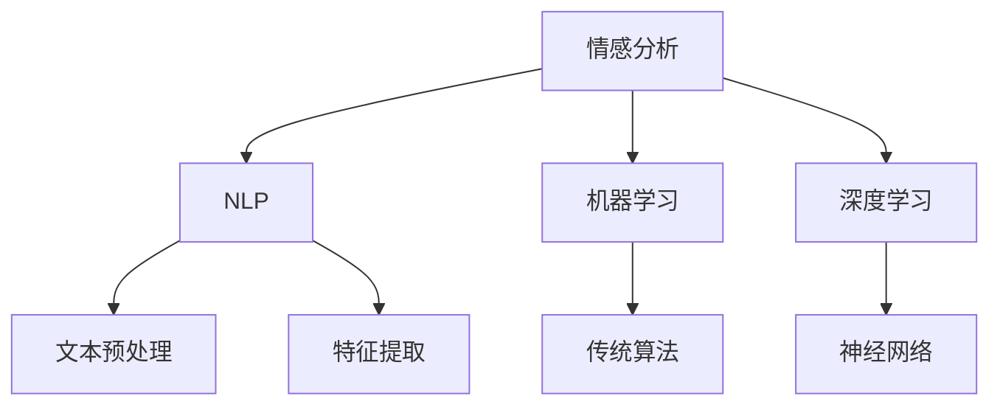
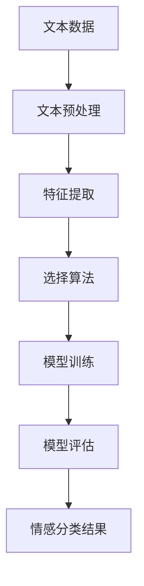

# Python机器学习实战：基于文本数据进行情感分析

## 1.背景介绍

在当今信息爆炸的时代，社交媒体、新闻网站和在线评论平台每天都会产生大量的文本数据。这些文本数据中蕴含着丰富的情感信息，能够反映用户的情绪、态度和观点。情感分析（Sentiment Analysis）作为自然语言处理（NLP）中的一个重要分支，旨在通过分析文本数据来识别和提取其中的情感信息。情感分析在市场调研、品牌监控、舆情分析等领域有着广泛的应用。

Python作为一种强大且易于使用的编程语言，拥有丰富的机器学习和自然语言处理库，使得基于Python进行情感分析变得相对简单和高效。本文将深入探讨如何使用Python进行基于文本数据的情感分析，涵盖从核心概念到实际项目实践的各个方面。

## 2.核心概念与联系

### 2.1 情感分析的定义

情感分析是指通过自然语言处理、文本分析和计算语言学等技术，从文本数据中提取、识别和分类情感信息的过程。情感通常被分为正面、负面和中性三类。

### 2.2 自然语言处理（NLP）

自然语言处理是计算机科学与人工智能的一个重要领域，旨在实现计算机对人类语言的理解、生成和处理。NLP技术在情感分析中起着至关重要的作用。

### 2.3 机器学习与深度学习

机器学习是人工智能的一个分支，通过从数据中学习模型来进行预测和决策。深度学习是机器学习的一个子领域，利用多层神经网络来处理复杂的数据。情感分析可以使用传统的机器学习算法（如朴素贝叶斯、支持向量机）或深度学习算法（如卷积神经网络、循环神经网络）来实现。

### 2.4 核心概念联系图



## 3.核心算法原理具体操作步骤

### 3.1 文本预处理

文本预处理是情感分析的第一步，主要包括以下几个步骤：

1. **分词**：将文本分割成单独的词语或标记。
2. **去除停用词**：去除对情感分析无关紧要的词语，如“的”、“是”等。
3. **词干提取**：将词语还原为其词干形式。
4. **文本规范化**：将文本中的字符转换为统一的格式，如小写化。

### 3.2 特征提取

特征提取是将文本数据转换为机器学习算法可以处理的数值特征的过程。常用的方法包括：

1. **词袋模型（Bag of Words, BoW）**：将文本表示为词频向量。
2. **TF-IDF**：考虑词频和逆文档频率的加权方法。
3. **词向量（Word Embeddings）**：如Word2Vec、GloVe等。

### 3.3 选择算法

根据具体需求选择合适的机器学习或深度学习算法：

1. **传统机器学习算法**：如朴素贝叶斯、支持向量机、逻辑回归等。
2. **深度学习算法**：如卷积神经网络（CNN）、循环神经网络（RNN）、长短期记忆网络（LSTM）等。

### 3.4 模型训练与评估

1. **模型训练**：使用训练数据训练模型。
2. **模型评估**：使用验证数据评估模型性能，常用的评估指标包括准确率、精确率、召回率和F1分数。

### 3.5 核心算法流程图



## 4.数学模型和公式详细讲解举例说明

### 4.1 词袋模型（BoW）

词袋模型是一种简单而有效的特征提取方法。假设有一个包含 $N$ 个文档的语料库，词汇表大小为 $V$。每个文档可以表示为一个 $V$ 维的向量，其中每个元素表示词汇表中对应词语在该文档中的出现次数。

$$
\mathbf{d}_i = [f_{i1}, f_{i2}, \ldots, f_{iV}]
$$

其中，$f_{ij}$ 表示词汇表中第 $j$ 个词在第 $i$ 个文档中的出现次数。

### 4.2 TF-IDF

TF-IDF 是一种加权方法，考虑了词频（Term Frequency, TF）和逆文档频率（Inverse Document Frequency, IDF）。TF-IDF 的计算公式如下：

$$
\text{TF-IDF}(t, d) = \text{TF}(t, d) \times \text{IDF}(t)
$$

其中，$\text{TF}(t, d)$ 表示词 $t$ 在文档 $d$ 中的词频，$\text{IDF}(t)$ 表示词 $t$ 的逆文档频率，计算公式为：

$$
\text{IDF}(t) = \log \frac{N}{n_t}
$$

其中，$N$ 是文档总数，$n_t$ 是包含词 $t$ 的文档数。

### 4.3 朴素贝叶斯分类器

朴素贝叶斯分类器是一种基于贝叶斯定理的简单而高效的分类算法。假设有 $K$ 个类别，给定一个文档 $d$，其属于类别 $c_k$ 的概率为：

$$
P(c_k | d) = \frac{P(d | c_k) P(c_k)}{P(d)}
$$

由于 $P(d)$ 对所有类别是相同的，可以忽略，简化为：

$$
P(c_k | d) \propto P(d | c_k) P(c_k)
$$

假设词语之间相互独立，则有：

$$
P(d | c_k) = \prod_{i=1}^{V} P(w_i | c_k)^{f_i}
$$

其中，$w_i$ 表示词汇表中的第 $i$ 个词，$f_i$ 表示词 $w_i$ 在文档 $d$ 中的出现次数。

## 5.项目实践：代码实例和详细解释说明

### 5.1 环境准备

首先，确保安装了必要的Python库：

```bash
pip install numpy pandas scikit-learn nltk
```

### 5.2 数据加载与预处理

```python
import pandas as pd
from sklearn.model_selection import train_test_split
from sklearn.feature_extraction.text import TfidfVectorizer
from sklearn.naive_bayes import MultinomialNB
from sklearn.metrics import accuracy_score

# 加载数据
data = pd.read_csv('sentiment_data.csv')
texts = data['text']
labels = data['label']

# 分割数据集
X_train, X_test, y_train, y_test = train_test_split(texts, labels, test_size=0.2, random_state=42)

# 文本预处理和特征提取
vectorizer = TfidfVectorizer(stop_words='english')
X_train_tfidf = vectorizer.fit_transform(X_train)
X_test_tfidf = vectorizer.transform(X_test)
```

### 5.3 模型训练与评估

```python
# 训练朴素贝叶斯分类器
model = MultinomialNB()
model.fit(X_train_tfidf, y_train)

# 预测与评估
y_pred = model.predict(X_test_tfidf)
accuracy = accuracy_score(y_test, y_pred)
print(f'模型准确率: {accuracy:.2f}')
```

### 5.4 代码解释

1. **数据加载**：从CSV文件中加载文本数据和标签。
2. **数据分割**：将数据集分为训练集和测试集。
3. **文本预处理和特征提取**：使用TF-IDF对文本进行特征提取。
4. **模型训练**：使用朴素贝叶斯分类器进行训练。
5. **模型评估**：使用测试集评估模型的准确率。

## 6.实际应用场景

### 6.1 市场调研

通过分析用户评论和反馈，企业可以了解消费者对产品或服务的满意度，从而改进产品和服务。

### 6.2 品牌监控

企业可以通过情感分析监控社交媒体上的品牌提及，及时发现和应对负面舆情。

### 6.3 舆情分析

政府和媒体可以通过情感分析了解公众对热点事件的态度和情绪，辅助决策和舆论引导。

### 6.4 客户服务

情感分析可以帮助企业自动识别和处理客户服务中的负面情绪，提高客户满意度。

## 7.工具和资源推荐

### 7.1 Python库

1. **NLTK**：自然语言处理库，提供丰富的文本处理工具。
2. **scikit-learn**：机器学习库，提供多种分类、回归和聚类算法。
3. **spaCy**：高效的自然语言处理库，适用于大规模文本处理。

### 7.2 数据集

1. **IMDb**：电影评论数据集，包含大量标注的情感标签。
2. **Twitter Sentiment Analysis**：推特情感分析数据集，适用于社交媒体情感分析。

### 7.3 在线资源

1. **Kaggle**：数据科学竞赛平台，提供丰富的数据集和代码示例。
2. **GitHub**：开源代码托管平台，可以找到许多情感分析的项目和代码。

## 8.总结：未来发展趋势与挑战

### 8.1 发展趋势

1. **深度学习的应用**：随着深度学习技术的发展，情感分析的准确率和鲁棒性将进一步提高。
2. **多模态情感分析**：结合文本、图像和音频等多种数据源的情感分析将成为趋势。
3. **实时情感分析**：实时情感分析技术将广泛应用于社交媒体监控和客户服务等领域。

### 8.2 挑战

1. **数据质量**：情感分析的效果高度依赖于数据的质量和标注的准确性。
2. **语言多样性**：不同语言和文化背景下的情感表达方式不同，增加了情感分析的难度。
3. **情感复杂性**：情感是复杂多样的，单一的情感分类方法难以全面捕捉文本中的情感信息。

## 9.附录：常见问题与解答

### 9.1 如何处理文本中的噪音数据？

可以通过文本预处理步骤，如去除停用词、标点符号和特殊字符来减少噪音数据的影响。

### 9.2 如何选择合适的特征提取方法？

可以根据具体的应用场景和数据特点选择合适的特征提取方法，如词袋模型、TF-IDF或词向量。

### 9.3 如何提高情感分析的准确率？

可以尝试使用更复杂的模型（如深度学习模型）、增加训练数据量、进行超参数调优等方法来提高情感分析的准确率。

### 9.4 如何处理多语言情感分析？

可以使用多语言支持的NLP库（如spaCy）和多语言预训练模型（如BERT）来处理多语言情感分析。

### 9.5 如何应对情感分析中的数据不平衡问题？

可以通过数据采样（如过采样和欠采样）、使用加权损失函数等方法来应对数据不平衡问题。

---

作者：禅与计算机程序设计艺术 / Zen and the Art of Computer Programming