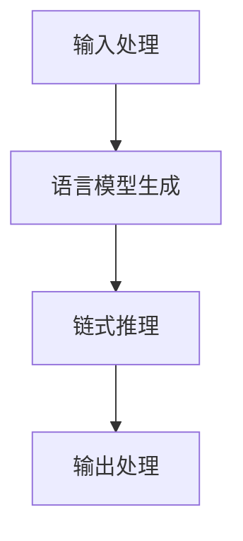

# 【LangChain编程：从入门到实践】RAG

## 1.背景介绍

在人工智能和自然语言处理领域，LangChain作为一种新兴的编程范式，正在迅速崛起。LangChain编程结合了语言模型和链式推理的优势，能够在复杂任务中实现高效的自动化处理。本文将深入探讨LangChain编程的核心概念、算法原理、数学模型、实际应用以及未来发展趋势。

## 2.核心概念与联系

### 2.1 LangChain简介

LangChain是一种结合语言模型（Language Model）和链式推理（Chain Reasoning）的编程范式。它利用语言模型的强大生成能力和链式推理的逻辑推理能力，能够在复杂任务中实现高效的自动化处理。

### 2.2 语言模型

语言模型是基于统计和机器学习的方法，用于预测文本序列中下一个词的概率。常见的语言模型包括GPT-3、BERT等。

### 2.3 链式推理

链式推理是一种逻辑推理方法，通过一系列的推理步骤，从已知信息推导出新的结论。它在知识图谱、专家系统等领域有广泛应用。

### 2.4 LangChain的优势

LangChain编程结合了语言模型和链式推理的优势，能够在复杂任务中实现高效的自动化处理。其主要优势包括：
- 高效的自动化处理能力
- 强大的生成能力
- 灵活的逻辑推理能力

## 3.核心算法原理具体操作步骤

### 3.1 LangChain编程的基本流程

LangChain编程的基本流程包括以下几个步骤：
1. **输入处理**：将输入文本转换为适合语言模型处理的格式。
2. **语言模型生成**：利用语言模型生成初步结果。
3. **链式推理**：通过一系列推理步骤，对初步结果进行逻辑推理和优化。
4. **输出处理**：将最终结果转换为用户可读的格式。

### 3.2 具体操作步骤

#### 3.2.1 输入处理

输入处理的目的是将输入文本转换为适合语言模型处理的格式。常见的方法包括分词、去停用词、词向量化等。

#### 3.2.2 语言模型生成

利用语言模型生成初步结果。以GPT-3为例，可以通过API调用生成文本。

```python
import openai

def generate_text(prompt):
    response = openai.Completion.create(
        engine="davinci",
        prompt=prompt,
        max_tokens=100
    )
    return response.choices[0].text.strip()
```

#### 3.2.3 链式推理

通过一系列推理步骤，对初步结果进行逻辑推理和优化。可以使用规则引擎或知识图谱进行推理。

```python
def chain_reasoning(initial_result):
    # 假设我们有一个简单的规则引擎
    rules = [
        {"if": "A", "then": "B"},
        {"if": "B", "then": "C"}
    ]
    result = initial_result
    for rule in rules:
        if rule["if"] in result:
            result += " " + rule["then"]
    return result
```

#### 3.2.4 输出处理

将最终结果转换为用户可读的格式。可以进行文本格式化、结果展示等。

```python
def format_output(result):
    return f"最终结果: {result}"
```

### 3.3 流程图



## 4.数学模型和公式详细讲解举例说明

### 4.1 语言模型的数学基础

语言模型的核心是计算一个给定序列的概率。对于一个序列 $w_1, w_2, ..., w_n$，其概率可以表示为：

$$
P(w_1, w_2, ..., w_n) = P(w_1) \cdot P(w_2|w_1) \cdot P(w_3|w_1, w_2) \cdot ... \cdot P(w_n|w_1, w_2, ..., w_{n-1})
$$

### 4.2 链式推理的数学基础

链式推理的核心是通过一系列的推理步骤，从已知信息推导出新的结论。假设我们有一组规则 $R$ 和一组已知事实 $F$，推理的过程可以表示为：

$$
F' = F \cup \{r \in R | \text{if } r \text{ is applicable to } F\}
$$

### 4.3 举例说明

假设我们有以下输入文本：

```
输入: "天气很好，我想去公园。"
```

通过语言模型生成初步结果：

```
初步结果: "天气很好，我想去公园。你可以带上你的朋友。"
```

通过链式推理优化结果：

```
优化结果: "天气很好，我想去公园。你可以带上你的朋友。记得带上水和零食。"
```

最终输出：

```
最终结果: "天气很好，我想去公园。你可以带上你的朋友。记得带上水和零食。"
```

## 5.项目实践：代码实例和详细解释说明

### 5.1 项目简介

我们将实现一个简单的LangChain编程项目，模拟一个智能助手，根据用户输入生成建议。

### 5.2 环境配置

首先，确保你已经安装了所需的Python库：

```bash
pip install openai
```

### 5.3 代码实例

```python
import openai

# 输入处理
def preprocess_input(input_text):
    return input_text.strip()

# 语言模型生成
def generate_text(prompt):
    response = openai.Completion.create(
        engine="davinci",
        prompt=prompt,
        max_tokens=100
    )
    return response.choices[0].text.strip()

# 链式推理
def chain_reasoning(initial_result):
    rules = [
        {"if": "公园", "then": "记得带上水和零食"}
    ]
    result = initial_result
    for rule in rules:
        if rule["if"] in result:
            result += " " + rule["then"]
    return result

# 输出处理
def format_output(result):
    return f"最终结果: {result}"

# 主函数
def main(input_text):
    preprocessed_input = preprocess_input(input_text)
    initial_result = generate_text(preprocessed_input)
    optimized_result = chain_reasoning(initial_result)
    final_output = format_output(optimized_result)
    return final_output

# 示例
input_text = "天气很好，我想去公园。"
print(main(input_text))
```

### 5.4 详细解释

1. **输入处理**：将输入文本进行预处理，去除多余的空格。
2. **语言模型生成**：利用OpenAI的GPT-3模型生成初步结果。
3. **链式推理**：根据预定义的规则，对初步结果进行优化。
4. **输出处理**：将最终结果格式化为用户可读的形式。

## 6.实际应用场景

### 6.1 智能客服

LangChain编程可以用于智能客服系统，通过结合语言模型和链式推理，提供更加智能和个性化的服务。

### 6.2 自动化写作

在自动化写作领域，LangChain编程可以帮助生成高质量的文章、报告等，提高写作效率。

### 6.3 数据分析

在数据分析领域，LangChain编程可以用于自动生成数据报告、分析结果等，提升数据分析的自动化程度。

## 7.工具和资源推荐

### 7.1 开发工具

- **Python**：LangChain编程的主要开发语言。
- **OpenAI API**：用于调用GPT-3等语言模型。
- **Jupyter Notebook**：用于代码开发和测试。

### 7.2 学习资源

- **《深度学习》**：Ian Goodfellow等著，深度学习领域的经典教材。
- **OpenAI文档**：详细介绍了OpenAI API的使用方法和示例代码。

## 8.总结：未来发展趋势与挑战

LangChain编程作为一种新兴的编程范式，具有广阔的应用前景。未来，随着语言模型和链式推理技术的不断发展，LangChain编程将会在更多领域得到应用。然而，LangChain编程也面临一些挑战，如模型的可解释性、数据隐私等问题。解决这些挑战将是未来研究的重点。

## 9.附录：常见问题与解答

### 9.1 LangChain编程的优势是什么？

LangChain编程结合了语言模型和链式推理的优势，能够在复杂任务中实现高效的自动化处理。

### 9.2 如何选择合适的语言模型？

选择语言模型时，可以根据任务的具体需求选择合适的模型。例如，GPT-3适用于生成任务，BERT适用于理解任务。

### 9.3 LangChain编程的应用场景有哪些？

LangChain编程可以应用于智能客服、自动化写作、数据分析等领域。

### 9.4 如何解决LangChain编程中的数据隐私问题？

可以通过数据加密、访问控制等技术手段，保护数据隐私。

### 9.5 LangChain编程的未来发展趋势是什么？

未来，随着语言模型和链式推理技术的不断发展，LangChain编程将会在更多领域得到应用。然而，LangChain编程也面临一些挑战，如模型的可解释性、数据隐私等问题。

---

作者：禅与计算机程序设计艺术 / Zen and the Art of Computer Programming