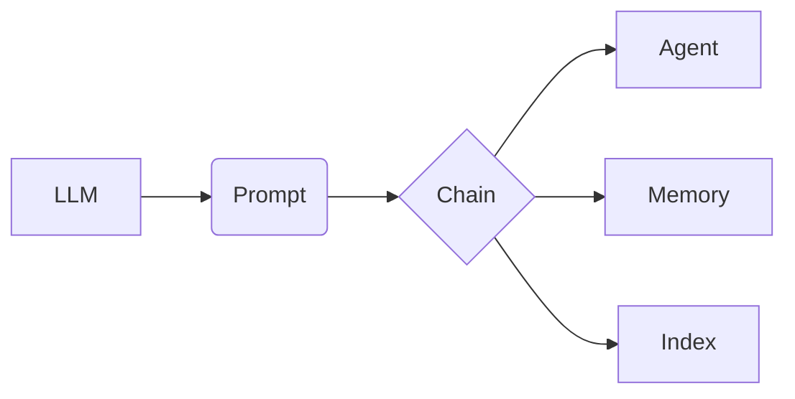

# 【LangChain编程：从入门到实践】资源和工具推荐

## 1. 背景介绍
### 1.1 LangChain的兴起
近年来,随着人工智能技术的飞速发展,大语言模型(Large Language Model, LLM)的出现为自然语言处理(Natural Language Processing, NLP)领域带来了革命性的突破。而LangChain作为一个基于LLM的应用开发框架,正在受到越来越多开发者的关注。

### 1.2 LangChain的定义
LangChain是一个基于LLM的应用开发框架,旨在帮助开发者更容易地构建基于LLM的应用程序。它提供了一系列工具和组件,可以帮助开发者快速搭建对话式AI应用、智能文档处理系统、知识图谱等。

### 1.3 LangChain的优势
相比其他NLP开发框架,LangChain的优势在于:

1. 基于先进的LLM,拥有强大的自然语言理解和生成能力。
2. 提供了丰富的工具链和组件,大大降低了开发门槛。  
3. 拥有活跃的社区支持和完善的文档,学习曲线平缓。
4. 可以与其他AI技术(如知识图谱、语音识别等)无缝集成。

## 2. 核心概念与联系
### 2.1 LLM
LLM是LangChain的核心,它为整个框架提供了强大的NLP能力。目前主流的LLM包括OpenAI的GPT系列、Google的BERT、Anthropic的Claude等。LangChain可以灵活地集成各种LLM。

### 2.2 Prompt模板
Prompt是指输入给LLM的文本序列,它决定了LLM的输出内容。在LangChain中,我们通常使用Prompt模板来动态生成Prompt,从而实现更灵活的对话交互。

### 2.3 Chains
Chain是LangChain中的一个重要概念,它将多个组件(如LLM、Prompt等)组合在一起,形成一个完整的处理流程。通过组合不同的Chain,我们可以实现更复杂的应用逻辑。

### 2.4 Agents  
Agent是一种特殊的Chain,它可以根据用户的输入,自主决定执行哪些操作。常见的Agent包括会话型Agent、问答型Agent等。使用Agent可以大大简化应用的开发。

### 2.5 Memory
Memory组件用于在多轮对话中记录和使用历史信息,使得LLM能够根据上下文生成更连贯、更准确的回复。LangChain提供了多种Memory实现,如BufferMemory、ConversationBufferMemory等。

### 2.6 索引
索引是一种数据结构,可以帮助LLM更高效地检索和利用大规模的文本数据。常见的索引技术包括向量数据库、嵌入式索引等。LangChain集成了多种主流的索引方案。

### 2.7 各概念之间的关系
下面是一个示意图,展示了LangChain核心概念之间的关系:



## 3. 核心算法原理具体操作步骤
### 3.1 Prompt生成
1. 定义Prompt模板,模板中可以包含变量占位符
2. 将具体的变量值填充到模板中,得到最终的Prompt文本
3. 将Prompt文本输入给LLM,得到输出结果

### 3.2 Chain执行
1. 定义Chain的组成部分,如LLM、Prompt等
2. 将用户输入传递给Chain
3. Chain根据预定义的逻辑,依次执行各个组件
4. 将最终结果返回给用户

### 3.3 Agent决策
1. 根据用户输入,Agent先判断需要执行哪个工具
2. 调用相应的工具,得到执行结果
3. 将工具的结果作为新的观察,输入给Agent的LLM
4. 根据LLM的输出,决定是否需要继续执行其他工具,或者返回最终结果

### 3.4 索引查询
1. 将用户输入转换为嵌入向量
2. 在向量索引中查找与输入向量最相似的文档向量
3. 取出相似文档,返回给用户或输入给LLM做进一步处理

## 4. 数学模型和公式详细讲解举例说明
### 4.1 Transformer模型
LLM的核心是Transformer模型,它使用了自注意力机制(Self-Attention)来处理文本序列。假设输入序列为 $X=(x_1,\cdots,x_n)$,则自注意力的计算过程为:

$$
\begin{aligned}
Q &= XW^Q \\
K &= XW^K \\
V &= XW^V \\
\text{Attention}(Q,K,V) &= \text{softmax}(\frac{QK^T}{\sqrt{d_k}})V
\end{aligned}
$$

其中 $W^Q, W^K, W^V$ 是可学习的参数矩阵, $d_k$ 是 $K$ 的维度。

### 4.2 余弦相似度
在向量检索中,我们通常使用余弦相似度来衡量两个向量之间的相似性。给定两个 $n$ 维向量 $\mathbf{a}=(a_1,\cdots,a_n)$ 和 $\mathbf{b}=(b_1,\cdots,b_n)$,它们的余弦相似度定义为:

$$
\cos(\theta) = \frac{\mathbf{a}\cdot\mathbf{b}}{\|\mathbf{a}\|\|\mathbf{b}\|} = \frac{\sum_{i=1}^n a_i b_i}{\sqrt{\sum_{i=1}^n a_i^2}\sqrt{\sum_{i=1}^n b_i^2}}
$$

余弦相似度的取值范围为 $[-1,1]$,值越大表示两个向量越相似。

## 5. 项目实践：代码实例和详细解释说明
下面是一个使用LangChain实现问答系统的简单示例:

```python
from langchain import OpenAI, ConversationChain, ConversationBufferMemory

# 初始化LLM
llm = OpenAI(temperature=0)

# 初始化Memory
memory = ConversationBufferMemory()
  
# 初始化Chain
chain = ConversationChain(llm=llm, memory=memory)

# 开始对话
while True:
    user_input = input("User: ")
    if user_input.lower() in ["bye", "quit"]:
        print("Assistant: Goodbye!")
        break
    
    output = chain.predict(input=user_input)
    print(f"Assistant: {output}")
```

代码解释:

1. 首先初始化一个OpenAI的LLM对象,作为问答系统的核心
2. 然后初始化一个ConversationBufferMemory对象,用于存储对话历史
3. 接着初始化一个ConversationChain对象,将LLM和Memory组合在一起 
4. 进入一个循环,不断接收用户输入,并将其传递给Chain
5. Chain根据当前输入和历史信息,生成相应的回复并输出
6. 用户输入"bye"或"quit"时,结束对话

这个例子展示了如何使用LangChain快速搭建一个基于LLM的问答系统。实际项目中,我们还可以加入更多的功能,如知识库查询、多轮对话管理等。

## 6. 实际应用场景
LangChain可以应用于多种场景,包括:

1. 客服聊天机器人:通过LangChain构建智能客服系统,自动解答用户问题,提供个性化服务。
2. 智能文档处理:利用LangChain对文档进行自动分类、摘要、关键词提取等,提高文档处理效率。  
3. 知识图谱构建:使用LangChain从非结构化文本中抽取实体和关系,辅助构建领域知识图谱。
4. 数据分析与可视化:用LangChain分析文本数据,生成数据洞察和可视化报告。
5. 个性化推荐:根据用户的历史行为和偏好,利用LangChain生成个性化的内容推荐。

## 7. 工具和资源推荐
### 7.1 LangChain官方资源
- 官网:https://langchain.com/
- GitHub:https://github.com/hwchase17/langchain
- 文档:https://langchain.readthedocs.io/

### 7.2 LLM平台
- OpenAI:https://openai.com/
- Anthropic:https://www.anthropic.com/
- Hugging Face:https://huggingface.co/

### 7.3 向量数据库 
- Faiss:https://github.com/facebookresearch/faiss
- Pinecone:https://www.pinecone.io/
- Weaviate:https://weaviate.io/

### 7.4 相关教程
- LangChain入门指南:https://zhuanlan.zhihu.com/p/620167546
- 基于LangChain的聊天机器人开发:https://zhuanlan.zhihu.com/p/622683352
- LangChain实战:搭建个人知识库助手:https://zhuanlan.zhihu.com/p/622030963

## 8. 总结：未来发展趋势与挑战
### 8.1 发展趋势
随着LLM技术的不断进步,LangChain的应用场景将更加广泛。未来LangChain有望与更多的AI技术结合,如计算机视觉、语音识别等,实现多模态的智能应用。此外,LangChain也将不断优化性能,支持更大规模的应用部署。

### 8.2 挑战
LangChain的发展也面临一些挑战:

1. LLM的推理成本较高,在某些场景下可能难以实现实时响应。
2. LLM生成的内容可能存在事实性错误,需要引入额外的校验机制。
3. 不同LLM之间的接口和性能差异较大,给开发者带来了挑战。
4. 隐私和安全问题。由于LLM需要接触大量用户数据,因此需要采取必要的隐私保护措施。

尽管存在这些挑战,但LangChain仍然是一个非常有前景的NLP应用开发框架。相信通过社区的共同努力,LangChain会变得越来越成熟和完善。

## 9. 附录：常见问题与解答
### Q1: LangChain支持哪些编程语言?
目前LangChain主要支持Python和JavaScript。未来可能会支持更多语言。

### Q2: LangChain可以与哪些LLM集成?
LangChain支持多种主流LLM,包括OpenAI GPT、Anthropic Claude、Google PaLM等。理论上,任何提供API接口的LLM都可以集成到LangChain中。

### Q3: 学习LangChain需要什么基础?
要学习LangChain,你需要具备以下基础:

1. Python或JavaScript编程能力
2. NLP和机器学习的基本概念
3. LLM的基本原理和使用方法

如果你已经具备这些基础,那么学习LangChain将会比较容易。官方文档是一个很好的学习起点。

### Q4: LangChain的性能如何?
LangChain本身对性能的影响较小,主要瓶颈在于底层的LLM。不过LangChain提供了一些优化手段,如向量索引、文本压缩等,可以在一定程度上提升性能。

### Q5: 如何处理LLM生成内容的准确性问题?
可以采取以下措施:

1. 在Prompt中引导LLM生成更准确的内容
2. 对LLM的输出进行后处理,如事实校验、语法纠错等
3. 结合知识图谱等外部知识源,提高内容的可靠性
4. 人工审核关键内容

作者：禅与计算机程序设计艺术 / Zen and the Art of Computer Programming