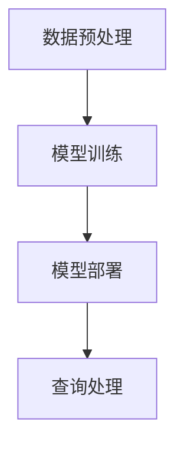

# 【大模型应用开发 动手做AI Agent】构建查询引擎和工具

## 1.背景介绍

在人工智能领域，AI Agent（智能代理）已经成为了一个热门话题。随着大模型（如GPT-3、BERT等）的发展，AI Agent的应用场景越来越广泛。无论是在自然语言处理、图像识别还是自动驾驶等领域，AI Agent都展现出了强大的潜力。本文将深入探讨如何利用大模型构建一个高效的查询引擎和工具，帮助开发者更好地理解和应用这些技术。

## 2.核心概念与联系

### 2.1 大模型

大模型是指具有大量参数和复杂结构的深度学习模型，如GPT-3、BERT等。这些模型通过大量的数据训练，能够在多种任务中表现出色。

### 2.2 AI Agent

AI Agent是一种能够自主执行任务的智能系统。它可以感知环境、做出决策并采取行动。AI Agent通常由感知模块、决策模块和执行模块组成。

### 2.3 查询引擎

查询引擎是一种用于检索信息的系统。它通过索引和搜索算法，能够快速找到与查询相关的信息。常见的查询引擎包括Google、Bing等。

### 2.4 工具

在本文中，工具指的是辅助开发和使用AI Agent的各种软件和库。这些工具可以简化开发过程，提高工作效率。

## 3.核心算法原理具体操作步骤

### 3.1 数据预处理

数据预处理是构建查询引擎的第一步。它包括数据清洗、数据标注和数据增强等步骤。数据清洗是指去除数据中的噪声和错误，数据标注是为数据添加标签，数据增强是通过各种技术生成更多的数据。

### 3.2 模型训练

模型训练是构建查询引擎的核心步骤。通过使用大模型和大量的训练数据，我们可以训练出一个高效的查询引擎。训练过程包括模型选择、超参数调优和模型评估等步骤。

### 3.3 模型部署

模型部署是将训练好的模型应用到实际环境中的过程。它包括模型优化、模型压缩和模型上线等步骤。模型优化是通过各种技术提高模型的性能，模型压缩是减少模型的大小，模型上线是将模型部署到服务器上。

### 3.4 查询处理

查询处理是查询引擎的关键功能。它包括查询解析、查询扩展和查询排序等步骤。查询解析是将用户的查询转换为系统可以理解的格式，查询扩展是通过各种技术扩展查询，查询排序是根据相关性对查询结果进行排序。



## 4.数学模型和公式详细讲解举例说明

### 4.1 词向量

词向量是自然语言处理中的一种重要技术。它将词语表示为向量，使得词语之间的语义关系可以通过向量运算来表示。常见的词向量模型包括Word2Vec、GloVe等。

$$
\text{Word2Vec:} \quad \mathbf{v}(w) = \frac{1}{|C(w)|} \sum_{c \in C(w)} \mathbf{v}(c)
$$

### 4.2 注意力机制

注意力机制是深度学习中的一种重要技术。它通过计算输入序列中各个元素的重要性，来提高模型的性能。常见的注意力机制包括自注意力、跨注意力等。

$$
\text{Attention:} \quad \text{Attention}(Q, K, V) = \text{softmax}\left(\frac{QK^T}{\sqrt{d_k}}\right)V
$$

### 4.3 变换器模型

变换器模型是近年来在自然语言处理领域取得巨大成功的一种模型。它通过堆叠多个注意力层和前馈神经网络层，来实现对输入序列的建模。

$$
\text{Transformer:} \quad \text{Output} = \text{LayerNorm}(X + \text{FeedForward}(\text{Attention}(X)))
$$

## 5.项目实践：代码实例和详细解释说明

### 5.1 数据预处理

```python
import pandas as pd
from sklearn.model_selection import train_test_split

# 读取数据
data = pd.read_csv('data.csv')

# 数据清洗
data = data.dropna()

# 数据标注
data['label'] = data['text'].apply(lambda x: 1 if 'positive' in x else 0)

# 数据增强
augmented_data = data.copy()
augmented_data['text'] = augmented_data['text'].apply(lambda x: x + ' augmented')

# 数据分割
train_data, test_data = train_test_split(data, test_size=0.2)
```

### 5.2 模型训练

```python
from transformers import BertTokenizer, BertForSequenceClassification, Trainer, TrainingArguments

# 加载预训练模型和分词器
tokenizer = BertTokenizer.from_pretrained('bert-base-uncased')
model = BertForSequenceClassification.from_pretrained('bert-base-uncased')

# 数据编码
train_encodings = tokenizer(train_data['text'].tolist(), truncation=True, padding=True)
test_encodings = tokenizer(test_data['text'].tolist(), truncation=True, padding=True)

# 创建数据集
class Dataset(torch.utils.data.Dataset):
    def __init__(self, encodings, labels):
        self.encodings = encodings
        self.labels = labels

    def __getitem__(self, idx):
        item = {key: torch.tensor(val[idx]) for key, val in self.encodings.items()}
        item['labels'] = torch.tensor(self.labels[idx])
        return item

    def __len__(self):
        return len(self.labels)

train_dataset = Dataset(train_encodings, train_data['label'].tolist())
test_dataset = Dataset(test_encodings, test_data['label'].tolist())

# 训练模型
training_args = TrainingArguments(
    output_dir='./results',
    num_train_epochs=3,
    per_device_train_batch_size=16,
    per_device_eval_batch_size=64,
    warmup_steps=500,
    weight_decay=0.01,
    logging_dir='./logs',
)

trainer = Trainer(
    model=model,
    args=training_args,
    train_dataset=train_dataset,
    eval_dataset=test_dataset
)

trainer.train()
```

### 5.3 模型部署

```python
from transformers import pipeline

# 加载训练好的模型
model_path = './results/checkpoint-500'
model = BertForSequenceClassification.from_pretrained(model_path)
tokenizer = BertTokenizer.from_pretrained(model_path)

# 创建查询引擎
query_engine = pipeline('sentiment-analysis', model=model, tokenizer=tokenizer)

# 查询处理
def process_query(query):
    result = query_engine(query)
    return result

# 示例查询
query = "I love this product!"
print(process_query(query))
```

## 6.实际应用场景

### 6.1 客服系统

在客服系统中，AI Agent可以通过自然语言处理技术，自动回答用户的问题，提高客服效率。

### 6.2 搜索引擎

在搜索引擎中，AI Agent可以通过查询扩展和排序技术，提高搜索结果的相关性和准确性。

### 6.3 推荐系统

在推荐系统中，AI Agent可以通过用户行为分析和推荐算法，提供个性化的推荐，提高用户满意度。

## 7.工具和资源推荐

### 7.1 开源库

- [Transformers](https://github.com/huggingface/transformers): 一个强大的自然语言处理库，支持多种预训练模型。
- [spaCy](https://spacy.io/): 一个高效的自然语言处理库，支持多种语言的处理。

### 7.2 数据集

- [IMDB](https://ai.stanford.edu/~amaas/data/sentiment/): 一个常用的情感分析数据集。
- [SQuAD](https://rajpurkar.github.io/SQuAD-explorer/): 一个常用的问答数据集。

### 7.3 在线课程

- [Coursera: Natural Language Processing](https://www.coursera.org/learn/natural-language-processing): 一个全面的自然语言处理课程。
- [Udacity: Deep Learning](https://www.udacity.com/course/deep-learning-nanodegree--nd101): 一个深入的深度学习课程。

## 8.总结：未来发展趋势与挑战

### 8.1 发展趋势

随着大模型和AI Agent技术的不断发展，未来的查询引擎和工具将更加智能和高效。我们可以预见，AI Agent将在更多的领域中得到应用，如医疗、金融、教育等。

### 8.2 挑战

尽管AI Agent技术有着广阔的前景，但也面临着一些挑战。首先是数据隐私和安全问题，如何保护用户的数据是一个重要的课题。其次是模型的可解释性问题，如何让AI Agent的决策过程更加透明和可理解，也是一个需要解决的问题。

## 9.附录：常见问题与解答

### 9.1 如何选择合适的大模型？

选择大模型时，需要考虑任务的具体需求和资源的限制。对于自然语言处理任务，GPT-3和BERT是常用的选择。对于图像处理任务，ResNet和EfficientNet是常用的选择。

### 9.2 如何提高模型的性能？

提高模型性能的方法有很多，包括数据增强、超参数调优、模型压缩等。数据增强可以增加训练数据的多样性，超参数调优可以找到最优的模型参数，模型压缩可以减少模型的大小，提高推理速度。

### 9.3 如何部署模型到生产环境？

部署模型到生产环境时，需要考虑模型的优化和压缩。可以使用TensorFlow Serving、TorchServe等工具，将模型部署到服务器上。同时，需要监控模型的性能和稳定性，及时进行调整。

---

作者：禅与计算机程序设计艺术 / Zen and the Art of Computer Programming