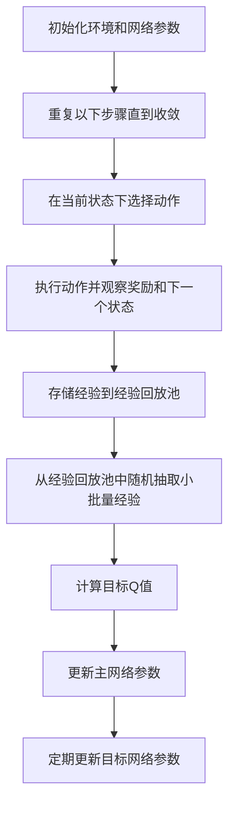

# 一切皆是映射：DQN在交通规划中的应用：智能交通的挑战与机遇

## 1.背景介绍

随着城市化进程的加快，交通拥堵问题日益严重，智能交通系统（ITS）成为解决这一问题的关键。智能交通系统通过集成先进的信息技术、通信技术和控制技术，实现交通系统的智能化管理和控制。深度强化学习（Deep Reinforcement Learning, DRL）作为人工智能领域的前沿技术，已在多个领域取得了显著成果。本文将探讨深度Q网络（Deep Q-Network, DQN）在交通规划中的应用，分析其在智能交通中的挑战与机遇。

## 2.核心概念与联系

### 2.1 深度强化学习

深度强化学习结合了深度学习和强化学习的优势，通过深度神经网络（Deep Neural Network, DNN）处理高维状态空间，并通过强化学习算法优化策略。其核心思想是通过与环境的交互，学习最优策略以最大化累积奖励。

### 2.2 Q学习

Q学习是一种无模型的强化学习算法，通过学习状态-动作值函数（Q函数）来评估每个状态-动作对的价值。Q函数的更新公式为：

$$
Q(s, a) \leftarrow Q(s, a) + \alpha [r + \gamma \max_{a'} Q(s', a') - Q(s, a)]
$$

其中，$s$ 和 $a$ 分别表示状态和动作，$r$ 是即时奖励，$\alpha$ 是学习率，$\gamma$ 是折扣因子。

### 2.3 深度Q网络

深度Q网络（DQN）通过深度神经网络近似Q函数，解决了传统Q学习在高维状态空间中的局限性。DQN引入了经验回放（Experience Replay）和目标网络（Target Network）等技术，稳定了训练过程。

## 3.核心算法原理具体操作步骤

### 3.1 环境建模

在交通规划中，环境通常包括道路网络、交通信号灯、车辆等。状态空间可以表示为当前交通状况，如车辆位置、速度等；动作空间可以表示为交通信号灯的控制策略。

### 3.2 奖励设计

奖励函数的设计直接影响算法的性能。常见的奖励设计包括减少车辆等待时间、减少交通拥堵、提高交通流量等。

### 3.3 经验回放

经验回放通过存储智能体与环境交互的经验，并在训练过程中随机抽取经验进行训练，打破了数据的相关性，提高了训练的稳定性。

### 3.4 目标网络

目标网络是DQN中的一个关键技术，通过引入一个与主网络结构相同但参数固定的目标网络，减少了训练过程中的振荡和不稳定性。

### 3.5 算法流程

以下是DQN在交通规划中的基本流程：



## 4.数学模型和公式详细讲解举例说明

### 4.1 状态空间表示

在交通规划中，状态空间可以表示为一个多维向量，包括每条道路上的车辆数量、平均速度、交通信号灯状态等。假设有 $n$ 条道路，每条道路上的状态可以表示为 $s_i$，则整个状态空间可以表示为 $S = [s_1, s_2, ..., s_n]$。

### 4.2 动作空间表示

动作空间表示为交通信号灯的控制策略。假设有 $m$ 个交通信号灯，每个信号灯有 $k$ 种控制策略，则动作空间可以表示为 $A = [a_1, a_2, ..., a_m]$，其中 $a_i$ 表示第 $i$ 个信号灯的控制策略。

### 4.3 奖励函数设计

奖励函数的设计需要综合考虑多个因素，如减少车辆等待时间、减少交通拥堵等。假设 $w_i$ 表示第 $i$ 个因素的权重，$r_i$ 表示第 $i$ 个因素的奖励，则总奖励可以表示为：

$$
R = \sum_{i=1}^{n} w_i r_i
$$

### 4.4 Q函数更新

Q函数的更新公式为：

$$
Q(s, a) \leftarrow Q(s, a) + \alpha [r + \gamma \max_{a'} Q(s', a') - Q(s, a)]
$$

其中，$s$ 和 $a$ 分别表示当前状态和动作，$r$ 是即时奖励，$\alpha$ 是学习率，$\gamma$ 是折扣因子，$s'$ 和 $a'$ 分别表示下一个状态和动作。

## 5.项目实践：代码实例和详细解释说明

### 5.1 环境搭建

首先，我们需要搭建一个模拟交通环境。可以使用开源的交通仿真工具如SUMO（Simulation of Urban MObility）来创建一个交通仿真环境。

```python
import traci
import sumolib

# 初始化SUMO环境
sumoBinary = sumolib.checkBinary('sumo')
traci.start([sumoBinary, "-c", "your_sumo_config_file.sumocfg"])

# 获取交通信号灯ID
traffic_lights = traci.trafficlight.getIDList()
```

### 5.2 DQN算法实现

接下来，我们实现DQN算法。首先定义深度Q网络：

```python
import torch
import torch.nn as nn
import torch.optim as optim

class DQN(nn.Module):
    def __init__(self, state_dim, action_dim):
        super(DQN, self).__init__()
        self.fc1 = nn.Linear(state_dim, 128)
        self.fc2 = nn.Linear(128, 128)
        self.fc3 = nn.Linear(128, action_dim)

    def forward(self, x):
        x = torch.relu(self.fc1(x))
        x = torch.relu(self.fc2(x))
        x = self.fc3(x)
        return x

# 初始化网络和优化器
state_dim = 10  # 状态维度
action_dim = 4  # 动作维度
policy_net = DQN(state_dim, action_dim)
target_net = DQN(state_dim, action_dim)
target_net.load_state_dict(policy_net.state_dict())
optimizer = optim.Adam(policy_net.parameters())
```

### 5.3 训练过程

在训练过程中，我们需要不断与环境交互，存储经验，并更新网络参数。

```python
import random
import numpy as np

# 经验回放池
memory = []

# 超参数
batch_size = 32
gamma = 0.99
epsilon = 0.1
target_update = 10

def select_action(state):
    if random.random() < epsilon:
        return random.randint(0, action_dim - 1)
    else:
        with torch.no_grad():
            return policy_net(torch.tensor(state, dtype=torch.float32)).argmax().item()

def optimize_model():
    if len(memory) < batch_size:
        return
    batch = random.sample(memory, batch_size)
    states, actions, rewards, next_states = zip(*batch)
    states = torch.tensor(states, dtype=torch.float32)
    actions = torch.tensor(actions, dtype=torch.long)
    rewards = torch.tensor(rewards, dtype=torch.float32)
    next_states = torch.tensor(next_states, dtype=torch.float32)

    q_values = policy_net(states).gather(1, actions.unsqueeze(1)).squeeze(1)
    next_q_values = target_net(next_states).max(1)[0].detach()
    expected_q_values = rewards + gamma * next_q_values

    loss = nn.MSELoss()(q_values, expected_q_values)
    optimizer.zero_grad()
    loss.backward()
    optimizer.step()

# 训练循环
for episode in range(1000):
    state = get_initial_state()
    for t in range(100):
        action = select_action(state)
        next_state, reward = step(action)
        memory.append((state, action, reward, next_state))
        state = next_state
        optimize_model()
    if episode % target_update == 0:
        target_net.load_state_dict(policy_net.state_dict())
```

## 6.实际应用场景

### 6.1 城市交通信号灯优化

通过DQN算法，可以优化城市交通信号灯的控制策略，减少车辆等待时间，提高交通流量。例如，在高峰时段，通过动态调整信号灯的绿灯时间，缓解交通拥堵。

### 6.2 智能交通管理系统

智能交通管理系统可以集成DQN算法，实现对整个城市交通的智能化管理。通过实时监控交通状况，动态调整交通信号灯、限速等措施，提高交通效率。

### 6.3 自动驾驶车辆路径规划

在自动驾驶车辆的路径规划中，DQN算法可以帮助车辆选择最优路径，避开拥堵路段，减少行驶时间和能耗。

## 7.工具和资源推荐

### 7.1 开源工具

- **SUMO**：一个开源的交通仿真工具，可以用于创建和模拟复杂的交通环境。
- **OpenAI Gym**：一个开源的强化学习环境库，提供了多种环境和接口，方便进行强化学习算法的开发和测试。

### 7.2 学习资源

- **《深度强化学习》**：一本详细介绍深度强化学习理论和实践的书籍，适合初学者和进阶学习者。
- **Coursera上的强化学习课程**：由知名教授讲授的在线课程，涵盖了强化学习的基本概念和高级技术。

## 8.总结：未来发展趋势与挑战

### 8.1 未来发展趋势

随着人工智能技术的不断进步，深度强化学习在智能交通中的应用前景广阔。未来，智能交通系统将更加智能化、自动化，实现对城市交通的全面优化和管理。

### 8.2 挑战

尽管深度强化学习在智能交通中展现了巨大的潜力，但仍面临一些挑战。例如，交通环境的复杂性和不确定性使得算法的训练和应用变得困难。此外，算法的实时性和稳定性也是需要解决的问题。

## 9.附录：常见问题与解答

### 9.1 DQN算法在交通规划中的优势是什么？

DQN算法通过深度神经网络处理高维状态空间，能够在复杂的交通环境中学习最优策略，提高交通效率。

### 9.2 如何设计奖励函数？

奖励函数的设计需要综合考虑多个因素，如减少车辆等待时间、减少交通拥堵等。可以通过加权求和的方式，将多个因素的奖励综合起来。

### 9.3 如何解决算法的稳定性问题？

可以通过引入经验回放和目标网络等技术，减少训练过程中的振荡和不稳定性。此外，合理设置超参数也是提高算法稳定性的关键。

### 9.4 DQN算法的应用场景有哪些？

DQN算法可以应用于城市交通信号灯优化、智能交通管理系统、自动驾驶车辆路径规划等多个场景。

---

作者：禅与计算机程序设计艺术 / Zen and the Art of Computer Programming