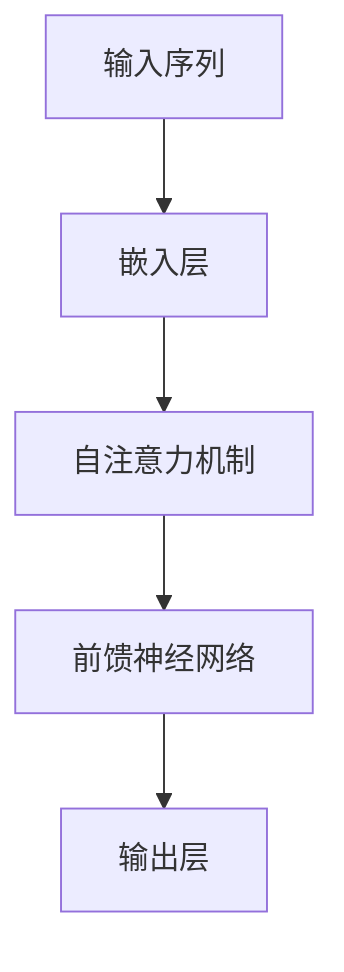

# 大规模语言模型从理论到实践 实践思考

## 1.背景介绍

大规模语言模型（Large Language Models, LLMs）近年来在自然语言处理（NLP）领域取得了显著的进展。自从OpenAI发布了GPT系列模型以来，LLMs在文本生成、翻译、问答系统等多个应用场景中展现了强大的能力。本文将深入探讨大规模语言模型的理论基础、核心算法、数学模型、实际应用以及未来发展趋势。

## 2.核心概念与联系

### 2.1 语言模型的定义

语言模型是一种能够理解和生成自然语言文本的统计模型。其核心任务是根据给定的上下文预测下一个词或生成一段连贯的文本。

### 2.2 大规模语言模型的特点

大规模语言模型通常具有以下几个特点：
- **参数量大**：模型参数量通常达到数十亿甚至上千亿。
- **数据驱动**：依赖于大规模的训练数据集。
- **多任务学习**：能够在多个NLP任务中表现出色。

### 2.3 语言模型的演变

从传统的n-gram模型到现代的Transformer架构，语言模型经历了多次演变。每一次演变都带来了性能的显著提升。

## 3.核心算法原理具体操作步骤

### 3.1 Transformer架构

Transformer架构是现代大规模语言模型的基础。其核心组件包括自注意力机制和前馈神经网络。



### 3.2 自注意力机制

自注意力机制通过计算输入序列中每个词与其他词的相关性来捕捉全局信息。其计算公式为：

$$
\text{Attention}(Q, K, V) = \text{softmax}\left(\frac{QK^T}{\sqrt{d_k}}\right)V
$$

其中，$Q$、$K$、$V$分别表示查询、键和值矩阵，$d_k$表示键的维度。

### 3.3 训练过程

大规模语言模型的训练过程通常包括以下几个步骤：
1. **数据预处理**：对大规模文本数据进行清洗和标注。
2. **模型初始化**：初始化模型参数。
3. **训练优化**：使用梯度下降算法优化模型参数。
4. **模型评估**：在验证集上评估模型性能。

## 4.数学模型和公式详细讲解举例说明

### 4.1 语言模型的概率分布

语言模型的目标是学习一个概率分布 $P(w_1, w_2, \ldots, w_n)$，其中 $w_i$ 表示第 $i$ 个词。通过链式法则，可以将其分解为条件概率的乘积：

$$
P(w_1, w_2, \ldots, w_n) = P(w_1) P(w_2 | w_1) P(w_3 | w_1, w_2) \ldots P(w_n | w_1, w_2, \ldots, w_{n-1})
$$

### 4.2 自注意力机制的计算

自注意力机制的计算过程可以分为以下几步：
1. **计算查询、键和值矩阵**：

$$
Q = XW_Q, \quad K = XW_K, \quad V = XW_V
$$

其中，$X$ 表示输入序列，$W_Q$、$W_K$、$W_V$ 分别表示查询、键和值的权重矩阵。

2. **计算注意力得分**：

$$
\text{Attention}(Q, K, V) = \text{softmax}\left(\frac{QK^T}{\sqrt{d_k}}\right)V
$$

3. **加权求和**：

$$
\text{Output} = \sum_{i=1}^{n} \alpha_i V_i
$$

其中，$\alpha_i$ 表示第 $i$ 个词的注意力权重。

### 4.3 损失函数

大规模语言模型通常使用交叉熵损失函数来衡量预测结果与真实标签之间的差异：

$$
\mathcal{L} = -\sum_{i=1}^{n} y_i \log(\hat{y}_i)
$$

其中，$y_i$ 表示真实标签，$\hat{y}_i$ 表示模型预测的概率。

## 5.项目实践：代码实例和详细解释说明

### 5.1 数据预处理

在实际项目中，数据预处理是非常重要的一步。以下是一个简单的Python代码示例：

```python
import re

def preprocess_text(text):
    # 移除特殊字符
    text = re.sub(r'\W', ' ', text)
    # 转换为小写
    text = text.lower()
    # 移除多余的空格
    text = re.sub(r'\s+', ' ', text)
    return text

# 示例文本
sample_text = "Hello, World! This is a sample text."
processed_text = preprocess_text(sample_text)
print(processed_text)
```

### 5.2 模型训练

以下是使用PyTorch进行模型训练的示例代码：

```python
import torch
import torch.nn as nn
import torch.optim as optim

class SimpleTransformer(nn.Module):
    def __init__(self, vocab_size, d_model, nhead, num_layers):
        super(SimpleTransformer, self).__init__()
        self.embedding = nn.Embedding(vocab_size, d_model)
        self.transformer = nn.Transformer(d_model, nhead, num_layers)
        self.fc = nn.Linear(d_model, vocab_size)

    def forward(self, src, tgt):
        src = self.embedding(src)
        tgt = self.embedding(tgt)
        output = self.transformer(src, tgt)
        output = self.fc(output)
        return output

# 超参数设置
vocab_size = 10000
d_model = 512
nhead = 8
num_layers = 6

# 模型实例化
model = SimpleTransformer(vocab_size, d_model, nhead, num_layers)
criterion = nn.CrossEntropyLoss()
optimizer = optim.Adam(model.parameters(), lr=0.001)

# 训练循环
for epoch in range(10):
    for src, tgt in data_loader:
        optimizer.zero_grad()
        output = model(src, tgt)
        loss = criterion(output.view(-1, vocab_size), tgt.view(-1))
        loss.backward()
        optimizer.step()
    print(f'Epoch {epoch+1}, Loss: {loss.item()}')
```

### 5.3 模型评估

模型评估是确保模型性能的重要步骤。以下是一个简单的评估代码示例：

```python
def evaluate(model, data_loader):
    model.eval()
    total_loss = 0
    with torch.no_grad():
        for src, tgt in data_loader:
            output = model(src, tgt)
            loss = criterion(output.view(-1, vocab_size), tgt.view(-1))
            total_loss += loss.item()
    return total_loss / len(data_loader)

# 评估模型
eval_loss = evaluate(model, eval_data_loader)
print(f'Evaluation Loss: {eval_loss}')
```

## 6.实际应用场景

### 6.1 文本生成

大规模语言模型在文本生成任务中表现出色，可以用于自动写作、新闻生成等场景。

### 6.2 机器翻译

通过训练双语数据集，LLMs可以实现高质量的机器翻译。

### 6.3 问答系统

LLMs可以用于构建智能问答系统，提供准确的答案和建议。

### 6.4 情感分析

通过分析文本情感，LLMs可以用于舆情监控、市场分析等领域。

## 7.工具和资源推荐

### 7.1 开源框架

- **TensorFlow**：谷歌开发的深度学习框架，支持大规模语言模型的训练和部署。
- **PyTorch**：Facebook开发的深度学习框架，广泛应用于研究和工业界。

### 7.2 数据集

- **Common Crawl**：一个包含大量网页数据的开源数据集，适用于训练大规模语言模型。
- **Wikipedia**：维基百科提供了丰富的文本数据，可以用于语言模型的训练。

### 7.3 预训练模型

- **GPT-3**：OpenAI发布的预训练模型，具有强大的文本生成能力。
- **BERT**：谷歌发布的预训练模型，广泛应用于各种NLP任务。

## 8.总结：未来发展趋势与挑战

### 8.1 未来发展趋势

- **模型规模继续扩大**：随着计算资源的增加，未来的大规模语言模型将会更加庞大，性能也会进一步提升。
- **多模态学习**：未来的语言模型将不仅限于文本，还会结合图像、音频等多种模态进行学习。
- **个性化定制**：根据用户需求，定制化的语言模型将会越来越普及。

### 8.2 挑战

- **计算资源需求**：大规模语言模型的训练需要大量的计算资源，这对中小型企业来说是一个挑战。
- **数据隐私**：在使用大规模数据集进行训练时，如何保护用户隐私是一个重要问题。
- **模型解释性**：大规模语言模型的黑箱特性使得其决策过程难以解释，这在某些应用场景中是一个挑战。

## 9.附录：常见问题与解答

### 9.1 大规模语言模型的训练需要多长时间？

训练时间取决于模型的规模和计算资源。通常，大规模语言模型的训练需要数周甚至数月的时间。

### 9.2 如何选择合适的预训练模型？

选择预训练模型时，应考虑模型的性能、适用场景以及计算资源需求。可以根据具体任务选择合适的预训练模型。

### 9.3 如何处理训练数据中的噪声？

可以通过数据清洗、去重等方法处理训练数据中的噪声。此外，使用数据增强技术也可以提高模型的鲁棒性。

### 9.4 大规模语言模型是否适用于所有NLP任务？

虽然大规模语言模型在许多NLP任务中表现出色，但并不适用于所有任务。在某些特定任务中，可能需要结合其他技术进行优化。

### 9.5 如何评估大规模语言模型的性能？

可以使用多种评估指标，如准确率、精确率、召回率、F1值等。此外，还可以通过人类评估来衡量模型的生成质量。

---

作者：禅与计算机程序设计艺术 / Zen and the Art of Computer Programming