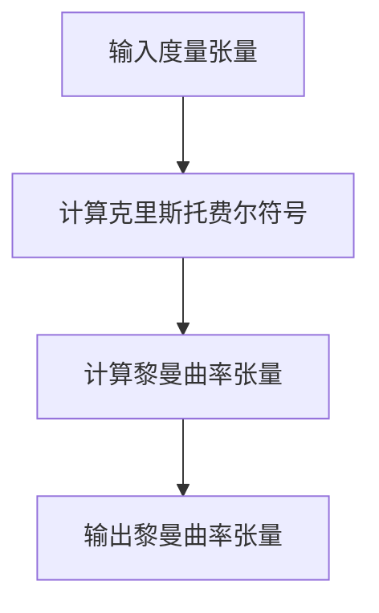
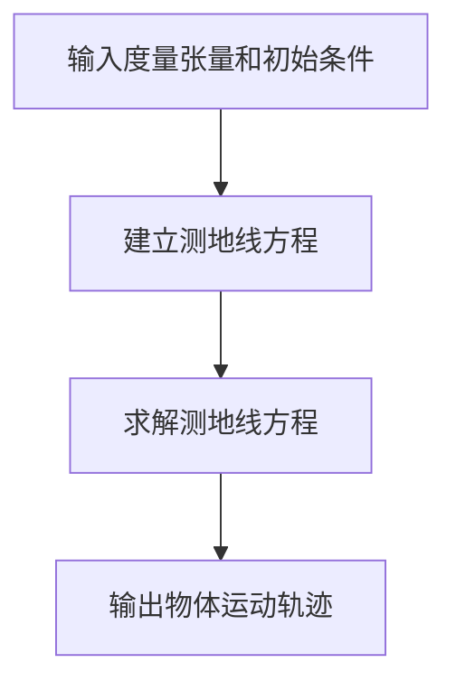
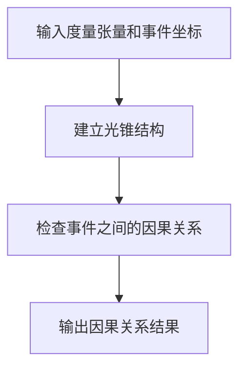

# 微分几何入门与广义相对论：因果条件

## 1.背景介绍

微分几何和广义相对论是现代物理学和数学中两个重要的领域。微分几何提供了研究曲面和流形的工具，而广义相对论则是爱因斯坦提出的描述引力的理论。因果条件是广义相对论中的一个关键概念，它确保了物理事件的时间顺序和因果关系。

### 1.1 微分几何的起源与发展

微分几何起源于对曲线和曲面的研究，最早可以追溯到高斯和黎曼的工作。高斯的曲率理论和黎曼的流形概念为微分几何奠定了基础。随着时间的推移，微分几何逐渐发展成为一个独立的数学分支，广泛应用于物理学、工程学和计算机科学等领域。

### 1.2 广义相对论的提出与意义

广义相对论是爱因斯坦于1915年提出的理论，它描述了引力不是一种力，而是时空的弯曲。广义相对论不仅成功解释了水星近日点的进动和光线在引力场中的弯曲，还预言了黑洞和引力波的存在。

### 1.3 因果条件的定义与重要性

因果条件是广义相对论中的一个基本概念，它确保了事件的时间顺序和因果关系。因果条件的违反会导致时间悖论和其他物理上的不一致，因此在广义相对论的研究中，因果条件的维护是至关重要的。

## 2.核心概念与联系

在这一部分，我们将详细介绍微分几何和广义相对论中的核心概念，并探讨它们之间的联系。

### 2.1 流形与度量

流形是微分几何中的基本概念，它是一个局部类似于欧几里得空间的拓扑空间。度量则是定义在流形上的一个函数，用于测量流形上两点之间的距离。在广义相对论中，时空被视为一个四维流形，度量则描述了时空的几何性质。

### 2.2 曲率与引力

曲率是描述流形弯曲程度的一个量。在微分几何中，曲率可以通过高斯曲率和黎曼曲率张量来描述。在广义相对论中，引力被视为时空的曲率，物体在引力场中的运动可以通过测地线方程来描述。

### 2.3 因果结构与光锥

因果结构是描述事件之间因果关系的一个概念。在广义相对论中，因果结构通过光锥来描述。光锥是时空中的一个几何结构，它定义了光速传播的极限，从而确定了事件之间的因果关系。

## 3.核心算法原理具体操作步骤

在这一部分，我们将介绍微分几何和广义相对论中的一些核心算法，并详细说明它们的具体操作步骤。

### 3.1 计算黎曼曲率张量

黎曼曲率张量是描述流形曲率的一个重要工具。计算黎曼曲率张量的步骤如下：

1. **计算克里斯托费尔符号**：克里斯托费尔符号是连接系数，用于描述流形上的平行移动。它可以通过度量张量的导数来计算。
2. **计算黎曼曲率张量**：黎曼曲率张量可以通过克里斯托费尔符号及其导数来计算。



### 3.2 求解测地线方程

测地线是流形上长度最短的曲线。在广义相对论中，物体在引力场中的运动可以通过测地线方程来描述。求解测地线方程的步骤如下：

1. **建立测地线方程**：测地线方程是一个二阶微分方程，可以通过度量张量和克里斯托费尔符号来建立。
2. **求解测地线方程**：使用数值方法求解测地线方程，得到物体的运动轨迹。



### 3.3 验证因果条件

因果条件确保了事件的时间顺序和因果关系。验证因果条件的步骤如下：

1. **建立光锥结构**：通过度量张量建立光锥结构，确定光速传播的极限。
2. **检查事件之间的因果关系**：根据光锥结构，检查事件之间是否满足因果条件。



## 4.数学模型和公式详细讲解举例说明

在这一部分，我们将详细讲解微分几何和广义相对论中的一些重要数学模型和公式，并通过具体例子来说明它们的应用。

### 4.1 度量张量

度量张量是描述流形几何性质的一个基本工具。在广义相对论中，度量张量描述了时空的几何结构。度量张量的定义如下：

$$
g_{\mu\nu} = \begin{pmatrix}
-1 & 0 & 0 & 0 \\
0 & 1 & 0 & 0 \\
0 & 0 & 1 & 0 \\
0 & 0 & 0 & 1
\end{pmatrix}
$$

这个度量张量描述了平直时空中的几何结构。

### 4.2 克里斯托费尔符号

克里斯托费尔符号是描述流形上平行移动的一个工具。它的定义如下：

$$
\Gamma^\lambda_{\mu\nu} = \frac{1}{2} g^{\lambda\sigma} \left( \partial_\mu g_{\nu\sigma} + \partial_\nu g_{\mu\sigma} - \partial_\sigma g_{\mu\nu} \right)
$$

### 4.3 黎曼曲率张量

黎曼曲率张量是描述流形曲率的一个重要工具。它的定义如下：

$$
R^\rho_{\sigma\mu\nu} = \partial_\mu \Gamma^\rho_{\nu\sigma} - \partial_\nu \Gamma^\rho_{\mu\sigma} + \Gamma^\rho_{\mu\lambda} \Gamma^\lambda_{\nu\sigma} - \Gamma^\rho_{\nu\lambda} \Gamma^\lambda_{\mu\sigma}
$$

### 4.4 测地线方程

测地线方程描述了流形上长度最短的曲线。它的定义如下：

$$
\frac{d^2 x^\lambda}{d\tau^2} + \Gamma^\lambda_{\mu\nu} \frac{dx^\mu}{d\tau} \frac{dx^\nu}{d\tau} = 0
$$

### 4.5 光锥结构

光锥结构描述了时空中的因果关系。光锥的定义如下：

$$
ds^2 = g_{\mu\nu} dx^\mu dx^\nu = 0
$$

## 5.项目实践：代码实例和详细解释说明

在这一部分，我们将通过一个具体的项目实例，展示如何在实际中应用微分几何和广义相对论的概念和算法。

### 5.1 项目简介

我们将实现一个简单的Python程序，用于计算平直时空中的测地线方程，并验证因果条件。

### 5.2 环境配置

首先，我们需要安装必要的Python库：

```bash
pip install numpy scipy matplotlib
```

### 5.3 代码实现

以下是计算测地线方程的Python代码：

```python
import numpy as np
from scipy.integrate import odeint
import matplotlib.pyplot as plt

# 定义度量张量
def metric(x):
    return np.array([[-1, 0, 0, 0],
                     [0, 1, 0, 0],
                     [0, 0, 1, 0],
                     [0, 0, 0, 1]])

# 计算克里斯托费尔符号
def christoffel_symbols(x):
    g = metric(x)
    g_inv = np.linalg.inv(g)
    n = g.shape[0]
    Gamma = np.zeros((n, n, n))
    for i in range(n):
        for j in range(n):
            for k in range(n):
                Gamma[i, j, k] = 0.5 * np.sum(g_inv[i, l] * (np.gradient(g[j, l], x[k]) + np.gradient(g[k, l], x[j]) - np.gradient(g[j, k], x[l])) for l in range(n))
    return Gamma

# 定义测地线方程
def geodesic_eq(y, tau):
    x = y[:4]
    dx = y[4:]
    Gamma = christoffel_symbols(x)
    ddx = -np.einsum('ijk,j,k->i', Gamma, dx, dx)
    return np.concatenate((dx, ddx))

# 初始条件
x0 = np.array([0, 0, 0, 0])
dx0 = np.array([1, 0, 0, 0])
y0 = np.concatenate((x0, dx0))

# 时间范围
tau = np.linspace(0, 10, 100)

# 求解测地线方程
sol = odeint(geodesic_eq, y0, tau)

# 绘制结果
plt.plot(tau, sol[:, 0], label='t')
plt.plot(tau, sol[:, 1], label='x')
plt.plot(tau, sol[:, 2], label='y')
plt.plot(tau, sol[:, 3], label='z')
plt.xlabel('Proper Time')
plt.ylabel('Coordinates')
plt.legend()
plt.show()
```

### 5.4 代码解释

1. **定义度量张量**：我们定义了一个平直时空的度量张量。
2. **计算克里斯托费尔符号**：我们通过度量张量计算克里斯托费尔符号。
3. **定义测地线方程**：我们定义了测地线方程，并使用`odeint`函数求解。
4. **初始条件**：我们设置了初始条件，包括初始位置和速度。
5. **时间范围**：我们定义了一个时间范围，用于求解测地线方程。
6. **求解测地线方程**：我们使用`odeint`函数求解测地线方程，并得到物体的运动轨迹。
7. **绘制结果**：我们使用`matplotlib`库绘制结果，展示物体在时空中的运动轨迹。

## 6.实际应用场景

微分几何和广义相对论在许多实际应用中发挥着重要作用。以下是一些典型的应用场景：

### 6.1 天体物理学

在天体物理学中，广义相对论用于描述黑洞、引力波和宇宙膨胀等现象。微分几何提供了研究这些现象的数学工具。

### 6.2 导航与定位

全球定位系统（GPS）需要考虑广义相对论效应，以确保定位的准确性。微分几何用于描述地球表面的几何结构，从而提高导航和定位的精度。

### 6.3 计算机图形学

在计算机图形学中，微分几何用于描述曲面和形状的几何性质，从而实现高质量的图像渲染和三维建模。

### 6.4 机器学习与数据分析

在机器学习和数据分析中，微分几何用于研究数据的几何结构，从而提高算法的性能和准确性。例如，流形学习是一种基于微分几何的降维方法。

## 7.工具和资源推荐

在这一部分，我们将推荐一些有助于学习和应用微分几何和广义相对论的工具和资源。

### 7.1 书籍推荐

- 《黎曼几何与广义相对论》：这本书详细介绍了黎曼几何和广义相对论的基本概念和数学工具。
- 《微分几何基础》：这本书是学习微分几何的经典教材，适合初学者和进阶学习者。

### 7.2 在线课程

- Coursera上的《广义相对论入门》：这门课程由著名物理学家讲授，适合对广义相对论感兴趣的学习者。
- edX上的《微分几何基础》：这门课程详细介绍了微分几何的基本概念和应用。

### 7.3 软件工具

- Mathematica：Mathematica是一个强大的数学软件，适合进行微分几何和广义相对论的计算和模拟。
- Python：Python是一个广泛使用的编程语言，拥有丰富的科学计算库，如NumPy、SciPy和Matplotlib，适合进行微分几何和广义相对论的编程和可视化。

## 8.总结：未来发展趋势与挑战

微分几何和广义相对论是现代物理学和数学中两个重要的领域，它们在许多实际应用中发挥着重要作用。随着科学技术的不断发展，微分几何和广义相对论的研究将面临新的机遇和挑战。

### 8.1 未来发展趋势

- **量子引力**：量子引力是将广义相对论和量子力学结合起来的理论，目前仍在探索中。微分几何将在量子引力的研究中发挥重要作用。
- **高维时空**：高维时空是现代物理学中的一个重要概念，微分几何提供了研究高维时空的数学工具。
- **数据科学**：随着大数据和人工智能的发展，微分几何将在数据科学中发挥越来越重要的作用，特别是在流形学习和高维数据分析方面。

### 8.2 面临的挑战

- **计算复杂性**：微分几何和广义相对论的计算通常非常复杂，需要高效的算法和强大的计算能力。
- **实验验证**：广义相对论的一些预言（如引力波和黑洞）已经得到了实验验证，但仍有许多未解之谜需要进一步的实验和观测。
- **跨学科研究**：微分几何和广义相对论涉及数学、物理学和计算机科学等多个学科，需要跨学科的合作和研究。

## 9.附录：常见问题与解答

在这一部分，我们将解答一些关于微分几何和广义相对论的常见问题。

### 9.1 什么是微分几何？

微分几何是研究曲面和流形的几何性质的数学分支。它结合了微积分和几何学的工具，用于描述曲面和流形的弯曲和形状。

### 9.2 什么是广义相对论？

广义相对论是爱因斯坦提出的描述引力的理论。它认为引力不是一种力，而是时空的弯曲。广义相对论成功解释了许多天文现象，如水星近日点的进动和光线在引力场中的弯曲。

### 9.3 什么是因果条件？

因果条件是广义相对论中的一个基本概念，它确保了事件的时间顺序和因果关系。因果条件的违反会导致时间悖论和其他物理上的不一致。

### 9.4 如何计算黎曼曲率张量？

黎曼曲率张量是描述流形曲率的一个重要工具。它可以通过克里斯托费尔符号及其导数来计算。具体公式如下：

$$
R^\rho_{\sigma\mu\nu} = \partial_\mu \Gamma^\rho_{\nu\sigma} - \partial_\nu \Gamma^\rho_{\mu\sigma} + \Gamma^\rho_{\mu\lambda} \Gamma^\lambda_{\nu\sigma} - \Gamma^\rho_{\nu\lambda} \Gamma^\lambda_{\mu\sigma}
$$

### 9.5 如何求解测地线方程？

测地线方程是一个二阶微分方程，可以通过度量张量和克里斯托费尔符号来建立。使用数值方法（如`odeint`函数）可以求解测地线方程，得到物体的运动轨迹。

### 9.6 微分几何和广义相对论有哪些实际应用？

微分几何和广义相对论在天体物理学、导航与定位、计算机图形学和机器学习等领域有广泛的应用。例如，广义相对论用于描述黑洞和引力波，微分几何用于描述曲面和形状的几何性质。

---

作者：禅与计算机程序设计艺术 / Zen and the Art of Computer Programming