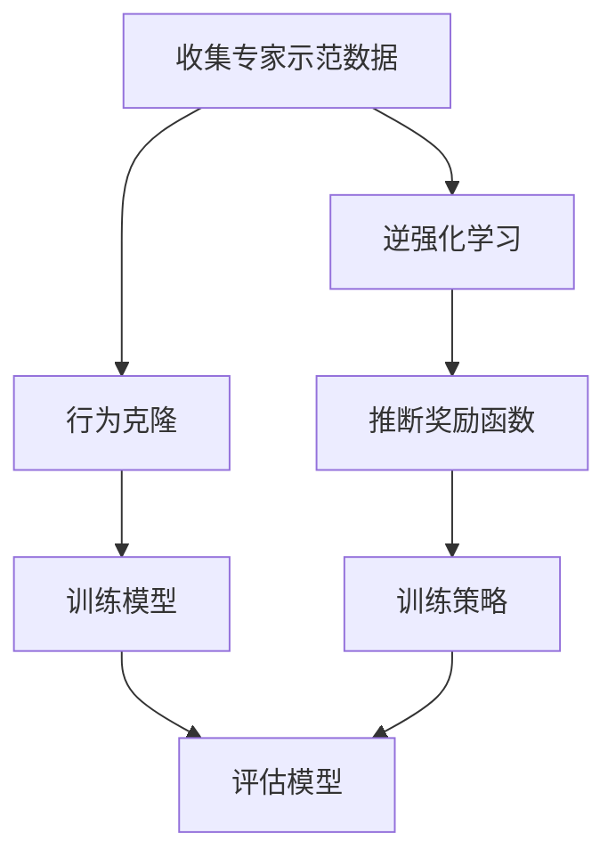

# 模仿学习 (Imitation Learning) 原理与代码实例讲解

## 1.背景介绍

模仿学习（Imitation Learning，IL）是一种机器学习方法，旨在通过模仿专家的行为来训练智能体。与传统的强化学习不同，模仿学习不需要明确的奖励函数，而是通过观察和模仿专家的行为来学习策略。这种方法在机器人控制、自动驾驶、游戏AI等领域有广泛应用。

模仿学习的核心思想是通过专家示范的数据来训练模型，使其能够在相似的环境中执行类似的任务。模仿学习的优势在于可以快速收敛，尤其在奖励函数难以设计或环境复杂的情况下，模仿学习提供了一种有效的解决方案。

## 2.核心概念与联系

### 2.1 模仿学习的基本概念

模仿学习主要包括以下几个基本概念：

- **专家示范（Expert Demonstration）**：专家在特定任务中的行为数据，通常包括状态、动作对。
- **策略（Policy）**：智能体在给定状态下选择动作的规则或函数。
- **状态（State）**：环境在某一时刻的描述。
- **动作（Action）**：智能体在某一状态下采取的行为。

### 2.2 模仿学习与强化学习的联系

模仿学习与强化学习有着密切的联系，但也有显著的区别：

- **奖励函数**：强化学习依赖于明确的奖励函数来指导智能体的学习，而模仿学习则通过专家示范数据进行学习，不需要明确的奖励函数。
- **数据依赖**：模仿学习依赖于高质量的专家示范数据，而强化学习则通过与环境的交互来生成数据。

### 2.3 模仿学习的分类

模仿学习主要分为两类：

- **行为克隆（Behavior Cloning，BC）**：通过监督学习的方法直接学习专家的策略。
- **逆强化学习（Inverse Reinforcement Learning，IRL）**：通过推断专家的奖励函数来学习策略。

## 3.核心算法原理具体操作步骤

### 3.1 行为克隆

行为克隆是一种直接模仿专家行为的方法，其基本步骤如下：

1. **收集专家示范数据**：收集专家在特定任务中的状态-动作对。
2. **训练模型**：使用监督学习的方法训练模型，使其能够在给定状态下预测专家的动作。
3. **评估模型**：在测试环境中评估模型的表现。

### 3.2 逆强化学习

逆强化学习通过推断专家的奖励函数来学习策略，其基本步骤如下：

1. **收集专家示范数据**：收集专家在特定任务中的状态-动作对。
2. **推断奖励函数**：使用逆强化学习算法推断专家的奖励函数。
3. **训练策略**：使用强化学习算法在推断的奖励函数下训练策略。
4. **评估策略**：在测试环境中评估策略的表现。

### 3.3 核心算法流程图



## 4.数学模型和公式详细讲解举例说明

### 4.1 行为克隆的数学模型

行为克隆可以看作是一个监督学习问题，其目标是最小化预测动作与专家动作之间的差异。假设专家示范数据为 $\{(s_i, a_i)\}_{i=1}^N$，其中 $s_i$ 表示状态，$a_i$ 表示动作。行为克隆的目标是找到一个策略 $\pi$，使得在给定状态 $s_i$ 下，预测的动作 $\pi(s_i)$ 与专家动作 $a_i$ 之间的差异最小。

$$
\min_{\pi} \sum_{i=1}^N \| \pi(s_i) - a_i \|^2
$$

### 4.2 逆强化学习的数学模型

逆强化学习的目标是推断专家的奖励函数 $R$，使得在该奖励函数下，专家的策略 $\pi_E$ 是最优的。假设专家示范数据为 $\{(s_i, a_i)\}_{i=1}^N$，逆强化学习的目标是找到一个奖励函数 $R$，使得在该奖励函数下，专家的策略 $\pi_E$ 最大化累积奖励。

$$
\max_{R} \sum_{i=1}^N R(s_i, a_i)
$$

在推断出奖励函数 $R$ 后，可以使用强化学习算法在该奖励函数下训练策略 $\pi$。

## 5.项目实践：代码实例和详细解释说明

### 5.1 行为克隆代码实例

以下是一个使用行为克隆进行模仿学习的代码实例，基于Python和TensorFlow实现。

```python
import tensorflow as tf
from tensorflow.keras import layers, models
import numpy as np

# 生成示例专家示范数据
def generate_expert_data(num_samples):
    states = np.random.rand(num_samples, 4)
    actions = np.random.rand(num_samples, 2)
    return states, actions

# 构建行为克隆模型
def build_model(input_shape, output_shape):
    model = models.Sequential()
    model.add(layers.Dense(64, activation='relu', input_shape=input_shape))
    model.add(layers.Dense(64, activation='relu'))
    model.add(layers.Dense(output_shape))
    model.compile(optimizer='adam', loss='mse')
    return model

# 训练行为克隆模型
def train_model(model, states, actions, epochs=50, batch_size=32):
    model.fit(states, actions, epochs=epochs, batch_size=batch_size)

# 评估行为克隆模型
def evaluate_model(model, states, actions):
    loss = model.evaluate(states, actions)
    print(f"Evaluation loss: {loss}")

# 主函数
if __name__ == "__main__":
    num_samples = 1000
    states, actions = generate_expert_data(num_samples)
    model = build_model((4,), 2)
    train_model(model, states, actions)
    evaluate_model(model, states, actions)
```

### 5.2 逆强化学习代码实例

以下是一个使用逆强化学习进行模仿学习的代码实例，基于Python和Gym实现。

```python
import gym
import numpy as np
from irl import InverseReinforcementLearning

# 生成示例专家示范数据
def generate_expert_data(env, policy, num_episodes):
    expert_data = []
    for _ in range(num_episodes):
        state = env.reset()
        done = False
        while not done:
            action = policy(state)
            next_state, reward, done, _ = env.step(action)
            expert_data.append((state, action))
            state = next_state
    return expert_data

# 定义专家策略
def expert_policy(state):
    return env.action_space.sample()

# 主函数
if __name__ == "__main__":
    env = gym.make('CartPole-v1')
    num_episodes = 100
    expert_data = generate_expert_data(env, expert_policy, num_episodes)
    
    irl = InverseReinforcementLearning(env, expert_data)
    reward_function = irl.train()
    
    # 使用推断的奖励函数进行强化学习
    policy = irl.train_policy(reward_function)
    irl.evaluate_policy(policy)
```

## 6.实际应用场景

模仿学习在多个领域有广泛的应用，以下是一些典型的应用场景：

### 6.1 机器人控制

在机器人控制中，模仿学习可以通过专家示范数据训练机器人执行复杂的任务，如抓取、搬运等。通过模仿专家的行为，机器人可以快速学习并执行任务。

### 6.2 自动驾驶

在自动驾驶领域，模仿学习可以通过专家驾驶数据训练自动驾驶系统，使其能够在复杂的交通环境中安全驾驶。模仿学习可以帮助自动驾驶系统快速适应不同的驾驶场景。

### 6.3 游戏AI

在游戏AI中，模仿学习可以通过专家玩家的数据训练游戏AI，使其能够在游戏中表现出高水平的策略。模仿学习可以帮助游戏AI快速学习并适应不同的游戏环境。

## 7.工具和资源推荐

### 7.1 工具推荐

- **TensorFlow**：一个开源的机器学习框架，适用于构建和训练模仿学习模型。
- **PyTorch**：另一个流行的开源机器学习框架，适用于构建和训练模仿学习模型。
- **Gym**：一个开源的强化学习环境库，提供了多种模拟环境，适用于模仿学习和强化学习的研究。

### 7.2 资源推荐

- **《深度强化学习》**：一本详细介绍深度强化学习的书籍，适合深入了解模仿学习和强化学习的原理和应用。
- **OpenAI Gym文档**：提供了详细的Gym库使用指南和示例代码，适合初学者和研究人员参考。
- **TensorFlow文档**：提供了详细的TensorFlow使用指南和示例代码，适合构建和训练模仿学习模型。

## 8.总结：未来发展趋势与挑战

模仿学习作为一种有效的机器学习方法，在多个领域展现了广阔的应用前景。未来，模仿学习的发展趋势和挑战主要包括以下几个方面：

### 8.1 发展趋势

- **多模态模仿学习**：结合视觉、听觉等多种感知信息，提高模仿学习的效果。
- **自适应模仿学习**：开发能够适应不同环境和任务的模仿学习算法，提高智能体的泛化能力。
- **人机协作**：通过模仿学习实现人机协作，提高机器人和自动驾驶系统的智能化水平。

### 8.2 挑战

- **数据质量**：高质量的专家示范数据是模仿学习的关键，如何获取和处理高质量的数据是一个重要挑战。
- **模型复杂度**：随着任务复杂度的增加，模仿学习模型的复杂度也随之增加，如何设计高效的模型是一个重要挑战。
- **安全性和可靠性**：在实际应用中，模仿学习系统的安全性和可靠性至关重要，如何保证系统的安全性和可靠性是一个重要挑战。

## 9.附录：常见问题与解答

### 9.1 什么是模仿学习？

模仿学习是一种机器学习方法，通过模仿专家的行为来训练智能体，使其能够在相似的环境中执行类似的任务。

### 9.2 模仿学习与强化学习有什么区别？

模仿学习不需要明确的奖励函数，而是通过专家示范数据进行学习；强化学习依赖于明确的奖励函数，通过与环境的交互生成数据。

### 9.3 模仿学习的主要应用场景有哪些？

模仿学习在机器人控制、自动驾驶、游戏AI等领域有广泛应用。

### 9.4 如何获取高质量的专家示范数据？

高质量的专家示范数据可以通过专家操作、模拟环境生成等方式获取。

### 9.5 模仿学习的未来发展趋势是什么？

未来，模仿学习的发展趋势包括多模态模仿学习、自适应模仿学习和人机协作等。

---

作者：禅与计算机程序设计艺术 / Zen and the Art of Computer Programming