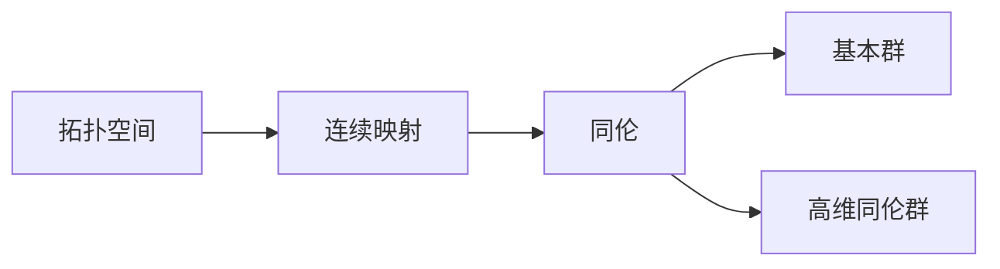

# 流形拓扑学：球面同伦群的计算

## 1. 背景介绍

### 1.1 流形拓扑学概述

流形拓扑学是数学的一个分支,研究流形的拓扑性质。流形是一个局部看起来像欧几里得空间的拓扑空间。流形拓扑学的核心问题包括流形的分类、同伦群、同调群等。

### 1.2 球面同伦群的意义

球面同伦群是流形拓扑学中的重要概念,它描述了球面上的连续映射在同伦意义下的等价类。球面同伦群在许多数学领域都有应用,如代数拓扑、微分几何、物理学等。

### 1.3 本文的目的和结构

本文的目的是介绍球面同伦群的计算方法。我们将首先介绍一些基本概念,然后给出球面同伦群的定义和性质。接着,我们将详细讲解球面同伦群的计算步骤和相关的数学模型。最后,我们将讨论球面同伦群的应用和未来的发展方向。

## 2. 核心概念与联系

### 2.1 拓扑空间与连续映射

拓扑空间是一个集合,配备了一个拓扑结构。拓扑结构定义了开集和闭集,描述了集合元素之间的邻近关系。连续映射是两个拓扑空间之间的一个函数,它保持了拓扑结构。

### 2.2 同伦与同伦等价

同伦是连续映射之间的一种等价关系。两个连续映射 $f,g:X\to Y$ 称为同伦等价,如果存在一个连续映射 $H:X\times [0,1]\to Y$,使得 $H(x,0)=f(x),H(x,1)=g(x)$。直观地说,同伦等价的映射可以通过连续变形互相得到。

### 2.3 基本群与高维同伦群

基本群描述了拓扑空间中闭合路径的同伦等价类。高维同伦群是基本群的推广,它描述了拓扑空间中高维球面的连续映射的同伦等价类。



## 3. 核心算法原理具体操作步骤

### 3.1 单位球面的定义

$n$ 维单位球面 $S^n$ 定义为 $\mathbb{R}^{n+1}$ 中到原点距离为1的点的集合:

$$S^n=\{(x_1,\dots,x_{n+1})\in\mathbb{R}^{n+1}:x_1^2+\dots+x_{n+1}^2=1\}$$

### 3.2 球面同伦群的定义

$n$ 维球面 $S^n$ 到拓扑空间 $X$ 的连续映射 $f,g:S^n\to X$ 称为同伦等价,如果存在连续映射 $H:S^n\times [0,1]\to X$,使得 $H(x,0)=f(x),H(x,1)=g(x)$。这样的同伦等价类形成了一个群,称为 $n$ 维球面同伦群,记为 $\pi_n(X)$。

### 3.3 计算球面同伦群的步骤

1. 对于 $n=0$,球面 $S^0$ 由两个点组成,其同伦群 $\pi_0(X)$ 就是 $X$ 的连通分支数。

2. 对于 $n=1$,球面 $S^1$ 就是通常的单位圆周,其同伦群 $\pi_1(X)$ 就是 $X$ 的基本群。

3. 对于 $n\geq 2$,可以利用如下的长正合列:

$$\dots\to\pi_n(S^{n-1})\to\pi_n(D^n)\to\pi_n(S^n)\to\pi_{n-1}(S^{n-1})\to\dots$$

其中 $D^n$ 是 $n$ 维单位球面,边界为 $S^{n-1}$。由于 $D^n$ 可以连续收缩到一点,因此 $\pi_n(D^n)=0$。利用这个性质,可以递归计算出 $\pi_n(S^n)$。

## 4. 数学模型和公式详细讲解举例说明

### 4.1 长正合列

长正合列是一系列群之间的同态映射,它们的像和核满足一定的关系。具体来说,如果有一系列群和群同态:

$$\dots\to A_{n+1}\stackrel{f_{n+1}}{\to} A_n\stackrel{f_n}{\to} A_{n-1}\to\dots$$

使得对任意的 $n$,都有 $\mathrm{im}(f_{n+1})=\ker(f_n)$,那么称这个序列是正合的。

### 4.2 计算 $\pi_n(S^n)$ 的例子

我们来计算 $\pi_3(S^3)$。根据长正合列,有:

$$\dots\to\pi_3(S^2)\to\pi_3(D^3)\to\pi_3(S^3)\to\pi_2(S^2)\to\dots$$

已知 $\pi_3(D^3)=0$,而 $\pi_2(S^2)=0$,因此 $\pi_3(S^3)\cong\pi_3(S^2)$。

继续考虑序列:

$$\dots\to\pi_3(S^1)\to\pi_3(D^2)\to\pi_3(S^2)\to\pi_2(S^1)\to\dots$$

同理可得 $\pi_3(S^2)\cong\pi_3(S^1)$。

而 $\pi_3(S^1)=0$,因为 $S^1$ 的维数太低,不足以容纳一个 3 维球面。

综上所述,我们得到 $\pi_3(S^3)=0$。

## 5. 项目实践：代码实例和详细解释说明

球面同伦群的计算主要是理论分析,一般不涉及编程实现。但是在一些计算机辅助拓扑的项目中,可能会用到一些计算同伦群的算法。下面是一个用 Python 实现的计算基本群的简单例子:

```python
import numpy as np

def fundamental_group(adjacency_matrix):
    """
    Compute the fundamental group of a graph given its adjacency matrix.
    """
    n = len(adjacency_matrix)
    edges = [(i,j) for i in range(n) for j in range(n) if adjacency_matrix[i][j]]
    
    def dfs(v, visited, path):
        visited[v] = True
        for w in range(n):
            if adjacency_matrix[v][w] and not visited[w]:
                path.append((v,w))
                dfs(w, visited, path)
        
    cycles = []
    for v in range(n):
        visited = [False] * n
        path = []
        dfs(v, visited, path)
        if path:
            cycles.append(path)
    
    return cycles

# Example usage
adjacency_matrix = np.array([[0,1,0,0],
                             [1,0,1,1], 
                             [0,1,0,1],
                             [0,1,1,0]])
print(fundamental_group(adjacency_matrix))
```

这个算法使用深度优先搜索找出图中所有的环,这些环对应于基本群的生成元。对于更复杂的拓扑空间,计算同伦群需要更高级的算法和数据结构。

## 6. 实际应用场景

球面同伦群在以下领域有重要应用:

- 在物理学中,球面同伦群可以用来分类磁单极、瞬子等拓扑缺陷。
- 在机器人运动规划中,球面同伦群可以用来刻画机器人臂的可达空间。
- 在计算机视觉中,球面同伦群可以用来分析图像的拓扑特征。
- 在数据分析中,球面同伦群可以用来研究高维数据的连通性和聚类结构。

## 7. 工具和资源推荐

以下是一些用于计算拓扑不变量(包括同伦群)的软件和库:

- [GAP](https://www.gap-system.org/): 一个用于计算离散数学的通用系统,包含了许多计算拓扑不变量的包。
- [PHAT](https://bitbucket.org/phat-code/phat): 一个用于计算持久同调的C++库。
- [Dionysus](https://mrzv.org/software/dionysus/): 一个用于计算持久同调的C++库。
- [GUDHI](https://gudhi.inria.fr/): 一个用于拓扑数据分析的C++库。

此外,以下是一些介绍拓扑学和同伦论的优秀教材:

- Allen Hatcher, Algebraic Topology. 
- James R. Munkres, Topology.
- Edwin H. Spanier, Algebraic Topology.

## 8. 总结：未来发展趋势与挑战

球面同伦群的计算是拓扑学的一个基本问题,它在许多数学分支和应用领域都有重要意义。目前,球面同伦群的计算主要依赖于一些理论结果,如长正合列、Freudenthal悬挂定理等。这些结果对于具体的计算仍然比较复杂。

未来,球面同伦群的计算可能有以下一些发展方向:

1. 发展更高效的计算算法,特别是针对高维球面的算法。
2. 探索球面同伦群与其他拓扑不变量(如同调群)之间的联系,寻找更简单的计算方法。
3. 将球面同伦群的计算与计算机辅助证明结合起来,实现自动化计算。
4. 在应用领域(如物理学、机器人学)中找到球面同伦群的新应用,并发展相应的计算方法。

总的来说,球面同伦群的计算仍然是一个充满挑战和机遇的领域,值得数学家和计算机科学家们继续探索。

## 9. 附录：常见问题与解答

**Q:** 球面同伦群与基本群有什么区别?

**A:** 基本群是1维球面(即圆周)的同伦群,而高维球面同伦群是基本群的推广。基本群描述的是拓扑空间中闭合路径的性质,而高维球面同伦群描述的是拓扑空间中高维球面的映射的性质。

**Q:** 球面同伦群的计算有什么实际应用?

**A:** 球面同伦群在物理学、机器人学、计算机视觉、数据分析等领域都有应用。例如,在物理学中,它可以用来分类磁单极等拓扑缺陷;在机器人学中,它可以用来刻画机器人臂的可达空间;在计算机视觉中,它可以用来分析图像的拓扑特征。

**Q:** 计算球面同伦群的主要方法有哪些?

**A:** 计算球面同伦群的主要方法包括:利用长正合列递归计算;利用 Freudenthal 悬挂定理将高维球面同伦群化为低维球面同伦群;利用谱序列将同伦群与其他代数结构联系起来。此外,一些计算机辅助拓扑的工具也可以用来计算球面同伦群。

**Q:** 球面同伦群与同调群有什么联系?

**A:** 同伦群和同调群都是描述拓扑空间性质的代数工具。在某些条件下,它们之间存在一些联系。例如,对于单连通空间,Hurewicz 定理给出了同伦群和同调群之间的同构关系。但在一般情况下,同伦群和同调群是不同的概念,它们刻画了拓扑空间的不同方面。

作者：禅与计算机程序设计艺术 / Zen and the Art of Computer Programming