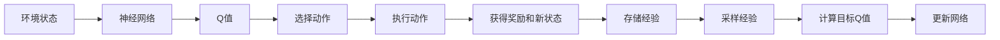
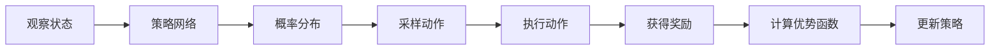

# 深度强化学习 (Deep Reinforcement Learning)

## 1. 背景介绍
在人工智能的众多分支中，深度强化学习（Deep Reinforcement Learning, DRL）是近年来发展最为迅速的领域之一。它结合了深度学习（Deep Learning, DL）的感知能力和强化学习（Reinforcement Learning, RL）的决策能力，使得机器能够在复杂的环境中自主学习如何做出最优决策。从AlphaGo击败世界围棋冠军，到自动驾驶汽车在复杂交通中巧妙导航，DRL的应用前景广阔，引人注目。

## 2. 核心概念与联系
### 2.1 强化学习基础
- **Agent（智能体）**：执行动作的实体。
- **Environment（环境）**：智能体所处并与之交互的外部世界。
- **State（状态）**：环境在某一时刻的具体情况。
- **Action（动作）**：智能体在某状态下所采取的行为。
- **Reward（奖励）**：智能体执行动作后环境给予的反馈。

### 2.2 深度学习的融合
- **Neural Networks（神经网络）**：用于近似非线性函数，如策略函数或价值函数。
- **Feature Learning（特征学习）**：自动从原始数据中学习有用特征的过程。

### 2.3 DRL的核心
- **Policy（策略）**：定义了在给定状态下选择动作的规则。
- **Value Function（价值函数）**：预测从某状态开始，采取特定策略能获得的累积奖励。
- **Q-Learning**：一种基于价值的方法，使用Q函数（动作价值函数）来评估状态-动作对。

## 3. 核心算法原理具体操作步骤
### 3.1 DQN（Deep Q-Network）

1. **初始化**：构建Q网络和目标Q网络。
2. **经验回放**：智能体的经验（状态，动作，奖励，新状态）存储在经验池中。
3. **采样**：从经验池中随机采样一批经验。
4. **目标Q值计算**：使用目标Q网络和奖励计算目标Q值。
5. **梯度下降**：根据目标Q值和当前Q值的差异更新网络权重。

### 3.2 策略梯度方法

1. **策略网络**：使用神经网络参数化策略。
2. **采样动作**：根据策略网络输出的概率分布采样动作。
3. **执行动作**：在环境中执行采样的动作。
4. **优势函数**：评估动作相对于平均的好坏。
5. **策略更新**：根据优势函数更新策略网络。

## 4. 数学模型和公式详细讲解举例说明
### 4.1 Q-Learning的Bellman方程
$$ Q(s_t, a_t) = r_{t+1} + \gamma \max_{a} Q(s_{t+1}, a) $$
其中，$Q(s_t, a_t)$ 是在状态 $s_t$ 下采取动作 $a_t$ 的预期回报，$r_{t+1}$ 是即时奖励，$\gamma$ 是折扣因子，$\max_{a} Q(s_{t+1}, a)$ 是下一状态的最大预期回报。

### 4.2 策略梯度定理
$$ \nabla_{\theta}J(\theta) = \mathbb{E}_{\tau \sim \pi_\theta} \left[ \sum_{t=0}^{T} \nabla_{\theta} \log \pi_\theta(a_t|s_t) A^{\pi_\theta}(s_t, a_t) \right] $$
其中，$J(\theta)$ 是策略的性能函数，$\pi_\theta$ 是参数为 $\theta$ 的策略，$A^{\pi_\theta}(s_t, a_t)$ 是优势函数，表示在状态 $s_t$ 下采取动作 $a_t$ 相对于平均策略的优势。

## 5. 项目实践：代码实例和详细解释说明
由于篇幅限制，这里仅提供一个简化的DQN代码示例：
```python
import numpy as np
import tensorflow as tf
from collections import deque
import random

class DQN:
    def __init__(self, state_size, action_size):
        self.state_size = state_size
        self.action_size = action_size
        self.memory = deque(maxlen=2000)
        self.gamma = 0.95    # discount rate
        self.epsilon = 1.0    # exploration rate
        self.epsilon_min = 0.01
        self.epsilon_decay = 0.995
        self.model = self._build_model()

    def _build_model(self):
        # Neural Net for Deep-Q learning Model
        model = tf.keras.models.Sequential()
        model.add(tf.keras.layers.Dense(24, input_dim=self.state_size, activation='relu'))
        model.add(tf.keras.layers.Dense(24, activation='relu'))
        model.add(tf.keras.layers.Dense(self.action_size, activation='linear'))
        model.compile(loss='mse', optimizer=tf.keras.optimizers.Adam(0.001))
        return model

    def remember(self, state, action, reward, next_state, done):
        self.memory.append((state, action, reward, next_state, done))

    def act(self, state):
        if np.random.rand() <= self.epsilon:
            return random.randrange(self.action_size)
        act_values = self.model.predict(state)
        return np.argmax(act_values[0])  # returns action

    def replay(self, batch_size):
        minibatch = random.sample(self.memory, batch_size)
        for state, action, reward, next_state, done in minibatch:
            target = reward
            if not done:
                target = (reward + self.gamma * np.amax(self.model.predict(next_state)[0]))
            target_f = self.model.predict(state)
            target_f[0][action] = target
            self.model.fit(state, target_f, epochs=1, verbose=0)
        if self.epsilon > self.epsilon_min:
            self.epsilon *= self.epsilon_decay
```
这段代码展示了DQN算法的核心组成部分，包括模型构建、记忆存储、行为选择和经验回放。

## 6. 实际应用场景
深度强化学习已被应用于多个领域，包括但不限于：
- **游戏**：从经典的Atari游戏到复杂的多人在线战斗竞技场（MOBA）游戏。
- **机器人**：用于机器人的导航、操控和决策。
- **自动驾驶**：用于汽车的路径规划、障碍物避让和交通行为预测。
- **金融**：在投资组合管理和交易策略中进行决策优化。

## 7. 工具和资源推荐
- **TensorFlow** 和 **PyTorch**：两个主流的深度学习框架，都支持构建和训练DRL模型。
- **OpenAI Gym**：提供了一系列设计良好的环境，用于开发和测试强化学习算法。
- **Stable Baselines**：一个基于OpenAI Gym的强化学习算法库，提供了多种预训练的模型和实用工具。

## 8. 总结：未来发展趋势与挑战
深度强化学习的未来发展趋势包括算法的进一步优化、多任务学习、转移学习、以及与其他AI领域的融合。同时，挑战也十分明显，如样本效率低、稳定性和鲁棒性问题、解释性和安全性等。

## 9. 附录：常见问题与解答
**Q1：深度强化学习和传统强化学习有什么区别？**
A1：深度强化学习结合了深度学习，能够处理高维度的输入数据，而传统强化学习通常处理较低维度的问题。

**Q2：DRL在实际应用中的主要障碍是什么？**
A2：主要障碍包括算法的样本效率、稳定性、泛化能力以及安全性等。

**Q3：如何评估深度强化学习模型的性能？**
A3：通常通过模型在特定任务中的累积奖励、收敛速度和稳定性来评估性能。

作者：禅与计算机程序设计艺术 / Zen and the Art of Computer Programming