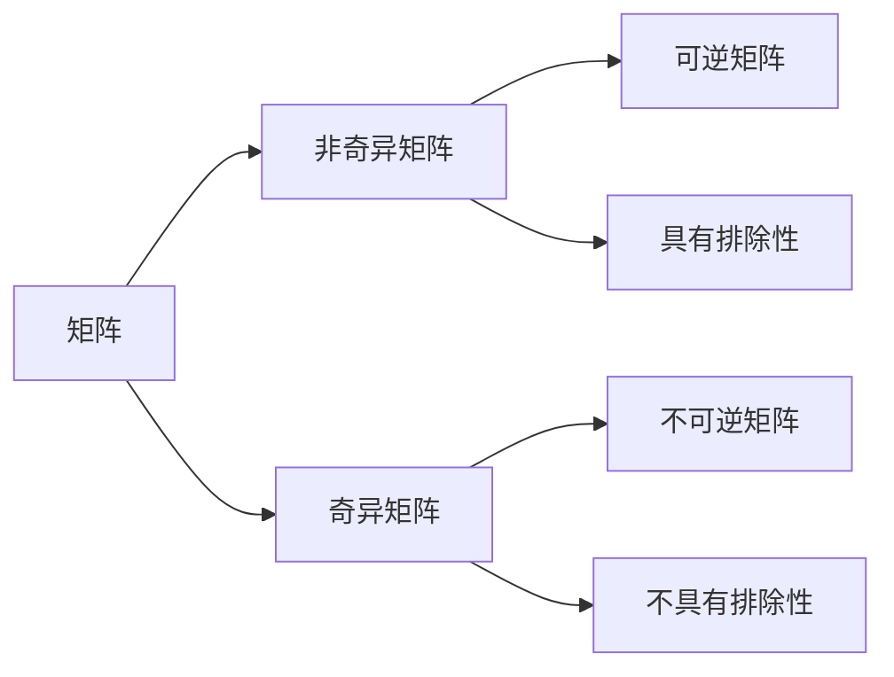

# 矩阵理论与应用：矩阵非奇异性定理与排除定理

## 1. 背景介绍

矩阵理论是数学和计算机科学中一个重要的分支,在人工智能、图像处理、控制论等领域有着广泛的应用。矩阵的非奇异性和排除性质是矩阵理论的重要内容,对于求解线性方程组、计算矩阵的逆等问题具有重要意义。本文将重点探讨矩阵的非奇异性定理和排除定理,并给出相关的数学证明、代码实现以及实际应用。

### 1.1 矩阵的基本概念
#### 1.1.1 矩阵的定义
#### 1.1.2 特殊矩阵
#### 1.1.3 矩阵的运算

### 1.2 行列式
#### 1.2.1 行列式的定义
#### 1.2.2 行列式的性质
#### 1.2.3 行列式的计算

### 1.3 矩阵的秩
#### 1.3.1 矩阵的秩的定义
#### 1.3.2 矩阵的秩的性质
#### 1.3.3 矩阵的秩的计算

## 2. 核心概念与联系

### 2.1 矩阵的非奇异性
#### 2.1.1 非奇异矩阵的定义
#### 2.1.2 非奇异矩阵的性质
#### 2.1.3 非奇异矩阵与可逆矩阵的关系

### 2.2 矩阵的排除性
#### 2.2.1 矩阵排除的定义
#### 2.2.2 矩阵排除的性质
#### 2.2.3 矩阵排除与线性无关的关系

### 2.3 非奇异性与排除性的联系
#### 2.3.1 非奇异矩阵一定具有排除性
#### 2.3.2 具有排除性的矩阵不一定非奇异
#### 2.3.3 非奇异性与排除性在应用中的意义



## 3. 核心算法原理具体操作步骤

### 3.1 判断矩阵非奇异性的算法
#### 3.1.1 行列式法
#### 3.1.2 初等变换法
#### 3.1.3 秩法

### 3.2 判断矩阵排除性的算法 
#### 3.2.1 定义法
#### 3.2.2 秩法
#### 3.2.3 行列式法

### 3.3 求矩阵的逆的算法
#### 3.3.1 初等变换法
#### 3.3.2 伴随矩阵法
#### 3.3.3 分块矩阵法

## 4. 数学模型和公式详细讲解举例说明

### 4.1 非奇异矩阵的判定定理
**定理1：** 设$A$是$n$阶方阵,则$A$为非奇异矩阵的充要条件是$|A| \neq 0$。

**证明：**
充分性:设$|A| \neq 0$,则由行列式性质可知$A$可逆,从而$A$为非奇异矩阵。
必要性:设$A$为非奇异矩阵,则$A$可逆,从而$|A| \neq 0$。

**例1：** 判断矩阵$A=\begin{bmatrix} 1 & 2 \\ 3 & 4 \end{bmatrix}$是否为非奇异矩阵。
解:计算$|A|=\begin{vmatrix} 1 & 2 \\ 3 & 4 \end{vmatrix}=1 \times 4-2 \times 3=-2 \neq 0$,
故$A$为非奇异矩阵。

### 4.2 排除定理
**定理2：** 设$A$是$m \times n$矩阵,$\alpha_1,\alpha_2,\cdots,\alpha_n$是$A$的列向量,则
$$rank(A)=n \Leftrightarrow \alpha_1,\alpha_2,\cdots,\alpha_n线性无关$$

**证明：**
充分性:若$\alpha_1,\alpha_2,\cdots,\alpha_n$线性无关,则它们可以构成$A$的一个极大线性无关组,从而$rank(A)=n$。
必要性:若$rank(A)=n$,则存在$A$的$n$个线性无关的列向量,不妨设为$\alpha_1,\alpha_2,\cdots,\alpha_n$。

**例2：** 设$A=\begin{bmatrix} 1 & 0 & 2 \\ 0 & 1 & 3 \end{bmatrix}$,判断$A$的列向量是否线性无关。
解:对$A$进行初等行变换:
$$\begin{bmatrix} 1 & 0 & 2 \\ 0 & 1 & 3 \end{bmatrix} \sim \begin{bmatrix} 1 & 0 & 2 \\ 0 & 1 & 0 \end{bmatrix}$$
故$rank(A)=2 \neq 3$,从而$A$的列向量线性相关。

### 4.3 逆矩阵的计算公式
设$A$是$n$阶非奇异矩阵,则$A$的逆矩阵$A^{-1}$可按下列公式计算:
$$A^{-1}=\frac{1}{|A|}A^*$$
其中$A^*$为$A$的伴随矩阵。

**例3：** 求矩阵$A=\begin{bmatrix} 1 & 2 \\ 3 & 4 \end{bmatrix}$的逆矩阵。
解:$|A|=-2$,
$$A^*=\begin{bmatrix} 4 & -2 \\ -3 & 1 \end{bmatrix}$$
故
$$A^{-1}=\frac{1}{-2} \begin{bmatrix} 4 & -2 \\ -3 & 1 \end{bmatrix}=\begin{bmatrix} -2 & 1 \\ \frac{3}{2} & -\frac{1}{2} \end{bmatrix}$$

## 5. 项目实践：代码实例和详细解释说明

下面给出几个常用的矩阵运算的Python代码实现。

### 5.1 矩阵乘法

```python
def matrix_multiply(A, B):
    """矩阵乘法"""
    m, n, s = len(A), len(B[0]), len(B)
    C = [[0] * n for _ in range(m)]
    for i in range(m):
        for j in range(n):
            for k in range(s):
                C[i][j] += A[i][k] * B[k][j]
    return C
```

函数`matrix_multiply`实现了两个矩阵的乘法运算,其中`A`是$m \times s$矩阵,`B`是$s \times n$矩阵,返回$m \times n$矩阵`C`。时间复杂度为$O(msn)$。

### 5.2 行列式计算

```python
def det(A):
    """计算方阵A的行列式"""
    n = len(A)
    if n == 1:
        return A[0][0]
    res = 0
    for j in range(n):
        B = [row[:j] + row[j+1:] for row in A[1:]]
        res += (1 - 2*(j%2)) * A[0][j] * det(B)
    return res
```

函数`det`使用递归算法计算$n$阶方阵`A`的行列式,时间复杂度为$O(n!)$。其中`B`为`A`去掉第一行第$j$列后的$(n-1)$阶子方阵。

### 5.3 高斯消元法求矩阵的秩

```python
def gcd(a, b):
    """欧几里得算法求最大公约数"""
    return a if b == 0 else gcd(b, a % b)

def gcd_row(row):
    """求行向量的最大公约数"""
    g = 0
    for x in row:
        g = gcd(g, x)
    return g

def gaussian_elimination(A):
    """高斯消元法"""
    m, n = len(A), len(A[0])
    r = 0
    for c in range(n):
        # 找主元
        max_r = r
        for i in range(r+1, m):
            if abs(A[i][c]) > abs(A[max_r][c]):
                max_r = i
        if A[max_r][c] == 0:
            continue
        # 交换两行 
        A[r], A[max_r] = A[max_r], A[r]
        # 第r行归一化
        div = gcd_row(A[r])
        for j in range(c, n):
            A[r][j] //= div
        # 消元
        for i in range(r+1, m):
            if A[i][c] != 0:
                lcm = A[i][c] // gcd(A[i][c], A[r][c]) * A[r][c]
                for j in range(c, n):
                    A[i][j] = A[i][j] * A[r][c] - A[r][j] * A[i][c]
                    A[i][j] //= lcm
        r += 1
    return r
```

函数`gaussian_elimination`使用高斯消元法将矩阵`A`化为行阶梯形矩阵,返回矩阵的秩`r`。其中`gcd`为欧几里得算法求两个整数的最大公约数,`gcd_row`求行向量元素的最大公约数。时间复杂度为$O(m^2n)$。

## 6. 实际应用场景

矩阵的非奇异性和排除性质在许多领域有着重要的应用,下面列举几个典型的应用场景。

### 6.1 线性方程组求解

对于线性方程组$Ax=b$,若系数矩阵$A$为非奇异矩阵,则方程组有唯一解,可以通过求$A$的逆矩阵得到:
$$x=A^{-1}b$$
若$A$为奇异矩阵,则方程组可能无解或有无穷多解。此时可以通过高斯消元法化简系数矩阵,判断方程组的解的情况。

### 6.2 特征值和特征向量计算

对于$n$阶矩阵$A$,如果数$\lambda$和$n$维非零列向量$\alpha$满足
$$A\alpha=\lambda \alpha$$
则称$\lambda$为$A$的一个特征值,$\alpha$为$A$的属于特征值$\lambda$的一个特征向量。

特征值和特征向量在物理学、工程学等领域有重要应用,例如矩阵对角化、主成分分析等。求矩阵的特征值往往需要计算特征多项式$|\lambda I-A|$,其中$I$为$n$阶单位矩阵,$|·|$表示行列式。显然,$|\lambda I-A|$的根即为$A$的全部特征值。

### 6.3 计算机图形学

在计算机图形学中,常常需要对图形进行平移、旋转、缩放等变换,这些变换都可以用矩阵来表示。例如,将平面上的点$(x,y)$绕原点逆时针旋转$\theta$角得到点$(x',y')$,可以用下面的矩阵乘法表示:

$$\begin{bmatrix} x' \\ y' \end{bmatrix}=\begin{bmatrix} \cos \theta & -\sin \theta \\ \sin \theta & \cos \theta \end{bmatrix} \begin{bmatrix} x \\ y \end{bmatrix}$$

再如,将空间中的点$(x,y,z)$绕$z$轴旋转$\theta$角,可以用下面的矩阵乘法表示:

$$\begin{bmatrix} x' \\ y' \\ z' \end{bmatrix}=\begin{bmatrix} \cos \theta & -\sin \theta & 0 \\ \sin \theta & \cos \theta & 0 \\ 0 & 0 & 1 \end{bmatrix} \begin{bmatrix} x \\ y \\ z \end{bmatrix}$$

通过矩阵的乘法和求逆等运算,可以方便地实现图形的各种变换。

## 7. 工具和资源推荐

### 7.1 数学软件
- MATLAB
- Mathematica
- Maple
- SageMath

### 7.2 数值计算库
- NumPy (Python)
- Eigen (C++)
- BLAS/LAPACK (Fortran)
- Math Kernel Library (Intel)

### 7.3 符号计算库
- SymPy (Python)
- Maxima (Lisp)
- Reduce (Standard Lisp)
- Axiom (Aldor)

### 7.4 在线教程
- MIT线性代数课程 (Gilbert Strang)
- Khan Academy线性代数教程
- 3Blue1Brown线性代数的本质

### 7.5 经典书籍
- Introduction to Linear Algebra (Gilbert St