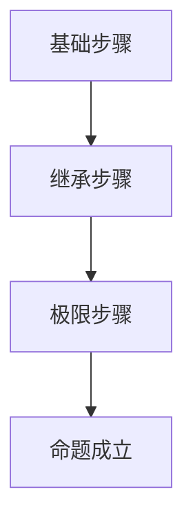

# 集合论导引：超限归纳法

## 1.背景介绍

集合论是数学的一个基础分支，研究集合的性质和关系。集合论不仅在数学中占据重要地位，还在计算机科学、逻辑学和其他科学领域中有广泛应用。超限归纳法是集合论中的一个重要工具，用于处理无限集合和超限序数的问题。本文将深入探讨超限归纳法的核心概念、算法原理、数学模型、实际应用以及未来发展趋势。

## 2.核心概念与联系

### 2.1 集合与序数

集合是数学中最基本的概念之一，表示一组对象的集合。序数是用于表示集合的大小和顺序的数。有限序数是自然数，而无限序数则用于表示无限集合的大小。

### 2.2 超限归纳法

超限归纳法是一种数学证明技术，用于证明关于所有序数的命题。它是归纳法的推广，适用于无限序数。超限归纳法包括以下三个步骤：
1. 基础步骤：证明命题对最小序数（通常是0）成立。
2. 继承步骤：假设命题对某个序数 $\alpha$ 成立，证明命题对 $\alpha+1$ 也成立。
3. 极限步骤：对于极限序数 $\lambda$，假设命题对所有小于 $\lambda$ 的序数都成立，证明命题对 $\lambda$ 也成立。

### 2.3 超限归纳法与归纳法的区别

归纳法仅适用于有限集合，而超限归纳法则适用于无限集合。归纳法的继承步骤只需考虑 $\alpha+1$，而超限归纳法还需考虑极限序数的情况。

## 3.核心算法原理具体操作步骤

### 3.1 基础步骤

基础步骤是证明命题对最小序数成立。通常情况下，最小序数是0。我们需要证明命题 $P(0)$ 成立。

### 3.2 继承步骤

继承步骤是证明命题对某个序数 $\alpha$ 成立时，命题对 $\alpha+1$ 也成立。假设 $P(\alpha)$ 成立，我们需要证明 $P(\alpha+1)$ 也成立。

### 3.3 极限步骤

极限步骤是处理极限序数的情况。对于极限序数 $\lambda$，假设命题对所有小于 $\lambda$ 的序数都成立，我们需要证明命题对 $\lambda$ 也成立。

### 3.4 算法流程图



## 4.数学模型和公式详细讲解举例说明

### 4.1 序数的定义

序数是集合的等价类，用于表示集合的大小和顺序。有限序数是自然数，而无限序数则用于表示无限集合的大小。

### 4.2 超限归纳法的数学表达

超限归纳法的数学表达如下：

$$
\forall \alpha (P(0) \land (\forall \beta < \alpha, P(\beta) \implies P(\alpha)) \implies \forall \alpha, P(\alpha))
$$

### 4.3 举例说明

假设我们要证明一个关于所有序数的命题 $P(\alpha)$。我们可以使用超限归纳法进行证明：

1. 基础步骤：证明 $P(0)$ 成立。
2. 继承步骤：假设 $P(\alpha)$ 成立，证明 $P(\alpha+1)$ 也成立。
3. 极限步骤：对于极限序数 $\lambda$，假设 $P(\beta)$ 对所有 $\beta < \lambda$ 都成立，证明 $P(\lambda)$ 也成立。

## 5.项目实践：代码实例和详细解释说明

### 5.1 Python代码示例

以下是一个使用Python实现超限归纳法的示例代码：

```python
def base_case():
    # 基础步骤
    return True

def inductive_step(alpha):
    # 继承步骤
    return True

def limit_step(lambda_):
    # 极限步骤
    return all(inductive_step(beta) for beta in range(lambda_))

def transfinite_induction(alpha):
    if alpha == 0:
        return base_case()
    elif alpha > 0 and isinstance(alpha, int):
        return inductive_step(alpha - 1)
    else:
        return limit_step(alpha)

# 测试超限归纳法
alpha = 10
print(transfinite_induction(alpha))
```

### 5.2 代码解释

1. `base_case` 函数实现基础步骤，返回命题对最小序数成立。
2. `inductive_step` 函数实现继承步骤，返回命题对 $\alpha+1$ 成立。
3. `limit_step` 函数实现极限步骤，返回命题对极限序数成立。
4. `transfinite_induction` 函数根据序数的类型调用相应的步骤函数。

## 6.实际应用场景

### 6.1 数学证明

超限归纳法广泛应用于数学证明，特别是涉及无限集合和序数的命题。例如，证明某些递归定义的函数在所有序数上都成立。

### 6.2 计算机科学

在计算机科学中，超限归纳法用于证明递归算法的正确性和终止性，特别是涉及无限递归的情况。

### 6.3 逻辑学

在逻辑学中，超限归纳法用于证明逻辑系统的完备性和一致性，特别是涉及无限逻辑公式的情况。

## 7.工具和资源推荐

### 7.1 数学工具

- **Mathematica**：强大的数学计算工具，支持集合论和序数的计算。
- **Coq**：交互式定理证明器，支持形式化证明和超限归纳法。

### 7.2 编程工具

- **Python**：灵活的编程语言，适合实现超限归纳法的算法。
- **Haskell**：函数式编程语言，支持递归和无限数据结构的处理。

### 7.3 资源推荐

- **《集合论导引》**：经典的集合论教材，详细介绍了集合论的基本概念和超限归纳法。
- **《计算机科学中的数学》**：介绍了集合论在计算机科学中的应用，包括超限归纳法。

## 8.总结：未来发展趋势与挑战

### 8.1 未来发展趋势

随着数学和计算机科学的发展，超限归纳法将继续在更多领域中发挥重要作用。特别是在大数据和人工智能领域，处理无限数据和递归算法的需求将推动超限归纳法的发展。

### 8.2 挑战

尽管超限归纳法在理论上非常强大，但在实际应用中仍面临一些挑战。例如，处理复杂的无限序数和递归结构需要高效的算法和计算工具。此外，形式化证明和验证仍是一个重要的研究方向。

## 9.附录：常见问题与解答

### 9.1 什么是超限归纳法？

超限归纳法是一种数学证明技术，用于证明关于所有序数的命题。它包括基础步骤、继承步骤和极限步骤。

### 9.2 超限归纳法与归纳法有什么区别？

归纳法仅适用于有限集合，而超限归纳法适用于无限集合。归纳法的继承步骤只需考虑 $\alpha+1$，而超限归纳法还需考虑极限序数的情况。

### 9.3 超限归纳法在计算机科学中的应用有哪些？

超限归纳法在计算机科学中用于证明递归算法的正确性和终止性，特别是涉及无限递归的情况。

### 9.4 如何使用Python实现超限归纳法？

可以使用Python编写函数实现超限归纳法的基础步骤、继承步骤和极限步骤，并根据序数的类型调用相应的步骤函数。

### 9.5 超限归纳法的未来发展趋势是什么？

随着数学和计算机科学的发展，超限归纳法将在大数据和人工智能领域中发挥重要作用，处理无限数据和递归算法的需求将推动其发展。

---

作者：禅与计算机程序设计艺术 / Zen and the Art of Computer Programming