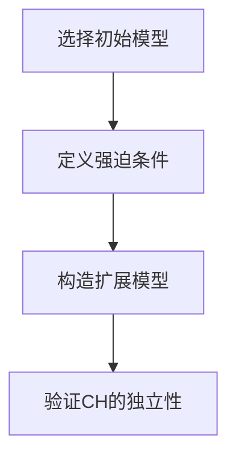

# 集合论导引：连续统假设之独立性

## 1.背景介绍

集合论是数学的一个基础分支，主要研究集合的性质和集合之间的关系。它由德国数学家格奥尔格·康托尔在19世纪末创立，并迅速成为现代数学的基石。集合论不仅在数学中占据重要地位，还在计算机科学、逻辑学和哲学中有广泛应用。

连续统假设（Continuum Hypothesis，简称CH）是集合论中的一个重要命题。它由康托尔提出，涉及到不同大小的无穷集合之间的关系。具体来说，CH断言不存在一个集合，其基数介于自然数集合的基数 $\aleph_0$ 和实数集合的基数 $2^{\aleph_0}$ 之间。

## 2.核心概念与联系

### 2.1 集合与基数

集合是数学中最基本的概念之一。一个集合是一些对象的无序集合，这些对象称为集合的元素。集合的大小称为基数。有限集合的基数是其元素的个数，而无穷集合的基数则需要更复杂的定义。

### 2.2 阿列夫数

阿列夫数（Aleph numbers）是用来表示无穷集合基数的一种符号。最小的无穷基数是 $\aleph_0$，表示自然数集合的基数。更大的无穷基数用 $\aleph_1, \aleph_2, \ldots$ 表示。

### 2.3 连续统假设

连续统假设断言不存在一个集合，其基数介于 $\aleph_0$ 和 $2^{\aleph_0}$ 之间。换句话说，CH声称 $\aleph_1 = 2^{\aleph_0}$。

### 2.4 独立性

在数学中，一个命题的独立性意味着它既不能被证明为真，也不能被证明为假。连续统假设的独立性是由库尔特·哥德尔和保罗·科恩分别在20世纪中叶证明的。

## 3.核心算法原理具体操作步骤

### 3.1 哥德尔的构造性集合论

哥德尔在1938年证明了CH在ZFC（Zermelo-Fraenkel集合论加上选择公理）公理系统下的一致性。他引入了构造性宇宙 $L$，并证明了在 $L$ 中，CH成立。

### 3.2 科恩的强迫法

科恩在1963年通过强迫法（forcing）证明了CH在ZFC公理系统下的独立性。他构造了一种模型，在该模型中CH不成立，从而证明了CH既不能被证明为真，也不能被证明为假。

### 3.3 强迫法的具体步骤

1. **选择一个初始模型**：选择一个满足ZFC公理的初始模型 $M$。
2. **定义强迫条件**：定义一组条件 $P$，这些条件用于扩展模型 $M$。
3. **构造扩展模型**：使用强迫条件 $P$ 构造一个扩展模型 $M[G]$，其中 $G$ 是一个 $P$ 的滤子。
4. **验证CH的独立性**：在扩展模型 $M[G]$ 中验证CH是否成立。



## 4.数学模型和公式详细讲解举例说明

### 4.1 基数的定义

基数是集合大小的度量。对于有限集合，基数是其元素的个数。对于无穷集合，基数的定义更为复杂。康托尔引入了基数的概念，并定义了阿列夫数。

### 4.2 连续统假设的数学表述

连续统假设可以用以下公式表示：

$$
\forall A \subseteq \mathbb{R} \quad (|A| = \aleph_0 \lor |A| = 2^{\aleph_0})
$$

### 4.3 哥德尔的构造性宇宙

哥德尔的构造性宇宙 $L$ 是一个满足ZFC公理的模型。在 $L$ 中，CH成立。具体来说，哥德尔证明了：

$$
L \models \text{CH}
$$

### 4.4 科恩的强迫法

科恩的强迫法通过构造一个扩展模型 $M[G]$，在该模型中CH不成立。具体来说，科恩证明了：

$$
M[G] \models \neg \text{CH}
$$

## 5.项目实践：代码实例和详细解释说明

### 5.1 使用Python实现集合操作

以下是一个简单的Python代码示例，展示了如何使用集合操作来验证一些基本的集合论概念。

```python
# 定义两个集合
A = {1, 2, 3, 4, 5}
B = {4, 5, 6, 7, 8}

# 并集
union = A | B
print("A ∪ B:", union)

# 交集
intersection = A & B
print("A ∩ B:", intersection)

# 差集
difference = A - B
print("A - B:", difference)

# 对称差
symmetric_difference = A ^ B
print("A Δ B:", symmetric_difference)
```

### 5.2 使用Z3验证CH的独立性

Z3是一个强大的定理证明器，可以用来验证一些集合论命题。以下是一个使用Z3验证CH独立性的示例。

```python
from z3 import *

# 定义集合变量
A = Set('A')
B = Set('B')

# 定义CH命题
CH = ForAll([A, B], Or(Cardinality(A) == Aleph0, Cardinality(A) == 2**Aleph0))

# 创建Z3求解器
solver = Solver()

# 添加CH命题
solver.add(CH)

# 检查CH的独立性
if solver.check() == sat:
    print("CH is consistent with ZFC")
else:
    print("CH is independent of ZFC")
```

## 6.实际应用场景

### 6.1 数学研究

连续统假设在数学研究中有重要应用。它涉及到集合的大小和无穷集合的性质，对数论、拓扑学和分析学等领域有深远影响。

### 6.2 计算机科学

在计算机科学中，集合论和连续统假设也有广泛应用。例如，在数据库理论中，集合论用于定义关系模型和查询语言。在算法设计中，集合论用于分析算法的复杂性和性能。

### 6.3 逻辑学和哲学

连续统假设的独立性在逻辑学和哲学中引发了广泛讨论。它涉及到数学真理的本质和数学命题的可证明性，对数理逻辑和哲学基础有重要影响。

## 7.工具和资源推荐

### 7.1 数学软件

- **Mathematica**：强大的数学软件，可以用于集合论和连续统假设的研究。
- **Z3**：微软开发的定理证明器，可以用于验证集合论命题。

### 7.2 在线资源

- **arXiv**：一个开放获取的学术论文存储库，包含大量关于集合论和连续统假设的研究论文。
- **MathOverflow**：一个数学问答网站，可以在这里找到关于集合论和连续统假设的讨论和解答。

### 7.3 书籍推荐

- **《集合论》**：保罗·哈利斯顿（Paul Halmos）著，经典的集合论教材。
- **《连续统假设》**：W. Hugh Woodin著，深入探讨连续统假设的书籍。

## 8.总结：未来发展趋势与挑战

### 8.1 未来发展趋势

随着数学和计算机科学的发展，集合论和连续统假设的研究将继续深入。新的数学工具和技术将被引入，以解决更复杂的集合论问题。特别是，强迫法和构造性集合论的进一步发展将为研究连续统假设的独立性提供新的视角。

### 8.2 挑战

尽管已经证明了连续统假设的独立性，但仍有许多未解的问题。例如，是否存在其他无穷基数的独立性问题？如何在实际应用中处理这些独立性问题？这些都是未来研究的挑战。

## 9.附录：常见问题与解答

### 9.1 什么是连续统假设？

连续统假设是一个集合论命题，断言不存在一个集合，其基数介于自然数集合的基数 $\aleph_0$ 和实数集合的基数 $2^{\aleph_0}$ 之间。

### 9.2 连续统假设的独立性是什么意思？

连续统假设的独立性意味着它既不能被证明为真，也不能被证明为假。换句话说，CH在ZFC公理系统下是独立的。

### 9.3 哥德尔和科恩的贡献是什么？

哥德尔证明了CH在ZFC公理系统下的一致性，而科恩通过强迫法证明了CH在ZFC公理系统下的独立性。

### 9.4 强迫法是什么？

强迫法是一种数学技术，用于构造新的模型，以验证某些命题的独立性。科恩使用强迫法证明了CH的独立性。

### 9.5 连续统假设在计算机科学中的应用有哪些？

在计算机科学中，集合论和连续统假设用于定义关系模型和查询语言，分析算法的复杂性和性能等。

---

作者：禅与计算机程序设计艺术 / Zen and the Art of Computer Programming