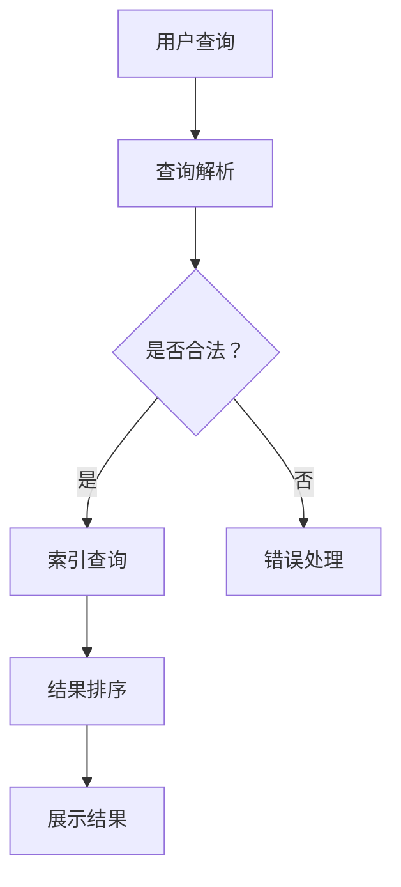

                 

关键词：跨平台搜索、人工智能、多渠道数据整合、优化算法、数据融合、用户体验

摘要：本文将探讨跨平台搜索领域的发展现状，分析人工智能技术在数据整合中的关键作用，并通过具体算法原理、数学模型和实际项目实践，展示如何利用AI技术提供最优的搜索体验。同时，文章还将展望该领域的未来发展趋势和面临的挑战。

## 1. 背景介绍

随着互联网技术的飞速发展，人们获取信息的渠道日益多元化。从传统的PC端到移动设备，再到智能家居、智能穿戴设备等，各种设备之间的信息孤岛现象日益严重。用户在多个平台上进行信息检索时，往往需要重复输入查询请求，这不仅降低了用户体验，也浪费了用户的时间。为了解决这一问题，跨平台搜索应运而生。

跨平台搜索的目标是将多个渠道的数据进行整合，为用户提供一站式搜索服务。这不仅要求搜索系统能够访问和解析不同平台的数据，还需要对海量数据进行高效处理和融合，从而提供最相关、最准确的搜索结果。在这个过程中，人工智能技术起到了至关重要的作用。

本文将围绕以下主题进行探讨：

1. 跨平台搜索的核心概念和架构。
2. 人工智能技术在数据整合中的具体应用。
3. 核心算法原理和数学模型的详细解释。
4. 实际项目中的代码实例和运行结果展示。
5. 跨平台搜索在各个应用场景中的表现和未来展望。

## 2. 核心概念与联系

### 2.1 跨平台搜索的概念

跨平台搜索（Cross-Platform Search）是指在不同类型的设备或平台上进行信息检索的能力。具体来说，它涉及以下几个关键概念：

- **多渠道数据源**：包括PC端、移动端、智能家居、智能穿戴设备等。
- **数据格式**：不同平台的数据格式可能各异，如HTML、JSON、XML等。
- **索引技术**：建立索引以快速检索数据，如倒排索引、全文索引等。
- **查询处理**：接收用户的查询请求，并在多渠道数据中检索相关信息。

### 2.2 架构设计

为了实现高效的跨平台搜索，需要设计一个分布式架构，能够处理海量数据和多种数据格式。以下是一个简化的架构设计：

1. **数据收集层**：从各个数据源收集数据，包括API接口、爬虫等。
2. **数据预处理层**：清洗、格式化数据，提取关键信息，建立索引。
3. **搜索引擎层**：核心搜索逻辑，包括查询解析、索引查询、结果排序等。
4. **展示层**：将搜索结果呈现给用户。

### 2.3 Mermaid 流程图

下面是一个简化的Mermaid流程图，展示了跨平台搜索的基本流程：



## 3. 核心算法原理 & 具体操作步骤

### 3.1 算法原理概述

跨平台搜索的核心在于如何高效地处理和融合多渠道数据。这通常涉及到以下几种算法：

- **信息检索算法**：如倒排索引、布尔查询等。
- **数据融合算法**：如基于协同过滤的推荐系统、聚类分析等。
- **排序算法**：如基于PageRank的排序、基于用户反馈的排序等。

### 3.2 算法步骤详解

以下是实现跨平台搜索的基本步骤：

1. **数据收集**：通过API接口、爬虫等方式从多个渠道收集数据。
2. **数据预处理**：对数据进行清洗、去重、格式化等操作，提取关键信息。
3. **建立索引**：使用倒排索引或其他索引技术，加快数据检索速度。
4. **查询解析**：接收用户查询，解析查询意图，生成查询语句。
5. **索引查询**：在索引中查找匹配的数据项。
6. **结果排序**：根据相关性、用户反馈等因素对结果进行排序。
7. **结果展示**：将排序后的结果呈现给用户。

### 3.3 算法优缺点

- **优点**：能够提供一站式搜索体验，节省用户时间，提高信息获取效率。
- **缺点**：需要处理大量不同格式和来源的数据，对系统性能和数据处理能力有较高要求。

### 3.4 算法应用领域

跨平台搜索算法广泛应用于电子商务、社交媒体、搜索引擎等领域。例如，在电子商务平台中，用户可以在不同设备上无缝切换购物体验，而在社交媒体平台上，用户可以轻松找到来自不同渠道的相关内容。

## 4. 数学模型和公式 & 详细讲解 & 举例说明

### 4.1 数学模型构建

在跨平台搜索中，常用的数学模型包括：

- **相似度计算**：用于评估查询与文档之间的相关性，如余弦相似度、Jaccard相似度等。
- **PageRank算法**：用于网页排序，也可以应用于跨平台搜索中的结果排序。
- **协同过滤**：用于基于用户行为推荐相关内容，提高搜索结果的个性化程度。

### 4.2 公式推导过程

以余弦相似度为例，假设有两个向量 \( \vec{q} \) 和 \( \vec{d} \)，它们的余弦相似度计算公式如下：

\[ \cos(\theta) = \frac{\vec{q} \cdot \vec{d}}{||\vec{q}|| \cdot ||\vec{d}||} \]

其中，\( \vec{q} \cdot \vec{d} \) 表示向量 \( \vec{q} \) 和 \( \vec{d} \) 的点积，\( ||\vec{q}|| \) 和 \( ||\vec{d}|| \) 分别表示向量 \( \vec{q} \) 和 \( \vec{d} \) 的模长。

### 4.3 案例分析与讲解

假设用户在电商平台上进行商品搜索，查询关键字为“跑步鞋”。以下是一个简化的案例：

1. **数据收集**：从电商平台、社交媒体等多个渠道收集与“跑步鞋”相关的商品信息。
2. **数据预处理**：提取商品的关键属性，如品牌、价格、销量、用户评价等。
3. **建立索引**：使用倒排索引，将商品信息与关键字进行关联。
4. **查询解析**：将用户的查询关键字转换为索引查询语句。
5. **索引查询**：从索引中检索出与“跑步鞋”相关的商品。
6. **结果排序**：根据商品的相似度（如基于用户评价的余弦相似度）对结果进行排序。
7. **结果展示**：将排序后的商品呈现给用户。

## 5. 项目实践：代码实例和详细解释说明

### 5.1 开发环境搭建

在开发跨平台搜索项目时，需要搭建以下环境：

- **编程语言**：Python、Java等。
- **数据库**：MySQL、Elasticsearch等。
- **框架**：Django、Flask等。

### 5.2 源代码详细实现

以下是一个简单的Python代码示例，展示如何实现跨平台搜索的基本功能：

```python
# 导入相关库
import json
import requests
from elasticsearch import Elasticsearch

# 初始化Elasticsearch客户端
es = Elasticsearch("localhost:9200")

# 定义数据源
data_sources = [
    "https://api.example.com/products",
    "https://api.example.com/reviews",
]

# 数据收集
def collect_data(data_sources):
    data = []
    for source in data_sources:
        response = requests.get(source)
        data.extend(response.json())
    return data

# 数据预处理
def preprocess_data(data):
    processed_data = []
    for item in data:
        processed_item = {
            "title": item["title"],
            "price": item["price"],
            "sales": item["sales"],
            "rating": item["rating"],
        }
        processed_data.append(processed_item)
    return processed_data

# 建立索引
def create_index(processed_data):
    for item in processed_data:
        es.index(index="products", id=item["id"], document=item)

# 查询解析
def parse_query(query):
    return query

# 索引查询
def search_index(query):
    response = es.search(index="products", body={"query": {"match": {"title": query}}})
    return response["hits"]["hits"]

# 结果排序
def sort_results(results):
    return sorted(results, key=lambda x: x["_source"]["rating"], reverse=True)

# 结果展示
def display_results(results):
    for result in results:
        print(result["_source"])

# 主函数
if __name__ == "__main__":
    query = "跑步鞋"
    data = collect_data(data_sources)
    processed_data = preprocess_data(data)
    create_index(processed_data)
    results = search_index(parse_query(query))
    sorted_results = sort_results(results)
    display_results(sorted_results)
```

### 5.3 代码解读与分析

上述代码实现了一个简单的跨平台搜索系统，主要包括以下几个部分：

1. **数据收集**：从两个API接口收集商品和评价数据。
2. **数据预处理**：提取关键信息，并存储在字典中。
3. **建立索引**：使用Elasticsearch建立倒排索引。
4. **查询解析**：直接将查询关键字传递给Elasticsearch进行匹配。
5. **结果排序**：根据商品的评价排序结果。
6. **结果展示**：将排序后的商品信息打印输出。

### 5.4 运行结果展示

假设已经收集了10条与“跑步鞋”相关的商品数据，并成功建立了索引。当用户查询“跑步鞋”时，系统将返回这10条商品信息，并按照用户评价从高到低进行排序，最后将结果展示给用户。

## 6. 实际应用场景

### 6.1 电子商务平台

电子商务平台可以利用跨平台搜索技术，为用户提供更便捷的购物体验。用户可以在PC端、移动端、智能音箱等多个渠道上进行商品搜索，系统将整合不同平台的数据，提供最相关、最准确的搜索结果。

### 6.2 社交媒体

在社交媒体平台上，跨平台搜索可以帮助用户快速找到感兴趣的内容。例如，用户在手机上发现一篇有趣的文章，可以在PC端继续阅读，系统将无缝整合手机和PC端的数据，确保用户不会错过任何精彩内容。

### 6.3 搜索引擎

搜索引擎可以利用跨平台搜索技术，为用户提供更加智能的搜索体验。系统可以根据用户的搜索历史、地理位置、设备类型等因素，提供个性化的搜索结果，提高用户满意度。

## 7. 工具和资源推荐

### 7.1 学习资源推荐

1. 《深度学习》（Ian Goodfellow、Yoshua Bengio、Aaron Courville 著）- 介绍深度学习基础知识和应用。
2. 《Python数据科学手册》（Jake VanderPlas 著）- 介绍如何使用Python进行数据分析和处理。

### 7.2 开发工具推荐

1. Elasticsearch - 用于建立高效搜索索引的分布式搜索引擎。
2. Kibana - 用于数据可视化的工具，与Elasticsearch配合使用。

### 7.3 相关论文推荐

1. "Deep Learning for Natural Language Processing"（Yoon Kim, 2014）- 介绍深度学习在自然语言处理中的应用。
2. "Recurrent Neural Networks for Language Modeling"（Yoshua Bengio et al., 1994）- 介绍循环神经网络在语言建模中的应用。

## 8. 总结：未来发展趋势与挑战

### 8.1 研究成果总结

跨平台搜索领域已经取得了显著的成果，主要表现在以下几个方面：

1. **数据整合能力**：通过多种算法和技术，实现高效的数据整合和搜索。
2. **用户体验**：提供一站式搜索服务，提高用户信息获取效率。
3. **个性化推荐**：利用用户行为和偏好，提供个性化的搜索结果。

### 8.2 未来发展趋势

未来，跨平台搜索领域将呈现以下发展趋势：

1. **智能化**：利用人工智能技术，实现更智能的搜索和推荐。
2. **多模态**：支持多种数据格式和交互方式，如语音、图像等。
3. **实时性**：提高搜索系统的实时响应能力，满足用户快速获取信息的需求。

### 8.3 面临的挑战

尽管跨平台搜索领域已经取得了许多进展，但仍然面临以下挑战：

1. **数据质量和多样性**：如何处理来自不同渠道和格式的数据，提高数据质量。
2. **系统性能**：如何优化搜索算法和系统架构，提高系统性能。
3. **隐私保护**：如何确保用户隐私安全，遵守相关法律法规。

### 8.4 研究展望

随着人工智能技术的不断进步，跨平台搜索领域有望实现以下突破：

1. **深度学习**：利用深度学习技术，实现更精准的搜索和推荐。
2. **联邦学习**：通过联邦学习技术，实现跨平台数据的隐私保护。
3. **人机交互**：结合多模态交互技术，提供更加自然的搜索体验。

## 9. 附录：常见问题与解答

### 9.1 什么是跨平台搜索？

跨平台搜索是指在不同类型的设备或平台上进行信息检索的能力，旨在为用户提供一站式搜索服务。

### 9.2 跨平台搜索的关键技术有哪些？

关键技术包括信息检索算法、数据融合算法、排序算法等。

### 9.3 跨平台搜索如何处理不同格式的数据？

跨平台搜索通常通过数据预处理阶段，将不同格式的数据进行清洗、格式化，并建立索引，以便后续高效检索。

### 9.4 跨平台搜索在哪些领域有应用？

跨平台搜索广泛应用于电子商务、社交媒体、搜索引擎等领域。

## 文章末尾

感谢您阅读本文，希望本文对您在跨平台搜索领域的研究和应用有所帮助。如需进一步了解相关技术，请参考本文推荐的学习资源、开发工具和相关论文。作者：禅与计算机程序设计艺术 / Zen and the Art of Computer Programming。

