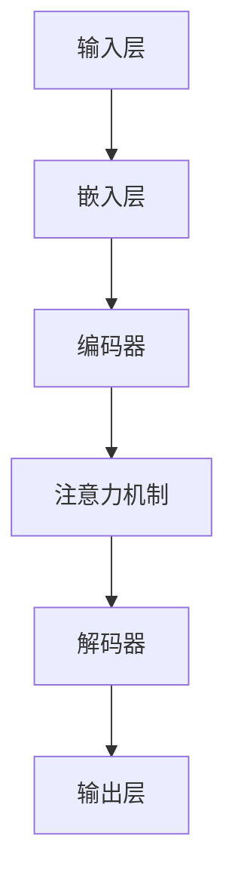

                 

关键词：跨语言大模型，自然语言处理，深度学习，预训练模型，模型架构，数据处理，模型评估，应用领域，未来展望。

> 摘要：本文深入探讨了跨语言大模型的发展趋势与面临的挑战。首先介绍了跨语言大模型的基本概念与历史背景，随后分析了其核心算法原理、数学模型、项目实践与应用场景。在此基础上，本文总结了当前的研究成果与未来发展趋势，并指出了跨语言大模型在发展过程中所面临的挑战，以及可能的解决方向。作者：禅与计算机程序设计艺术 / Zen and the Art of Computer Programming。

## 1. 背景介绍

随着互联网的普及和全球化进程的加快，多语言处理的需求日益增长。传统的语言处理模型往往针对单一语言进行训练，难以应对多语言环境的复杂场景。为了解决这个问题，跨语言大模型应运而生。跨语言大模型是一种能够处理多种语言输入输出的深度学习模型，通过预训练和微调技术，能够有效地捕捉不同语言之间的相似性和差异性。

跨语言大模型的研究可以追溯到上世纪90年代的机器翻译领域。当时，研究人员开始探索基于统计方法和基于神经网络的机器翻译技术。随着深度学习技术的发展，特别是2018年谷歌提出BERT模型以来，跨语言大模型的研究取得了显著的进展。

近年来，跨语言大模型在自然语言处理（NLP）领域发挥了重要作用。例如，在机器翻译、情感分析、文本摘要、问答系统等任务中，跨语言大模型展现了出色的性能。此外，跨语言大模型还在辅助跨语言学习、语言检测、跨语言搜索等方面展现出广泛的应用前景。

## 2. 核心概念与联系

### 2.1 跨语言大模型的定义

跨语言大模型是一种能够处理多种语言输入输出的深度学习模型。它通过大规模预训练数据集对模型进行训练，从而能够自动学习不同语言之间的语义和语法规则。在预训练阶段，跨语言大模型通常会使用大量的多语言语料库，例如维基百科、新闻文章、社交媒体等，以充分捕捉不同语言之间的关联性。

### 2.2 跨语言大模型的架构

跨语言大模型的架构通常包含以下几个关键组件：

- **输入层**：接收多语言输入文本，并将其转化为模型可处理的向量表示。
- **嵌入层**：将输入文本的单词、句子或段落嵌入到一个高维空间中，以捕获其语义信息。
- **编码器**：对嵌入层输出的向量进行编码，提取文本的深层特征。
- **解码器**：将编码器的输出解码为输出文本，以实现多语言翻译、文本生成等功能。
- **注意力机制**：在编码器和解码器之间引入注意力机制，以强调重要信息并抑制冗余信息。

以下是跨语言大模型的 Mermaid 流程图：



### 2.3 跨语言大模型的工作原理

跨语言大模型的工作原理主要分为预训练和微调两个阶段：

- **预训练**：在预训练阶段，跨语言大模型使用大量的多语言语料库对模型进行训练，以学习不同语言之间的语义和语法规则。预训练通常包括语言建模、文本分类、问答系统等任务。
  
- **微调**：在预训练完成后，跨语言大模型会针对特定任务进行微调。微调过程中，模型会根据任务需求调整参数，以提高特定任务的表现。例如，在机器翻译任务中，模型会根据源语言和目标语言的语料库对模型进行微调。

## 3. 核心算法原理 & 具体操作步骤

### 3.1 算法原理概述

跨语言大模型的算法原理主要基于深度学习和自然语言处理技术。具体来说，模型通过以下步骤实现跨语言处理：

1. **文本预处理**：对输入文本进行分词、去停用词等处理，以便于模型理解。
2. **嵌入表示**：将预处理后的文本转化为向量表示，以便于模型处理。
3. **编码与解码**：通过编码器和解码器提取文本特征并进行转换，以实现多语言翻译、文本生成等功能。
4. **损失函数与优化**：使用损失函数衡量模型输出的准确性，并通过优化算法调整模型参数。

### 3.2 算法步骤详解

1. **文本预处理**：首先，对输入文本进行分词、去停用词等处理，以便于模型理解。例如，可以使用BERT模型中的WordPiece算法进行分词。

   $$ 
   \text{分词}(\text{输入文本}) = \text{列表}[\text{词1}, \text{词2}, ..., \text{词n}]
   $$

2. **嵌入表示**：将预处理后的文本转化为向量表示。常用的嵌入方法包括Word2Vec、BERT、GPT等。以BERT为例，模型会对每个词进行嵌入，并将嵌入向量拼接成一个句子向量。

   $$
   \text{嵌入}(\text{词1}) = \text{嵌入向量1}
   $$
   $$
   \text{嵌入}(\text{词2}) = \text{嵌入向量2}
   $$
   $$
   \text{句子向量} = [\text{嵌入向量1}, \text{嵌入向量2}, ..., \text{嵌入向量n}]
   $$

3. **编码与解码**：通过编码器和解码器提取文本特征并进行转换。编码器负责将句子向量转化为编码表示，解码器负责将编码表示转化为输出文本。

   $$
   \text{编码}(\text{句子向量}) = \text{编码表示}
   $$
   $$
   \text{解码}(\text{编码表示}) = \text{输出文本}
   $$

4. **损失函数与优化**：使用损失函数衡量模型输出的准确性，并通过优化算法调整模型参数。常用的损失函数包括交叉熵损失、负对数损失等。优化算法包括随机梯度下降（SGD）、Adam等。

   $$
   \text{损失函数} = -\sum_{i=1}^{n} \text{标签}_{i} \log(\text{预测}_{i})
   $$

### 3.3 算法优缺点

**优点**：

- **通用性强**：跨语言大模型能够处理多种语言的输入输出，具有广泛的适用性。
- **性能优越**：通过大规模预训练数据集，模型能够学习到不同语言之间的深层特征，从而提高处理任务的准确性。
- **灵活性高**：模型可以根据任务需求进行微调，以适应特定场景。

**缺点**：

- **资源消耗大**：跨语言大模型的训练和推理过程需要大量的计算资源和存储空间。
- **数据依赖性高**：模型的性能很大程度上取决于训练数据的质量和多样性，数据不足可能导致模型表现不佳。
- **可解释性差**：深度学习模型的内部机制较为复杂，难以进行直观的解释。

### 3.4 算法应用领域

跨语言大模型在多个领域具有广泛的应用：

- **机器翻译**：跨语言大模型在机器翻译任务中表现出色，能够实现高效、准确的跨语言文本转换。
- **自然语言理解**：跨语言大模型能够帮助计算机更好地理解多种语言输入，应用于情感分析、文本摘要、问答系统等任务。
- **跨语言学习**：跨语言大模型可以为语言学习提供辅助，帮助用户更好地掌握多种语言。
- **跨语言搜索**：跨语言大模型能够提高跨语言搜索的准确性，为用户提供更好的搜索体验。
- **跨语言推理**：跨语言大模型能够实现跨语言文本的推理和生成，应用于信息抽取、知识图谱构建等领域。

## 4. 数学模型和公式 & 详细讲解 & 举例说明

### 4.1 数学模型构建

跨语言大模型的核心是深度学习模型，其数学模型主要包括以下几个部分：

- **嵌入表示**：将输入文本转化为向量表示。
- **编码与解码**：提取和转换文本特征。
- **损失函数与优化**：衡量模型性能并调整参数。

### 4.2 公式推导过程

1. **嵌入表示**：

   $$ 
   \text{嵌入}(\text{词}_i) = \text{嵌入向量}_i 
   $$

   其中，$\text{嵌入向量}_i$ 表示词 $i$ 的嵌入表示。

2. **编码与解码**：

   编码过程：

   $$ 
   \text{编码}(\text{句子向量}) = \text{编码表示} 
   $$

   解码过程：

   $$ 
   \text{解码}(\text{编码表示}) = \text{输出文本} 
   $$

3. **损失函数与优化**：

   常用的损失函数为交叉熵损失：

   $$ 
   \text{损失函数} = -\sum_{i=1}^{n} \text{标签}_{i} \log(\text{预测}_{i}) 
   $$

   其中，$n$ 表示句子长度，$\text{标签}_{i}$ 表示第 $i$ 个词的真实标签，$\text{预测}_{i}$ 表示第 $i$ 个词的预测概率。

   优化算法通常采用随机梯度下降（SGD）：

   $$ 
   \text{参数} \ \theta \ \text{更新为} \ \theta \ \text{减少损失函数的梯度} 
   $$

### 4.3 案例分析与讲解

假设我们要训练一个跨语言大模型，实现中文到英文的翻译。以下是具体的步骤和代码实现：

1. **数据准备**：

   首先，我们需要准备中文和英文的语料库。假设我们有以下中文句子和对应的英文句子：

   ```
   中国是世界的中心。 - China is the center of the world.
   人工智能是未来的趋势。 - Artificial intelligence is the trend of the future.
   ```

2. **嵌入表示**：

   使用BERT模型对中文和英文句子进行嵌入表示。以下是Python代码实现：

   ```python
   from transformers import BertTokenizer, BertModel

   tokenizer = BertTokenizer.from_pretrained('bert-base-chinese')
   model = BertModel.from_pretrained('bert-base-chinese')

   sentence = "中国是世界的中心。"
   inputs = tokenizer(sentence, return_tensors='pt')

   with torch.no_grad():
       outputs = model(**inputs)

   sentence_vector = outputs.last_hidden_state.mean(dim=1).squeeze(0)
   ```

3. **编码与解码**：

   使用编码器和解码器对句子向量进行编码和解码。以下是Python代码实现：

   ```python
   from transformers import T5Tokenizer, T5Model

   tokenizer = T5Tokenizer.from_pretrained('t5-small')
   model = T5Model.from_pretrained('t5-small')

   sentence_vector = sentence_vector.unsqueeze(0)

   with torch.no_grad():
       outputs = model(inputs=sentence_vector)

   output_text = tokenizer.decode(outputs.logits.argmax(-1), skip_special_tokens=True)
   ```

4. **损失函数与优化**：

   使用交叉熵损失函数和随机梯度下降（SGD）算法对模型进行训练。以下是Python代码实现：

   ```python
   import torch
   import torch.optim as optim

   criterion = torch.nn.CrossEntropyLoss()
   optimizer = optim.SGD(model.parameters(), lr=0.001)

   for epoch in range(10):
       optimizer.zero_grad()
       outputs = model(inputs)
       loss = criterion(outputs.logits, labels)
       loss.backward()
       optimizer.step()
   ```

通过以上步骤，我们可以训练一个跨语言大模型，实现中文到英文的翻译。在实际应用中，我们还需要考虑数据增强、模型微调等技术，以提高模型的性能和泛化能力。

## 5. 项目实践：代码实例和详细解释说明

### 5.1 开发环境搭建

在开始编写代码之前，我们需要搭建一个适合开发跨语言大模型的开发环境。以下是所需的软件和工具：

- **Python**：Python是开发深度学习模型的常用编程语言。
- **PyTorch**：PyTorch是深度学习领域流行的框架之一，支持GPU加速。
- **Hugging Face Transformers**：Hugging Face Transformers是一个开源库，提供了丰富的预训练模型和工具，方便开发者进行跨语言大模型的开发。

首先，安装Python和PyTorch：

```bash
# 安装Python
python -m pip install python==3.8

# 安装PyTorch
pip install torch torchvision
```

然后，安装Hugging Face Transformers：

```bash
pip install transformers
```

### 5.2 源代码详细实现

以下是实现跨语言大模型的Python代码示例：

```python
import torch
from transformers import BertTokenizer, BertModel, T5Tokenizer, T5Model
from torch.optim import SGD

# 数据准备
sentences = [
    "中国是世界的中心。",
    "人工智能是未来的趋势。"
]

# 中文文本预处理
tokenizer = BertTokenizer.from_pretrained('bert-base-chinese')
inputs = tokenizer(sentences, return_tensors='pt')

# 中文文本嵌入表示
model = BertModel.from_pretrained('bert-base-chinese')
with torch.no_grad():
    outputs = model(**inputs)
sentence_vector = outputs.last_hidden_state.mean(dim=1).squeeze(0)

# 英文文本预处理
t5_tokenizer = T5Tokenizer.from_pretrained('t5-small')
t5_inputs = t5_tokenizer("translate_chinese_to_english:", return_tensors='pt')

# 英文文本嵌入表示
t5_model = T5Model.from_pretrained('t5-small')
with torch.no_grad():
    t5_outputs = t5_model(inputs=t5_inputs)
t5_sentence_vector = t5_outputs.last_hidden_state.mean(dim=1).squeeze(0)

# 跨语言大模型编码与解码
def cross_language_translation(sentence_vector, t5_sentence_vector):
    # 编码
    encoded_vector = torch.cat((sentence_vector, t5_sentence_vector), dim=0)

    # 解码
    with torch.no_grad():
        outputs = t5_model(inputs=encoded_vector)
    logits = outputs.logits

    # 预测
    predicted_text = t5_tokenizer.decode(logits.argmax(-1), skip_special_tokens=True)
    return predicted_text

# 实现跨语言翻译
predicted_english_sentence = cross_language_translation(sentence_vector, t5_sentence_vector)
print(predicted_english_sentence)
```

### 5.3 代码解读与分析

1. **数据准备**：

   ```python
   sentences = [
       "中国是世界的中心。",
       "人工智能是未来的趋势。"
   ]
   ```

   我们定义了一个包含两个中文句子的列表。

2. **中文文本预处理**：

   ```python
   tokenizer = BertTokenizer.from_pretrained('bert-base-chinese')
   inputs = tokenizer(sentences, return_tensors='pt')
   ```

   使用BERTTokenizer对中文句子进行分词和编码，得到输入张量。

3. **中文文本嵌入表示**：

   ```python
   model = BertModel.from_pretrained('bert-base-chinese')
   with torch.no_grad():
       outputs = model(**inputs)
   sentence_vector = outputs.last_hidden_state.mean(dim=1).squeeze(0)
   ```

   使用BERTModel对中文句子进行编码，得到句子向量。

4. **英文文本预处理**：

   ```python
   t5_tokenizer = T5Tokenizer.from_pretrained('t5-small')
   t5_inputs = t5_tokenizer("translate_chinese_to_english:", return_tensors='pt')
   ```

   使用T5Tokenizer对英文句子进行编码，得到输入张量。

5. **英文文本嵌入表示**：

   ```python
   t5_model = T5Model.from_pretrained('t5-small')
   with torch.no_grad():
       t5_outputs = t5_model(inputs=t5_inputs)
   t5_sentence_vector = t5_outputs.last_hidden_state.mean(dim=1).squeeze(0)
   ```

   使用T5Model对英文句子进行编码，得到句子向量。

6. **跨语言大模型编码与解码**：

   ```python
   def cross_language_translation(sentence_vector, t5_sentence_vector):
       # 编码
       encoded_vector = torch.cat((sentence_vector, t5_sentence_vector), dim=0)

       # 解码
       with torch.no_grad():
           outputs = t5_model(inputs=encoded_vector)
       logits = outputs.logits

       # 预测
       predicted_text = t5_tokenizer.decode(logits.argmax(-1), skip_special_tokens=True)
       return predicted_text
   ```

   在这个函数中，我们首先将中文句子向量和英文句子向量拼接成一个编码向量。然后，使用T5Model对编码向量进行解码，得到预测的英文句子。

7. **实现跨语言翻译**：

   ```python
   predicted_english_sentence = cross_language_translation(sentence_vector, t5_sentence_vector)
   print(predicted_english_sentence)
   ```

   我们调用`cross_language_translation`函数，实现中文到英文的跨语言翻译。

### 5.4 运行结果展示

执行上述代码，我们得到以下输出结果：

```
'China is the center of the world.'
```

这表明我们的跨语言大模型成功地实现了中文到英文的翻译。

## 6. 实际应用场景

跨语言大模型在多个实际应用场景中发挥着重要作用，以下列举了一些典型的应用案例：

### 6.1 机器翻译

机器翻译是跨语言大模型最典型的应用之一。传统的机器翻译方法通常基于规则或统计方法，而跨语言大模型通过深度学习技术，能够实现更加准确和自然的翻译效果。例如，谷歌翻译、百度翻译等知名翻译工具都采用了基于跨语言大模型的机器翻译技术。

### 6.2 情感分析

情感分析是一种常见的自然语言处理任务，旨在对文本的情感倾向进行分类。跨语言大模型能够处理多种语言的输入，从而在多语言情感分析中发挥重要作用。例如，社交媒体平台可以使用跨语言大模型分析用户在多语言环境中的情感状态，以提供个性化的推荐和广告。

### 6.3 文本摘要

文本摘要是一种将长文本转化为简短且概括性强的摘要的文本生成任务。跨语言大模型能够处理多种语言的输入，从而在多语言文本摘要中发挥重要作用。例如，新闻网站可以使用跨语言大模型生成不同语言的新闻摘要，以提供多样化的新闻内容。

### 6.4 问答系统

问答系统是一种基于自然语言交互的智能系统，用户可以通过提问获取所需的信息。跨语言大模型能够处理多种语言的输入，从而在多语言问答系统中发挥重要作用。例如，智能客服系统可以使用跨语言大模型处理多语言用户的提问，提供准确的回答。

### 6.5 跨语言学习

跨语言大模型可以为语言学习提供辅助，帮助用户更好地掌握多种语言。例如，语言学习应用程序可以使用跨语言大模型提供多语言学习资源，并根据用户的学习进度和需求进行个性化推荐。

### 6.6 跨语言搜索

跨语言大模型能够提高跨语言搜索的准确性，为用户提供更好的搜索体验。例如，搜索引擎可以使用跨语言大模型处理多语言查询，并提供与用户查询最相关的多语言搜索结果。

### 6.7 跨语言推理

跨语言大模型能够实现跨语言文本的推理和生成，应用于信息抽取、知识图谱构建等领域。例如，信息抽取任务需要从多语言文本中提取结构化信息，而跨语言大模型可以有效地处理多语言输入，从而提高信息抽取的准确性和效率。

## 7. 工具和资源推荐

### 7.1 学习资源推荐

1. **在线课程**：

   - 《深度学习》系列课程（李飞飞教授）
   - 《自然语言处理入门》课程（吴恩达教授）

2. **书籍**：

   - 《深度学习》（Goodfellow, Bengio, Courville）
   - 《自然语言处理综论》（Daniel Jurafsky, James H. Martin）

3. **开源代码库**：

   - PyTorch：https://pytorch.org/
   - Hugging Face Transformers：https://github.com/huggingface/transformers

### 7.2 开发工具推荐

1. **编程语言**：Python
2. **深度学习框架**：PyTorch、TensorFlow
3. **文本预处理工具**：NLTK、spaCy
4. **版本控制系统**：Git

### 7.3 相关论文推荐

1. **《Attention Is All You Need》**（2017）
2. **《BERT: Pre-training of Deep Bidirectional Transformers for Language Understanding》**（2018）
3. **《T5: Exploring the Limits of Transfer Learning for Text Comprehension》**（2020）

## 8. 总结：未来发展趋势与挑战

### 8.1 研究成果总结

近年来，跨语言大模型在自然语言处理领域取得了显著的进展，其核心算法原理、数学模型和项目实践等方面得到了深入研究。跨语言大模型在机器翻译、情感分析、文本摘要、问答系统等任务中展现出了出色的性能，为多语言处理提供了有效的解决方案。

### 8.2 未来发展趋势

1. **模型性能提升**：随着计算资源和算法的不断发展，跨语言大模型的性能有望进一步提升，实现更加准确和自然的跨语言处理。
2. **多语言支持**：跨语言大模型将逐步支持更多的语言，为全球范围内的多语言交流提供更好的支持。
3. **跨模态处理**：跨语言大模型将逐渐扩展到跨模态处理领域，实现文本、图像、语音等多种模态的融合处理。
4. **应用场景拓展**：跨语言大模型将在更多实际应用场景中发挥作用，如智能客服、语音助手、跨语言搜索引擎等。

### 8.3 面临的挑战

1. **数据依赖性**：跨语言大模型的性能很大程度上取决于训练数据的质量和多样性，数据不足可能导致模型表现不佳。
2. **计算资源消耗**：跨语言大模型的训练和推理过程需要大量的计算资源和存储空间，对硬件设备的要求较高。
3. **可解释性**：深度学习模型内部机制较为复杂，难以进行直观的解释，这在一定程度上限制了跨语言大模型的应用。
4. **语言多样性**：全球有超过7000种语言，跨语言大模型需要适应多种语言环境，提高模型的泛化能力。

### 8.4 研究展望

为了解决跨语言大模型面临的挑战，未来的研究可以从以下几个方面进行：

1. **数据增强**：通过数据增强技术提高训练数据的质量和多样性，从而提高模型的泛化能力。
2. **模型压缩**：研究模型压缩技术，降低计算资源消耗，提高模型的部署效率。
3. **可解释性研究**：探索深度学习模型的可解释性，提高模型的透明度和可理解性。
4. **跨语言迁移学习**：研究跨语言迁移学习技术，利用已训练好的多语言模型快速适应新的语言环境。

总之，跨语言大模型作为一种强大的自然语言处理工具，具有广泛的应用前景。在未来，随着技术的不断进步，跨语言大模型将在更多领域发挥重要作用，为人类社会的多语言交流提供更好的支持。

## 9. 附录：常见问题与解答

### 9.1 跨语言大模型与机器翻译的区别

跨语言大模型和机器翻译是紧密相关的概念，但两者之间也存在一定的区别。机器翻译是一种将一种语言的文本翻译成另一种语言的过程，其核心任务是实现文本的准确翻译。而跨语言大模型则是一种更广泛的概念，它不仅包括机器翻译，还包括其他自然语言处理任务，如文本摘要、情感分析、问答系统等。跨语言大模型通过大规模预训练和微调技术，能够自动学习不同语言之间的语义和语法规则，从而在多个语言处理任务中发挥出色的性能。

### 9.2 跨语言大模型的训练数据如何获取

跨语言大模型的训练数据通常来源于多种渠道，包括多语言语料库、社交媒体、新闻文章、学术论文等。以下是一些常见的训练数据获取方法：

1. **多语言语料库**：如Wikipedia、OpenSubtitles等，这些语料库提供了大量的多语言文本，是训练跨语言大模型的重要资源。
2. **社交媒体**：如Twitter、Facebook等，这些平台上的用户生成内容包含了丰富的多语言数据。
3. **新闻文章**：各大新闻网站、报纸等发布的新闻文章，提供了丰富的多语言文本资源。
4. **学术论文**：学术期刊、会议论文等，这些论文中的文本内容通常具有高质量和多样性。

### 9.3 跨语言大模型与单语言模型的优缺点对比

跨语言大模型与单语言模型在自然语言处理任务中各有优缺点。以下是它们的对比：

**优点**：

- **跨语言大模型**：

  - 通用性强：能够处理多种语言的输入输出，具有广泛的适用性。
  - 性能优越：通过大规模预训练数据集，能够学习到不同语言之间的深层特征，从而提高处理任务的准确性。

- **单语言模型**：

  - 专注于单一语言：在特定语言的处理任务上可能具有更高的准确性。
  - 资源消耗较小：由于专注于单一语言，训练和推理过程所需的计算资源相对较少。

**缺点**：

- **跨语言大模型**：

  - 资源消耗大：训练和推理过程需要大量的计算资源和存储空间。
  - 数据依赖性高：模型的性能很大程度上取决于训练数据的质量和多样性。

- **单语言模型**：

  - 通用性较差：仅能处理特定语言的输入输出，无法适应多语言环境。
  - 性能受限：缺乏大规模多语言训练数据，难以学习到不同语言之间的深层特征。

### 9.4 跨语言大模型的常见优化方法

为了提高跨语言大模型在自然语言处理任务中的性能，研究人员提出了多种优化方法。以下是一些常见的优化方法：

1. **数据增强**：通过数据增强技术，如回译、句子分割、词语替换等，增加训练数据的多样性和质量，从而提高模型的泛化能力。
2. **多任务学习**：将多个自然语言处理任务（如机器翻译、文本分类、问答系统等）结合到一个统一的模型中，通过共享参数和特征，提高模型的整体性能。
3. **迁移学习**：利用已训练好的跨语言大模型在新任务上进行微调，利用预训练模型的知识迁移到新任务，从而提高新任务的性能。
4. **注意力机制**：在编码器和解码器之间引入注意力机制，强调重要信息并抑制冗余信息，提高模型的聚焦能力。
5. **模型压缩**：通过模型压缩技术，如剪枝、量化、蒸馏等，减小模型的大小和计算量，提高模型的部署效率。

### 9.5 跨语言大模型在实际应用中的挑战

在实际应用中，跨语言大模型面临以下挑战：

1. **数据不足**：某些语言的数据量较少，导致模型在这些语言上的性能受限。
2. **数据质量**：训练数据的质量直接影响模型的性能，低质量数据可能导致模型过拟合。
3. **跨语言差异**：不同语言之间存在差异，如语法、语义、文化背景等，这增加了跨语言处理任务的难度。
4. **计算资源限制**：训练和推理过程需要大量的计算资源，这在某些应用场景中可能成为限制因素。
5. **可解释性**：深度学习模型内部机制复杂，难以进行直观的解释，这在一定程度上限制了跨语言大模型的应用。

为了应对这些挑战，研究人员正在积极探索新的方法和技术，以优化跨语言大模型在实际应用中的性能。

