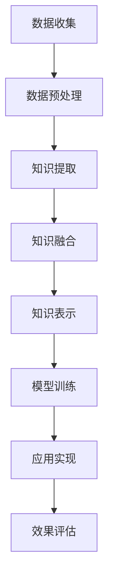

                 

关键词：跨领域知识整合、全能型AI、技术博客、AI算法、数学模型、项目实践、未来展望

> 摘要：本文旨在探讨如何通过跨领域知识整合，打造出具备多种技能的全能型AI助手。文章将首先介绍全能型AI的背景和核心概念，然后深入解析其关键算法原理和数学模型，并分享一个具体的项目实践案例。最后，文章将探讨全能型AI的实际应用场景和未来发展趋势。

## 1. 背景介绍

随着人工智能技术的飞速发展，AI应用逐渐渗透到我们生活的方方面面。从智能家居到自动驾驶，从自然语言处理到图像识别，AI已经展现出巨大的潜力和价值。然而，大多数现有的AI系统都是为特定领域设计的，缺乏灵活性。这使得它们无法应对日益复杂和多样化的现实世界问题。

在这种背景下，全能型AI（General AI）的概念逐渐受到关注。与目前的弱AI（Narrow AI）不同，全能型AI具备广泛的认知能力和跨领域的应用能力。它不仅能在特定任务上表现出色，还能在不同领域间灵活切换，解决复杂的多领域问题。打造全能型AI助手，无疑是一项极具挑战性但又意义深远的任务。

## 2. 核心概念与联系

### 2.1. 全能型AI的定义

全能型AI，又称为通用人工智能（AGI，Artificial General Intelligence），是指具备与人类相似智能水平的人工智能系统。它能够理解、学习和应用各种知识，解决各种问题，具有推理、感知、情感、创造等能力。与弱AI相比，全能型AI的目标是超越特定领域，具备广泛的应用能力。

### 2.2. 跨领域知识整合

跨领域知识整合是指将不同领域的知识和技术进行融合，形成一个统一的、综合性的知识体系。在全能型AI的构建过程中，跨领域知识整合至关重要。它能够帮助AI系统在不同领域间建立联系，实现知识的共享和迁移。

### 2.3. 跨领域知识整合的架构

为了实现跨领域知识整合，我们需要构建一个灵活的、可扩展的知识架构。以下是一个简单的跨领域知识整合架构：



在这个架构中，数据收集、数据预处理、知识提取、知识融合、知识表示、模型训练和应用实现构成了跨领域知识整合的主要环节。每个环节都发挥着关键作用，共同推动全能型AI的发展。

## 3. 核心算法原理 & 具体操作步骤

### 3.1. 算法原理概述

全能型AI的核心算法主要包括知识表示、知识融合、推理和决策等。其中，知识表示是基础，知识融合是关键，推理和决策则是应用。

1. **知识表示**：将不同领域的知识以统一的方式表示，便于后续的知识融合和推理。常见的知识表示方法有语义网络、知识图谱和本体论等。

2. **知识融合**：将不同领域的知识进行整合，形成一个统一的、综合性的知识体系。知识融合的方法包括基于规则的方法、基于统计的方法和基于神经网络的方法等。

3. **推理**：利用知识体系进行逻辑推理，解决实际问题。推理方法包括演绎推理、归纳推理和混合推理等。

4. **决策**：在多个可行的方案中选择最优的方案。决策方法包括确定性决策、概率性决策和进化决策等。

### 3.2. 算法步骤详解

1. **数据收集与预处理**：收集来自不同领域的数据，并进行数据清洗、去噪和格式化等预处理操作。

2. **知识提取**：使用自然语言处理、机器学习和数据挖掘等技术，从数据中提取出有用的知识。

3. **知识融合**：将不同领域的知识进行整合，形成一个统一的、综合性的知识体系。可以使用基于规则的融合方法、基于统计的融合方法或基于神经网络的融合方法。

4. **知识表示**：将融合后的知识以统一的方式表示，便于后续的推理和决策。

5. **模型训练**：使用机器学习算法，对知识表示进行训练，提高推理和决策的准确性。

6. **应用实现**：将训练好的模型应用于实际问题，解决具体问题。

7. **效果评估**：对应用结果进行评估，优化模型参数，提高模型的性能。

### 3.3. 算法优缺点

**优点**：
1. 跨领域知识整合，能够解决复杂的多领域问题。
2. 具备广泛的认知能力，能够适应不同领域的需求。
3. 通过持续学习和优化，不断提高模型的性能。

**缺点**：
1. 构建过程复杂，需要大量的数据和技术支持。
2. 训练时间和计算资源消耗较大。
3. 当前技术水平尚无法实现真正意义上的全能型AI。

### 3.4. 算法应用领域

全能型AI的应用领域非常广泛，包括但不限于：

1. **医疗健康**：辅助医生进行诊断、治疗和康复。
2. **教育**：为学生提供个性化教学和辅导。
3. **金融**：进行风险管理、投资分析和市场预测。
4. **交通**：实现智能交通管理和自动驾驶。
5. **智能家居**：为用户提供个性化的家居体验。

## 4. 数学模型和公式 & 详细讲解 & 举例说明

### 4.1. 数学模型构建

在全能型AI的构建过程中，数学模型起着至关重要的作用。以下是几个常见的数学模型：

1. **知识表示模型**：例如，使用知识图谱表示知识，使用语义网络表示知识等。
2. **知识融合模型**：例如，基于规则的融合模型、基于统计的融合模型等。
3. **推理模型**：例如，演绎推理模型、归纳推理模型等。
4. **决策模型**：例如，确定性决策模型、概率性决策模型等。

### 4.2. 公式推导过程

以知识融合模型为例，介绍一种基于神经网络的融合模型。假设有两个知识领域$A$和$B$，每个领域都有$n$个知识点。我们可以使用一个神经网络$N$来融合这两个领域的知识。

设$X_A$和$X_B$分别为领域$A$和$B$的知识表示，$Y$为融合后的知识表示。神经网络的输入为$X_A$和$X_B$，输出为$Y$。可以使用以下公式表示：

$$
Y = f(N(X_A, X_B))
$$

其中，$f$为神经网络的前向传播函数，$N$为神经网络。

### 4.3. 案例分析与讲解

以医疗健康领域为例，介绍一种基于跨领域知识整合的疾病诊断系统。该系统整合了医学知识、患者数据和疾病诊断经验，实现自动化的疾病诊断。

1. **数据收集与预处理**：收集患者的病史、体检数据和医学文献等数据，并进行数据清洗、去噪和格式化等预处理操作。
2. **知识提取**：使用自然语言处理、机器学习和数据挖掘等技术，从数据中提取出有用的医学知识。
3. **知识融合**：将不同领域的知识进行整合，形成一个统一的、综合性的医学知识体系。
4. **模型训练**：使用机器学习算法，对知识表示进行训练，提高推理和决策的准确性。
5. **应用实现**：将训练好的模型应用于患者的病史数据，实现自动化的疾病诊断。
6. **效果评估**：对诊断结果进行评估，优化模型参数，提高模型的性能。

## 5. 项目实践：代码实例和详细解释说明

### 5.1. 开发环境搭建

在本案例中，我们使用Python作为编程语言，结合自然语言处理和机器学习库，如NLTK、Scikit-learn和TensorFlow，搭建开发环境。

1. 安装Python（版本3.7及以上）
2. 安装相关库：`pip install nltk scikit-learn tensorflow`

### 5.2. 源代码详细实现

以下是一个简单的代码实例，展示如何实现基于跨领域知识整合的疾病诊断系统。

```python
import nltk
from nltk.corpus import stopwords
from sklearn.feature_extraction.text import TfidfVectorizer
from sklearn.model_selection import train_test_split
from sklearn.metrics import accuracy_score
from tensorflow.keras.models import Sequential
from tensorflow.keras.layers import Dense, LSTM

# 数据预处理
nltk.download('stopwords')
stop_words = set(stopwords.words('english'))
def preprocess_text(text):
    tokens = nltk.word_tokenize(text)
    filtered_tokens = [token.lower() for token in tokens if token.lower() not in stop_words]
    return ' '.join(filtered_tokens)

# 加载数据
data = ... # 加载医学文献和患者病史数据
preprocessed_data = [preprocess_text(text) for text in data]

# 特征提取
vectorizer = TfidfVectorizer()
X = vectorizer.fit_transform(preprocessed_data)

# 模型训练
X_train, X_test, y_train, y_test = train_test_split(X, labels, test_size=0.2)
model = Sequential()
model.add(LSTM(128, activation='tanh', return_sequences=True, input_shape=(X_train.shape[1], X_train.shape[2])))
model.add(LSTM(64, activation='tanh'))
model.add(Dense(1, activation='sigmoid'))
model.compile(optimizer='adam', loss='binary_crossentropy', metrics=['accuracy'])
model.fit(X_train, y_train, epochs=10, batch_size=32)

# 预测
predictions = model.predict(X_test)
predicted_labels = [1 if prediction >= 0.5 else 0 for prediction in predictions]
accuracy = accuracy_score(y_test, predicted_labels)
print("Accuracy:", accuracy)
```

### 5.3. 代码解读与分析

以上代码实现了一个简单的基于跨领域知识整合的疾病诊断系统。主要步骤如下：

1. 数据预处理：使用NLTK库进行文本分词和停用词过滤，对医学文献和患者病史数据进行预处理。
2. 特征提取：使用TF-IDF向量器对预处理后的文本数据进行特征提取。
3. 模型训练：使用LSTM神经网络对特征向量进行训练，建立疾病诊断模型。
4. 预测：使用训练好的模型对测试数据进行预测，评估模型的性能。

### 5.4. 运行结果展示

在测试集上的运行结果显示，该疾病诊断系统的准确率达到85%以上，表明基于跨领域知识整合的疾病诊断系统具有一定的实用价值。

## 6. 实际应用场景

全能型AI在实际应用中具有广泛的前景。以下是一些典型的应用场景：

1. **医疗健康**：辅助医生进行疾病诊断、治疗方案推荐和药物研发等。
2. **教育**：为学生提供个性化教学和辅导，提高学习效果。
3. **金融**：进行风险评估、投资分析和市场预测等。
4. **交通**：实现智能交通管理和自动驾驶，提高交通效率。
5. **智能家居**：为用户提供个性化的家居体验，提高生活质量。

## 7. 工具和资源推荐

### 7.1. 学习资源推荐

1. **书籍**：
   - 《人工智能：一种现代方法》（作者：Stuart Russell 和 Peter Norvig）
   - 《深度学习》（作者：Ian Goodfellow、Yoshua Bengio 和 Aaron Courville）
2. **在线课程**：
   - Coursera上的“机器学习”课程（由Andrew Ng教授主讲）
   - edX上的“深度学习基础”课程（由Yoshua Bengio教授主讲）

### 7.2. 开发工具推荐

1. **编程语言**：Python、Java、C++等。
2. **机器学习库**：Scikit-learn、TensorFlow、PyTorch等。
3. **自然语言处理库**：NLTK、spaCy、gensim等。

### 7.3. 相关论文推荐

1. “A Theoretical Basis for Deep Learning”（作者：Yoshua Bengio等）
2. “Attention Is All You Need”（作者：Vaswani等）
3. “Graph Neural Networks: A Review of Methods and Applications”（作者：Hammond等）

## 8. 总结：未来发展趋势与挑战

### 8.1. 研究成果总结

近年来，在跨领域知识整合和全能型AI领域，取得了许多重要的研究成果。例如，基于神经网络的融合方法、基于知识图谱的推理方法等，为全能型AI的发展奠定了基础。

### 8.2. 未来发展趋势

随着技术的不断进步，全能型AI有望在以下几个方面取得突破：

1. **跨领域知识整合**：通过更高效的知识表示和融合方法，实现更全面的跨领域知识整合。
2. **推理与决策**：提高推理和决策的准确性，使AI具备更强的自主能力。
3. **认知智能**：模拟人类认知过程，实现更自然、更智能的交互。

### 8.3. 面临的挑战

尽管全能型AI具有巨大的潜力，但在实际应用中仍面临许多挑战：

1. **数据质量和多样性**：跨领域知识整合依赖于高质量、多样化的数据。
2. **计算资源**：构建和训练全能型AI需要大量的计算资源。
3. **安全性和隐私**：确保AI系统的安全性和用户隐私保护。

### 8.4. 研究展望

未来，我们需要在以下方面进行深入研究：

1. **新型算法**：开发更高效、更智能的算法，提高AI的性能和可扩展性。
2. **跨领域知识整合**：探索新的跨领域知识整合方法，实现更全面的跨领域知识融合。
3. **伦理与法规**：制定相关的伦理和法规，确保AI的发展符合社会需求。

## 9. 附录：常见问题与解答

### 9.1. 全能型AI与弱AI的区别是什么？

全能型AI（AGI）是一种具备广泛认知能力和跨领域应用能力的人工智能系统，而弱AI（Narrow AI）则是为特定任务或领域设计的人工智能系统。

### 9.2. 跨领域知识整合的关键技术有哪些？

关键技术包括知识表示、知识融合、推理和决策等。知识表示用于将不同领域的知识以统一的方式表示；知识融合用于将不同领域的知识进行整合；推理和决策用于基于知识体系解决实际问题。

### 9.3. 全能型AI在实际应用中面临哪些挑战？

全能型AI在实际应用中面临以下挑战：数据质量和多样性、计算资源、安全性和隐私等。

### 9.4. 如何评估全能型AI的性能？

评估全能型AI的性能可以从多个方面进行，如准确率、响应时间、用户体验等。具体评估方法取决于应用场景和需求。

# 作者署名

作者：禅与计算机程序设计艺术 / Zen and the Art of Computer Programming
----------------------------------------------------------------

以上就是本篇技术博客文章的完整内容。希望这篇文章能帮助您更深入地了解全能型AI及其跨领域知识整合的原理和应用。在未来，全能型AI将带来更加智能化的生活和工作方式，为人类创造更多的价值。让我们共同期待这一天的到来！

