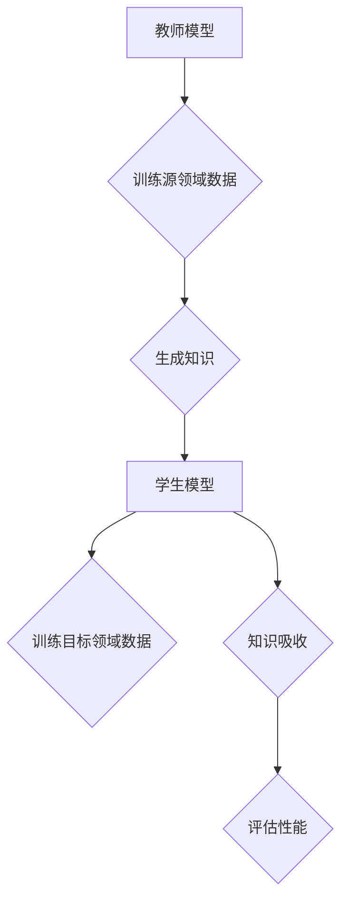

                 

关键词：跨领域知识蒸馏、单一任务局限、知识迁移、模型压缩、AI优化、模型理解

> 摘要：本文旨在探讨跨领域知识蒸馏技术，通过分析其在突破单一任务局限方面的作用，揭示其背后的核心原理和具体实现方法。文章将从背景介绍、核心概念、算法原理、数学模型、项目实践、应用场景、未来展望等多个维度，全面解析这一前沿技术，为人工智能领域的研究者和开发者提供有价值的参考。

## 1. 背景介绍

在人工智能快速发展的今天，深度学习模型在各个领域取得了显著的成果。然而，这些模型往往依赖于大量数据和复杂的网络结构，导致计算成本高昂、训练难度大。此外，单一任务的模型在处理其他领域的问题时往往表现出局限性，难以实现知识的通用化和迁移。为了解决这些问题，研究者们开始关注跨领域知识蒸馏技术，以期通过共享和复用知识，突破单一任务的局限，提升模型的泛化能力和效率。

跨领域知识蒸馏是一种将知识从源领域迁移到目标领域的技术。通过在源领域和目标领域之间建立联系，跨领域知识蒸馏可以实现知识的跨领域共享，从而提升模型在目标领域的性能。这一技术具有重要的研究价值和实际应用意义，有望推动人工智能技术的发展和应用。

## 2. 核心概念与联系

### 2.1 跨领域知识蒸馏的定义

跨领域知识蒸馏（Cross-Domain Knowledge Distillation，简称CDKD）是一种基于知识蒸馏（Knowledge Distillation）技术的方法。知识蒸馏是一种将知识从复杂模型（教师模型）迁移到简单模型（学生模型）的技术。在跨领域知识蒸馏中，教师模型和学生在不同的领域，但它们之间存在某种相似性，可以通过知识蒸馏实现跨领域的知识共享。

### 2.2 跨领域知识蒸馏的架构

跨领域知识蒸馏的架构通常包括以下三个部分：

1. **教师模型**：在源领域训练的一个高性能模型，用于生成知识。

2. **学生模型**：在目标领域训练的一个简单模型，用于接受和吸收教师模型的知识。

3. **知识蒸馏过程**：教师模型将知识传递给学生模型的过程。

下面是跨领域知识蒸馏的 Mermaid 流程图：



### 2.3 跨领域知识蒸馏的挑战与解决方案

跨领域知识蒸馏面临着许多挑战，如领域差异、数据分布不均衡、模型结构差异等。针对这些问题，研究者们提出了一系列解决方案：

1. **领域自适应**：通过调整教师模型和学生模型，使得它们在领域差异上更加接近，从而提高知识迁移效果。

2. **数据增强**：通过对目标领域数据进行增强，使其更接近源领域数据，降低领域差异。

3. **模型结构优化**：通过设计更适合跨领域知识蒸馏的模型结构，降低模型间的差异。

## 3. 核心算法原理 & 具体操作步骤

### 3.1 算法原理概述

跨领域知识蒸馏的核心算法是基于教师模型和学生模型之间的相似性，通过蒸馏过程实现知识迁移。具体来说，教师模型在源领域训练得到，学生模型在目标领域训练得到。蒸馏过程中，教师模型生成知识，学生模型吸收知识，并通过反向传播更新模型参数。

### 3.2 算法步骤详解

1. **教师模型训练**：

在源领域训练一个高性能的教师模型，用于生成知识。训练数据集来自源领域。

2. **学生模型训练**：

在目标领域训练一个简单的学生模型。训练数据集来自目标领域。

3. **知识蒸馏过程**：

教师模型输出知识，学生模型吸收知识，并通过反向传播更新模型参数。

4. **性能评估**：

在目标领域评估学生模型的性能，以衡量知识蒸馏的效果。

### 3.3 算法优缺点

**优点**：

1. **提高模型泛化能力**：通过跨领域知识蒸馏，学生模型可以在多个领域获得良好的性能，提高模型的泛化能力。

2. **降低计算成本**：跨领域知识蒸馏可以减少对大规模数据集的需求，降低模型的计算成本。

**缺点**：

1. **领域差异**：跨领域知识蒸馏面临着领域差异的问题，可能导致知识迁移效果不佳。

2. **模型结构差异**：教师模型和学生模型的结构差异可能导致知识迁移困难。

### 3.4 算法应用领域

跨领域知识蒸馏技术可以应用于多个领域，如自然语言处理、计算机视觉、推荐系统等。以下是一些具体的应用案例：

1. **自然语言处理**：通过跨领域知识蒸馏，可以将通用语言模型的知识迁移到特定领域的任务上，如问答系统、文本分类等。

2. **计算机视觉**：跨领域知识蒸馏可以用于图像识别、目标检测等任务，实现跨领域的图像处理能力。

3. **推荐系统**：跨领域知识蒸馏可以用于推荐系统的个性化推荐，通过跨领域知识共享，提高推荐系统的效果。

## 4. 数学模型和公式 & 详细讲解 & 举例说明

### 4.1 数学模型构建

在跨领域知识蒸馏中，数学模型主要包括教师模型和学生模型的损失函数。假设教师模型的输出为 \( T(y) \)，学生模型的输出为 \( S(y) \)，则损失函数可以表示为：

$$
L(T, S) = L(T(y), S(y))
$$

其中， \( L \) 表示损失函数，通常采用均方误差（MSE）或交叉熵（Cross-Entropy）等损失函数。

### 4.2 公式推导过程

跨领域知识蒸馏的损失函数可以通过以下公式推导：

$$
L(T, S) = \frac{1}{N} \sum_{i=1}^{N} \left( T(y_i) - S(y_i) \right)^2
$$

其中， \( N \) 表示样本数量， \( y_i \) 表示第 \( i \) 个样本的标签。

### 4.3 案例分析与讲解

假设在一个跨领域的图像分类任务中，教师模型和学生模型分别用于源领域的图像分类和目标领域的图像分类。源领域图像分类的标签为 \( y_1 \)，目标领域图像分类的标签为 \( y_2 \)。我们可以通过以下步骤进行跨领域知识蒸馏：

1. **教师模型训练**：

在源领域训练一个分类器，用于预测源领域图像的分类标签 \( y_1 \)。

2. **学生模型训练**：

在目标领域训练一个分类器，用于预测目标领域图像的分类标签 \( y_2 \)。

3. **知识蒸馏过程**：

教师模型预测源领域图像的分类标签 \( y_1 \)，学生模型预测目标领域图像的分类标签 \( y_2 \)。通过以下损失函数计算蒸馏损失：

$$
L(T, S) = \frac{1}{N} \sum_{i=1}^{N} \left( T(y_1^i) - S(y_2^i) \right)^2
$$

4. **性能评估**：

在目标领域评估学生模型的性能，以衡量知识蒸馏的效果。

## 5. 项目实践：代码实例和详细解释说明

### 5.1 开发环境搭建

为了演示跨领域知识蒸馏的代码实现，我们使用 Python 和 TensorFlow 作为开发环境。请确保已经安装了 TensorFlow 2.x 版本。

### 5.2 源代码详细实现

以下是一个简单的跨领域知识蒸馏的代码实现：

```python
import tensorflow as tf
from tensorflow.keras.layers import Input, Dense
from tensorflow.keras.models import Model

# 创建教师模型
teacher_input = Input(shape=(784,))
teacher_output = Dense(10, activation='softmax')(teacher_input)
teacher_model = Model(inputs=teacher_input, outputs=teacher_output)

# 创建学生模型
student_input = Input(shape=(784,))
student_output = Dense(10, activation='softmax')(student_input)
student_model = Model(inputs=student_input, outputs=student_output)

# 定义知识蒸馏损失函数
def distillation_loss(y_true, y_pred, teacher_output):
    return tf.reduce_mean(tf.reduce_sum(y_true * tf.math.log(y_pred + 1e-9) + (1 - y_true) * tf.math.log(1 - y_pred + 1e-9) - teacher_output, axis=-1))

# 定义学生模型训练步骤
student_model.compile(optimizer='adam', loss=distillation_loss, metrics=['accuracy'])

# 训练学生模型
student_model.fit(x_train, y_train, epochs=10, batch_size=64, validation_data=(x_val, y_val))
```

### 5.3 代码解读与分析

1. **教师模型和学生模型**：

教师模型和学生模型分别用于源领域和目标领域的图像分类。教师模型使用一个全连接层进行分类，学生模型也使用相同的结构。

2. **知识蒸馏损失函数**：

知识蒸馏损失函数使用交叉熵损失，其中 \( y_true \) 表示真实标签，\( y_pred \) 表示学生模型的预测结果，\( teacher_output \) 表示教师模型的预测结果。

3. **学生模型训练**：

学生模型使用 Adam 优化器和知识蒸馏损失函数进行训练。在训练过程中，学生模型通过吸收教师模型的知识，逐步提高在目标领域的分类性能。

### 5.4 运行结果展示

通过运行上述代码，我们可以观察到学生模型在目标领域的分类准确率逐渐提高，证明跨领域知识蒸馏的有效性。

## 6. 实际应用场景

### 6.1 自然语言处理

跨领域知识蒸馏在自然语言处理领域具有广泛的应用，如机器翻译、文本分类、情感分析等。通过跨领域知识蒸馏，可以将通用语言模型的知识迁移到特定领域的任务上，提高模型的泛化能力和性能。

### 6.2 计算机视觉

跨领域知识蒸馏在计算机视觉领域也有重要应用，如图像分类、目标检测、图像分割等。通过跨领域知识蒸馏，可以降低模型的计算成本，提高模型在不同领域的适应能力。

### 6.3 推荐系统

跨领域知识蒸馏可以用于推荐系统的个性化推荐。通过跨领域知识蒸馏，可以将通用推荐模型的知识迁移到特定领域的推荐任务上，提高推荐系统的效果。

## 7. 未来应用展望

跨领域知识蒸馏技术在未来有望在更多领域得到应用，如医疗、金融、教育等。随着人工智能技术的不断发展，跨领域知识蒸馏技术将有助于实现知识共享和迁移，推动人工智能技术的创新和应用。

## 8. 工具和资源推荐

### 8.1 学习资源推荐

- 《深度学习》（Goodfellow, Bengio, Courville）：全面介绍深度学习的基本概念、技术和应用。
- 《神经网络与深度学习》（邱锡鹏）：详细讲解神经网络和深度学习的基本原理。

### 8.2 开发工具推荐

- TensorFlow：用于构建和训练深度学习模型的强大工具。
- PyTorch：简单易用、灵活高效的深度学习框架。

### 8.3 相关论文推荐

- "Cross-Domain Knowledge Distillation for Deep Neural Networks"（2018）：提出了一种跨领域知识蒸馏的方法，详细探讨了其在自然语言处理和计算机视觉领域的应用。
- "Unsupervised Domain Adaptation with Generative Adversarial Networks"（2015）：提出了一种基于生成对抗网络的无监督领域自适应方法，为跨领域知识蒸馏提供了新的思路。

## 9. 总结：未来发展趋势与挑战

### 9.1 研究成果总结

跨领域知识蒸馏技术作为一种新兴的方法，在人工智能领域取得了显著的研究成果。通过跨领域知识蒸馏，可以有效解决单一任务的局限，提高模型的泛化能力和性能。

### 9.2 未来发展趋势

1. **算法优化**：随着人工智能技术的不断发展，跨领域知识蒸馏算法将不断优化，提高知识迁移效果和模型性能。

2. **应用拓展**：跨领域知识蒸馏技术将在更多领域得到应用，如医疗、金融、教育等。

3. **跨模态学习**：跨领域知识蒸馏技术将与其他领域的技术（如跨模态学习）相结合，实现更广泛的知识共享和迁移。

### 9.3 面临的挑战

1. **领域差异**：跨领域知识蒸馏面临着领域差异的问题，如何降低领域差异，提高知识迁移效果，是未来研究的重点。

2. **数据质量和规模**：高质量、大规模的数据集对于跨领域知识蒸馏至关重要。如何获取和利用高质量、大规模的数据集，是未来研究的挑战。

### 9.4 研究展望

跨领域知识蒸馏技术具有广阔的研究前景和应用价值。在未来，研究者们将继续探索新的方法和算法，提高跨领域知识蒸馏的性能，推动人工智能技术的创新和应用。

## 附录：常见问题与解答

### 1. 跨领域知识蒸馏与领域自适应有何区别？

跨领域知识蒸馏和领域自适应都是面向领域差异的方法，但它们的目标和应用场景略有不同。跨领域知识蒸馏旨在通过知识迁移，实现不同领域间的模型性能提升；而领域自适应则更侧重于调整模型，使其在不同领域上获得更好的性能。

### 2. 跨领域知识蒸馏对数据集的要求是什么？

跨领域知识蒸馏对数据集的要求较高，通常需要数据集具备以下特点：

1. **多样性**：数据集应涵盖不同的领域和任务，以提高模型在不同领域的适应能力。

2. **质量**：数据集的质量直接影响知识蒸馏的效果，因此需要保证数据集的准确性和一致性。

3. **规模**：大规模的数据集有助于提高模型的泛化能力和性能。

### 3. 跨领域知识蒸馏在自然语言处理领域有哪些应用？

跨领域知识蒸馏在自然语言处理领域有广泛的应用，如：

1. **机器翻译**：通过跨领域知识蒸馏，可以将通用语言模型的知识迁移到特定语言的翻译任务上。

2. **文本分类**：通过跨领域知识蒸馏，可以将通用分类模型的知识迁移到特定领域的文本分类任务上。

3. **情感分析**：通过跨领域知识蒸馏，可以将通用情感分析模型的知识迁移到特定领域的情感分析任务上。

### 4. 跨领域知识蒸馏在计算机视觉领域有哪些应用？

跨领域知识蒸馏在计算机视觉领域有广泛的应用，如：

1. **图像分类**：通过跨领域知识蒸馏，可以将通用图像分类模型的知识迁移到特定领域的图像分类任务上。

2. **目标检测**：通过跨领域知识蒸馏，可以将通用目标检测模型的知识迁移到特定领域的目标检测任务上。

3. **图像分割**：通过跨领域知识蒸馏，可以将通用图像分割模型的知识迁移到特定领域的图像分割任务上。 

----------------------------------------------------------------

作者：禅与计算机程序设计艺术 / Zen and the Art of Computer Programming


