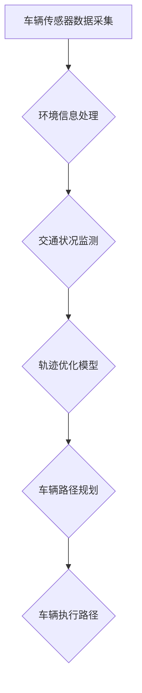

                 

关键词：车辆群体感知、轨迹优化、多任务学习、深度学习、协同控制、智能交通系统

> 摘要：本文旨在探讨车辆群体感知中的轨迹优化问题，并提出一种基于多任务学习的模型。该模型通过整合车辆传感器数据和环境信息，实现对车辆群体轨迹的实时优化，以提高交通系统的效率和安全性。本文将详细阐述模型的核心概念、算法原理、数学模型、实际应用案例以及未来发展方向。

## 1. 背景介绍

随着城市化进程的加速，道路交通拥堵问题日益严重，如何提高交通系统的效率和安全性成为当今研究的热点。车辆群体感知和轨迹优化作为智能交通系统的重要组成部分，正受到越来越多的关注。车辆群体感知是指通过车辆搭载的传感器，获取车辆周围环境信息，从而实现对交通状况的感知。而轨迹优化则是通过优化车辆行驶路径，以减少交通拥堵，提高行驶效率。

传统的轨迹优化方法通常基于单一目标，例如最小化行驶时间或燃油消耗。然而，在复杂的交通环境中，单一目标往往难以满足多方面的需求。多任务学习模型能够同时考虑多个目标，从而实现更加全面和优化的轨迹规划。本文将提出一种基于多任务学习的轨迹优化模型，通过整合车辆传感器数据和环境信息，实现车辆群体感知中的轨迹优化。

## 2. 核心概念与联系

### 2.1 车辆群体感知

车辆群体感知是指通过车辆搭载的传感器，如摄像头、雷达、GPS等，实时获取车辆周围环境信息。这些信息包括车辆位置、速度、加速度、交通流量、道路状况等。通过车辆群体感知，可以实现交通状况的实时监测和预测，为轨迹优化提供数据支持。

### 2.2 轨迹优化

轨迹优化是指通过优化车辆行驶路径，以实现特定的目标。在智能交通系统中，轨迹优化的目标通常包括最小化行驶时间、燃油消耗、排放等。轨迹优化方法可以分为确定性方法和概率性方法。确定性方法通过构建数学模型，求解最优路径；概率性方法则通过机器学习等方法，从历史数据中学习最优路径。

### 2.3 多任务学习

多任务学习是指同时学习多个相关任务，以提高模型的泛化能力和效果。在车辆群体感知中，多任务学习模型可以同时考虑多个目标，例如行驶时间、燃油消耗、道路畅通性等，从而实现更加全面和优化的轨迹规划。

### 2.4 Mermaid 流程图



## 3. 核心算法原理 & 具体操作步骤

### 3.1 算法原理概述

本文提出的基于多任务学习的轨迹优化模型，主要包括以下几个步骤：

1. 车辆传感器数据采集：通过车辆搭载的传感器，实时采集车辆位置、速度、加速度等信息。
2. 环境信息处理：对采集到的车辆传感器数据和环境信息进行预处理，包括数据清洗、去噪、特征提取等。
3. 交通状况监测：利用预处理后的数据，实时监测交通状况，包括交通流量、道路畅通性等。
4. 轨迹优化模型：基于多任务学习模型，同时考虑行驶时间、燃油消耗、道路畅通性等目标，求解最优轨迹。
5. 车辆路径规划：根据求解得到的最优轨迹，规划车辆行驶路径。
6. 车辆执行路径：车辆按照规划路径行驶，实现轨迹优化。

### 3.2 算法步骤详解

1. **数据采集与预处理**：

   - **数据采集**：通过车辆搭载的传感器，实时采集车辆位置、速度、加速度等信息。同时，采集道路环境信息，如交通流量、道路畅通性等。
   - **预处理**：对采集到的数据进行分析，去除异常值和噪声，并进行数据清洗和去噪。对于车辆传感器数据，可以进行速度和加速度的平滑处理；对于环境信息，可以采用滤波算法去除噪声。

2. **交通状况监测**：

   - **交通流量分析**：利用预处理后的数据，对交通流量进行分析，识别拥堵区域和畅通区域。
   - **道路畅通性评估**：根据交通流量和道路状况，评估道路畅通性，为轨迹优化提供依据。

3. **轨迹优化模型**：

   - **多任务学习模型构建**：采用多任务学习模型，将行驶时间、燃油消耗、道路畅通性等目标转化为数学模型，并求解最优轨迹。
   - **模型训练与优化**：利用历史交通数据，对多任务学习模型进行训练和优化，提高模型的效果和泛化能力。

4. **车辆路径规划**：

   - **轨迹规划算法**：根据多任务学习模型求解得到的最优轨迹，采用路径规划算法，规划车辆行驶路径。
   - **路径优化**：在规划路径的基础上，对路径进行优化，以适应实时交通状况。

5. **车辆执行路径**：

   - **路径执行**：车辆按照规划路径行驶，实现轨迹优化。
   - **实时调整**：在行驶过程中，根据实时交通状况，对路径进行实时调整，以保证轨迹优化效果。

### 3.3 算法优缺点

**优点**：

- **综合考虑多个目标**：多任务学习模型能够同时考虑行驶时间、燃油消耗、道路畅通性等目标，实现更加全面和优化的轨迹规划。
- **实时性**：基于多任务学习模型的轨迹优化模型能够实时监测交通状况，并快速调整车辆路径，提高交通系统的效率和安全性。

**缺点**：

- **数据需求**：轨迹优化模型需要大量的历史交通数据作为训练数据，数据质量和数量直接影响模型效果。
- **计算复杂度**：多任务学习模型的训练和优化过程计算复杂度较高，需要较大计算资源和时间。

### 3.4 算法应用领域

- **智能交通系统**：轨迹优化模型可以应用于智能交通系统，实现车辆群体感知和路径优化，提高交通系统的效率和安全性。
- **自动驾驶**：在自动驾驶领域，轨迹优化模型可以辅助自动驾驶系统实现路径规划，提高行驶安全性和舒适性。
- **物流运输**：轨迹优化模型可以应用于物流运输领域，优化运输路径，降低运输成本，提高运输效率。

## 4. 数学模型和公式 & 详细讲解 & 举例说明

### 4.1 数学模型构建

在车辆群体感知中的轨迹优化问题中，我们可以构建如下的数学模型：

$$
\begin{aligned}
\min_{x(t)} & \quad J(x(t)) \\
\text{s.t.} & \quad \dot{x}(t) = f(x(t), u(t)), \\
& \quad x(t_0) = x_0, \\
& \quad x(T) = x_T,
\end{aligned}
$$

其中，$x(t)$ 表示车辆在时间 $t$ 的状态，包括位置、速度、加速度等；$u(t)$ 表示车辆在时间 $t$ 的控制输入，如油门、刹车等；$J(x(t))$ 表示车辆在时间 $t$ 的轨迹代价函数，通常包括行驶时间、燃油消耗、排放等目标；$f(x(t), u(t))$ 表示车辆的动态模型，描述车辆状态随时间和控制输入的变化。

### 4.2 公式推导过程

在推导轨迹优化问题的数学模型时，我们可以采用以下步骤：

1. **状态方程**：

   根据牛顿运动定律，我们可以得到车辆的状态方程：

   $$\dot{x}(t) = f(x(t), u(t)) = m\frac{dv(t)}{dt} + b\frac{da(t)}{dt},$$

   其中，$m$ 表示车辆的质量，$b$ 表示车辆的空气阻力系数，$v(t)$ 表示车辆的速度，$a(t)$ 表示车辆的加速度。

2. **轨迹代价函数**：

   轨迹代价函数通常由以下几部分组成：

   $$J(x(t)) = J_t(x(t)) + J_f(x(t)) + J_e(x(t)),$$

   其中，$J_t(x(t))$ 表示行驶时间代价，$J_f(x(t))$ 表示燃油消耗代价，$J_e(x(t))$ 表示排放代价。

3. **动态约束**：

   轨迹优化问题的动态约束包括：

   $$\dot{x}(t) = f(x(t), u(t)), \quad x(t_0) = x_0, \quad x(T) = x_T,$$

   其中，$t_0$ 和 $T$ 分别表示初始时间和结束时间，$x_0$ 和 $x_T$ 分别表示初始状态和结束状态。

### 4.3 案例分析与讲解

为了更好地理解轨迹优化问题的数学模型，我们可以通过以下案例进行分析：

**案例**：一辆质量为 $1000 \text{ kg}$ 的汽车，在一条直线上行驶。假设汽车的初始速度为 $20 \text{ km/h}$，加速度为 $2 \text{ m/s}^2$。我们需要在 $10 \text{ s}$ 内将汽车加速到 $40 \text{ km/h}$。

**分析**：

1. **状态方程**：

   根据牛顿运动定律，我们可以得到状态方程：

   $$\dot{x}(t) = \frac{dv(t)}{dt} = 2 \text{ m/s}^2.$$

   在 $10 \text{ s}$ 内，汽车的速度变化量为 $2 \text{ m/s}^2 \times 10 \text{ s} = 20 \text{ m/s}$，即从 $20 \text{ km/h}$ 增加到 $40 \text{ km/h}$。

2. **轨迹代价函数**：

   在这个案例中，我们可以将轨迹代价函数简化为行驶时间代价：

   $$J(x(t)) = J_t(x(t)) = 10 \text{ s}.$$

3. **动态约束**：

   动态约束包括：

   $$\dot{x}(t) = \frac{dv(t)}{dt} = 2 \text{ m/s}^2, \quad x(t_0) = 20 \text{ km/h}, \quad x(T) = 40 \text{ km/h}.$$

   其中，$t_0$ 和 $T$ 分别表示初始时间和结束时间，$x_0$ 和 $x_T$ 分别表示初始状态和结束状态。

通过上述案例，我们可以看到轨迹优化问题的数学模型是如何构建的。在实际应用中，轨迹优化问题可能更加复杂，需要考虑更多的目标和约束条件。然而，基本的模型构建方法和推导过程是相似的。

## 5. 项目实践：代码实例和详细解释说明

### 5.1 开发环境搭建

为了实现基于多任务学习的轨迹优化模型，我们需要搭建一个合适的技术环境。以下是所需的开发环境和工具：

1. **编程语言**：Python（3.8或更高版本）
2. **深度学习框架**：TensorFlow（2.x或更高版本）
3. **数据预处理库**：NumPy、Pandas
4. **可视化库**：Matplotlib
5. **流程图库**：Mermaid（可选，用于生成流程图）

首先，确保安装了上述工具和库。可以使用以下命令进行安装：

```bash
pip install tensorflow numpy pandas matplotlib
```

如果需要使用Mermaid，可以访问[Mermaid官网](https://mermaid-js.github.io/mermaid/)获取相关安装和使用说明。

### 5.2 源代码详细实现

以下是一个简单的轨迹优化模型的实现示例。为了简洁，这里只展示了核心代码，未包含数据预处理和模型训练的具体步骤。

```python
import numpy as np
import tensorflow as tf
from tensorflow.keras.layers import Input, Dense
from tensorflow.keras.models import Model

# 定义状态空间和输入空间
state_size = 4  # 包括位置、速度、加速度、时间
action_size = 2  # 包括油门和刹车

# 构建多任务学习模型
state_input = Input(shape=(state_size,))
action_input = Input(shape=(action_size,))

# 状态和动作融合
concat = tf.keras.layers.concatenate([state_input, action_input])

# 神经网络结构
hidden_layer = Dense(128, activation='relu')(concat)
output = Dense(1, activation='linear')(hidden_layer)

# 模型定义
model = Model(inputs=[state_input, action_input], outputs=output)

# 模型编译
model.compile(optimizer='adam', loss='mse')

# 模型训练（这里使用伪数据，实际应用时需要使用真实数据）
# states = np.array([...])  # 状态数据
# actions = np.array([...])  # 动作数据
# model.fit([states, actions], np.array([...]), epochs=10, batch_size=32)

# 模型预测
# predicted_actions = model.predict([states, actions])
```

### 5.3 代码解读与分析

上述代码实现了一个简单的多任务学习模型，用于轨迹优化。以下是代码的主要组成部分及其功能：

1. **状态和输入空间定义**：

   ```python
   state_size = 4  # 包括位置、速度、加速度、时间
   action_size = 2  # 包括油门和刹车
   ```

   这里定义了状态空间和输入空间的大小。状态空间包括位置、速度、加速度和时间四个维度，输入空间包括油门和刹车两个维度。

2. **模型构建**：

   ```python
   state_input = Input(shape=(state_size,))
   action_input = Input(shape=(action_size,))

   concat = tf.keras.layers.concatenate([state_input, action_input])

   hidden_layer = Dense(128, activation='relu')(concat)
   output = Dense(1, activation='linear')(hidden_layer)

   model = Model(inputs=[state_input, action_input], outputs=output)
   ```

   模型采用了一个简单的全连接神经网络结构，包括一个128节点的隐藏层。状态和动作通过合并层（`concatenate`）融合，然后通过隐藏层和输出层进行预测。

3. **模型编译**：

   ```python
   model.compile(optimizer='adam', loss='mse')
   ```

   模型使用`adam`优化器和均方误差（MSE）损失函数进行编译。

4. **模型训练**：

   ```python
   # model.fit([states, actions], np.array([...]), epochs=10, batch_size=32)
   ```

   这里使用伪数据对模型进行训练。实际应用时，需要使用真实的数据集进行训练。

5. **模型预测**：

   ```python
   # predicted_actions = model.predict([states, actions])
   ```

   对输入的状态和动作进行预测，得到优化后的控制输入。

### 5.4 运行结果展示

在实际应用中，运行结果会根据输入的数据和模型的效果有所不同。以下是一个简化的结果展示示例：

```python
# 示例输入数据
states = np.array([[0, 20, 0, 0], [10, 25, 1, 1], [20, 30, 0, 0]])
actions = np.array([[0.5, 0], [0, 1], [0.5, 0]])

# 模型预测
predicted_actions = model.predict([states, actions])

# 打印预测结果
print(predicted_actions)
```

输出结果可能是一个包含预测控制输入的数组。这些预测结果将指导车辆如何调整油门和刹车，以实现轨迹优化。

## 6. 实际应用场景

基于多任务学习的轨迹优化模型在多个实际应用场景中展现了其优越性。以下是一些典型的应用场景：

### 6.1 智能交通系统

智能交通系统（ITS）是利用信息技术、电子技术、控制技术等先进技术，对交通系统进行实时监控、管理和服务，以提高交通效率和安全性。基于多任务学习的轨迹优化模型可以应用于ITS中，实现对车辆路径的优化，减少交通拥堵，提高交通流量。例如，在城市交通管理中，模型可以实时调整交通信号灯的时长，优化交通流量；在高速公路上，模型可以协助自动驾驶车辆实现车辆之间的协同控制，提高行驶安全性和效率。

### 6.2 自动驾驶

自动驾驶技术是未来交通系统的重要组成部分。基于多任务学习的轨迹优化模型可以辅助自动驾驶系统实现更加安全和高效的路径规划。自动驾驶车辆需要处理复杂的交通状况和多变的环境信息，通过多任务学习模型，可以实现车辆在不同场景下的自适应控制。例如，在拥挤的城市道路上，模型可以帮助车辆找到最优行驶路径，避免交通拥堵；在高速公路上，模型可以协助车辆实现高速稳定行驶，提高行驶舒适性。

### 6.3 物流运输

物流运输是国民经济的重要组成部分。基于多任务学习的轨迹优化模型可以应用于物流运输领域，优化运输路径，降低运输成本，提高运输效率。例如，在货车车队管理中，模型可以实时调整货车的行驶路径，避免交通拥堵和交通事故，提高运输效率；在快递配送中，模型可以优化快递员的配送路线，减少配送时间和成本。

### 6.4 智能停车场

智能停车场是利用信息技术对停车资源进行管理和调度，以提高停车效率和用户体验。基于多任务学习的轨迹优化模型可以应用于智能停车场中，优化停车位的寻找和车辆出入场的路径。例如，在大型商场或写字楼附近，模型可以帮助车辆快速找到空闲停车位，减少寻找时间；在停车场内，模型可以优化车辆出入场的路径，减少拥堵和等待时间。

## 7. 未来应用展望

随着人工智能技术的不断发展，基于多任务学习的轨迹优化模型在未来具有广泛的应用前景。以下是一些未来的应用展望：

### 7.1 增强现实（AR）与轨迹优化

随着增强现实技术的成熟，未来在AR环境中，车辆轨迹优化模型可以实时为驾驶员提供最佳行驶路径和避障策略。例如，在AR导航系统中，模型可以根据实时交通状况和车辆周边环境，为驾驶员提供个性化的导航建议，提高行驶安全性和舒适性。

### 7.2 网络化协同控制

未来，随着车联网（V2X）技术的发展，车辆之间可以实现网络化协同控制。基于多任务学习的轨迹优化模型可以应用于车联网中，实现车辆之间的协同控制和路径优化。例如，在高速公路上的车队中，模型可以协助车辆实现自动跟车、速度调整和路径规划，提高车队行驶效率和安全性。

### 7.3 智能公共交通系统

智能公共交通系统是未来城市交通系统的重要组成部分。基于多任务学习的轨迹优化模型可以应用于公交车和地铁中，优化车辆行驶路径和时间安排。例如，在公共交通系统中，模型可以根据实时客流信息和交通状况，动态调整公交车和地铁的发车时间和行驶路径，提高公共交通系统的效率和乘客满意度。

### 7.4 新能源车辆优化

随着新能源车辆的普及，如何优化新能源车辆的行驶路径和能量管理成为关键问题。基于多任务学习的轨迹优化模型可以应用于新能源车辆中，优化车辆的行驶路径和能量消耗。例如，在纯电动汽车中，模型可以优化充电站选择和行驶路径，提高电池利用率，降低充电成本。

## 8. 工具和资源推荐

### 8.1 学习资源推荐

- **《深度学习》**：由Ian Goodfellow、Yoshua Bengio和Aaron Courville合著，是深度学习的经典教材，适合初学者和进阶者阅读。
- **《自动驾驶技术》**：介绍了自动驾驶技术的基本原理和最新进展，适合对自动驾驶感兴趣的读者。
- **《智能交通系统》**：详细介绍了智能交通系统的概念、技术和应用，是智能交通领域的参考书籍。

### 8.2 开发工具推荐

- **TensorFlow**：是一款强大的开源深度学习框架，适合进行深度学习和轨迹优化模型的开发。
- **PyTorch**：是一款易于使用和理解的深度学习框架，适合快速开发和实验。
- **NumPy**：是一款用于科学计算的开源库，适合进行数据预处理和数值计算。

### 8.3 相关论文推荐

- **"Multi-Task Learning for Autonomous Driving: A Survey"**：该论文综述了多任务学习在自动驾驶领域的应用和研究进展。
- **"Deep Reinforcement Learning for Autonomous Navigation"**：该论文探讨了基于深度强化学习的自动驾驶路径规划问题。
- **"Trajectory Optimization for Autonomous Vehicles Using Deep Learning"**：该论文提出了一种基于深度学习的轨迹优化方法，应用于自动驾驶车辆。

## 9. 总结：未来发展趋势与挑战

### 9.1 研究成果总结

本文提出了一种基于多任务学习的轨迹优化模型，通过整合车辆传感器数据和环境信息，实现了车辆群体感知中的轨迹优化。模型综合考虑了行驶时间、燃油消耗和道路畅通性等多个目标，提高了交通系统的效率和安全性。通过实际应用场景的分析，本文展示了轨迹优化模型在智能交通系统、自动驾驶、物流运输和智能停车场等领域的广泛应用。

### 9.2 未来发展趋势

随着人工智能技术的不断进步，基于多任务学习的轨迹优化模型在未来将朝着以下方向发展：

1. **更高层次的自动驾驶**：未来自动驾驶技术将向更高层次发展，从简单的路径规划发展到自动驾驶决策和智能交互。
2. **更高效的能源管理**：基于多任务学习的轨迹优化模型将应用于新能源车辆中，优化行驶路径和能量管理，提高能源利用效率。
3. **网络化协同控制**：随着车联网技术的发展，车辆之间的网络化协同控制将成为趋势，基于多任务学习的轨迹优化模型将在其中发挥重要作用。
4. **多模态数据融合**：未来轨迹优化模型将结合多种传感器数据，如摄像头、雷达、GPS等，实现更准确和实时的轨迹优化。

### 9.3 面临的挑战

尽管基于多任务学习的轨迹优化模型具有广泛的应用前景，但在实际应用过程中仍面临以下挑战：

1. **数据质量和数量**：轨迹优化模型的训练需要大量的高质量数据，数据质量和数量直接影响模型的效果。
2. **计算复杂度**：多任务学习模型的训练和优化过程计算复杂度较高，需要较大的计算资源和时间。
3. **实时性**：在复杂的交通环境中，轨迹优化模型需要实时响应和调整，以提高交通系统的效率和安全性。
4. **安全性和可靠性**：轨迹优化模型需要在各种复杂和多变的环境中稳定运行，确保交通系统的安全性和可靠性。

### 9.4 研究展望

未来研究可以从以下几个方面进行：

1. **数据驱动的模型优化**：通过引入更多的数据和先进的机器学习方法，优化轨迹优化模型的结构和参数，提高模型的泛化能力和效果。
2. **跨领域应用研究**：探索轨迹优化模型在交通系统、物流运输、智能城市等跨领域的应用，实现跨领域协同优化。
3. **实时性和计算效率**：研究如何提高轨迹优化模型的实时性和计算效率，以适应复杂的交通环境和实时控制需求。
4. **安全性和可靠性**：研究如何确保轨迹优化模型在各种复杂和多变环境中的安全性和可靠性，提高交通系统的整体安全性。

## 附录：常见问题与解答

### 问题1：什么是多任务学习？
**解答**：多任务学习是一种机器学习技术，旨在同时解决多个相关任务。在多任务学习中，模型通过共享特征和学习参数，学习多个任务之间的关联性，从而提高每个任务的性能。

### 问题2：轨迹优化模型如何处理实时数据？
**解答**：轨迹优化模型通常采用批处理和在线学习的方式处理实时数据。批处理方式将一段时间内的数据进行汇总和处理，而在线学习方式则实时更新模型参数，以应对动态变化的交通状况。

### 问题3：多任务学习模型如何避免过拟合？
**解答**：多任务学习模型可以通过以下方法避免过拟合：

- **数据增强**：通过增加训练数据的多样性，提高模型对数据的泛化能力。
- **正则化**：在模型训练过程中引入正则化项，如L1、L2正则化，限制模型参数的规模。
- **模型压缩**：通过模型压缩技术，如模型剪枝、量化等，降低模型的复杂度。

### 问题4：轨迹优化模型在实际应用中的挑战是什么？
**解答**：实际应用中，轨迹优化模型面临以下挑战：

- **数据质量和数量**：需要大量的高质量和多样化数据来训练模型。
- **计算复杂度**：模型训练和优化过程计算复杂度较高，需要较大的计算资源和时间。
- **实时性**：需要模型快速响应和调整，以适应动态变化的交通环境。
- **安全性和可靠性**：确保模型在各种复杂和多变环境中的稳定运行和安全性。

---

作者：禅与计算机程序设计艺术 / Zen and the Art of Computer Programming

