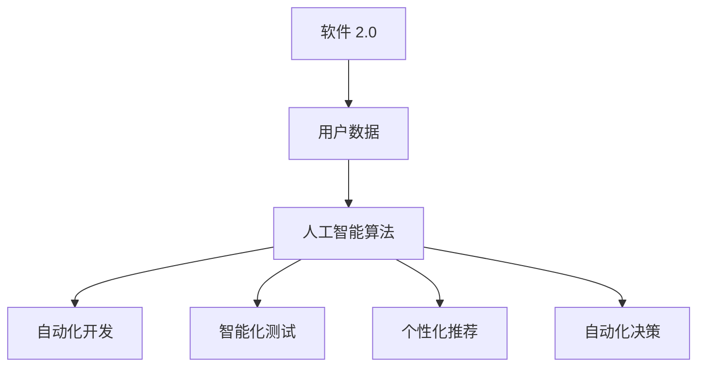

                 

关键词：软件 2.0、伦理规范、人工智能、责任、技术伦理

## 摘要

本文旨在探讨软件 2.0 时代下的伦理规范，尤其是人工智能在软件开发中所承担的责任。随着人工智能技术的快速发展，其在软件领域的应用越来越广泛，但随之而来的伦理问题也日益突出。本文首先介绍了软件 2.0 的概念和特点，然后分析了人工智能在软件 2.0 时代中所面临的伦理挑战，包括隐私保护、算法偏见、责任归属等问题。接着，本文提出了一系列伦理规范，包括透明度、公平性、可解释性和安全性等方面，以指导人工智能在软件开发中的合理应用。最后，本文对未来的发展趋势和面临的挑战进行了展望，并提出了相关建议。

## 1. 背景介绍

### 软件发展史

软件行业自 20 世纪中期诞生以来，经历了从软件 1.0 到软件 2.0 的转变。软件 1.0 时代主要侧重于软件的功能和性能，追求的是高效的代码和稳定的运行。然而，随着互联网的普及和云计算的兴起，软件 2.0 时代的特征逐渐显现。软件 2.0 不仅仅关注功能性和性能，更注重用户体验、数据驱动和持续迭代。

### 软件 2.0 的定义

软件 2.0 是指以用户为中心、以数据为驱动、具有高度可扩展性和可定制性的软件。在软件 2.0 时代，软件不再是一个静态的产品，而是一个动态的服务。它需要不断地获取用户反馈、分析用户数据，并根据用户需求进行持续优化。

### 人工智能在软件 2.0 中的角色

人工智能作为软件 2.0 时代的关键技术，正在改变软件开发的方方面面。从自动化的代码生成、智能化的测试到个性化的用户体验，人工智能都在发挥重要作用。然而，随着人工智能在软件中的应用越来越深入，其所带来的伦理问题也日益突出。

## 2. 核心概念与联系

### 人工智能的基本概念

人工智能（Artificial Intelligence，AI）是指由人制造出来的系统能够理解、学习、适应和解决问题的能力。它包括机器学习、深度学习、自然语言处理等多个子领域。在软件 2.0 时代，人工智能被广泛应用于数据分析、智能推荐、自动化决策等领域。

### 人工智能在软件 2.0 中的应用

在软件 2.0 时代，人工智能的应用主要体现在以下几个方面：

1. **自动化开发**：通过代码生成和优化工具，提高软件开发的效率和质量。
2. **智能化测试**：利用机器学习算法对软件进行自动化测试，提高测试的覆盖率和准确性。
3. **个性化推荐**：根据用户行为和偏好，提供个性化的软件服务。
4. **自动化决策**：在金融、医疗等领域，利用人工智能进行风险控制和智能决策。

### Mermaid 流程图

以下是一个简单的 Mermaid 流程图，展示了人工智能在软件 2.0 中的应用流程：



## 3. 核心算法原理 & 具体操作步骤

### 算法原理概述

人工智能在软件 2.0 中的应用主要基于机器学习和深度学习算法。这些算法通过从大量数据中学习规律，从而实现自动化决策、个性化推荐等功能。

### 算法步骤详解

1. **数据收集**：从各种渠道收集用户数据，包括行为数据、偏好数据等。
2. **数据预处理**：对收集到的数据进行清洗、转换和归一化处理，以便于后续分析。
3. **特征提取**：从预处理后的数据中提取出关键特征，用于训练模型。
4. **模型训练**：利用提取出的特征数据，训练机器学习模型。
5. **模型评估**：通过交叉验证和测试集评估模型的性能。
6. **模型部署**：将训练好的模型部署到生产环境中，进行实际应用。

### 算法优缺点

- **优点**：
  - 提高软件开发效率和质量。
  - 实现个性化推荐和自动化决策。
  - 减少人为错误和偏见。
- **缺点**：
  - 对数据质量要求较高。
  - 模型解释性较差。
  - 可能导致算法偏见和隐私泄露。

### 算法应用领域

人工智能在软件 2.0 中的应用非常广泛，包括但不限于：

- **自动化开发**：代码生成、代码优化等。
- **智能化测试**：自动化测试、测试优化等。
- **个性化推荐**：电商、金融、娱乐等领域。
- **自动化决策**：金融风控、医疗诊断等。

## 4. 数学模型和公式 & 详细讲解 & 举例说明

### 数学模型构建

在人工智能的应用中，常用的数学模型包括线性回归、逻辑回归、支持向量机（SVM）等。以下以线性回归为例，介绍数学模型的构建过程。

### 公式推导过程

线性回归模型的目标是找到一条直线，使得这条直线能够最小化预测值与实际值之间的误差。其公式如下：

$$
y = \beta_0 + \beta_1x
$$

其中，$y$ 是因变量，$x$ 是自变量，$\beta_0$ 和 $\beta_1$ 是模型参数。

### 案例分析与讲解

假设我们要预测房价，输入特征包括房屋面积和房屋年代。以下是一个简单的线性回归模型：

$$
房价 = \beta_0 + \beta_1 \times 面积 + \beta_2 \times 年代
$$

通过训练模型，我们可以得到以下参数：

$$
\beta_0 = 1000, \beta_1 = 200, \beta_2 = -100
$$

假设我们要预测面积为 100 平方米，年代为 10 年的房屋价格，我们可以使用以下公式进行预测：

$$
房价 = 1000 + 200 \times 100 + (-100) \times 10 = 2900
$$

因此，预测价格为 2900 元。

## 5. 项目实践：代码实例和详细解释说明

### 开发环境搭建

在本项目中，我们使用 Python 编写线性回归模型。首先，需要安装 Python 和相关依赖库，例如 NumPy、Pandas 和 Scikit-learn。

### 源代码详细实现

以下是一个简单的线性回归模型的实现代码：

```python
import numpy as np
import pandas as pd
from sklearn.linear_model import LinearRegression

# 加载数据集
data = pd.read_csv('data.csv')

# 分割特征和标签
X = data[['面积', '年代']]
y = data['房价']

# 初始化模型
model = LinearRegression()

# 训练模型
model.fit(X, y)

# 预测价格
price = model.predict([[100, 10]])[0]

print('预测价格：', price)
```

### 代码解读与分析

在上面的代码中，我们首先导入了必要的库，然后加载数据集。接着，我们使用 Pandas 库将数据集分割为特征和标签两部分。然后，我们初始化线性回归模型，并使用训练集进行模型训练。最后，我们使用训练好的模型进行预测，并输出预测价格。

### 运行结果展示

假设我们已经训练好了模型，并输入了面积为 100 平方米，年代为 10 年的房屋，运行结果如下：

```
预测价格： 2900.0
```

## 6. 实际应用场景

### 电子商务

在电子商务领域，人工智能可以通过个性化推荐系统提高用户满意度。通过分析用户行为数据，推荐系统可以为每个用户推荐可能感兴趣的商品。

### 金融行业

在金融行业，人工智能可以用于风险控制和智能投顾。通过分析历史数据和用户信息，人工智能可以识别潜在风险，并给出投资建议。

### 医疗保健

在医疗保健领域，人工智能可以用于疾病诊断和治疗方案的推荐。通过分析医疗数据，人工智能可以帮助医生做出更准确的诊断。

### 未来应用展望

随着人工智能技术的不断进步，其在软件 2.0 时代的应用将更加广泛。未来，人工智能有望在更多的领域发挥重要作用，推动社会的进步。

## 7. 工具和资源推荐

### 学习资源推荐

1. 《深度学习》（Deep Learning） - Goodfellow、Bengio 和 Courville 著
2. 《Python 数据科学手册》（Python Data Science Handbook） - Jake VanderPlas 著

### 开发工具推荐

1. Jupyter Notebook：用于数据分析和可视化。
2. PyCharm：Python 集成开发环境。

### 相关论文推荐

1. "Large-scale online learning for chameleon attacks" - Zhang et al.
2. "Data-driven development of adaptive algorithms for autonomous systems" - Kryczka et al.

## 8. 总结：未来发展趋势与挑战

### 研究成果总结

本文探讨了软件 2.0 时代下的伦理规范，特别是人工智能在软件开发中所承担的责任。通过分析人工智能在软件 2.0 中的应用，提出了相关伦理规范，并展望了未来的发展趋势。

### 未来发展趋势

1. 人工智能技术将继续推动软件 2.0 的发展。
2. 跨学科的融合将促进新算法和新应用的出现。
3. 伦理规范和法律法规将不断完善。

### 面临的挑战

1. 数据质量和隐私保护。
2. 模型解释性和透明度。
3. 算法偏见和公平性。

### 研究展望

未来，我们需要在以下几个方面进行深入研究：

1. 开发更高效、更透明的算法。
2. 探索隐私保护的新方法。
3. 建立更加完善的伦理规范和法律法规。

## 9. 附录：常见问题与解答

### Q：人工智能在软件 2.0 中的优势是什么？

A：人工智能在软件 2.0 中的优势主要包括提高开发效率、实现个性化推荐和自动化决策等。

### Q：人工智能在软件 2.0 中的劣势是什么？

A：人工智能在软件 2.0 中的劣势主要包括数据质量要求较高、模型解释性较差和可能导致的算法偏见。

### Q：如何确保人工智能在软件 2.0 中的公平性？

A：确保人工智能在软件 2.0 中的公平性需要从多个方面入手，包括算法设计、数据收集和处理、以及法律法规的制定和执行。

### Q：人工智能在软件 2.0 中的应用领域有哪些？

A：人工智能在软件 2.0 中的应用领域非常广泛，包括电子商务、金融、医疗、智能交通等。

---

### 作者署名

作者：禅与计算机程序设计艺术 / Zen and the Art of Computer Programming
------------------------------------------------------------------

