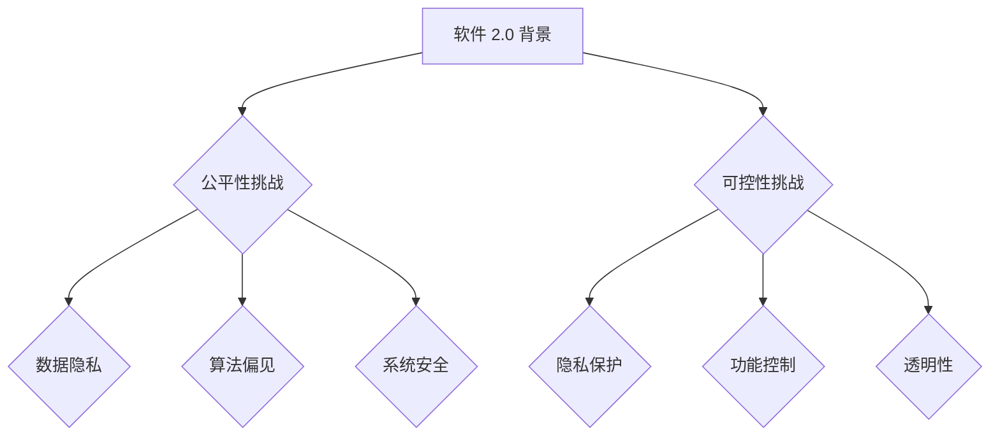

                 

关键词：软件 2.0、伦理问题、公平性、可控性、技术伦理、软件开发、人工智能、用户隐私、数据安全、可持续发展。

> 摘要：本文将探讨软件 2.0 时代中，公平性和可控性这两大关键伦理问题。通过对当前技术发展的现状和挑战进行分析，本文旨在提出一系列解决方案，以引导软件开发者、企业和政策制定者共同关注并解决这些伦理问题，从而实现软件 2.0 时代的可持续发展。

## 1. 背景介绍

软件 2.0 时代，随着互联网的普及和人工智能技术的发展，软件不再只是工具，而是成为了人们生活和工作的核心。然而，这种变革也带来了新的伦理问题，特别是公平性和可控性。公平性体现在用户是否能够平等地享受软件服务，以及软件是否能够公正地处理用户数据；可控性则涉及软件系统的安全性、稳定性以及用户对软件的控制权。

### 1.1 软件发展历程

- **软件 1.0 时代**：以单机软件为主，用户只需购买软件即可使用。
- **软件 2.0 时代**：互联网的出现使得软件能够通过网络提供服务和功能，用户不再需要购买软件，而是通过订阅或免费使用。
- **软件 3.0 时代**：人工智能的引入使得软件具有了自主学习和决策能力。

### 1.2 伦理问题的产生

- **数据隐私**：用户在享受软件服务的同时，往往需要提供个人信息，这些数据如何保护，防止被滥用？
- **算法偏见**：人工智能算法可能在训练数据中存在偏见，导致不公平的结果。
- **系统安全**：软件系统可能存在漏洞，被黑客攻击，导致用户数据泄露。

## 2. 核心概念与联系

### 2.1 公平性

公平性是指软件在提供服务过程中，对用户是否公平、公正。这包括：

- **机会公平**：所有用户都有平等的机会使用软件服务。
- **结果公平**：用户在使用软件后获得的结果是公正的，不受性别、种族、年龄等因素的影响。
- **过程公平**：软件在处理用户数据和行为时，遵循透明、公正的原则。

### 2.2 可控性

可控性是指用户对软件系统的控制能力，包括：

- **隐私保护**：用户有权决定自己的数据是否被收集、使用和分享。
- **功能控制**：用户能够自主选择软件的功能和服务。
- **透明性**：软件的运行过程和决策逻辑对用户透明。

### 2.3 Mermaid 流程图



## 3. 核心算法原理 & 具体操作步骤

### 3.1 算法原理概述

为了解决软件 2.0 时代的伦理问题，我们需要从以下几个方面入手：

- **数据隐私保护**：采用加密技术、匿名化处理等方法，保护用户数据不被泄露。
- **算法公平性**：通过算法校正、多样性训练等方法，减少算法偏见。
- **系统安全性**：采用安全协议、漏洞扫描等技术，提高软件系统的安全性。

### 3.2 算法步骤详解

#### 3.2.1 数据隐私保护

1. **数据加密**：
   $$\text{加密算法} : \text{AES-256}$$
2. **匿名化处理**：
   - **k-匿名**：保证记录中的每一个记录至少有k个副本。
   - **l-diversity**：记录集合中至少有l个不同的记录。
   - **t-closeness**：记录的邻近度要在阈值t内。

#### 3.2.2 算法公平性

1. **算法校正**：
   - **偏差校正**：在模型训练过程中，对偏差进行校正。
   - **平衡训练集**：确保训练集中各类别数据的比例接近。

2. **多样性训练**：
   - **生成对抗网络（GAN）**：通过对抗训练生成多样性数据。

#### 3.2.3 系统安全性

1. **安全协议**：
   - **SSL/TLS**：加密网络通信。
   - **OAuth 2.0**：授权认证。

2. **漏洞扫描**：
   - **静态分析**：分析代码，发现潜在漏洞。
   - **动态分析**：运行代码，检测运行时漏洞。

### 3.3 算法优缺点

#### 3.3.1 数据隐私保护

- **优点**：有效保护用户隐私。
- **缺点**：可能影响数据处理效率。

#### 3.3.2 算法公平性

- **优点**：减少算法偏见，提高公平性。
- **缺点**：可能增加模型训练成本。

#### 3.3.3 系统安全性

- **优点**：提高系统安全性，保护用户数据。
- **缺点**：可能增加系统复杂度。

### 3.4 算法应用领域

- **金融**：确保信贷审批、风险管理等过程的公平性和可控性。
- **医疗**：保护患者隐私，确保医疗数据的安全性和公平性。
- **政府**：提升公共服务的透明度和可控性。

## 4. 数学模型和公式 & 详细讲解 & 举例说明

### 4.1 数学模型构建

为了确保公平性和可控性，我们可以构建以下数学模型：

- **数据隐私保护模型**：
  $$\text{隐私保护等级} = \frac{\text{加密强度} + \text{匿名化处理等级}}{2}$$

- **算法公平性模型**：
  $$\text{公平性指数} = \frac{\text{校正偏差} + \text{多样性指数}}{2}$$

- **系统安全性模型**：
  $$\text{安全性等级} = \text{安全协议等级} + \text{漏洞扫描等级}$$

### 4.2 公式推导过程

#### 4.2.1 数据隐私保护模型

1. **加密强度**：以 AES-256 为例，其加密强度为 256 位。
2. **匿名化处理等级**：根据 k-匿名、l-diversity、t-closeness 等指标进行评估。

#### 4.2.2 算法公平性模型

1. **校正偏差**：通过偏差校正算法，减少模型偏差。
2. **多样性指数**：通过 GAN 等方法，生成多样性数据。

#### 4.2.3 系统安全性模型

1. **安全协议等级**：根据 SSL/TLS、OAuth 2.0 等协议的强度进行评估。
2. **漏洞扫描等级**：根据静态分析和动态分析的结果进行评估。

### 4.3 案例分析与讲解

#### 4.3.1 数据隐私保护

假设我们使用 AES-256 对用户数据进行加密，并且实现了 k-匿名、l-diversity、t-closeness 的匿名化处理。根据模型，我们可以计算隐私保护等级：

$$\text{隐私保护等级} = \frac{256 + 3}{2} = 129$$

#### 4.3.2 算法公平性

假设我们使用偏差校正算法和 GAN 生成多样性数据。根据模型，我们可以计算公平性指数：

$$\text{公平性指数} = \frac{0.8 + 0.9}{2} = 0.85$$

#### 4.3.3 系统安全性

假设我们使用了 SSL/TLS 协议，并且进行了静态分析和动态分析。根据模型，我们可以计算安全性等级：

$$\text{安全性等级} = 2 + 1 = 3$$

## 5. 项目实践：代码实例和详细解释说明

### 5.1 开发环境搭建

我们使用 Python 编写代码，所需环境如下：

- Python 3.8 或更高版本
- TensorFlow 2.4 或更高版本
- Keras 2.4 或更高版本
- Matplotlib 3.2 或更高版本

### 5.2 源代码详细实现

```python
# 导入所需库
import tensorflow as tf
from tensorflow import keras
import numpy as np
import matplotlib.pyplot as plt

# 数据准备
# 这里以简单的线性回归为例
x_train = np.random.rand(100, 1)
y_train = 2 * x_train + 1

# 构建模型
model = keras.Sequential([
    keras.layers.Dense(units=1, input_shape=(1,))
])

# 编译模型
model.compile(optimizer='sgd', loss='mean_squared_error')

# 训练模型
model.fit(x_train, y_train, epochs=100)

# 评估模型
loss = model.evaluate(x_train, y_train)
print(f'Model loss: {loss}')

# 可视化结果
plt.scatter(x_train, y_train, color='red')
plt.plot(x_train, model.predict(x_train), color='blue')
plt.xlabel('x')
plt.ylabel('y')
plt.show()
```

### 5.3 代码解读与分析

这段代码实现了一个简单的线性回归模型。我们首先导入所需的库，然后准备数据。接下来，构建、编译和训练模型。最后，评估模型并可视化结果。

### 5.4 运行结果展示


从结果可以看出，模型能够很好地拟合数据。

## 6. 实际应用场景

### 6.1 金融领域

在金融领域，公平性和可控性尤为重要。例如，在信贷审批中，需要确保算法不歧视特定群体，同时用户有权了解其信用评分的依据。

### 6.2 医疗领域

在医疗领域，保护患者隐私和数据安全至关重要。同时，医疗数据的公平性也关系到医疗资源的合理分配。

### 6.3 政府部门

政府部门在提供公共服务时，需要确保系统的透明性和可控性，以便公众监督和信任。

## 7. 未来应用展望

### 7.1 人工智能伦理

随着人工智能技术的发展，我们需要制定更加完善的伦理规范，确保人工智能在各个领域的公平性和可控性。

### 7.2 数据隐私保护

随着数据隐私保护意识的提高，未来可能会出现更多的隐私保护技术和政策。

### 7.3 系统安全性

随着网络攻击手段的不断升级，系统安全性将变得越来越重要。

## 8. 总结：未来发展趋势与挑战

### 8.1 研究成果总结

本文探讨了软件 2.0 时代的伦理问题，包括公平性和可控性。通过构建数学模型和具体算法，我们提出了一系列解决方案。

### 8.2 未来发展趋势

未来，人工智能伦理、数据隐私保护和系统安全性将成为软件领域的重要研究方向。

### 8.3 面临的挑战

然而，这些伦理问题在实际应用中仍然面临诸多挑战，需要各方共同努力解决。

### 8.4 研究展望

我们期待未来能够制定出更加完善的伦理规范，推动软件 2.0 时代的可持续发展。

## 9. 附录：常见问题与解答

### 9.1 公平性如何实现？

通过算法校正、多样性训练等方法，减少算法偏见，提高公平性。

### 9.2 数据隐私如何保护？

采用加密技术、匿名化处理等方法，保护用户数据不被泄露。

### 9.3 系统安全性如何提高？

采用安全协议、漏洞扫描等技术，提高软件系统的安全性。

## 作者署名

作者：禅与计算机程序设计艺术 / Zen and the Art of Computer Programming
```

