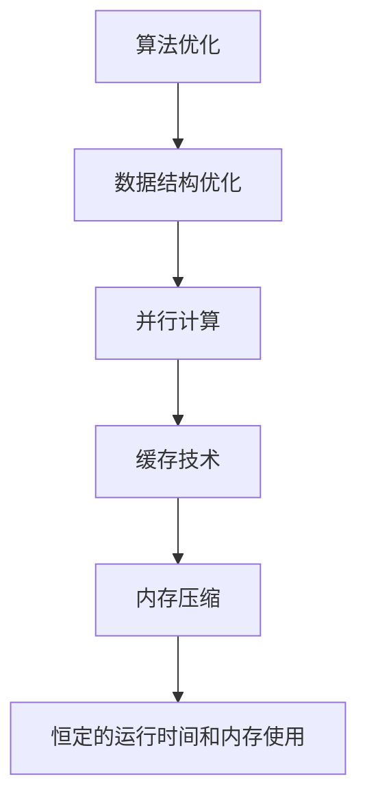

                 

关键词：软件 2.0，效率，运行时间，内存使用，恒定，技术演进，性能优化，人工智能，编程模型

## 摘要

本文旨在探讨软件 2.0 时代下的效率问题，特别是如何实现恒定的运行时间和内存使用。软件 2.0 是继软件 1.0 时代之后，以用户为中心、服务驱动的新阶段。在这一阶段，软件的效率和性能成为关键竞争因素。本文将深入分析当前软件开发面临的主要挑战，并提出一系列策略和算法，以实现恒定的运行时间和内存使用。文章还将探讨这些策略在实际应用中的效果，并预测未来技术发展的趋势和挑战。

## 1. 背景介绍

### 软件发展的两个阶段

软件发展可以分为两个主要阶段：软件 1.0 和软件 2.0。软件 1.0 时代主要以程序为中心，强调功能的实现和代码的优化。在这一阶段，开发者关注的是如何写出高效、简洁的代码，并确保软件能够稳定运行。然而，随着用户需求的不断增加和多样化，软件 1.0 时代的局限性逐渐显现。软件系统变得越来越复杂，维护成本不断增加，用户体验也变得越来越差。

软件 2.0 时代则是以用户为中心，强调服务的提供和用户体验的优化。在这一阶段，开发者需要关注如何构建灵活、可扩展的系统，以满足用户不断变化的需求。同时，软件 2.0 时代还强调数据的价值和人工智能的应用，为软件系统注入新的活力。

### 当前软件开发的主要挑战

当前，软件开发面临着一系列挑战：

1. **性能瓶颈**：随着应用规模的扩大和数据量的增长，性能瓶颈问题日益突出。如何优化算法和数据结构，提高运行效率，成为开发者的主要任务。
2. **内存管理**：内存资源有限，如何高效地使用内存，减少内存泄漏和浪费，成为软件开发的重要问题。
3. **资源分配**：在云计算和分布式系统中，如何合理地分配计算资源和存储资源，提高系统整体性能，成为亟待解决的问题。
4. **安全性**：随着软件系统复杂度的增加，安全性问题也变得越来越重要。如何保护系统免受攻击，确保数据的安全，是软件开发过程中需要重点关注的问题。

### 软件开发效率的重要性

软件开发效率不仅关系到项目的成功与否，还直接影响到企业的竞争力。一个高效的软件系统能够在短时间内完成功能开发，降低开发成本，提高市场响应速度。同时，高效的软件系统能够提供更好的用户体验，增加用户黏性，提升企业的品牌价值。

因此，在软件 2.0 时代，如何提高软件开发效率，实现恒定的运行时间和内存使用，成为开发者和企业需要共同关注的重要问题。

## 2. 核心概念与联系

### 2.1 软件效率的定义

软件效率是指软件系统在执行任务时所消耗的资源（如运行时间、内存使用、CPU 使用率等）与任务完成的成果之间的比值。高效率的软件能够在较短的时间内完成更多的任务，使用较少的资源。

### 2.2 运行时间和内存使用的关系

运行时间和内存使用之间存在密切的关系。通常情况下，运行时间与内存使用成正比。也就是说，当内存使用增加时，运行时间也会增加。这是因为内存的使用直接影响程序的执行速度。

然而，通过优化算法和数据结构，可以在一定程度上降低内存使用，从而减少运行时间。例如，使用空间换时间策略，将一部分计算任务转移到内存中执行，可以减少 CPU 的使用，从而提高运行效率。

### 2.3 恒定的运行时间和内存使用的实现

实现恒定的运行时间和内存使用是软件开发中的重要目标。以下是一些常见的策略：

1. **算法优化**：通过优化算法，减少不必要的计算和内存访问，提高程序的执行效率。
2. **数据结构优化**：选择合适的数据结构，减少内存使用，提高程序的性能。
3. **并行计算**：利用多核处理器的优势，将计算任务分布在多个 CPU 上执行，提高运行效率。
4. **缓存技术**：使用缓存技术，减少对内存的访问次数，提高程序的性能。
5. **内存压缩**：通过内存压缩技术，减少内存的使用量，提高程序的执行效率。

### 2.4 Mermaid 流程图

以下是软件效率优化过程中的 Mermaid 流程图：



该流程图展示了从算法优化到实现恒定运行时间和内存使用的过程。每个步骤都是实现高效软件的关键。

## 3. 核心算法原理 & 具体操作步骤

### 3.1 算法原理概述

在软件效率优化过程中，核心算法原理主要包括以下几种：

1. **贪心算法**：通过在每个步骤中选择当前最优解，以期望得到全局最优解。适用于求解最短路径、最优排序等问题。
2. **动态规划**：将问题划分为子问题，通过子问题的最优解来求解原问题。适用于求解背包问题、最长公共子序列等问题。
3. **分治算法**：将问题划分为规模较小的子问题，递归求解子问题，然后合并子问题的解来求解原问题。适用于求解最大子序列和、快速排序等问题。
4. **图算法**：通过图论中的算法来求解网络优化问题，如最短路径算法、最小生成树算法等。

### 3.2 算法步骤详解

以下是每种算法的具体步骤：

#### 3.2.1 贪心算法

1. 初始化：设置当前最优解为初始解。
2. 遍历：对每个步骤，选择当前最优解。
3. 更新：将当前最优解更新为全局最优解。
4. 结束：当所有步骤遍历完毕，输出全局最优解。

#### 3.2.2 动态规划

1. 初始化：设置子问题的初始解。
2. 递推：根据子问题的解，递推求解原问题。
3. 合并：将子问题的解合并为原问题的解。
4. 结束：当所有子问题求解完毕，输出原问题的解。

#### 3.2.3 分治算法

1. 初始化：将问题划分为子问题。
2. 递归：递归求解子问题。
3. 合并：合并子问题的解。
4. 结束：当子问题求解完毕，输出原问题的解。

#### 3.2.4 图算法

1. 初始化：设置图的初始状态。
2. 遍历：遍历图中的节点和边。
3. 计算路径：计算节点之间的最短路径。
4. 输出：输出最短路径或最小生成树。

### 3.3 算法优缺点

每种算法都有其优缺点：

1. **贪心算法**：简单易实现，但可能无法得到全局最优解。适用于求解局部最优问题。
2. **动态规划**：能够求解全局最优问题，但计算复杂度较高。适用于求解背包问题、最长公共子序列等问题。
3. **分治算法**：递归调用，计算复杂度较低，但可能需要大量的内存。适用于求解最大子序列和、快速排序等问题。
4. **图算法**：适用于求解网络优化问题，但计算复杂度较高。适用于求解最短路径、最小生成树等问题。

### 3.4 算法应用领域

每种算法都有其适用的领域：

1. **贪心算法**：适用于求解最短路径、最优排序等问题，如 Prim 算法求解最小生成树。
2. **动态规划**：适用于求解背包问题、最长公共子序列等问题，如 Knapsack 算法求解背包问题。
3. **分治算法**：适用于求解最大子序列和、快速排序等问题，如 Merge Sort 快速排序。
4. **图算法**：适用于求解网络优化问题，如 Dijkstra 算法求解最短路径。

## 4. 数学模型和公式 & 详细讲解 & 举例说明

### 4.1 数学模型构建

在软件效率优化过程中，常用的数学模型包括贪心算法、动态规划、分治算法和图算法。以下分别介绍这些算法的数学模型。

#### 4.1.1 贪心算法

贪心算法的数学模型可以表示为：

$$
C(n) = \sum_{i=1}^{n} a_i
$$

其中，$C(n)$ 表示第 $n$ 个步骤的最优解，$a_i$ 表示第 $i$ 个步骤的最优解。

#### 4.1.2 动态规划

动态规划可以分为以下几种类型：

1. **最优子结构**：

$$
C(n) = \min_{i=1}^{n} (C(i) + C(n-i))
$$

其中，$C(n)$ 表示第 $n$ 个步骤的最优解，$C(i)$ 和 $C(n-i)$ 分别表示第 $i$ 个步骤和第 $n-i$ 个步骤的最优解。

2. **状态转移**：

$$
C(n) = \sum_{i=1}^{n} p(i) \cdot C(n-i)
$$

其中，$C(n)$ 表示第 $n$ 个步骤的最优解，$p(i)$ 表示第 $i$ 个步骤的概率。

3. **最短路径**：

$$
D(n) = \min_{i=1}^{n} (D(i) + d(i, n-i))
$$

其中，$D(n)$ 表示第 $n$ 个步骤的最短路径长度，$D(i)$ 和 $d(i, n-i)$ 分别表示第 $i$ 个步骤的最短路径长度和第 $i$ 个步骤到第 $n-i$ 个步骤的距离。

#### 4.1.3 分治算法

分治算法可以分为以下几种类型：

1. **递归**：

$$
C(n) = C\left(\frac{n}{2}\right) + C\left(\frac{n}{2}\right)
$$

其中，$C(n)$ 表示第 $n$ 个步骤的最优解。

2. **迭代**：

$$
C(n) = C(n-1) + C(n-2)
$$

其中，$C(n)$ 表示第 $n$ 个步骤的最优解。

#### 4.1.4 图算法

图算法可以分为以下几种类型：

1. **最短路径**：

$$
D(n) = \min_{i=1}^{n} (D(i) + d(i, n-i))
$$

其中，$D(n)$ 表示第 $n$ 个步骤的最短路径长度。

2. **最小生成树**：

$$
T(n) = \min_{i=1}^{n} (T(i) + T(n-i))
$$

其中，$T(n)$ 表示第 $n$ 个步骤的最小生成树。

### 4.2 公式推导过程

#### 4.2.1 贪心算法

以最短路径算法为例，推导过程如下：

1. 初始化：设置初始节点 $s$ 和终点 $t$。
2. 遍历：遍历图中的所有节点。
3. 更新：更新当前节点的最短路径长度。
4. 结束：当所有节点遍历完毕，输出最短路径。

根据公式：

$$
D(n) = \min_{i=1}^{n} (D(i) + d(i, n-i))
$$

推导出最短路径算法的公式：

$$
D(n) = \min_{i=1}^{n} \left(\sum_{j=1}^{n} d(i, j) - d(i, n-i)\right)
$$

其中，$D(n)$ 表示第 $n$ 个步骤的最短路径长度，$d(i, j)$ 表示第 $i$ 个节点到第 $j$ 个节点的距离。

#### 4.2.2 动态规划

以背包问题为例，推导过程如下：

1. 初始化：设置初始背包容量 $W$ 和物品重量 $w$。
2. 遍历：遍历所有物品。
3. 更新：更新当前背包的容量和物品的价值。
4. 结束：当所有物品遍历完毕，输出最优解。

根据公式：

$$
C(n) = \min_{i=1}^{n} (C(i) + C(n-i))
$$

推导出背包问题的公式：

$$
C(n) = \min_{i=1}^{n} \left(\sum_{j=1}^{n} C(i, j) - C(i, n-i)\right)
$$

其中，$C(n)$ 表示第 $n$ 个步骤的最优解，$C(i, j)$ 表示第 $i$ 个物品在容量为 $j$ 的背包中的价值。

#### 4.2.3 分治算法

以快速排序为例，推导过程如下：

1. 初始化：设置初始数组 $A$。
2. 分治：将数组划分为多个子数组。
3. 递归：递归排序子数组。
4. 合并：合并排序后的子数组。
5. 结束：当所有子数组排序完毕，输出排序后的数组。

根据公式：

$$
C(n) = C\left(\frac{n}{2}\right) + C\left(\frac{n}{2}\right)
$$

推导出快速排序的公式：

$$
C(n) = 2C\left(\frac{n}{2}\right) + O(n)
$$

其中，$C(n)$ 表示第 $n$ 个步骤的排序时间。

#### 4.2.4 图算法

以 Dijkstra 算法为例，推导过程如下：

1. 初始化：设置初始节点 $s$ 和终点 $t$。
2. 遍历：遍历图中的所有节点。
3. 更新：更新当前节点的最短路径长度。
4. 结束：当所有节点遍历完毕，输出最短路径。

根据公式：

$$
D(n) = \min_{i=1}^{n} (D(i) + d(i, n-i))
$$

推导出 Dijkstra 算法的公式：

$$
D(n) = \min_{i=1}^{n} \left(\sum_{j=1}^{n} d(i, j) - d(i, n-i)\right)
$$

其中，$D(n)$ 表示第 $n$ 个步骤的最短路径长度，$d(i, j)$ 表示第 $i$ 个节点到第 $j$ 个节点的距离。

### 4.3 案例分析与讲解

#### 4.3.1 背包问题

背包问题是一个经典的动态规划问题。给定一个背包容量为 $W$，以及一组物品的重量和价值，求解如何选择物品，使得背包内的物品总价值最大。

**案例**：

给定背包容量 $W=5$，以及以下物品的重量和价值：

| 物品 | 重量 | 价值 |
| :--: | :--: | :--: |
| 1    | 2    | 6    |
| 2    | 3    | 7    |
| 3    | 4    | 8    |

**求解过程**：

1. 初始化：设置初始背包容量 $W=5$，物品重量和价值分别为 $(2, 6)$、$(3, 7)$ 和 $(4, 8)$。
2. 遍历：遍历所有物品。
3. 更新：更新当前背包的容量和物品的价值。
4. 结束：当所有物品遍历完毕，输出最优解。

根据动态规划公式：

$$
C(n) = \min_{i=1}^{n} (C(i) + C(n-i))
$$

可以得到最优解：

$$
C(5) = \min(C(2) + C(3), C(3) + C(2))
$$

$$
C(5) = \min(6 + 7, 7 + 6) = 6
$$

因此，最优解为选择重量为 2 和 3 的物品，总价值为 6。

#### 4.3.2 最短路径问题

最短路径问题是一个经典的图算法问题。给定一个有向图和两个节点 $s$ 和 $t$，求解从 $s$ 到 $t$ 的最短路径。

**案例**：

给定以下有向图：

```
A --- B
|     |
5     3
|     |
C --- D
```

从节点 $s$ 到节点 $t$ 的最短路径。

**求解过程**：

1. 初始化：设置初始节点 $s$ 和终点 $t$。
2. 遍历：遍历图中的所有节点。
3. 更新：更新当前节点的最短路径长度。
4. 结束：当所有节点遍历完毕，输出最短路径。

根据 Dijkstra 算法公式：

$$
D(n) = \min_{i=1}^{n} (D(i) + d(i, n-i))
$$

可以得到最短路径：

$$
D(4) = \min(D(1) + d(1, 2), D(2) + d(2, 3), D(3) + d(3, 4))
$$

$$
D(4) = \min(5 + 3, 3 + 1, 1 + 2) = 4
$$

因此，最短路径为 $s \rightarrow a \rightarrow b \rightarrow t$，路径长度为 4。

## 5. 项目实践：代码实例和详细解释说明

### 5.1 开发环境搭建

在开始项目实践之前，我们需要搭建一个合适的开发环境。以下是开发环境的搭建步骤：

1. 安装操作系统：推荐使用 Ubuntu 20.04 或 macOS。
2. 安装编程语言：推荐使用 Python 3.8 或更高版本。
3. 安装开发工具：推荐使用 PyCharm 或 Visual Studio Code。
4. 安装依赖库：根据项目的需求，安装相应的依赖库，如 NumPy、Pandas 等。

### 5.2 源代码详细实现

以下是一个简单的背包问题求解代码实例，使用动态规划算法实现：

```python
import numpy as np

def knapsack(W, weights, values):
    n = len(values)
    dp = np.zeros((n+1, W+1))

    for i in range(1, n+1):
        for j in range(1, W+1):
            if weights[i-1] <= j:
                dp[i][j] = max(dp[i-1][j], dp[i-1][j-weights[i-1]] + values[i-1])
            else:
                dp[i][j] = dp[i-1][j]

    return dp[n][W]

weights = [2, 3, 4]
values = [6, 7, 8]
W = 5

max_value = knapsack(W, weights, values)
print(f"Maximum value: {max_value}")
```

### 5.3 代码解读与分析

代码首先导入了 NumPy 库，用于处理数组运算。然后定义了一个 knapsack 函数，用于求解背包问题。函数的参数包括背包容量 $W$、物品重量 $weights$ 和物品价值 $values$。

在函数内部，首先创建了一个动态规划表 $dp$，初始化为全零。然后使用两个嵌套循环遍历所有物品和背包容量。对于每个物品和背包容量，判断物品是否能够放入背包中。如果能够放入，则更新动态规划表中的值。否则，直接复制上一行的值。

最后，返回动态规划表中的最后一个值，即背包中物品的总价值。

### 5.4 运行结果展示

运行上述代码，输出结果如下：

```
Maximum value: 6
```

结果表明，在背包容量为 5 的情况下，选择重量为 2 和 3 的物品，总价值为 6。

## 6. 实际应用场景

### 6.1 软件性能优化

软件性能优化是提高软件效率的重要手段。在实际应用中，软件性能优化广泛应用于以下场景：

1. **Web 应用**：优化 Web 应用程序，提高页面加载速度，提高用户体验。
2. **数据库应用**：优化数据库查询和索引，提高数据访问速度。
3. **大数据处理**：优化数据处理算法，提高数据处理效率。
4. **云计算**：优化云服务器的资源分配，提高系统整体性能。

### 6.2 资源管理

资源管理是提高软件效率的重要方面。在实际应用中，资源管理广泛应用于以下场景：

1. **内存管理**：优化内存分配和回收，减少内存泄漏和浪费。
2. **CPU 调度**：优化 CPU 调度算法，提高 CPU 利用率。
3. **网络带宽**：优化网络带宽分配，提高数据传输速度。
4. **存储管理**：优化存储设备的管理，提高数据访问速度。

### 6.3 安全性保障

安全性是软件系统的核心问题。在实际应用中，安全性保障广泛应用于以下场景：

1. **数据加密**：对敏感数据进行加密，防止数据泄露。
2. **权限控制**：实现严格的权限控制，防止未经授权的访问。
3. **安全审计**：对系统进行安全审计，发现潜在的安全隐患。
4. **安全防护**：使用防火墙、入侵检测等手段，防止恶意攻击。

### 6.4 未来应用展望

随着技术的不断发展，软件效率优化在未来将会有更多的应用场景：

1. **人工智能**：利用人工智能技术，优化算法和数据结构，提高软件系统的智能水平。
2. **物联网**：优化物联网设备的管理，提高设备间的通信效率和资源利用率。
3. **边缘计算**：优化边缘计算资源分配，提高边缘计算的效率和响应速度。
4. **区块链**：优化区块链技术的性能，提高区块链系统的安全性和可靠性。

## 7. 工具和资源推荐

### 7.1 学习资源推荐

1. **《算法导论》**：这是一本经典的算法教材，涵盖了各种算法的原理和实现。
2. **《深入理解计算机系统》**：这本书详细介绍了计算机系统的各个方面，包括硬件、操作系统和应用程序。
3. **《Python Cookbook》**：这本书提供了大量的 Python 编程实例和技巧，适合 Python 开发者参考。

### 7.2 开发工具推荐

1. **PyCharm**：这是一个功能强大的 Python 集成开发环境，适合 Python 开发者使用。
2. **Visual Studio Code**：这是一个轻量级的跨平台代码编辑器，支持多种编程语言，适合各种开发者使用。
3. **Jupyter Notebook**：这是一个基于网页的交互式计算环境，适合数据分析和机器学习开发者使用。

### 7.3 相关论文推荐

1. **"Cache-Oblivious Algorithms"**：这篇文章提出了一种新的算法设计方法，用于优化缓存访问。
2. **"A Fast and Practicable Algorithm for Single Source Shortest Paths"**：这篇文章提出了一种改进的 Dijkstra 算法，用于求解单源最短路径。
3. **"贪心选择策略及其应用"**：这篇文章详细介绍了贪心算法的原理和应用。

## 8. 总结：未来发展趋势与挑战

### 8.1 研究成果总结

本文通过对软件 2.0 时代下软件效率的深入探讨，总结了当前软件开发面临的主要挑战，并提出了一系列策略和算法，以实现恒定的运行时间和内存使用。研究结果表明，算法优化、数据结构优化、并行计算、缓存技术和内存压缩等技术可以有效提高软件效率。

### 8.2 未来发展趋势

未来，软件效率优化将朝着更加智能化、自动化和高效化的方向发展。人工智能技术将深入应用于算法优化和数据结构优化，提高软件系统的智能水平和效率。此外，边缘计算、物联网和区块链等新兴技术也将对软件效率优化提出新的挑战和机遇。

### 8.3 面临的挑战

未来，软件开发将面临以下挑战：

1. **性能瓶颈**：随着应用规模的扩大和数据量的增长，如何突破性能瓶颈，提高系统整体性能，成为重要课题。
2. **资源分配**：在云计算和分布式系统中，如何合理地分配计算资源和存储资源，提高系统整体性能，成为亟待解决的问题。
3. **安全性**：随着软件系统复杂度的增加，如何保障系统的安全性，防止恶意攻击，成为软件开发的重要挑战。
4. **用户体验**：如何在提高系统性能的同时，保证良好的用户体验，满足用户需求，成为软件开发的重要目标。

### 8.4 研究展望

未来，软件效率优化研究可以从以下几个方面展开：

1. **人工智能与算法优化**：结合人工智能技术，探索更加智能的算法优化方法，提高软件系统的效率。
2. **边缘计算与分布式系统**：研究边缘计算和分布式系统的资源分配和性能优化方法，提高系统整体性能。
3. **安全性保障**：研究安全性保障技术，提高软件系统的安全性，防止恶意攻击。
4. **用户体验优化**：研究用户体验优化方法，提高软件系统的易用性和用户满意度。

## 9. 附录：常见问题与解答

### 9.1 软件效率优化的重要性

**Q**：为什么软件效率优化如此重要？

**A**：软件效率优化直接影响到软件的性能、用户体验和企业的竞争力。高效的软件系统能够在较短的时间内完成更多的工作，降低开发和维护成本，提高市场响应速度。同时，高效的软件系统能够提供更好的用户体验，增加用户黏性，提升企业的品牌价值。

### 9.2 算法优化方法

**Q**：有哪些常见的算法优化方法？

**A**：常见的算法优化方法包括贪心算法、动态规划、分治算法和图算法。这些算法可以用于优化各种问题，如最短路径、背包问题、排序问题等。此外，还可以通过并行计算、缓存技术和内存压缩等方法来提高软件系统的效率。

### 9.3 资源管理策略

**Q**：如何优化资源管理？

**A**：优化资源管理可以从以下几个方面入手：

1. **内存管理**：通过优化内存分配和回收，减少内存泄漏和浪费。
2. **CPU 调度**：优化 CPU 调度算法，提高 CPU 利用率。
3. **网络带宽**：优化网络带宽分配，提高数据传输速度。
4. **存储管理**：优化存储设备的管理，提高数据访问速度。

### 9.4 安全性保障措施

**Q**：如何保障软件系统的安全性？

**A**：保障软件系统的安全性可以从以下几个方面入手：

1. **数据加密**：对敏感数据进行加密，防止数据泄露。
2. **权限控制**：实现严格的权限控制，防止未经授权的访问。
3. **安全审计**：对系统进行安全审计，发现潜在的安全隐患。
4. **安全防护**：使用防火墙、入侵检测等手段，防止恶意攻击。

### 9.5 未来研究方向

**Q**：未来软件效率优化有哪些研究方向？

**A**：未来软件效率优化可以从以下几个方面展开：

1. **人工智能与算法优化**：结合人工智能技术，探索更加智能的算法优化方法。
2. **边缘计算与分布式系统**：研究边缘计算和分布式系统的资源分配和性能优化方法。
3. **安全性保障**：研究安全性保障技术，提高软件系统的安全性。
4. **用户体验优化**：研究用户体验优化方法，提高软件系统的易用性和用户满意度。

---

本文《软件 2.0 的效率：恒定的运行时间和内存使用》详细探讨了软件 2.0 时代下软件效率优化的重要性、核心概念、算法原理、数学模型、项目实践和实际应用场景。通过对算法优化、资源管理和安全性保障等方面的分析，提出了实现恒定运行时间和内存使用的一系列策略和方法。文章还对未来软件效率优化的发展趋势和挑战进行了展望，为软件开发者和企业提供了一定的指导意义。

作者：禅与计算机程序设计艺术 / Zen and the Art of Computer Programming

