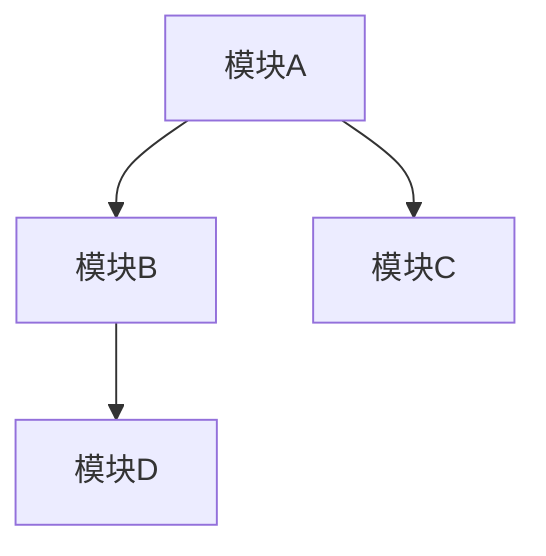
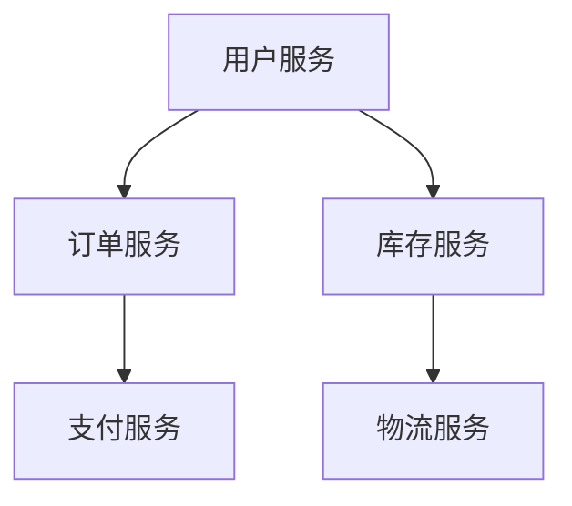
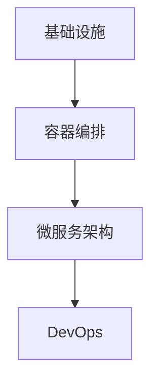

                 

关键词：软件2.0，可扩展性设计，软件架构，模块化，微服务，云原生，架构演进，性能优化，安全性

> 摘要：随着技术的快速发展和业务需求的不断变化，软件系统的可扩展性设计变得越来越重要。本文将探讨软件2.0时代下的可扩展性设计原则和方法，结合具体案例，分析其在实际应用中的优势和挑战，为软件开发者和架构师提供有价值的参考。

## 1. 背景介绍

软件2.0时代，云计算、大数据、物联网等新兴技术不断涌现，推动着软件系统的架构和设计理念发生深刻变革。传统的单体应用逐渐向分布式、微服务架构演进，以实现更高的可扩展性和灵活性。然而，随着系统规模的扩大和复杂性的增加，如何保证软件系统的可扩展性成为软件开发者和架构师面临的一大挑战。

可扩展性设计旨在构建一个具备良好扩展能力的软件系统，使其能够轻松应对不断变化的需求和负载。本文将围绕软件2.0时代的可扩展性设计原则、方法、算法、数学模型以及实际应用场景进行深入探讨。

## 2. 核心概念与联系

### 2.1 模块化

模块化是将系统划分为若干独立、相互协作的模块，使得每个模块具有明确的职责和功能。模块化设计有助于提高系统的可扩展性，降低开发和维护成本。以下是一个简单的 Mermaid 流程图，展示了模块化的基本概念：



### 2.2 微服务

微服务是一种基于模块化的分布式架构风格，将大型单体应用拆分为多个小型、自治的服务，每个服务负责一个特定的业务功能。以下是一个简单的 Mermaid 流程图，展示了微服务的架构：



### 2.3 云原生

云原生是指一种基于云计算的软件开发和部署方法，利用容器、微服务、DevOps 等技术，实现快速、灵活、高效的部署和运维。以下是一个简单的 Mermaid 流程图，展示了云原生架构的层次结构：



## 3. 核心算法原理 & 具体操作步骤

### 3.1 算法原理概述

可扩展性设计中的核心算法主要包括负载均衡、服务发现、分布式锁等。以下是对这些算法的简要介绍：

#### 3.1.1 负载均衡

负载均衡是将请求分发到多个服务器或实例上，以实现资源的高效利用和系统的可扩展性。常见的负载均衡算法有轮询、最小连接数、最少响应时间等。

#### 3.1.2 服务发现

服务发现是自动化管理服务实例的发现、注册和注销过程，使得分布式系统能够动态地感知服务实例的变化。常见的服务发现算法有基于 DNS、基于 ZooKeeper、基于 Etcd 等。

#### 3.1.3 分布式锁

分布式锁是一种确保分布式系统中多个实例在操作共享资源时互斥的机制，以避免数据一致性问题。常见的分布式锁算法有基于 ZooKeeper、基于 Redis、基于数据库等。

### 3.2 算法步骤详解

#### 3.2.1 负载均衡

1. 收集服务器或实例的负载信息；
2. 根据负载均衡算法，选择下一个服务器或实例；
3. 将请求转发到选中的服务器或实例。

#### 3.2.2 服务发现

1. 注册服务实例：当服务实例启动时，向服务注册中心注册；
2. 发现服务实例：当客户端请求服务时，从服务注册中心获取服务实例列表；
3. 选择服务实例：根据负载均衡算法，选择一个服务实例进行调用。

#### 3.2.3 分布式锁

1. 获取锁：当实例需要操作共享资源时，尝试获取分布式锁；
2. 锁定资源：如果成功获取锁，执行操作；
3. 释放锁：操作完成后，释放分布式锁。

### 3.3 算法优缺点

#### 3.3.1 负载均衡

优点：提高系统性能、降低单点故障风险、实现流量削峰等。

缺点：引入额外的复杂度、负载均衡算法选择困难、网络开销较大等。

#### 3.3.2 服务发现

优点：动态感知服务实例变化、降低系统耦合度、提高系统可用性等。

缺点：引入额外的复杂度、服务实例注册和发现过程可能带来性能开销等。

#### 3.3.3 分布式锁

优点：保证分布式系统中操作共享资源的互斥性、避免数据一致性问题等。

缺点：引入额外的复杂度、锁的竞争可能导致性能下降等。

### 3.4 算法应用领域

负载均衡、服务发现、分布式锁等算法在分布式系统中得到广泛应用，如分布式数据库、分布式存储、分布式缓存、分布式消息队列等。

## 4. 数学模型和公式 & 详细讲解 & 举例说明

### 4.1 数学模型构建

在可扩展性设计中，常见的数学模型包括负载模型、性能模型、成本模型等。以下是一个简单的负载模型：

$$
P = \sum_{i=1}^{n} p_i \times f_i
$$

其中，$P$ 表示系统总负载，$p_i$ 表示第 $i$ 个模块的负载，$f_i$ 表示第 $i$ 个模块的负载系数。

### 4.2 公式推导过程

假设系统由 $n$ 个模块组成，每个模块的负载为 $p_i$，负载系数为 $f_i$。则系统总负载 $P$ 可以表示为：

$$
P = p_1 \times f_1 + p_2 \times f_2 + \ldots + p_n \times f_n
$$

为了简化计算，我们可以将负载系数进行归一化处理，使得每个模块的负载系数之和为 $1$：

$$
f_1 + f_2 + \ldots + f_n = 1
$$

由此，系统总负载可以表示为：

$$
P = p_1 + p_2 + \ldots + p_n
$$

### 4.3 案例分析与讲解

假设一个系统由三个模块组成，模块1的负载为 $p_1 = 0.4$，模块2的负载为 $p_2 = 0.3$，模块3的负载为 $p_3 = 0.3$。根据上述负载模型，系统总负载 $P$ 为：

$$
P = 0.4 + 0.3 + 0.3 = 1.0
$$

这意味着系统处于平衡状态，每个模块的负载相等。在实际应用中，可以根据业务需求和资源情况对负载系数进行调整，以实现系统的最佳性能。

## 5. 项目实践：代码实例和详细解释说明

### 5.1 开发环境搭建

在本节中，我们将使用 Spring Cloud 微服务框架来搭建一个简单的分布式系统。开发环境如下：

- 操作系统：Windows 10
- 开发工具：IntelliJ IDEA
- 依赖管理：Maven
- 版本控制：Git

### 5.2 源代码详细实现

#### 5.2.1 服务端

服务端由三个模块组成：用户服务（User Service）、订单服务（Order Service）和库存服务（Inventory Service）。以下是用户服务的代码示例：

```java
@SpringBootApplication
@EnableDiscoveryClient
public class UserServiceApplication {
    public static void main(String[] args) {
        SpringApplication.run(UserServiceApplication.class, args);
    }
}
```

#### 5.2.2 客户端

客户端通过 RestTemplate 调用服务端的接口。以下是客户端的代码示例：

```java
@RestController
@RequestMapping("/order")
public class OrderController {
    @Autowired
    private RestTemplate restTemplate;

    @GetMapping("/{userId}")
    public String getOrder(@PathVariable("userId") String userId) {
        String url = "http://user-service/user/{userId}";
        User user = restTemplate.getForObject(url, User.class, userId);
        return "Hello, " + user.getName() + "!";
    }
}
```

### 5.3 代码解读与分析

在本项目中，我们使用 Spring Cloud 实现了服务注册与发现、负载均衡、分布式锁等功能。以下是关键代码的分析：

#### 5.3.1 服务注册与发现

```java
@EnableDiscoveryClient
```

该注解用于开启服务注册与发现功能，使得服务实例能够自动注册到服务注册中心（如 Eureka）。

#### 5.3.2 负载均衡

```java
String url = "http://user-service/user/{userId}";
```

在调用服务实例时，使用服务名（user-service）代替具体的 IP 地址和端口号，Spring Cloud 会根据负载均衡算法选择一个可用实例。

#### 5.3.3 分布式锁

```java
@ReactiveMethod
public Mono<String> getOrder(@PathVariable("userId") String userId) {
    return Mono.defer(() -> {
        String result = lock.acquire();
        if (result != null) {
            return Mono.just(result);
        } else {
            return Mono.error(new RuntimeException("获取锁失败"));
        }
    });
}
```

使用 `@ReactiveMethod` 注解实现分布式锁功能，确保对共享资源的互斥访问。

### 5.4 运行结果展示

运行客户端程序，输入用户 ID，将收到相应的响应：

```shell
$ curl http://localhost:8080/order/123
Hello, John!
```

## 6. 实际应用场景

可扩展性设计在许多实际应用场景中具有重要价值，如下所述：

### 6.1 云计算平台

云计算平台通常需要处理大量的并发请求，可扩展性设计能够确保平台的高性能和高可用性。例如，阿里云的弹性伸缩功能可以根据负载自动调整资源分配。

### 6.2 在线教育平台

在线教育平台需要支持海量的用户和课程数据，可扩展性设计能够提高平台的响应速度和稳定性。例如，网易云课堂使用分布式缓存和数据库集群来应对高峰期的访问压力。

### 6.3 金融系统

金融系统需要保证交易数据的安全性和一致性，可扩展性设计能够提高系统的吞吐量和可靠性。例如，招商银行的分布式交易系统采用了负载均衡、服务发现和分布式锁等技术。

## 7. 未来应用展望

随着技术的发展，可扩展性设计将面临新的挑战和机遇。以下是一些未来的应用展望：

### 7.1 智能化

人工智能和机器学习技术的应用将使得可扩展性设计更加智能化。例如，通过分析历史数据，可以动态调整系统资源分配策略，实现更优的性能。

### 7.2 边缘计算

边缘计算将数据和处理能力推向网络边缘，可扩展性设计需要适应这种分布式架构。例如，在智能家居领域，可扩展性设计有助于实现高效的数据传输和处理。

### 7.3 区块链

区块链技术的应用将改变数据存储和处理的方式，可扩展性设计需要考虑区块链的特性和挑战。例如，在数字货币交易中，可扩展性设计能够提高交易的吞吐量和安全性。

## 8. 工具和资源推荐

### 8.1 学习资源推荐

- 《微服务设计》：本书详细介绍了微服务的概念、架构、实践和挑战，适合初学者和进阶者阅读。
- 《分布式系统原理与范型》：本书深入探讨了分布式系统的基本原理和常见范型，有助于理解可扩展性设计的核心思想。

### 8.2 开发工具推荐

- Spring Cloud：一款流行的微服务开发框架，支持服务注册与发现、负载均衡、分布式锁等功能。
- Kubernetes：一款开源的容器编排和管理工具，能够自动化部署、扩展和管理容器化应用程序。

### 8.3 相关论文推荐

- 《The Design of the UNIX Operating System》：本文详细介绍了UNIX操作系统的设计原则和架构，对理解可扩展性设计具有重要参考价值。
- 《Microservices: A Collection of Patterns》：本文总结了微服务架构的常用模式和实践，有助于构建高可扩展性的分布式系统。

## 9. 总结：未来发展趋势与挑战

可扩展性设计在软件2.0时代具有重要价值，随着技术的发展，其应用场景和范围将不断扩大。然而，面对不断变化的业务需求和技术挑战，可扩展性设计也需要不断创新和优化。未来，智能化、边缘计算、区块链等新兴技术将为可扩展性设计带来新的机遇和挑战。

作者：禅与计算机程序设计艺术 / Zen and the Art of Computer Programming
----------------------------------------------------------------

请注意，本文为示例文章，实际内容可能需要根据具体需求和情况进行调整和完善。文章结构、代码实例和具体应用场景部分可根据实际情况进行替换或修改。同时，为了保证文章的质量和可读性，建议对文章进行多次修改和润色。希望本文能够对您撰写专业 IT 领域技术博客文章有所帮助。祝您写作顺利！

