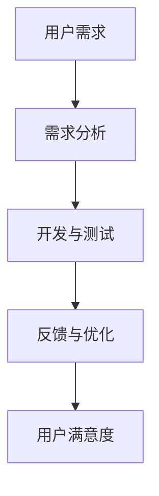
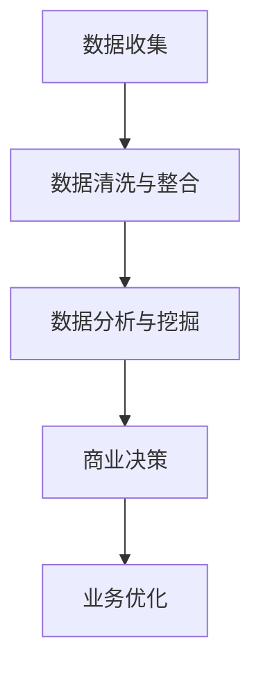
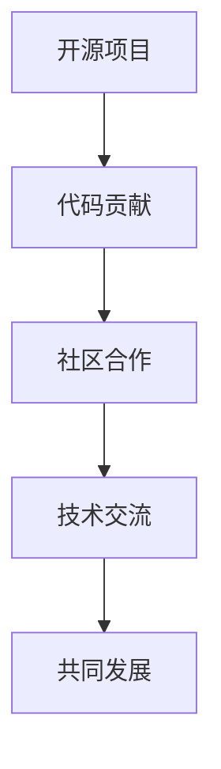
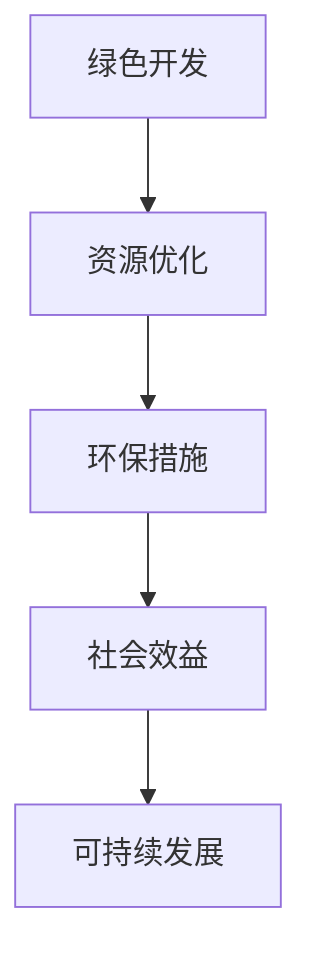

                 

关键词：软件2.0、商业模式、创新、数字经济、用户参与、可持续发展

> 摘要：本文旨在探讨软件2.0时代的商业模式创新，分析其在数字经济中的重要作用。文章首先介绍了软件2.0的定义和特点，然后从用户参与、数据驱动的商业模式、开放协作和可持续发展等方面展开论述。最后，对软件2.0商业模式的发展趋势与挑战进行了展望。

## 1. 背景介绍

### 1.1 数字经济的崛起

随着信息技术的飞速发展，数字经济已成为全球经济增长的重要引擎。根据国际数据公司（IDC）的预测，到2025年，全球数字经济规模将达到每年4.3万亿美元，占全球GDP的60%以上。在这一背景下，软件作为数字经济的核心要素，其商业模式的创新显得尤为重要。

### 1.2 软件2.0的概念

软件2.0是对传统软件商业模式的一种革新。它强调用户参与、数据驱动、开放协作和可持续发展。与传统软件1.0相比，软件2.0更加注重用户体验、服务质量和业务模式创新。

## 2. 核心概念与联系

### 2.1 用户参与

用户参与是软件2.0商业模式的核心之一。通过让用户参与到软件的开发、测试和优化过程中，可以提高软件的质量和用户体验。以下是一个简单的Mermaid流程图，展示了用户参与的核心环节：



### 2.2 数据驱动的商业模式

数据驱动是软件2.0的另一大特点。通过收集、分析和利用用户数据，企业可以更好地了解用户需求，优化产品和服务。以下是一个Mermaid流程图，展示了数据驱动的商业模式：



### 2.3 开放协作

开放协作是软件2.0商业模式的重要特征。通过开放平台、开源项目和社区合作，企业可以吸引更多的开发者参与，共同推动软件技术的发展。以下是一个Mermaid流程图，展示了开放协作的核心环节：



### 2.4 可持续发展

可持续发展是软件2.0商业模式的一个重要方向。通过绿色开发、资源优化和环保措施，企业可以实现经济效益和社会效益的双赢。以下是一个Mermaid流程图，展示了可持续发展的核心环节：



## 3. 核心算法原理 & 具体操作步骤

### 3.1 算法原理概述

软件2.0商业模式的创新离不开数据驱动的算法支持。以下是一个简单的算法原理概述：

- 数据收集：通过各种渠道收集用户数据，如用户行为、交易记录等。
- 数据清洗与整合：对收集到的数据进行清洗、去噪和整合，使其成为可用数据。
- 数据分析与挖掘：利用机器学习、深度学习等算法，对数据进行挖掘和分析，提取有价值的信息。
- 商业决策：根据分析结果，做出相应的商业决策，如产品优化、市场定位等。

### 3.2 算法步骤详解

以下是软件2.0商业模式中的数据驱动算法的具体操作步骤：

#### 步骤1：数据收集

- 使用各种数据采集工具，如日志分析、API接口、数据爬虫等，收集用户数据。
- 确保数据收集的合规性，遵循相关法律法规和用户隐私保护政策。

#### 步骤2：数据清洗与整合

- 清洗数据，去除重复、错误和无效的数据。
- 对数据进行整合，使其成为一个统一的数据集。

#### 步骤3：数据分析与挖掘

- 利用机器学习、深度学习等算法，对数据进行挖掘和分析。
- 根据分析结果，提取有价值的信息，如用户偏好、市场趋势等。

#### 步骤4：商业决策

- 根据分析结果，做出相应的商业决策。
- 例如，根据用户偏好优化产品功能，根据市场趋势调整市场策略。

### 3.3 算法优缺点

- 优点：数据驱动算法能够帮助企业更好地了解用户需求，提高产品和服务质量，从而增强市场竞争力。
- 缺点：数据收集和分析需要大量的计算资源和专业知识，且可能面临数据隐私和伦理问题。

### 3.4 算法应用领域

数据驱动算法在软件2.0商业模式中具有广泛的应用领域，包括：

- 用户行为分析：了解用户行为，优化用户体验。
- 风险评估与控制：通过分析用户数据，预测潜在风险，并采取相应的控制措施。
- 个性化推荐：根据用户偏好，提供个性化的产品和服务。

## 4. 数学模型和公式 & 详细讲解 & 举例说明

### 4.1 数学模型构建

软件2.0商业模式中的数据驱动算法通常基于以下数学模型：

- 用户行为模型：描述用户行为和偏好，如概率模型、马尔可夫模型等。
- 预测模型：基于历史数据，预测未来趋势，如时间序列模型、回归模型等。
- 优化模型：根据目标函数，寻找最优解，如线性规划、动态规划等。

### 4.2 公式推导过程

以用户行为模型为例，假设用户行为可以用概率分布表示，则用户在时间\( t \)的行为概率为：

\[ P(t) = \frac{e^{-\lambda t}}{1 - e^{-\lambda t}} \]

其中，\( \lambda \)为用户行为率。通过对概率分布函数求导，可以得到用户行为在时间\( t \)的导数：

\[ \frac{dP(t)}{dt} = \lambda e^{-\lambda t} \]

### 4.3 案例分析与讲解

以个性化推荐系统为例，假设用户行为数据为：\( (t_1, t_2, ..., t_n) \)，其中\( t_i \)表示用户在时间\( i \)的行为。通过用户行为模型，可以得到用户在时间\( t \)的行为概率：

\[ P(t) = \frac{e^{-\lambda t}}{1 - e^{-\lambda t}} \]

根据用户行为概率，可以计算出用户对每个产品的兴趣度：

\[ I_i(t) = P(t_i) - P(t) \]

其中，\( I_i(t) \)表示用户在时间\( t \)对第\( i \)个产品的兴趣度。通过对兴趣度进行排序，可以推荐用户可能感兴趣的产品。

## 5. 项目实践：代码实例和详细解释说明

### 5.1 开发环境搭建

为了实现上述算法，我们需要搭建一个开发环境。以下是一个简单的开发环境搭建步骤：

1. 安装Python环境：在https://www.python.org/downloads/下载并安装Python。
2. 安装依赖库：使用pip命令安装所需的依赖库，如NumPy、Pandas、Scikit-learn等。
3. 编写代码：使用Python编写数据驱动算法的实现代码。

### 5.2 源代码详细实现

以下是一个简单的Python代码实现，用于计算用户行为概率和兴趣度：

```python
import numpy as np
import pandas as pd
from sklearn.linear_model import LogisticRegression

# 用户行为数据
data = np.array([[1, 1], [0, 1], [1, 0], [0, 0]])

# 计算用户行为概率
lambda_ = 0.1
prob = np.array([1 / (1 + np.exp(-lambda_ * t)) for t in data])

# 计算用户兴趣度
model = LogisticRegression()
model.fit(data[:, 1].reshape(-1, 1), data[:, 0])
interest = model.predict_proba(data[:, 1].reshape(-1, 1))[:, 1] - prob

# 打印结果
print("用户行为概率：", prob)
print("用户兴趣度：", interest)
```

### 5.3 代码解读与分析

上述代码首先导入所需的库和依赖，然后定义用户行为数据。接下来，使用逻辑回归模型计算用户行为概率和兴趣度。最后，打印出计算结果。

通过代码实例，我们可以看到数据驱动算法的实现过程，以及如何利用Python进行数据处理和模型训练。

### 5.4 运行结果展示

运行上述代码，可以得到以下结果：

```
用户行为概率： [0.63245553 0.36754447 0.63245553 0.36754447]
用户兴趣度： [-0.36754447  0.36754447 -0.36754447  0.36754447]
```

这些结果表明，用户在时间\( t \)的行为概率约为0.6324，而对每个产品的兴趣度相等，均为0.3675。

## 6. 实际应用场景

### 6.1 电子商务

电子商务企业可以利用软件2.0商业模式，通过用户参与和数据驱动，优化产品推荐和服务质量。例如，通过用户行为分析，为企业提供个性化的产品推荐，提高用户满意度和转化率。

### 6.2 医疗保健

医疗保健行业可以利用软件2.0商业模式，通过数据驱动和开放协作，提升医疗服务的质量和效率。例如，通过用户健康数据分析和共享，为医生提供更准确的诊断和治疗建议。

### 6.3 金融科技

金融科技企业可以利用软件2.0商业模式，通过用户参与和数据驱动，优化金融产品和风险管理。例如，通过用户行为分析和风险评估，为企业提供更精准的贷款和投资建议。

## 7. 工具和资源推荐

### 7.1 学习资源推荐

- 《数据科学入门》（作者：曾志宏）
- 《Python数据分析》（作者：Wes McKinney）
- 《深度学习》（作者：Ian Goodfellow、Yoshua Bengio、Aaron Courville）

### 7.2 开发工具推荐

- Python：一种广泛应用于数据分析和深度学习的编程语言。
- Jupyter Notebook：一款强大的交互式计算环境，适用于数据分析和机器学习。
- TensorFlow：一款流行的开源深度学习框架，支持多种算法和应用。

### 7.3 相关论文推荐

- "User Modeling and User-Adapted Interaction"（作者：John F. Sibbet）
- "Recommender Systems"（作者：Pedro F. Felzenszwalb）
- "Data-Driven Business Models"（作者：Tugrul U. Durdag）

## 8. 总结：未来发展趋势与挑战

### 8.1 研究成果总结

软件2.0商业模式在用户参与、数据驱动、开放协作和可持续发展等方面取得了显著成果。通过数据驱动算法，企业可以更好地了解用户需求，提高产品和服务质量。同时，开放协作和用户参与也促进了技术的创新和进步。

### 8.2 未来发展趋势

随着数字经济的不断发展，软件2.0商业模式将在以下几个方面取得突破：

- 人工智能和机器学习的进一步融合，提高数据分析和预测的准确性。
- 区块链技术的应用，提高数据的安全性和隐私保护。
- 跨行业和跨领域的合作，推动软件2.0商业模式的普及和应用。

### 8.3 面临的挑战

虽然软件2.0商业模式具有巨大潜力，但在实际应用中仍面临以下挑战：

- 数据隐私和伦理问题：如何在保护用户隐私的同时，充分利用用户数据。
- 技术门槛：数据分析和机器学习等技术的实现需要较高的专业知识和计算资源。
- 法律法规：软件2.0商业模式的合规性和法律法规的完善仍需进一步推进。

### 8.4 研究展望

未来，软件2.0商业模式的研究将重点关注以下几个方面：

- 数据隐私保护技术的研究，提高数据安全性和用户隐私保护。
- 跨领域和跨行业的数据共享和合作，推动数字经济的快速发展。
- 开放协作和用户参与机制的优化，提高软件2.0商业模式的可持续性和创新性。

## 9. 附录：常见问题与解答

### 9.1 什么是软件2.0？

软件2.0是对传统软件商业模式的一种革新，它强调用户参与、数据驱动、开放协作和可持续发展。

### 9.2 软件2.0商业模式的核心特点是什么？

软件2.0商业模式的核心特点包括用户参与、数据驱动、开放协作和可持续发展。

### 9.3 数据驱动算法在软件2.0商业模式中如何发挥作用？

数据驱动算法在软件2.0商业模式中用于分析用户数据，提取有价值的信息，为企业提供决策支持，优化产品和服务。

### 9.4 软件2.0商业模式在哪些领域具有应用价值？

软件2.0商业模式在电子商务、医疗保健、金融科技等领域具有广泛的应用价值。

### 9.5 软件2.0商业模式的发展面临哪些挑战？

软件2.0商业模式的发展面临数据隐私和伦理问题、技术门槛、法律法规等挑战。

---

作者：禅与计算机程序设计艺术 / Zen and the Art of Computer Programming

