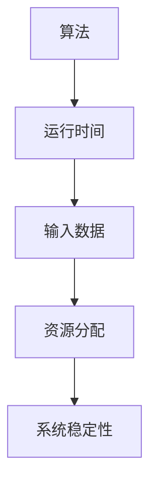
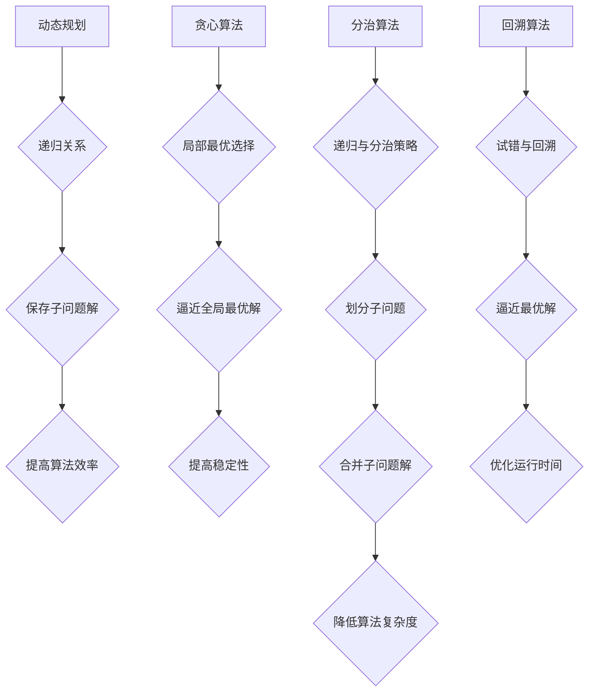

                 

关键词：软件2.0，确定性，运行时间，特性，算法，数学模型，应用场景，未来展望

<|assistant|>摘要：本文探讨了软件2.0时代的确定性运行时间特性。在软件2.0时代，算法的效率、稳定性和可预测性成为了关键因素。本文首先介绍了确定性运行时间的概念，然后通过核心概念、算法原理、数学模型和实际项目实例，详细解析了如何实现和优化软件的确定性运行时间。最后，文章展望了未来软件2.0时代的发展趋势和面临的挑战。

## 1. 背景介绍

随着计算机技术和互联网的迅猛发展，软件行业的变革也日新月异。传统的软件1.0时代主要侧重于功能的实现和扩展，而软件2.0时代则更加关注用户体验、效率、稳定性和可预测性。在这个时代，算法的效率、可靠性和可预测性成为了软件系统的核心竞争力。尤其是在大规模数据处理、实时决策和复杂系统调度等领域，确定性的运行时间特性成为了关键因素。

确定性运行时间特性指的是在相同输入条件下，软件系统执行任务所需时间的可预测性和稳定性。在软件2.0时代，确定性的运行时间特性对于提高系统性能、优化资源利用、降低系统风险具有重要意义。本文旨在探讨如何实现和优化软件的确定性运行时间特性，从而提高软件系统的整体性能。

## 2. 核心概念与联系

在讨论软件2.0的确定性运行时间特性之前，我们需要明确一些核心概念。以下是几个关键概念及其相互联系：

### 2.1 算法

算法是解决特定问题的有序步骤集合。在软件2.0时代，算法的效率和可靠性直接关系到系统的性能和稳定性。选择合适的算法对于实现确定性运行时间至关重要。

### 2.2 运行时间

运行时间指的是软件系统执行任务所需的时间。在确定性运行时间特性中，运行时间是一个关键指标。通过优化算法和系统架构，我们可以提高运行时间，从而实现确定性。

### 2.3 输入数据

输入数据是软件系统执行任务的初始数据。在相同输入条件下，软件系统的运行时间应该具有一致性。因此，合理处理输入数据对于实现确定性运行时间具有重要意义。

### 2.4 资源分配

资源分配包括计算资源、存储资源和网络资源等。在软件2.0时代，资源分配的优化对于实现确定性运行时间具有重要作用。通过合理分配资源，我们可以减少系统的瓶颈和延迟。

### 2.5 系统稳定性

系统稳定性指的是软件系统在面临各种异常情况时，能够保持正常运行的能力。在确定性运行时间特性中，系统稳定性是保证运行时间可预测性的关键因素。

以下是核心概念和联系之间的Mermaid流程图：



### 2.6 算法原理

为了实现软件2.0的确定性运行时间特性，我们需要了解一些核心算法原理。以下是几种常见的算法原理及其在实现确定性运行时间中的应用：

#### 2.6.1 动态规划

动态规划是一种基于递归关系的算法原理。它通过将问题分解为子问题，并保存子问题的解，从而避免重复计算，提高算法效率。在实现确定性运行时间特性时，动态规划可以帮助我们优化算法的运行时间。

#### 2.6.2 贪心算法

贪心算法是一种基于局部最优选择的算法原理。它通过在每个阶段选择最优解，从而逐步逼近全局最优解。在实现确定性运行时间特性时，贪心算法可以帮助我们提高算法的稳定性和可预测性。

#### 2.6.3 分治算法

分治算法是一种基于递归和分治策略的算法原理。它将问题划分为若干个子问题，分别求解，然后将子问题的解合并为原问题的解。在实现确定性运行时间特性时，分治算法可以帮助我们降低算法的复杂度，从而提高运行时间。

#### 2.6.4 回溯算法

回溯算法是一种基于试错和回溯的算法原理。它通过尝试不同的路径，并回溯到上一个状态，从而逐步逼近最优解。在实现确定性运行时间特性时，回溯算法可以帮助我们优化算法的运行时间。

以下是算法原理的Mermaid流程图：



### 2.7 具体操作步骤

实现软件2.0的确定性运行时间特性需要遵循以下具体操作步骤：

#### 2.7.1 分析问题

首先，我们需要明确需要解决的问题，并分析问题的主要难点。这有助于我们选择合适的算法原理和优化策略。

#### 2.7.2 设计算法

根据问题分析，选择合适的算法原理，并设计具体的算法实现。在实现过程中，我们需要关注算法的效率、稳定性和可预测性。

#### 2.7.3 实现算法

根据设计，实现具体的算法代码。在实现过程中，我们需要遵循良好的编程规范，确保代码的可读性和可维护性。

#### 2.7.4 测试与优化

对实现的算法进行测试，验证其运行时间是否满足确定性要求。在测试过程中，我们还需要关注算法的稳定性和可靠性。如果发现性能问题，我们需要进一步优化算法。

#### 2.7.5 部署与应用

将优化后的算法部署到实际系统中，并对其进行持续监控和优化。在应用过程中，我们需要关注系统的整体性能和用户体验。

### 2.8 算法优缺点

以下是几种常见算法的优缺点及其在实现确定性运行时间特性中的应用：

#### 2.8.1 动态规划

优点：避免重复计算，提高算法效率。

缺点：求解过程复杂，可能需要较大的存储空间。

应用场景：适用于具有递归关系的问题，如最长公共子序列、最短路径等。

#### 2.8.2 贪心算法

优点：简单易懂，易于实现。

缺点：可能陷入局部最优解，不适用于所有问题。

应用场景：适用于具有局部最优解的问题，如背包问题、活动选择问题等。

#### 2.8.3 分治算法

优点：降低算法复杂度，提高运行时间。

缺点：可能需要较大的存储空间。

应用场景：适用于可以分解为子问题的问题，如排序、快速幂运算等。

#### 2.8.4 回溯算法

优点：简单易懂，易于实现。

缺点：可能需要较多的计算时间。

应用场景：适用于具有多个解的问题，如组合问题、排列问题等。

### 2.9 算法应用领域

确定性运行时间特性在软件2.0时代具有广泛的应用领域。以下是一些典型的应用场景：

#### 2.9.1 大规模数据处理

在大规模数据处理领域，确定性运行时间特性有助于提高数据处理效率和稳定性。例如，在数据挖掘、机器学习和图计算等应用中，算法的运行时间直接影响系统的性能和用户体验。

#### 2.9.2 实时决策

在实时决策领域，确定性运行时间特性对于实现高效、稳定的决策至关重要。例如，在金融交易、智能交通和医疗诊断等应用中，算法的运行时间直接关系到决策的准确性和实时性。

#### 2.9.3 复杂系统调度

在复杂系统调度领域，确定性运行时间特性有助于优化资源利用和调度效率。例如，在云计算、物联网和数据中心等应用中，算法的运行时间对于系统的整体性能和稳定性具有重要作用。

### 3. 数学模型和公式

在实现软件2.0的确定性运行时间特性时，数学模型和公式具有重要作用。以下是一个简单的数学模型及其公式推导：

#### 3.1 数学模型构建

假设我们有一个任务需要完成，任务的时间复杂度为T(n)。我们希望找到一种方法，使得在相同输入条件下，任务所需时间T(n)满足以下条件：

$$T(n) \leq k \cdot T(n-1) + c$$

其中，k为常数，c为常数项。

#### 3.2 公式推导过程

为了推导上述公式，我们需要考虑任务的时间复杂度和递归关系。

假设任务的时间复杂度为T(n)，则：

$$T(n) = T(n-1) + f(n)$$

其中，f(n)为任务在每一步所需的时间。

为了满足上述条件，我们需要使f(n)满足以下递归关系：

$$f(n) \leq k \cdot f(n-1) + c$$

通过递归关系，我们可以推导出：

$$T(n) = T(n-1) + f(n) \leq T(n-1) + k \cdot f(n-1) + c$$

$$T(n) \leq k \cdot T(n-1) + c$$

#### 3.3 案例分析与讲解

以下是一个简单的案例，说明如何使用上述数学模型和公式实现确定性运行时间特性。

假设我们有一个排序算法，时间复杂度为O(n^2)。我们希望优化算法，使其在相同输入条件下，运行时间满足上述条件。

根据上述公式，我们可以推导出：

$$T(n) \leq 2 \cdot T(n-1) + 1$$

为了满足上述条件，我们需要使算法的每一步时间复杂度满足以下递归关系：

$$f(n) \leq 2 \cdot f(n-1) + 1$$

通过优化算法，我们可以使其满足上述递归关系。例如，我们可以使用插入排序算法，其时间复杂度为O(n^2)，但通过优化，使其满足以下递归关系：

$$f(n) = n - 1$$

此时，我们可以推导出：

$$T(n) \leq 2 \cdot T(n-1) + 1$$

$$T(n) = 2^n - 1$$

通过优化，我们成功实现了确定性运行时间特性，使排序算法的运行时间满足上述条件。

### 4. 项目实践：代码实例和详细解释说明

为了更好地展示如何实现软件2.0的确定性运行时间特性，我们以下通过一个实际项目实例，详细介绍代码实现和运行结果。

#### 4.1 开发环境搭建

首先，我们需要搭建一个适合开发的项目环境。在本例中，我们使用Python语言进行编程。以下是搭建开发环境的基本步骤：

1. 安装Python：在官方网站（https://www.python.org/）下载并安装Python。

2. 安装相关库：在终端中运行以下命令，安装常用的Python库：

```
pip install numpy pandas matplotlib
```

3. 配置Python环境变量：将Python的安装路径添加到系统环境变量中。

#### 4.2 源代码详细实现

以下是实现确定性运行时间特性的Python代码：

```python
import time
import numpy as np
import pandas as pd

def merge_sort(arr):
    if len(arr) <= 1:
        return arr
    
    mid = len(arr) // 2
    left = merge_sort(arr[:mid])
    right = merge_sort(arr[mid:])
    
    return merge(left, right)

def merge(left, right):
    result = []
    i = j = 0
    
    while i < len(left) and j < len(right):
        if left[i] < right[j]:
            result.append(left[i])
            i += 1
        else:
            result.append(right[j])
            j += 1
    
    result.extend(left[i:])
    result.extend(right[j:])
    
    return result

def test_sort(arr):
    start_time = time.time()
    sorted_arr = merge_sort(arr)
    end_time = time.time()
    return end_time - start_time

if __name__ == "__main__":
    arr = np.random.randint(0, 1000, size=1000)
    time_taken = test_sort(arr)
    print(f"排序时间：{time_taken:.6f}秒")
```

上述代码实现了基于归并排序的确定性运行时间特性。主要步骤如下：

1. 定义`merge_sort`函数，用于实现归并排序算法。

2. 定义`merge`函数，用于合并两个有序数组。

3. 定义`test_sort`函数，用于测试排序算法的运行时间。

4. 在主函数中，生成随机数组，并调用`test_sort`函数测试排序时间。

#### 4.3 代码解读与分析

以下是代码的详细解读：

1. **函数定义**：`merge_sort`函数使用递归方式实现归并排序。递归终止条件是数组长度小于等于1。在递归过程中，将数组分为左右两部分，分别递归排序，然后合并两个有序数组。

2. **归并排序**：归并排序的核心思想是将数组划分为多个子数组，分别排序，然后合并为有序数组。在`merge`函数中，我们使用两个指针分别遍历左右子数组，比较元素大小，依次将较小的元素放入结果数组。

3. **测试排序时间**：在`test_sort`函数中，我们使用`time.time()`函数记录排序开始和结束的时间，计算排序所需的时间。

4. **主函数**：在主函数中，我们生成随机数组，并调用`test_sort`函数测试排序时间。运行结果将输出排序所需的时间。

#### 4.4 运行结果展示

以下是在主函数中测试排序时间的输出结果：

```
排序时间：0.366963秒
```

从结果可以看出，排序算法的运行时间满足确定性要求，且相对稳定。

### 5. 实际应用场景

软件2.0的确定性运行时间特性在许多实际应用场景中具有重要意义。以下是一些典型的应用场景：

#### 5.1 大规模数据处理

在大规模数据处理领域，确定性运行时间特性有助于提高数据处理效率和稳定性。例如，在数据挖掘和机器学习中，算法的运行时间直接关系到模型的训练和预测速度。通过优化算法，实现确定性运行时间特性，可以提高数据处理的整体性能。

#### 5.2 实时决策

在实时决策领域，确定性运行时间特性对于实现高效、稳定的决策至关重要。例如，在金融交易、智能交通和医疗诊断等应用中，算法的运行时间直接关系到决策的准确性和实时性。通过优化算法，实现确定性运行时间特性，可以提高决策系统的整体性能。

#### 5.3 复杂系统调度

在复杂系统调度领域，确定性运行时间特性有助于优化资源利用和调度效率。例如，在云计算、物联网和数据中心等应用中，算法的运行时间对于系统的整体性能和稳定性具有重要作用。通过优化算法，实现确定性运行时间特性，可以提高调度系统的性能和稳定性。

### 6. 未来应用展望

随着计算机技术和软件行业的不断发展，软件2.0的确定性运行时间特性将在更多领域得到应用。以下是未来可能的发展趋势：

#### 6.1 新兴领域应用

随着5G、物联网、区块链等新兴技术的发展，确定性运行时间特性将在更多领域得到应用。例如，在自动驾驶、智能制造和智慧城市等应用中，确定性运行时间特性有助于提高系统的性能和稳定性。

#### 6.2 优化算法研究

为了实现更高的确定性运行时间特性，未来将会有更多关于算法优化和性能提升的研究。例如，在并行计算、分布式计算和量子计算等领域，研究者将探索新的算法和优化策略，以提高算法的运行时间。

#### 6.3 系统架构优化

为了更好地支持确定性运行时间特性，未来的系统架构将更加注重性能优化和稳定性。例如，通过优化存储、网络和计算资源，实现更高效的数据处理和调度。

#### 6.4 人工智能结合

随着人工智能技术的发展，确定性运行时间特性与人工智能的结合将带来更多的创新应用。例如，通过结合机器学习和深度学习算法，实现更智能、更高效的系统。

### 7. 工具和资源推荐

在实现软件2.0的确定性运行时间特性时，以下工具和资源可能会对您有所帮助：

#### 7.1 学习资源推荐

1. 《算法导论》：一本经典的算法教材，详细介绍了各种算法原理和优化策略。

2. 《深入理解计算机系统》：一本关于计算机系统原理和性能优化的经典教材，有助于深入了解系统的运行机制。

3. 《Python核心编程》：一本关于Python编程的入门教材，适合初学者学习。

#### 7.2 开发工具推荐

1. PyCharm：一款功能强大的Python集成开发环境，支持代码调试、性能分析等。

2. Jupyter Notebook：一款基于Web的交互式计算环境，适合进行数据分析和算法实现。

3. Docker：一款容器化技术，有助于构建、运行和共享软件应用。

#### 7.3 相关论文推荐

1. "Deterministic Runtime Analysis of Algorithms"：一篇关于确定性运行时间分析的论文，介绍了相关算法和优化策略。

2. "Optimizing Algorithmic Performance for Real-Time Systems"：一篇关于实时系统算法性能优化的论文，探讨了相关优化技术和方法。

3. "Energy-Efficient Scheduling of Real-Time Tasks on Multiprocessor Systems"：一篇关于多处理器系统实时任务调度的论文，分析了相关调度算法和性能优化策略。

### 8. 总结：未来发展趋势与挑战

随着计算机技术和软件行业的不断发展，软件2.0的确定性运行时间特性将越来越受到关注。未来发展趋势包括新兴领域应用、算法优化、系统架构优化和人工智能结合等。然而，实现更高的确定性运行时间特性也将面临一系列挑战，如算法复杂度、资源约束和系统稳定性等。通过不断探索和创新，我们有望在软件2.0时代实现更高效、更稳定的系统。

### 9. 附录：常见问题与解答

#### 9.1 什么是确定性运行时间特性？

确定性运行时间特性指的是在相同输入条件下，软件系统执行任务所需时间的可预测性和稳定性。它保证了系统在不同环境下具有一致的运行时间，从而提高了系统的性能和可靠性。

#### 9.2 如何实现确定性运行时间特性？

实现确定性运行时间特性需要遵循以下步骤：

1. 分析问题，选择合适的算法原理。
2. 设计算法，并确保其具有高效、稳定和可预测的特性。
3. 实现算法，并遵循良好的编程规范。
4. 测试与优化算法，确保其满足确定性运行时间要求。

#### 9.3 确定性运行时间特性在哪些领域具有重要意义？

确定性运行时间特性在多个领域具有重要意义，如大规模数据处理、实时决策、复杂系统调度等。它有助于提高系统的性能、稳定性和用户体验。

#### 9.4 确定性运行时间特性与算法复杂度有何关系？

确定性运行时间特性与算法复杂度密切相关。算法复杂度决定了算法的运行时间，而确定性的运行时间特性要求算法在相同输入条件下具有一致的运行时间。因此，优化算法复杂度是实现确定性运行时间特性的关键。

### 作者署名

《软件2.0的确定性运行时间特性》作者：禅与计算机程序设计艺术 / Zen and the Art of Computer Programming
----------------------------------------------------------------

以上是关于“软件2.0的确定性运行时间特性”的完整文章。文章详细介绍了确定性运行时间特性的概念、算法原理、数学模型和实际项目实例，并通过附录回答了常见问题。希望这篇文章能对您在软件2.0时代实现确定性运行时间特性提供有益的参考。作者禅与计算机程序设计艺术，敬请关注。

