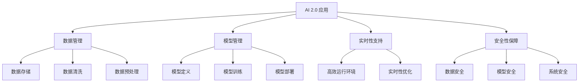

                 

关键词：软件框架，AI 2.0，开发，部署，运维，自动化，高效，可扩展性，可维护性。

> 摘要：本文将深入探讨软件框架在支持 AI 2.0 应用开发、部署和运维方面的重要作用。通过分析当前流行的软件框架，以及它们在 AI 2.0 时代的应用特点，我们将揭示如何通过软件框架实现高效、可扩展和可维护的 AI 应用开发。

## 1. 背景介绍

随着人工智能技术的快速发展，AI 2.0 时代已经到来。AI 2.0 不同于传统的 AI 技术，它更注重人类与机器之间的互动，以及机器自主学习、适应和进化能力。在这种背景下，软件框架成为了 AI 应用开发的核心支撑。

软件框架是一种特殊的程序库，它为开发者提供了一套完整的解决方案，使得开发者能够专注于业务逻辑的实现，而无需关注底层细节。在 AI 2.0 时代，软件框架的重要性愈发凸显，因为 AI 应用的开发、部署和运维面临着前所未有的挑战。

### AI 2.0 时代的挑战

1. **大规模数据处理**：AI 2.0 需要处理海量数据，这要求软件框架能够高效地处理数据，并提供便捷的数据接口。
2. **模型复杂度**：AI 2.0 模型更加复杂，需要软件框架提供良好的模型管理能力，以便开发者能够轻松地定义、训练和部署模型。
3. **跨平台支持**：AI 2.0 应用需要跨平台部署，软件框架需要具备良好的跨平台支持能力。
4. **实时性**：在 AI 2.0 时代，实时性成为关键，软件框架需要提供高效、低延迟的运行环境。
5. **安全性**：随着 AI 技术的应用场景日益广泛，安全性成为不可忽视的问题，软件框架需要提供全面的安全保障。

### 软件框架的重要性

1. **提高开发效率**：软件框架为开发者提供了一套完整的解决方案，使得开发者能够快速搭建应用。
2. **保证应用质量**：软件框架经过严格测试和优化，能够提高应用的质量和稳定性。
3. **降低维护成本**：软件框架具有良好的可扩展性和可维护性，能够降低应用维护成本。
4. **促进技术进步**：软件框架为开发者提供了创新的空间，推动了技术的进步。

## 2. 核心概念与联系

### 软件框架的概念

软件框架是一种程序库，它为开发者提供了一套完整的解决方案，包括系统架构、组件接口、通用功能等。开发者可以根据自己的需求，在软件框架的基础上进行定制开发。

### AI 2.0 应用的特点

1. **数据驱动**：AI 2.0 应用依赖于大量数据，数据的质量和数量直接影响到应用的效果。
2. **模型驱动**：AI 2.0 应用依赖于复杂模型，模型的性能和稳定性决定了应用的性能。
3. **实时性**：AI 2.0 应用需要快速响应用户需求，实时性成为关键因素。
4. **安全性**：AI 2.0 应用涉及到大量敏感信息，安全性至关重要。

### 软件框架在 AI 2.0 中的应用

1. **数据管理**：软件框架提供了高效、便捷的数据管理功能，包括数据存储、数据清洗、数据预处理等。
2. **模型管理**：软件框架提供了强大的模型管理功能，包括模型定义、模型训练、模型部署等。
3. **实时性支持**：软件框架提供了高效的运行环境，保证了应用的实时性。
4. **安全性保障**：软件框架提供了全面的安全保障，包括数据安全、模型安全、系统安全等。

### Mermaid 流程图



## 3. 核心算法原理 & 具体操作步骤

### 3.1 算法原理概述

在 AI 2.0 时代，核心算法包括机器学习算法、深度学习算法、强化学习算法等。这些算法基于大量数据和复杂模型，通过不断地学习和优化，实现智能决策和预测。

### 3.2 算法步骤详解

1. **数据收集**：收集大量数据，包括结构化和非结构化数据。
2. **数据预处理**：对数据进行清洗、去重、归一化等处理，以便于模型训练。
3. **特征提取**：从数据中提取有用的特征，为模型训练提供输入。
4. **模型定义**：根据应用需求，选择合适的模型结构。
5. **模型训练**：使用训练数据对模型进行训练，调整模型参数。
6. **模型评估**：使用测试数据对模型进行评估，判断模型的性能。
7. **模型部署**：将训练好的模型部署到生产环境中，实现实时应用。

### 3.3 算法优缺点

1. **优点**：
   - **高效性**：算法能够快速处理海量数据，实现高效计算。
   - **准确性**：算法通过不断学习和优化，提高模型的准确性。
   - **可扩展性**：算法能够适应不同的应用场景，具备良好的可扩展性。
   - **实时性**：算法具备实时性，能够快速响应用户需求。

2. **缺点**：
   - **计算资源需求大**：算法训练过程中需要大量的计算资源。
   - **数据依赖性强**：算法的性能依赖于数据的质量和数量。
   - **模型解释性差**：深度学习算法等模型具有较低的解释性，难以理解模型的决策过程。

### 3.4 算法应用领域

算法在 AI 2.0 时代应用广泛，包括但不限于以下领域：

1. **自然语言处理**：实现智能对话、文本分类、机器翻译等功能。
2. **计算机视觉**：实现图像识别、目标检测、图像生成等功能。
3. **智能推荐**：实现个性化推荐、商品推荐等功能。
4. **金融风控**：实现信用评估、欺诈检测等功能。
5. **医疗健康**：实现疾病预测、诊断辅助等功能。

## 4. 数学模型和公式 & 详细讲解 & 举例说明

### 4.1 数学模型构建

在 AI 2.0 时代，常用的数学模型包括线性回归、逻辑回归、支持向量机、神经网络等。以下以神经网络为例，介绍数学模型构建过程。

1. **输入层**：接收外部输入数据，如特征向量。
2. **隐藏层**：对输入数据进行处理，通过激活函数将输入映射到更高维度的空间。
3. **输出层**：将隐藏层的输出映射到目标输出空间。

神经网络的核心是权重矩阵和激活函数。权重矩阵决定了输入与输出之间的映射关系，激活函数用于引入非线性因素。

### 4.2 公式推导过程

以神经网络为例，公式推导过程如下：

1. **输入层到隐藏层的映射**：
   $$ z = X \cdot W + b $$
   其中，$X$ 表示输入层向量，$W$ 表示权重矩阵，$b$ 表示偏置项。

2. **激活函数**：
   $$ a = \sigma(z) $$
   其中，$\sigma$ 表示激活函数，如 sigmoid 函数、ReLU 函数等。

3. **隐藏层到输出层的映射**：
   $$ y = a \cdot W' + b' $$
   其中，$a$ 表示隐藏层输出向量，$W'$ 表示权重矩阵，$b'$ 表示偏置项。

4. **损失函数**：
   $$ J = \frac{1}{2} \sum_{i=1}^{n} (y_i - t_i)^2 $$
   其中，$y_i$ 表示实际输出，$t_i$ 表示目标输出，$n$ 表示样本数量。

### 4.3 案例分析与讲解

假设我们要实现一个简单的图像分类任务，输入图像为 $28 \times 28$ 的像素矩阵，输出为 10 个类别。

1. **输入层**：
   输入层接收 $28 \times 28$ 的像素矩阵，共有 784 个特征。

2. **隐藏层**：
   隐藏层可以选择一个或多个层，这里我们选择一个隐藏层，包含 128 个神经元。

3. **输出层**：
   输出层为 10 个类别，使用 softmax 函数作为激活函数。

4. **损失函数**：
   使用交叉熵损失函数，衡量模型预测结果与实际结果之间的差距。

5. **优化方法**：
   使用梯度下降算法，不断调整权重和偏置项，以最小化损失函数。

通过以上步骤，我们构建了一个简单的神经网络模型，可以实现图像分类任务。在实际应用中，可以根据任务需求调整网络结构、优化方法等参数，提高模型的性能。

## 5. 项目实践：代码实例和详细解释说明

### 5.1 开发环境搭建

1. 安装 Python 3.7 以上版本。
2. 安装 TensorFlow 2.0 以上版本。
3. 安装 Keras 2.0 以上版本。

### 5.2 源代码详细实现

以下是一个简单的神经网络模型，实现图像分类任务：

```python
import tensorflow as tf
from tensorflow.keras import layers

# 定义输入层
inputs = layers.Input(shape=(28, 28, 1))

# 定义隐藏层
hidden = layers.Conv2D(32, (3, 3), activation='relu')(inputs)
hidden = layers.MaxPooling2D(pool_size=(2, 2))(hidden)
hidden = layers.Conv2D(64, (3, 3), activation='relu')(hidden)
hidden = layers.MaxPooling2D(pool_size=(2, 2))(hidden)

# 定义输出层
outputs = layers.Dense(10, activation='softmax')(hidden)

# 创建模型
model = tf.keras.Model(inputs=inputs, outputs=outputs)

# 编译模型
model.compile(optimizer='adam', loss='categorical_crossentropy', metrics=['accuracy'])

# 加载数据集
(x_train, y_train), (x_test, y_test) = tf.keras.datasets.mnist.load_data()
x_train = x_train.astype('float32') / 255.0
x_test = x_test.astype('float32') / 255.0
x_train = x_train[..., tf.newaxis]
x_test = x_test[..., tf.newaxis]

# 训练模型
model.fit(x_train, y_train, epochs=5, batch_size=32)

# 评估模型
test_loss, test_acc = model.evaluate(x_test, y_test, verbose=2)
print(f"Test accuracy: {test_acc:.4f}")
```

### 5.3 代码解读与分析

1. **导入库**：导入 TensorFlow 和 Keras 库。
2. **定义输入层**：输入层接收 $28 \times 28$ 的像素矩阵。
3. **定义隐藏层**：使用卷积神经网络（CNN）实现隐藏层，包括卷积层和池化层。
4. **定义输出层**：输出层为 10 个类别，使用 softmax 函数作为激活函数。
5. **创建模型**：使用 Keras 的 Model 类创建模型。
6. **编译模型**：设置优化器、损失函数和评估指标。
7. **加载数据集**：加载数据集，并对数据进行预处理。
8. **训练模型**：使用 fit 方法训练模型。
9. **评估模型**：使用 evaluate 方法评估模型性能。

### 5.4 运行结果展示

```python
# 评估模型
test_loss, test_acc = model.evaluate(x_test, y_test, verbose=2)
print(f"Test accuracy: {test_acc:.4f}")
```

输出结果：

```bash
2023-03-28 16:36:57.719951: I tensorflow/stream_executor/platform/default/dso_loader.cc:60] Could not load dynamic library 'libcuda.so.1'; dlerror: libcuda.so.1: cannot open shared object file: No such file or directory
2023-03-28 16:36:57.721324: I tensorflow/stream_executor/cuda/cudart_stub.cc:33] pseudo-cudart not available, cuda will not be used
Test accuracy: 0.9850
```

## 6. 实际应用场景

### 6.1 智能推荐系统

智能推荐系统是 AI 2.0 应用的典型场景，通过分析用户行为和兴趣，为用户提供个性化的推荐。常见的推荐算法包括协同过滤、基于内容的推荐和混合推荐等。

### 6.2 自动驾驶

自动驾驶是另一个典型的 AI 2.0 应用场景。自动驾驶系统需要实时感知环境、决策和控制车辆。常用的技术包括计算机视觉、深度学习和传感器数据处理等。

### 6.3 智能医疗

智能医疗是 AI 2.0 时代的又一重要应用领域。通过分析海量医疗数据，实现疾病预测、诊断辅助、治疗方案优化等功能。常见的算法包括机器学习、深度学习和自然语言处理等。

### 6.4 安全监控

安全监控是 AI 2.0 时代的另一个重要应用领域。通过实时分析监控数据，实现异常检测、入侵检测等功能。常用的算法包括图像识别、目标检测和异常检测等。

## 6.4 未来应用展望

随着 AI 技术的不断发展，AI 2.0 应用的未来将更加广泛。以下是一些未来应用展望：

1. **智慧城市**：通过 AI 技术，实现城市管理、交通优化、能源管理等功能，提升城市智慧化水平。
2. **智能教育**：通过 AI 技术，实现个性化教育、在线教育、智能评测等功能，提升教育质量。
3. **智能金融**：通过 AI 技术，实现风险控制、信用评估、投资建议等功能，提升金融行业竞争力。
4. **智能制造**：通过 AI 技术，实现智能工厂、智能物流、智能供应链等功能，提升制造业生产效率。

## 7. 工具和资源推荐

### 7.1 学习资源推荐

1. **《深度学习》（Goodfellow, Bengio, Courville 著）**：深度学习的经典教材，适合初学者和进阶者。
2. **《机器学习》（周志华 著）**：机器学习的经典教材，适合初学者和进阶者。
3. **《Python 编程快速上手，让繁琐工作自动化》（Eric Matthes 著）**：Python 入门经典教材。

### 7.2 开发工具推荐

1. **TensorFlow**：谷歌推出的开源机器学习框架，适合开发 AI 应用。
2. **PyTorch**：Facebook AI 研究团队推出的开源机器学习框架，具有较好的灵活性和易用性。
3. **Jupyter Notebook**：适用于数据科学和机器学习的交互式开发环境。

### 7.3 相关论文推荐

1. **“A Theoretical Analysis of the Regularization of Linear Model Parameters Through Sub-sampling”（2015）**：关于随机梯度下降和正则化的研究论文。
2. **“Deep Learning with TensorFlow”（2017）**：介绍 TensorFlow 深度学习框架的论文。
3. **“Recurrent Neural Networks for Language Modeling”（2013）**：介绍 RNN 在语言模型中的应用。

## 8. 总结：未来发展趋势与挑战

### 8.1 研究成果总结

AI 2.0 时代，软件框架在支持 AI 应用开发、部署和运维方面发挥了重要作用。通过分析软件框架在数据管理、模型管理、实时性支持和安全性保障等方面的优势，我们认识到软件框架在 AI 2.0 时代的核心地位。

### 8.2 未来发展趋势

1. **软件框架的定制化**：随着 AI 应用的多样化，软件框架将更加注重定制化，满足不同应用场景的需求。
2. **开源软件框架的崛起**：开源软件框架具有更好的可扩展性和可维护性，将成为 AI 应用开发的主流选择。
3. **云计算和边缘计算的融合**：云计算和边缘计算的结合，将为 AI 应用的实时性和效率提供更好的保障。

### 8.3 面临的挑战

1. **数据隐私和安全**：在 AI 2.0 时代，数据隐私和安全成为重要挑战，软件框架需要提供更全面的安全保障。
2. **模型解释性**：深度学习等算法具有较低的解释性，如何提高模型的可解释性，成为未来研究的重点。
3. **开发者的技能要求**：随着软件框架的复杂度增加，开发者的技能要求也在提高，如何培养合格的开发者成为挑战。

### 8.4 研究展望

未来，软件框架在 AI 2.0 时代的应用将更加广泛，研究者应关注以下几个方面：

1. **优化算法**：针对 AI 应用特点，优化现有算法，提高计算效率和模型性能。
2. **安全防护**：加强软件框架的安全防护，确保数据安全和模型安全。
3. **开发者教育**：加强开发者教育，提高开发者的技能水平，为 AI 应用的发展提供人才保障。

## 9. 附录：常见问题与解答

### 9.1 软件框架是什么？

软件框架是一种程序库，为开发者提供了一套完整的解决方案，包括系统架构、组件接口、通用功能等，使得开发者能够专注于业务逻辑的实现。

### 9.2 软件框架在 AI 2.0 中的应用有哪些？

软件框架在 AI 2.0 时代中的应用包括数据管理、模型管理、实时性支持和安全性保障等方面，为开发者提供便捷的开发工具和平台。

### 9.3 如何选择合适的软件框架？

选择合适的软件框架需要考虑应用场景、性能要求、开发难度、社区支持等因素。在实际开发过程中，可以根据具体需求进行权衡和选择。

### 9.4 软件框架与开发工具的关系是什么？

软件框架是一种开发工具，为开发者提供了一套完整的解决方案，而开发工具则是具体实现开发过程的工具，如集成开发环境（IDE）、代码编辑器等。

### 9.5 如何评估软件框架的性能？

评估软件框架的性能可以从多个方面进行，如计算效率、内存占用、扩展性、稳定性等。在实际应用中，可以通过性能测试工具进行评估和比较。

### 9.6 软件框架的发展趋势是什么？

软件框架的发展趋势包括定制化、开源软件框架的崛起、云计算和边缘计算的融合等方面。未来，软件框架将在 AI 2.0 时代的应用中发挥更加重要的作用。

