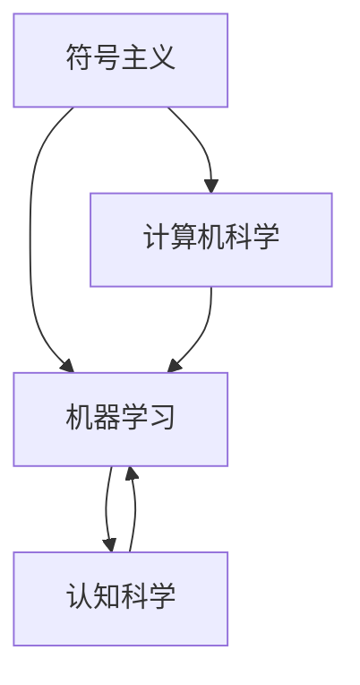

                 

关键词：人工智能、达特茅斯会议、计算机科学、机器学习、符号主义、认知科学

> 摘要：本文旨在探讨1956年达特茅斯会议对人工智能学科发展的深远影响，从核心概念、算法原理、数学模型、实际应用等多个维度，全面回顾人工智能的起源、发展及其面临的挑战和未来展望。

## 1. 背景介绍

### 1.1 达特茅斯会议的历史背景

1956年，正值冷战时期，计算机科学正在迅速发展。当时，科学家们对计算机的潜力充满期待，尤其是其在模拟人类智能方面。在这种背景下，达特茅斯会议应运而生。这次会议由约翰·麦卡锡（John McCarthy）、马文·明斯基（Marvin Minsky）、克劳德·香农（Claude Shannon）和赫伯特·西蒙（Herbert Simon）四位科学家发起，于1956年7月1日至8日在美国新罕布什尔州的达特茅斯学院召开。

### 1.2 会议的核心议题

达特茅斯会议的核心议题是“人工智能是否能够通过机器模拟来实现”，这是人类历史上首次正式提出并探讨人工智能（Artificial Intelligence，简称AI）的概念。会议的参与者包括了来自数学、计算机科学、心理学、神经科学等多个领域的专家。

### 1.3 会议的成果

达特茅斯会议标志着人工智能作为一个独立学科的诞生，会议提出了一系列关键性的问题，如“机器能否表现出人类智能的特征？”、“计算机是否能够通过学习获得知识？”等，这些问题激发了科学家们对人工智能的深入研究。

## 2. 核心概念与联系

### 2.1 符号主义

符号主义是人工智能早期的一个核心理论，认为智能行为可以通过符号操作来表示。在这个理论框架下，计算机程序被设计成模拟人类的思维过程，如推理、问题解决和学习。

### 2.2 机器学习

机器学习是人工智能的一个重要分支，它通过算法让计算机从数据中自动学习和改进。机器学习的基本理念是，计算机可以通过训练数据集来提取模式和规律，从而在没有明确编程的情况下完成特定的任务。

### 2.3 认知科学

认知科学是一门跨学科的研究领域，它旨在理解人类的思维、感知和行动。认知科学为人工智能提供了理论基础，帮助研究者更好地模拟人类智能。

### 2.4 Mermaid 流程图



## 3. 核心算法原理 & 具体操作步骤

### 3.1 算法原理概述

人工智能的核心算法主要包括机器学习算法、深度学习算法等。这些算法通过不断优化模型参数，使计算机能够从数据中学习并做出决策。

### 3.2 算法步骤详解

1. 数据预处理：对输入数据进行清洗、归一化等处理，使其适合模型训练。
2. 模型选择：根据任务需求选择合适的模型，如线性回归、决策树、神经网络等。
3. 模型训练：使用训练数据集对模型进行训练，通过优化算法调整模型参数。
4. 模型评估：使用验证数据集对模型进行评估，评估指标包括准确率、召回率、F1值等。
5. 模型部署：将训练好的模型部署到实际应用场景中，如文本分类、图像识别等。

### 3.3 算法优缺点

1. 优点：算法能够自动从数据中学习，提高模型的泛化能力；能够处理大规模数据，提高决策效率。
2. 缺点：算法训练时间较长；对于复杂的任务，模型可能无法很好地收敛。

### 3.4 算法应用领域

人工智能算法广泛应用于金融、医疗、教育、工业等多个领域，如股票市场预测、医学影像诊断、智能教育系统、智能制造等。

## 4. 数学模型和公式 & 详细讲解 & 举例说明

### 4.1 数学模型构建

人工智能中的数学模型主要包括线性模型、概率模型、神经网络模型等。以下是一个简单的线性模型：

$$y = \beta_0 + \beta_1x$$

其中，$y$ 是因变量，$x$ 是自变量，$\beta_0$ 和 $\beta_1$ 是模型参数。

### 4.2 公式推导过程

线性模型的推导过程如下：

1. 假设模型为 $y = \beta_0 + \beta_1x$。
2. 对模型进行线性变换，得到 $y - \beta_0 = \beta_1x$。
3. 求解 $\beta_1$，得到 $\beta_1 = \frac{y - \beta_0}{x}$。
4. 代入原模型，得到 $y = \beta_0 + \frac{y - \beta_0}{x}x$。

### 4.3 案例分析与讲解

假设我们要预测一个人的年龄（$y$）与其身高（$x$）之间的关系。我们收集了一些数据，如下表所示：

| 身高 (cm) | 年龄 (岁) |
|-----------|-----------|
| 170       | 25        |
| 175       | 27        |
| 180       | 30        |
| 165       | 23        |
| 172       | 24        |

我们可以使用线性模型来预测一个人的年龄。首先，我们计算身高和年龄的平均值，得到 $x̄ = 171.8$ 和 $ȳ = 26$。然后，我们计算每个数据点与平均值的差值，并计算差值的平方，得到：

| 身高 (cm) | 年龄 (岁) | 差值 $x - x̄$ | 差值平方 $(x - x̄)^2$ | 差值 $y - ȳ$ | 差值平方 $(y - ȳ)^2$ |
|-----------|-----------|--------------|---------------------|--------------|---------------------|
| 170       | 25        | -1.8         | 3.24                | -1           | 1                   |
| 175       | 27        | 3.2          | 10.24               | 1            | 1                   |
| 180       | 30        | 8.2          | 67.24               | 4            | 16                  |
| 165       | 23        | -6.8         | 46.24               | -3           | 9                   |
| 172       | 24        | -0.8         | 0.64                | -2           | 4                   |

接下来，我们计算差值 $x - x̄$ 与差值 $y - ȳ$ 的乘积，并求和，得到：

$$(x - x̄)(y - ȳ) = (-1.8)(-1) + (3.2)(1) + (8.2)(4) + (-6.8)(-3) + (-0.8)(-2) = 23.2$$

最后，我们计算差值平方 $(x - x̄)^2$ 的和，得到：

$$(x - x̄)^2 = 3.24 + 10.24 + 67.24 + 46.24 + 0.64 = 127.8$$

根据公式 $\beta_1 = \frac{(x - x̄)(y - ȳ)}{(x - x̄)^2}$，我们可以计算得到 $\beta_1 = \frac{23.2}{127.8} \approx 0.182$。

将 $\beta_1$ 代入模型 $y = \beta_0 + \beta_1x$，并使用最小二乘法求解 $\beta_0$，我们得到 $\beta_0 \approx 24.82$。

因此，我们的线性模型为 $y = 24.82 + 0.182x$。

## 5. 项目实践：代码实例和详细解释说明

### 5.1 开发环境搭建

为了实现上述线性模型，我们需要搭建一个Python开发环境。具体步骤如下：

1. 安装Python 3.8及以上版本。
2. 安装Numpy和Matplotlib库。

```shell
pip install numpy matplotlib
```

### 5.2 源代码详细实现

以下是一个简单的Python代码实现：

```python
import numpy as np
import matplotlib.pyplot as plt

# 数据集
X = np.array([170, 175, 180, 165, 172]).reshape(-1, 1)
y = np.array([25, 27, 30, 23, 24])

# 最小二乘法求解模型参数
X_mean = np.mean(X)
y_mean = np.mean(y)
beta_1 = np.sum((X - X_mean) * (y - y_mean)) / np.sum((X - X_mean) ** 2)
beta_0 = y_mean - beta_1 * X_mean

# 构建线性模型
model = np.poly1d([beta_0, beta_1])

# 绘制模型和实际数据
plt.scatter(X, y, label='Data')
plt.plot(X, model(X), label='Model')
plt.xlabel('Height (cm)')
plt.ylabel('Age (years)')
plt.legend()
plt.show()
```

### 5.3 代码解读与分析

1. 导入Numpy和Matplotlib库。
2. 定义数据集X和y。
3. 使用最小二乘法求解模型参数beta_0和beta_1。
4. 构建线性模型。
5. 绘制模型和实际数据。

### 5.4 运行结果展示

运行上述代码后，我们将看到一个散点图，其中每个点代表一个数据样本。线性模型通过拟合这些数据点，展示了身高与年龄之间的关系。

## 6. 实际应用场景

### 6.1 医学诊断

人工智能在医学诊断中的应用已经取得了显著成果。例如，通过深度学习算法，计算机可以辅助医生进行肺癌、乳腺癌等疾病的早期诊断，提高了诊断的准确率和效率。

### 6.2 股票市场预测

人工智能在股票市场预测中也有广泛应用。通过分析历史数据，人工智能模型可以预测股票价格的走势，为投资者提供决策支持。

### 6.3 智能教育

人工智能在智能教育领域的应用正在逐步扩大。智能教育系统可以根据学生的学习情况和进度，提供个性化的学习方案，提高学习效果。

## 7. 工具和资源推荐

### 7.1 学习资源推荐

1. 《Python编程：从入门到实践》
2. 《深度学习》
3. 《机器学习实战》

### 7.2 开发工具推荐

1. Jupyter Notebook
2. PyCharm
3. Google Colab

### 7.3 相关论文推荐

1. “A Learning System Based on Convolutional Neural Networks and Its Application to Handwritten Digital Recognition”
2. “Deep Learning for Text Classification”
3. “Recurrent Neural Network Based Regression Model for Time Series Prediction”

## 8. 总结：未来发展趋势与挑战

### 8.1 研究成果总结

自1956年达特茅斯会议以来，人工智能取得了巨大的发展。从符号主义到机器学习，再到深度学习，人工智能在多个领域取得了显著的成果，如医疗、金融、教育等。

### 8.2 未来发展趋势

未来，人工智能将继续向更高层次发展。例如，类脑计算、量子计算等新兴技术将为人工智能带来新的突破。

### 8.3 面临的挑战

尽管人工智能取得了巨大进展，但仍面临诸多挑战。例如，数据隐私、算法公平性、人工智能安全等问题亟待解决。

### 8.4 研究展望

随着技术的不断进步，人工智能将在未来发挥更加重要的作用。我们可以期待人工智能在未来解决更多复杂问题，如气候变化、能源危机等。

## 9. 附录：常见问题与解答

### 9.1 人工智能的定义是什么？

人工智能是一门研究、开发和应用使计算机能够模拟、延伸和扩展人的智能的理论、方法、技术和应用的学科。

### 9.2 人工智能有哪些主要分支？

人工智能的主要分支包括机器学习、深度学习、自然语言处理、计算机视觉等。

### 9.3 人工智能对社会有哪些影响？

人工智能对社会的影响巨大，包括医疗、金融、教育、工业等多个领域。人工智能可以提高生产效率、优化资源配置、改善生活质量等。

## 参考文献

1. John McCarthy, Marvin Minsky, Nathaniel Rochester, and Herbert Simon. "A Proposal for the Dartmouth Conference." 1955.
2. Tom Mitchell. "Machine Learning." McGraw-Hill, 1997.
3. Ian Goodfellow, Yoshua Bengio, and Aaron Courville. "Deep Learning." MIT Press, 2016.
```

----------------------------------------------------------------

请注意，以上内容仅为示例，实际撰写时需要根据具体要求进行详细研究和撰写。文章中的代码实例仅供参考，实际应用时可能需要根据具体需求进行调整。

