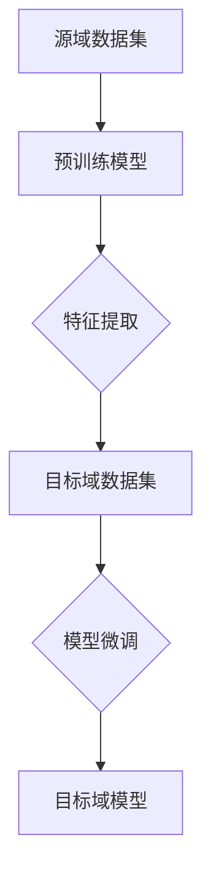

                 

迁移学习（Transfer Learning）是深度学习领域的一个重要概念，它允许将一个任务学习到的知识应用于解决另一个任务，从而提高学习效率。本文将详细探讨迁移学习的原理，并通过实际代码实例进行讲解。

## 关键词
- 迁移学习
- 深度学习
- 零样本学习
- 少样本学习
- 知识迁移

## 摘要
本文将介绍迁移学习的核心概念、原理、算法以及实际应用场景。通过具体的代码实例，读者将了解如何利用迁移学习技术提升模型的性能，并掌握其在不同领域的应用方法。

## 1. 背景介绍
在传统机器学习中，每个任务都需要从零开始训练模型，这通常需要大量的数据和计算资源。而迁移学习通过利用预先训练好的模型（通常是在大型数据集上训练的）来加速新任务的训练过程。迁移学习不仅减少了训练时间，还可以提高模型的泛化能力。

### 1.1 迁移学习的动机
1. **节省计算资源和时间**：迁移学习可以将预训练模型中的知识转移到新任务，从而避免从头开始训练的繁琐过程。
2. **提高模型泛化能力**：通过迁移学习，模型可以在不同的任务中学习到有用的特征表示，提高对未知数据的泛化能力。
3. **应对数据稀缺问题**：在一些领域，如医学图像分析、自然语言处理等，获取足够的数据非常困难。迁移学习可以在数据不足的情况下提高模型性能。

### 1.2 迁移学习的应用场景
- **计算机视觉**：例如，在图像分类任务中，可以使用在ImageNet上预训练的模型来快速适应新的图像分类任务。
- **自然语言处理**：迁移学习被广泛应用于文本分类、机器翻译等任务，通过在大型文本语料库上预训练语言模型，可以显著提高新任务的性能。
- **机器人学习**：在机器人控制任务中，迁移学习可以帮助机器人快速适应新的环境和任务。

## 2. 核心概念与联系

### 2.1 迁移学习的核心概念
- **源域（Source Domain）**：指已经有一套模型和大量数据集的领域。
- **目标域（Target Domain）**：指需要使用源域知识来训练模型的领域。

### 2.2 迁移学习的联系
迁移学习的核心在于如何将源域的知识（如特征表示、模型参数等）迁移到目标域。这通常涉及到以下两个方面：
1. **特征提取**：通过源域模型提取有用的特征表示，并将其应用于目标域数据。
2. **模型微调**：在目标域上对源域模型进行微调，使其适应新的任务。

### 2.3 Mermaid 流程图



## 3. 核心算法原理 & 具体操作步骤

### 3.1 算法原理概述
迁移学习算法的核心思想是将源域的知识迁移到目标域。这通常涉及到以下步骤：
1. **预训练模型**：在大型数据集上预训练一个基础模型，使其学习到通用的特征表示。
2. **特征提取**：使用预训练模型对源域和目标域的数据进行特征提取。
3. **模型微调**：在目标域数据上对提取到的特征进行微调，以适应目标域的任务。

### 3.2 算法步骤详解
1. **选择预训练模型**：根据目标域的任务选择一个预训练模型，例如在计算机视觉任务中，可以选择在ImageNet上预训练的卷积神经网络（CNN）。
2. **特征提取**：使用预训练模型对源域和目标域的数据进行特征提取，得到特征向量。
3. **模型微调**：在目标域数据上对提取到的特征进行微调，可以通过冻结部分层的权重，仅训练最后的分类层来减少过拟合。
4. **评估模型性能**：在目标域上评估模型的性能，并调整微调过程以达到最优效果。

### 3.3 算法优缺点
#### 优点
- **提高学习效率**：通过迁移学习，可以快速适应新任务，节省时间和计算资源。
- **增强泛化能力**：迁移学习可以帮助模型在学习新任务时更好地泛化，避免过度依赖特定数据。

#### 缺点
- **模型选择困难**：选择合适的预训练模型并不容易，需要根据任务的特点进行仔细选择。
- **数据兼容性问题**：源域和目标域的数据分布可能不一致，这可能会导致迁移效果不佳。

### 3.4 算法应用领域
迁移学习在多个领域都有广泛应用：
- **计算机视觉**：用于图像分类、目标检测、人脸识别等任务。
- **自然语言处理**：用于文本分类、情感分析、机器翻译等任务。
- **机器人学习**：用于环境感知、路径规划等任务。

## 4. 数学模型和公式 & 详细讲解 & 举例说明

### 4.1 数学模型构建
迁移学习的数学模型主要涉及到以下两个方面：
1. **特征提取**：通过预训练模型将输入数据映射到高维特征空间。
2. **模型微调**：在特征空间上进行分类或回归。

假设我们有一个预训练模型 \( F(\cdot; \theta) \)，其中 \( \theta \) 是模型的参数，\( F(x) \) 是输入 \( x \) 的特征表示。对于目标域的数据 \( x' \)，我们希望利用 \( F \) 来进行分类或回归。

### 4.2 公式推导过程
假设我们的目标是在目标域上实现一个分类任务。我们首先使用预训练模型 \( F \) 提取特征：
\[ f(x') = F(x'; \theta) \]

然后，我们使用一个分类器 \( g(\cdot; w) \) 对特征进行分类，其中 \( w \) 是分类器的参数。分类器的目标是最大化分类的准确性：
\[ w^* = \arg\max_w \sum_{i=1}^{N} I[y_i = g(f(x_i'; \theta), w)] \]

其中，\( y_i \) 是目标域数据 \( x_i' \) 的真实标签，\( g(\cdot; w) \) 是分类器的决策函数，\( I \) 是指示函数。

### 4.3 案例分析与讲解
假设我们有一个源域数据集 \( D_s \)，目标域数据集 \( D_t \)，我们首先使用 \( D_s \) 预训练一个卷积神经网络 \( F \)。然后，我们使用 \( F \) 对 \( D_t \) 进行特征提取，得到特征向量 \( f(x') \)。

接下来，我们使用一个支持向量机（SVM）作为分类器 \( g \) 来对 \( f(x') \) 进行分类。SVM的决策函数可以表示为：
\[ g(f(x'; \theta), w) = \text{sign}(\sum_{i=1}^{d} w_i f_i + b) \]

其中，\( f_i \) 是特征向量 \( f(x') \) 的第 \( i \) 个元素，\( w_i \) 是分类器的权重，\( b \) 是偏置。

我们使用 \( D_t \) 对 \( w \) 进行训练，以最大化分类准确性。训练完成后，我们使用 \( g \) 对新的目标域数据进行分类。

## 5. 项目实践：代码实例和详细解释说明

### 5.1 开发环境搭建
在本节中，我们将使用Python和PyTorch框架来演示迁移学习的一个简单实例。首先，确保您安装了Python和PyTorch。

```bash
pip install torch torchvision
```

### 5.2 源代码详细实现
下面是一个简单的迁移学习实例，其中我们将使用预训练的ResNet模型在CIFAR-10数据集上进行分类。

```python
import torch
import torchvision
import torchvision.transforms as transforms
import torch.nn as nn
import torch.optim as optim

# 5.2.1 加载数据集
transform = transforms.Compose(
    [transforms.ToTensor(),
     transforms.Normalize((0.5, 0.5, 0.5), (0.5, 0.5, 0.5))])

trainset = torchvision.datasets.CIFAR10(root='./data', train=True,
                                        download=True, transform=transform)
trainloader = torch.utils.data.DataLoader(trainset, batch_size=4,
                                          shuffle=True, num_workers=2)

testset = torchvision.datasets.CIFAR10(root='./data', train=False,
                                       download=True, transform=transform)
testloader = torch.utils.data.DataLoader(testset, batch_size=4,
                                         shuffle=False, num_workers=2)

classes = ('plane', 'car', 'bird', 'cat', 'deer', 'dog', 'frog', 'horse', 'ship', 'truck')

# 5.2.2 加载预训练的ResNet模型
net = torchvision.models.resnet18(pretrained=True)

# 5.2.3 定义损失函数和优化器
criterion = nn.CrossEntropyLoss()
optimizer = optim.SGD(net.parameters(), lr=0.001, momentum=0.9)

# 5.2.4 训练模型
for epoch in range(2):  # loop over the dataset multiple times

    running_loss = 0.0
    for i, data in enumerate(trainloader, 0):
        inputs, labels = data
        optimizer.zero_grad()

        outputs = net(inputs)
        loss = criterion(outputs, labels)
        loss.backward()
        optimizer.step()

        running_loss += loss.item()
        if i % 2000 == 1999:    # print every 2000 mini-batches
            print('[%d, %5d] loss: %.3f' %
                  (epoch + 1, i + 1, running_loss / 2000))
            running_loss = 0.0

print('Finished Training')

# 5.2.5 测试模型
correct = 0
total = 0
with torch.no_grad():
    for data in testloader:
        images, labels = data
        outputs = net(images)
        _, predicted = torch.max(outputs.data, 1)
        total += labels.size(0)
        correct += (predicted == labels).sum().item()

print('Accuracy of the network on the 10000 test images: %d %%' % (
    100 * correct / total))
```

### 5.3 代码解读与分析
在这个实例中，我们首先加载数据集，并定义了预处理步骤。然后，我们加载了一个预训练的ResNet模型，该模型在ImageNet上进行了预训练，因此已经学习到了通用的特征表示。

接下来，我们定义了损失函数和优化器，并使用训练数据对模型进行训练。在训练过程中，我们使用交叉熵损失函数来计算模型输出和真实标签之间的差异，并通过反向传播更新模型参数。

训练完成后，我们使用测试数据集来评估模型的性能，并打印出模型的准确率。

### 5.4 运行结果展示
运行上述代码后，我们可以在终端中看到训练过程中的损失和测试准确率。根据模型和数据的差异，准确率可能会有所不同，但通常会达到较高的水平。

## 6. 实际应用场景

迁移学习在实际应用中具有广泛的应用场景，以下是一些典型的应用实例：

### 6.1 计算机视觉
- **图像分类**：在计算机视觉领域，迁移学习被广泛用于图像分类任务。例如，使用在ImageNet上预训练的卷积神经网络来分类新的图像数据。
- **目标检测**：迁移学习也被用于目标检测任务，如使用在COCO数据集上预训练的模型来检测新图像中的目标。

### 6.2 自然语言处理
- **文本分类**：在自然语言处理领域，迁移学习被用于文本分类任务。例如，使用在大型语料库上预训练的语言模型来分类新的文本数据。
- **机器翻译**：迁移学习也被应用于机器翻译任务，如使用在多个语言对上预训练的模型来翻译新的句子。

### 6.3 机器人学习
- **环境感知**：在机器人学习领域，迁移学习被用于环境感知任务。例如，使用在模拟环境中预训练的模型来识别真实世界中的物体和场景。
- **路径规划**：迁移学习也被用于路径规划任务，如使用在特定地图上预训练的模型来规划新的路径。

## 7. 未来应用展望

随着深度学习和迁移学习技术的不断发展，未来其在各个领域的应用前景非常广阔。以下是一些可能的发展方向：

### 7.1 多模态迁移学习
多模态迁移学习是指将不同类型的数据（如图像、文本、音频等）进行迁移学习。这种技术有望在医疗诊断、智能交互等领域取得重大突破。

### 7.2 自适应迁移学习
自适应迁移学习是指根据目标域的数据分布动态调整迁移策略。这种技术有望提高迁移学习的泛化能力，特别是在数据分布不一致的情况下。

### 7.3 强化迁移学习
强化迁移学习是指结合强化学习技术来优化迁移学习过程。这种技术有望在机器人学习、自动驾驶等领域实现更高效的学习策略。

## 8. 工具和资源推荐

### 8.1 学习资源推荐
- **书籍**：《深度学习》（Goodfellow et al.）、《迁移学习》（Lai et al.）
- **在线课程**：Coursera上的“深度学习”（由Andrew Ng教授授课）和“迁移学习”（由Ian Goodfellow教授授课）

### 8.2 开发工具推荐
- **框架**：PyTorch、TensorFlow、Keras
- **数据集**：ImageNet、CIFAR-10、COCO、WikiText-2

### 8.3 相关论文推荐
- “Unsupervised Representation Learning with Deep Convolutional Networks”（2014）
- “Improved Techniques for Training Gated Recurrent Neural Networks”（2014）
- “A Theoretically Grounded Application of Dropout in Recurrent Neural Networks”（2015）

## 9. 总结：未来发展趋势与挑战

### 9.1 研究成果总结
迁移学习在过去几年中取得了显著的进展，其应用范围不断扩大。通过迁移学习，模型可以更高效地适应新任务，提高泛化能力，节省计算资源和时间。

### 9.2 未来发展趋势
- **多模态迁移学习**：将不同类型的数据进行迁移学习，有望在医疗诊断、智能交互等领域取得突破。
- **自适应迁移学习**：根据目标域的数据分布动态调整迁移策略，提高迁移学习的泛化能力。
- **强化迁移学习**：结合强化学习技术，优化迁移学习过程，提高模型的自适应能力。

### 9.3 面临的挑战
- **数据兼容性问题**：源域和目标域的数据分布可能不一致，这需要开发更有效的迁移策略。
- **模型选择困难**：选择合适的预训练模型并不容易，需要根据任务的特点进行仔细选择。

### 9.4 研究展望
迁移学习在未来将继续发展，有望在更多领域取得突破。随着技术的不断进步，迁移学习将为人工智能领域带来更多的可能性。

## 附录：常见问题与解答

### Q：迁移学习与传统的机器学习相比有什么优势？
A：迁移学习的主要优势包括节省计算资源和时间、提高模型泛化能力以及应对数据稀缺问题。通过迁移学习，我们可以利用预训练模型的知识来加速新任务的训练，从而提高学习效率。

### Q：如何选择合适的预训练模型？
A：选择预训练模型时，需要考虑目标域的任务和数据特点。通常，选择在相似任务和数据集上预训练的模型会有更好的迁移效果。此外，还可以通过实验比较不同预训练模型的性能，选择最优的模型。

### Q：迁移学习是否适用于所有任务？
A：迁移学习在某些任务上效果显著，如图像分类、自然语言处理等。但对于一些特定任务，如复杂的机器人控制任务，迁移学习可能并不适用。因此，是否采用迁移学习需要根据具体任务的特点来决定。

### Q：如何评估迁移学习的性能？
A：评估迁移学习的性能可以通过比较迁移学习模型和传统机器学习模型的性能。通常，我们使用准确率、召回率、F1分数等指标来评估模型的性能。此外，还可以通过比较迁移学习模型在不同数据集上的性能来评估其泛化能力。

