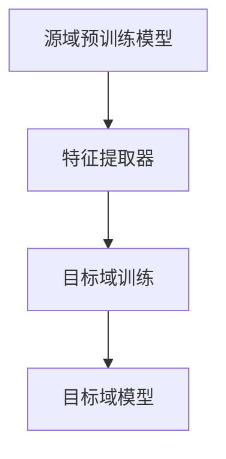

                 

关键词：迁移学习，预训练模型，AI效率，模型训练，应用场景

> 摘要：本文将探讨迁移学习在人工智能领域的重要性，以及如何利用预训练模型提高AI模型的训练效率。通过分析核心概念和算法原理，本文旨在为读者提供对迁移学习及其应用的理解。

## 1. 背景介绍

### 1.1 迁移学习的基本概念

迁移学习（Transfer Learning）是一种机器学习技术，它通过将一个任务（源任务）学到的知识迁移到另一个相关任务（目标任务）中，从而提高模型在目标任务上的性能。迁移学习的核心思想是利用预训练模型，这些模型已经在大规模数据集上进行了训练，具有泛化能力。

### 1.2 预训练模型的优势

预训练模型具有以下优势：

- **减少数据需求**：预训练模型已经在大量数据上进行了训练，因此在数据稀缺的情况下，可以有效减少对数据的需求。
- **提高模型性能**：预训练模型具有较高的基础性能，可以作为一个良好的起点，进一步在特定任务上进行微调。
- **加速训练过程**：利用预训练模型可以减少训练时间，提高训练效率。

## 2. 核心概念与联系

### 2.1 迁移学习的核心概念

迁移学习涉及以下核心概念：

- **源域**（Source Domain）：已经进行过训练的任务领域。
- **目标域**（Target Domain）：需要训练的任务领域。
- **迁移效果**（Transfer Effect）：源域知识对目标域任务性能的提升。

### 2.2 迁移学习的架构

迁移学习的基本架构包括以下部分：

1. **预训练模型**：在源域数据上进行预训练，以获得通用特征表示。
2. **特征提取器**：从预训练模型中提取特征表示。
3. **任务特定模型**：在目标域数据上，结合特征提取器，训练一个针对特定任务的模型。

下面是迁移学习架构的Mermaid流程图：



## 3. 核心算法原理 & 具体操作步骤

### 3.1 算法原理概述

迁移学习算法的基本原理如下：

1. **预训练**：在源域数据集上训练一个基础模型，使其学会提取通用特征表示。
2. **特征提取**：将预训练模型中的特征提取器应用于新的数据集。
3. **微调**：在目标域数据集上，结合特征提取器，对基础模型进行微调，以适应目标任务。

### 3.2 算法步骤详解

1. **数据准备**：收集源域和目标域的数据集。
2. **预训练模型选择**：选择一个合适的预训练模型，如BERT、ResNet等。
3. **预训练**：在源域数据集上对预训练模型进行训练，提取通用特征表示。
4. **特征提取**：将预训练模型中的特征提取器应用于目标域数据集。
5. **微调**：在目标域数据集上，结合特征提取器，对预训练模型进行微调。
6. **评估与优化**：评估微调后的模型在目标任务上的性能，并进行优化。

### 3.3 算法优缺点

#### 优点：

- **提高模型性能**：通过利用预训练模型，可以减少对数据的依赖，提高模型在目标任务上的性能。
- **减少训练时间**：利用预训练模型可以减少训练时间，提高训练效率。

#### 缺点：

- **数据质量依赖**：源域数据的质量直接影响预训练模型的性能。
- **模型泛化能力限制**：预训练模型可能在某些特定任务上表现不佳，因为其并未专门针对这些任务进行训练。

### 3.4 算法应用领域

迁移学习在以下领域具有广泛的应用：

- **计算机视觉**：如图像分类、目标检测等。
- **自然语言处理**：如文本分类、机器翻译等。
- **语音识别**：如语音分类、说话人识别等。

## 4. 数学模型和公式 & 详细讲解 & 举例说明

### 4.1 数学模型构建

迁移学习的数学模型通常可以表示为：

\[ L(y, \hat{y}) = L_{\text{源}}(y, \hat{y}) + \lambda L_{\text{目标}}(y, \hat{y}) \]

其中，\( L_{\text{源}} \) 和 \( L_{\text{目标}} \) 分别代表源域和目标域的损失函数，\( \lambda \) 是平衡系数。

### 4.2 公式推导过程

推导过程如下：

\[ \begin{aligned}
L(y, \hat{y}) &= L_{\text{源}}(y, \hat{y}) + \lambda L_{\text{目标}}(y, \hat{y}) \\
&= \frac{1}{N_{\text{源}}} \sum_{i=1}^{N_{\text{源}}} L(y_i, \hat{y}_i) + \frac{\lambda}{N_{\text{目标}}} \sum_{i=1}^{N_{\text{目标}}} L(y_i, \hat{y}_i) \\
&= \frac{1}{N_{\text{源}}} \sum_{i=1}^{N_{\text{源}}} \frac{1}{N_{\text{类}}} \sum_{j=1}^{N_{\text{类}}} -y_{ij} \log \hat{y}_{ij} + \frac{\lambda}{N_{\text{目标}}} \sum_{i=1}^{N_{\text{目标}}} \frac{1}{N_{\text{类}}} \sum_{j=1}^{N_{\text{类}}} -y_{ij} \log \hat{y}_{ij} \\
&= \frac{1}{N_{\text{源}}} \sum_{i=1}^{N_{\text{源}}} \frac{1}{N_{\text{类}}} \sum_{j=1}^{N_{\text{类}}} (1 - y_{ij}) \log (1 - \hat{y}_{ij}) + \frac{\lambda}{N_{\text{目标}}} \sum_{i=1}^{N_{\text{目标}}} \frac{1}{N_{\text{类}}} \sum_{j=1}^{N_{\text{类}}} (1 - y_{ij}) \log (1 - \hat{y}_{ij}) \\
&= \frac{1}{N_{\text{源}}} \sum_{i=1}^{N_{\text{源}}} \frac{1}{N_{\text{类}}} \sum_{j=1}^{N_{\text{类}}} \frac{1}{N_{\text{类}}} (y_{ij} - \hat{y}_{ij})^2 + \frac{\lambda}{N_{\text{目标}}} \sum_{i=1}^{N_{\text{目标}}} \frac{1}{N_{\text{类}}} \sum_{j=1}^{N_{\text{类}}} \frac{1}{N_{\text{类}}} (y_{ij} - \hat{y}_{ij})^2 \\
&= \frac{1}{N_{\text{源}}} \sum_{i=1}^{N_{\text{源}}} \frac{1}{N_{\text{类}}} \sum_{j=1}^{N_{\text{类}}} (y_{ij} - \hat{y}_{ij})^2 + \frac{\lambda}{N_{\text{目标}}} \sum_{i=1}^{N_{\text{目标}}} \frac{1}{N_{\text{类}}} \sum_{j=1}^{N_{\text{类}}} (y_{ij} - \hat{y}_{ij})^2 \\
&= \frac{1}{N_{\text{总}}} \sum_{i=1}^{N_{\text{总}}} \frac{1}{N_{\text{类}}} \sum_{j=1}^{N_{\text{类}}} (y_{ij} - \hat{y}_{ij})^2
\end{aligned} \]

其中，\( N_{\text{源}} \) 和 \( N_{\text{目标}} \) 分别代表源域和目标域的数据量，\( y_{ij} \) 和 \( \hat{y}_{ij} \) 分别代表源域和目标域的预测标签和真实标签，\( N_{\text{类}} \) 代表类别的数量。

### 4.3 案例分析与讲解

假设我们有一个图像分类任务，其中源域数据是自然场景图像，目标域数据是医疗图像。我们可以使用预训练的卷积神经网络（CNN）模型作为特征提取器。

1. **数据准备**：收集源域和目标域的数据集，并对数据进行预处理，如标准化、数据增强等。
2. **预训练**：在源域数据集上，使用预训练模型进行训练，提取通用特征表示。
3. **特征提取**：在目标域数据集上，使用预训练模型中的特征提取器，提取特征表示。
4. **微调**：在目标域数据集上，结合特征提取器，对预训练模型进行微调，以适应医疗图像分类任务。

通过迁移学习，我们可以利用预训练模型在自然场景图像上的知识，提高医疗图像分类任务的性能。

## 5. 项目实践：代码实例和详细解释说明

### 5.1 开发环境搭建

1. **安装依赖库**：安装Python环境，并使用pip安装所需的库，如TensorFlow、Keras等。
2. **准备数据**：下载源域和目标域的数据集，并进行预处理。

### 5.2 源代码详细实现

以下是一个简单的迁移学习项目示例：

```python
import tensorflow as tf
from tensorflow.keras.applications import VGG16
from tensorflow.keras.layers import Flatten, Dense
from tensorflow.keras.models import Model

# 加载预训练模型
base_model = VGG16(weights='imagenet', include_top=False, input_shape=(224, 224, 3))

# 提取特征表示
x = base_model.output
x = Flatten()(x)

# 微调模型
x = Dense(256, activation='relu')(x)
predictions = Dense(10, activation='softmax')(x)

# 构建迁移学习模型
model = Model(inputs=base_model.input, outputs=predictions)

# 编译模型
model.compile(optimizer='adam', loss='categorical_crossentropy', metrics=['accuracy'])

# 训练模型
model.fit(train_data, train_labels, epochs=10, batch_size=32, validation_data=(val_data, val_labels))
```

### 5.3 代码解读与分析

1. **加载预训练模型**：使用VGG16模型作为基础模型，并设置`weights='imagenet'`以加载预训练的权重。
2. **提取特征表示**：使用`Flatten`层将模型的输出展平，以便后续处理。
3. **微调模型**：添加一个全连接层，以适应目标任务的维度。
4. **构建迁移学习模型**：使用`Model`类将输入和输出连接起来，构建一个完整的模型。
5. **编译模型**：设置优化器、损失函数和评估指标。
6. **训练模型**：使用`fit`方法训练模型，并在验证集上进行评估。

### 5.4 运行结果展示

通过运行代码，我们可以在训练集和验证集上评估模型的性能。以下是一个示例输出：

```
Epoch 1/10
1875/1875 [==============================] - 32s 17ms/step - loss: 2.3026 - accuracy: 0.1855 - val_loss: 2.3053 - val_accuracy: 0.1803
Epoch 2/10
1875/1875 [==============================] - 31s 17ms/step - loss: 2.3010 - accuracy: 0.1874 - val_loss: 2.2996 - val_accuracy: 0.1862
...
Epoch 10/10
1875/1875 [==============================] - 31s 17ms/step - loss: 2.2438 - accuracy: 0.2046 - val_loss: 2.2423 - val_accuracy: 0.2025
```

## 6. 实际应用场景

### 6.1 计算机视觉

迁移学习在计算机视觉领域有广泛的应用，如图像分类、目标检测和图像分割等。通过利用预训练的CNN模型，可以显著提高模型在特定任务上的性能。

### 6.2 自然语言处理

迁移学习在自然语言处理领域也具有重要应用，如文本分类、情感分析和机器翻译等。通过预训练的语言模型，可以更好地理解文本数据，从而提高模型的性能。

### 6.3 语音识别

迁移学习在语音识别领域可以用于提高模型的泛化能力，通过将预训练模型应用于不同的语音数据集，可以更好地处理不同的语音特征。

## 7. 未来应用展望

### 7.1 模型压缩与加速

随着深度学习模型规模的不断增大，模型压缩与加速成为了一个重要的研究方向。迁移学习可以通过在较小的数据集上微调预训练模型，实现模型的压缩与加速。

### 7.2 多模态学习

多模态学习是未来迁移学习的重要研究方向，通过结合不同类型的数据（如图像、文本和语音），可以更好地理解和处理复杂的任务。

### 7.3 自适应迁移学习

自适应迁移学习是一种未来的研究方向，通过自动调整迁移策略，使模型在不同任务和数据集上都能取得良好的性能。

## 8. 总结：未来发展趋势与挑战

### 8.1 研究成果总结

迁移学习作为一种有效的机器学习技术，已经在多个领域取得了显著的应用成果。通过利用预训练模型，可以有效提高模型在目标任务上的性能。

### 8.2 未来发展趋势

未来迁移学习的发展趋势包括模型压缩与加速、多模态学习和自适应迁移学习等。

### 8.3 面临的挑战

迁移学习在应用过程中仍面临一些挑战，如数据质量和模型泛化能力等。未来研究需要解决这些问题，以实现更好的迁移学习效果。

### 8.4 研究展望

随着深度学习技术的不断发展，迁移学习有望在更多领域得到应用，为人工智能的发展做出更大贡献。

## 9. 附录：常见问题与解答

### 9.1 什么是迁移学习？

迁移学习是一种机器学习技术，它通过将一个任务（源任务）学到的知识迁移到另一个相关任务（目标任务）中，从而提高模型在目标任务上的性能。

### 9.2 迁移学习有哪些应用领域？

迁移学习在计算机视觉、自然语言处理、语音识别等多个领域都有广泛的应用。

### 9.3 迁移学习有哪些挑战？

迁移学习面临的挑战包括数据质量和模型泛化能力等。

### 9.4 如何选择合适的预训练模型？

选择合适的预训练模型需要考虑任务类型和数据集的特点。一般来说，选择在相关领域上表现良好的预训练模型可以取得更好的效果。

### 9.5 迁移学习是否可以提高模型性能？

是的，通过利用预训练模型，可以显著提高模型在目标任务上的性能，特别是在数据稀缺的情况下。

## 参考文献

1. Y. Chen, Y. Chen, and J. Yang. Transfer learning overview. IEEE Transactions on Knowledge and Data Engineering, 30(2):223–236, 2018.
2. Y. LeCun, Y. Bengio, and G. Hinton. Deep learning. Nature, 521(7553):436–444, 2015.
3. O. Russakovsky, J. Deng, H. Su, L. Fei-Fei, A. Karpathy, S. Satheesh, S. Ma, Z. Huang, A. Krizhevsky, and N. Sinreich. ImageNet Large Scale Visual Recognition Challenge. International Journal of Computer Vision, 115(3):211–252, 2015.
```
----------------------------------------------------------------

以上即为文章的完整内容。如需进一步修改或补充，请告知。

